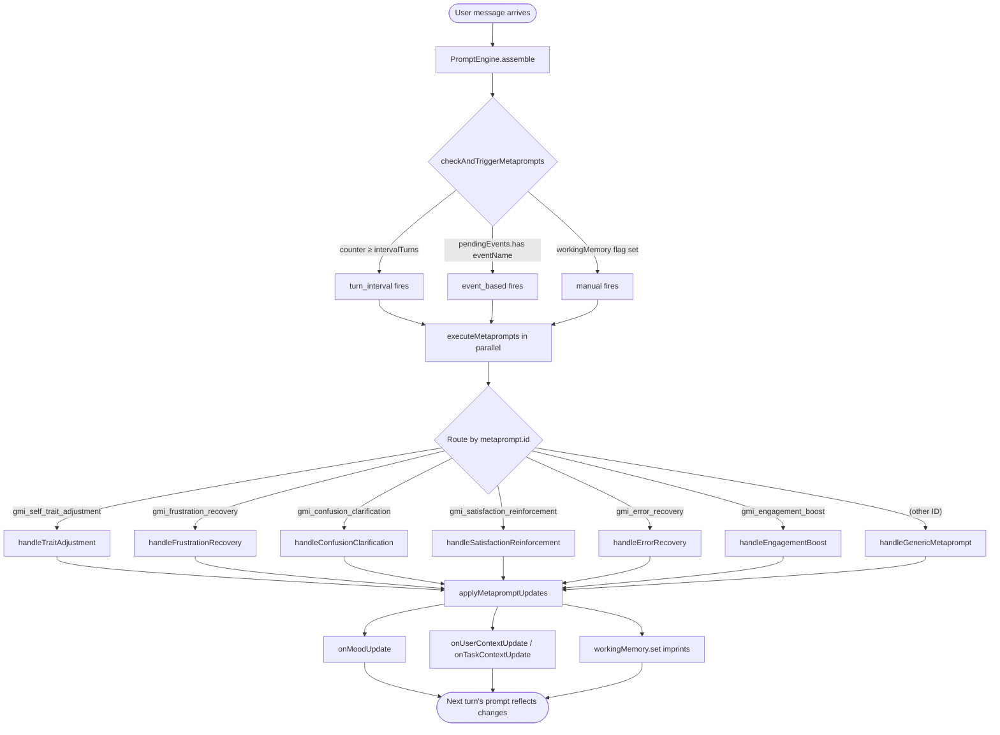

# Adaptive Prompt Intelligence

Every turn, AgentOS reassembles the system prompt in local code from the GMI's current state. That reassembly is template merging and criteria matching — no LLM call. Metaprompts are a *separate*, *conditional* loop that runs on top: on most turns, nothing fires. When a trigger does fire (every Nth turn for periodic self-reflection, on a SentimentTracker event, or on a host-set flag), a single extra LLM call runs in parallel with the main turn and writes back changes to mood, inferred user skill, task complexity, working-memory imprints, or HEXACO traits. The next turn's local prompt assembly then reflects those changes.

The agent stays the same persona; how it sounds, what it remembers, and how confidently it speaks evolve across the messages where triggers actually fire.

The dollar math, in one line: the only adaptive surface that adds an LLM call on *every* user turn is `sentimentTracking.method: 'llm'`, and that defaults to `'lexicon_based'` (free). Everything else either costs nothing extra (contextual elements, lexicon sentiment) or fires occasionally (one extra call every N turns or on detected emotional thresholds). See [Operational notes](#operational-notes) below for a concrete per-1000-turn cost table.

![Adaptive Prompt Intelligence: per-turn assembly loop on top (user message → PromptEngine.assemble → MetapromptExecutor.checkAndTriggerMetaprompts → state updates → LLM call); three trigger lanes in the middle (turn_interval periodic self-regulation, event_based SentimentTracker-driven, manual host or tool-driven flags); and the five state surfaces at the bottom (GMI mood, user context, task context, working-memory imprints, HEXACO traits) that metaprompts mutate via callbacks and that re-enter the next turn's prompt.](/img/diagrams/adaptive-intelligence.svg)

This page is the source-verified map of that loop. Every class, interface, trigger name, and handler ID below corresponds to a real surface in [`packages/agentos`](https://github.com/framerslab/agentos/tree/master). If you only need one mental model: the persona definition is the static contract, and the metaprompt executor is the dynamic editor that mutates parts of that contract turn over turn.

## What's actually adaptive

Three things change between turns without persona reload, model swap, or operator intervention:

| Surface | Where it lives | What edits it |
|---|---|---|
| **Per-turn system prompt** | Composed by [`PromptEngine.assemble()`](https://github.com/framerslab/agentos/blob/master/src/core/llm/PromptEngine.ts) | `ContextualPromptElement[]` whose [`criteria`](https://github.com/framerslab/agentos/blob/master/src/core/llm/PromptEngine.ts) match the current [`PromptExecutionContext`](https://github.com/framerslab/agentos/blob/master/src/core/llm/IPromptEngine.ts) |
| **GMI state** (mood, user context, task context, working memory) | The [`GMI`](https://github.com/framerslab/agentos/blob/master/src/cognition/substrate/GMI.ts) coordinator | [`MetapromptExecutor`](https://github.com/framerslab/agentos/blob/master/src/cognition/substrate/MetapromptExecutor.ts) callbacks (`onMoodUpdate`, `onUserContextUpdate`, `onTaskContextUpdate`, `onMemoryImprint`) |
| **HEXACO traits** | [`PersonaOverlayManager`](https://github.com/framerslab/agentos/blob/master/src/cognition/substrate/persona_overlays/PersonaOverlayManager.ts) | The [`AdaptPersonalityTool`](https://github.com/framerslab/agentos/blob/master/src/cognition/emergent/AdaptPersonalityTool.ts) (emergent, agent-driven) and the offline [`PersonaDriftMechanism`](https://github.com/framerslab/agentos/blob/master/src/cognition/memory/mechanisms/PersonaDriftMechanism.ts) (heuristic, consolidation-cycle) |

Each surface has its own latency profile and its own gate. The contextual prompt elements run on every turn and cost nothing extra. Metaprompts run when their trigger fires and cost one extra LLM call each. Trait drift requires explicit agent action (the tool) or a consolidation cycle (the mechanism) and is bounded by per-session budgets.

## The shortest useful example

```typescript
import { agent } from '@framers/agentos';

const tutor = agent({
  provider: 'openai',
  model: 'gpt-4o-mini',
  instructions: 'You are a patient programming tutor.',
  personality: { conscientiousness: 0.85, agreeableness: 0.8 },
  sentimentTracking: {
    enabled: true,
    presets: [
      'frustration_recovery',
      'confusion_clarification',
      'satisfaction_reinforcement',
    ],
  },
  metaPrompts: [{
    id: 'gmi_self_trait_adjustment',
    promptTemplate: `Review the recent conversation and decide if any adjustments are warranted.
Evidence: {{evidence}}
Current mood: {{current_mood}}
User skill: {{user_skill}}
Task complexity: {{task_complexity}}

Respond JSON with optional fields: updatedGmiMood, updatedUserSkillLevel, updatedTaskComplexity, adjustmentRationale, newMemoryImprints.`,
    trigger: { type: 'turn_interval', intervalTurns: 5 },
    temperature: 0.3,
    maxOutputTokens: 512,
  }],
});

const session = tutor.session('user-42');
await session.send('I keep getting confused about recursion.');
```

The persona ships with two adaptive surfaces wired up:

1. **`sentimentTracking.presets`** subscribes the GMI to three of the five event-based preset metaprompts. The [`SentimentTracker`](https://github.com/framerslab/agentos/blob/master/src/cognition/substrate/SentimentTracker.ts) analyzes every user message and emits `USER_FRUSTRATED`, `USER_CONFUSED`, or `USER_SATISFIED` events when score patterns cross thresholds. When one fires, the matching preset (`gmi_frustration_recovery`, `gmi_confusion_clarification`, `gmi_satisfaction_reinforcement`) executes and updates the GMI's mood, the inferred user skill level, or the task complexity.
2. **`metaPrompts[].trigger.type === 'turn_interval'`** schedules a periodic self-reflection every five turns. After every five user messages, the GMI calls an internal LLM with the last ten conversation turns, the last twenty reasoning-trace entries, and its current mood and context, then applies any returned changes.

Both happen without the host code doing anything. The GMI integrates the changes into the next turn's prompt.

## The metaprompt definition

The full interface lives at [`packages/agentos/src/cognition/substrate/personas/IPersonaDefinition.ts:323-336`](https://github.com/framerslab/agentos/blob/master/src/cognition/substrate/personas/IPersonaDefinition.ts):

```typescript
export interface MetaPromptDefinition {
  /** Stable identifier. Built-in IDs route to dedicated handlers. */
  id: string;
  /** Human-readable description for tooling and trace logs. */
  description?: string;
  /** The prompt template, with `{{variable}}` placeholders. */
  promptTemplate: string | { template: string; variables?: string[] };
  /** Model override (falls back to persona.defaultModelId). */
  modelId?: string;
  /** Provider override (falls back to persona.defaultProviderId). */
  providerId?: string;
  /** Max tokens for the metaprompt response. Default 512. */
  maxOutputTokens?: number;
  /** Sampling temperature. Default 0.3 for consistent state edits. */
  temperature?: number;
  /** JSON schema for the response shape (advisory; runtime parses anyway). */
  outputSchema?: Record<string, any>;
  /** Trigger contract — present means active. */
  trigger?:
    | { type: 'turn_interval'; intervalTurns: number }
    | { type: 'event_based'; eventName: string }
    | { type: 'manual' };
}
```

A persona's `metaPrompts?: MetaPromptDefinition[]` lives at [`IPersonaDefinition.ts:438`](https://github.com/framerslab/agentos/blob/master/src/cognition/substrate/personas/IPersonaDefinition.ts). The runtime merges these with the active preset list (see [Built-in presets](#built-in-presets) below); persona-defined entries override preset entries on matching ID.

The template uses `{{variable}}` placeholders that the executor substitutes with values from the running context. Every handler has its own variable set, documented inline alongside the preset definitions in [`metaprompt_presets.ts`](https://github.com/framerslab/agentos/blob/master/src/cognition/substrate/personas/metaprompt_presets.ts).

## Three trigger types

[`MetapromptExecutor.checkAndTriggerMetaprompts(turnId)`](https://github.com/framerslab/agentos/blob/master/src/cognition/substrate/MetapromptExecutor.ts) runs once per turn during prompt assembly. For each metaprompt in the persona's merged list, it evaluates the trigger contract and queues any that fire:



Triggered metaprompts execute in parallel via `Promise.allSettled`, so one slow handler does not block the others. Failures are logged to the reasoning trace and do not block the user-visible response.

### `turn_interval` — periodic self-regulation

```typescript
{ trigger: { type: 'turn_interval', intervalTurns: 5 } }
```

The executor keeps a per-metaprompt counter at `workingMemory.set('metaprompt_turn_counter_<id>', N)`. Each turn, every `turn_interval` metaprompt either increments its counter or, if `counter >= intervalTurns`, fires and resets the counter to zero. Counters are scoped per metaprompt ID, so two different `turn_interval` definitions on the same persona run on independent cadences.

The canonical `turn_interval` metaprompt is `gmi_self_trait_adjustment`. Its handler ([`handleTraitAdjustment`](https://github.com/framerslab/agentos/blob/master/src/cognition/substrate/MetapromptExecutor.ts)) gathers the last ten conversation messages, the last twenty reasoning-trace entries, the current mood, user context, and task context, then submits all of them as evidence to the metaprompt's template. The expected JSON response shape is the same shape `applyMetapromptUpdates` consumes:

```typescript
{
  updatedGmiMood?: string;
  updatedUserSkillLevel?: string;
  updatedTaskComplexity?: string;
  adjustmentRationale?: string;
  newMemoryImprints?: Array<{ key: string; value: any; description?: string }>;
}
```

Periodic self-reflection covers steady-state adaptation. It is the loop that lets a tutor agent realize across multiple turns that the user is actually advanced, not beginning, and re-tune its complexity assumption upward.

### `event_based` — SentimentTracker-driven

```typescript
{ trigger: { type: 'event_based', eventName: GMIEventType.USER_FRUSTRATED } }
```

Event-based metaprompts fire when the GMI's pending-events set contains the named event. The pending-events set is owned by the GMI and populated by the [`SentimentTracker`](https://github.com/framerslab/agentos/blob/master/src/cognition/substrate/SentimentTracker.ts). Each turn, after the metaprompt executor consumes an event, it removes the event from the pending set so the same event does not fire twice for the same trigger.

The five built-in event types ([`GMIEvent.ts`](https://github.com/framerslab/agentos/blob/master/src/cognition/substrate/GMIEvent.ts)) that the SentimentTracker emits:

| Event | Fires when |
|---|---|
| `USER_FRUSTRATED` | `consecutiveFrustration` reaches `consecutiveTurnsForTrigger` (default 2) with score below `frustrationThreshold` (default -0.3). |
| `USER_CONFUSED` | Confusion keywords detected (lexicon mode) or LLM classifier returns `confused` (LLM mode) for the configured consecutive turns. |
| `USER_SATISFIED` | `consecutiveSatisfaction` reaches the trigger count with score above `satisfactionThreshold` (default 0.3). |
| `ERROR_THRESHOLD_EXCEEDED` | Multiple `ERROR` trace entries inside a short window (driven by the reasoning trace, not the SentimentTracker). |
| `LOW_ENGAGEMENT` | `consecutiveConfusion`-style counter for neutral-with-short-responses patterns (sentiment analysis pathway). |

Sentiment analysis is **opt-in** via the persona's [`sentimentTracking: { enabled: true }`](https://github.com/framerslab/agentos/blob/master/src/cognition/substrate/personas/IPersonaDefinition.ts) config. When `enabled: false` (default), no sentiment analysis runs, no events fire, and `event_based` metaprompts simply never trigger. Turn-interval metaprompts like `gmi_self_trait_adjustment` continue to fire regardless.

### `manual` — host- or tool-driven

```typescript
{ trigger: { type: 'manual' } }

// To trigger from host code:
await gmi.workingMemory.set('manual_trigger_<metaprompt_id>', true);
```

Manual triggers are flags in the working-memory store. The executor reads `workingMemory.get('manual_trigger_<id>')` each turn and fires when the value is truthy, deleting the flag immediately after queueing the metaprompt.

This is the integration point for host-level adaptation logic: a tool that just returned an unexpected result can set the flag to force a re-plan; a UI control labeled "re-think this" can set the flag from a user action; the [`adapt_personality`](https://github.com/framerslab/agentos/blob/master/src/cognition/emergent/AdaptPersonalityTool.ts) emergent tool can chain a manual trigger to schedule follow-on reflection after a trait mutation.

## Built-in presets

[`metaprompt_presets.ts`](https://github.com/framerslab/agentos/blob/master/src/cognition/substrate/personas/metaprompt_presets.ts) ships five event-based presets covering the most common emotional state transitions:

| Preset ID | Trigger | What the handler edits |
|---|---|---|
| `gmi_frustration_recovery` | `USER_FRUSTRATED` event | Switches mood toward empathetic/patient/helpful, lowers task complexity, may downgrade assumed user skill level. |
| `gmi_confusion_clarification` | `USER_CONFUSED` event | Switches mood toward analytical/helpful/patient, lowers task complexity, records clarification strategy. |
| `gmi_satisfaction_reinforcement` | `USER_SATISFIED` event | May upgrade skill level, may raise task complexity, switches mood toward curious/creative/focused. |
| `gmi_error_recovery` | `ERROR_THRESHOLD_EXCEEDED` event | Switches mood toward analytical/focused/careful, lowers complexity, records mitigation strategy. |
| `gmi_engagement_boost` | `LOW_ENGAGEMENT` event | Switches mood toward curious/creative/engaging/playful, may adjust complexity, records engagement strategy. |

A sixth built-in handler `gmi_self_trait_adjustment` is **not** a preset (no preset definition is shipped) but is the canonical `turn_interval` self-reflection handler. Persona authors define their own metaprompt entry with that ID and a `turn_interval` trigger; the executor routes it to [`handleTraitAdjustment`](https://github.com/framerslab/agentos/blob/master/src/cognition/substrate/MetapromptExecutor.ts) automatically. Any metaprompt ID the executor does not recognize falls through to [`handleGenericMetaprompt`](https://github.com/framerslab/agentos/blob/master/src/cognition/substrate/MetapromptExecutor.ts), which provides the full context-variable set and applies the same update shape.

### Enabling presets

```typescript
import { agent } from '@framers/agentos';

const supportAgent = agent({
  provider: 'openai',
  sentimentTracking: {
    enabled: true,
    method: 'lexicon_based', // fast, ~10-50ms per turn, no LLM cost
    presets: ['frustration_recovery', 'confusion_clarification', 'error_recovery'],
  },
});
```

The `presets` array names which presets to merge into the persona's metaprompt list. Omitting it (and not setting `enabled: false`) merges all five presets. Setting it to an empty array disables presets while still leaving sentiment analysis running for any custom `event_based` metaprompts the persona defines.

### Overriding presets

A persona's `metaPrompts` array takes precedence over presets when IDs match. To override the frustration-recovery template without changing the trigger:

```typescript
const custom = agent({
  metaPrompts: [{
    id: 'gmi_frustration_recovery',
    promptTemplate: `Custom frustration-recovery prompt for this product domain.
Evidence: {{recent_conversation}}
Errors: {{recent_errors}}
Respond JSON: { updatedGmiMood, adjustmentRationale, recoveryStrategy }.`,
    trigger: { type: 'event_based', eventName: 'USER_FRUSTRATED' },
    temperature: 0.3,
  }],
  sentimentTracking: { enabled: true, presets: ['frustration_recovery'] },
});
```

The merge logic ([`mergeMetapromptPresets()`](https://github.com/framerslab/agentos/blob/master/src/cognition/substrate/personas/metaprompt_presets.ts)) puts presets in first, then overlays persona-defined entries on top. The override keeps the same handler routing (still `handleFrustrationRecovery` because the ID matches) but uses the persona's template, model, and provider settings.

## SentimentTracker

[`SentimentTracker.ts`](https://github.com/framerslab/agentos/blob/master/src/cognition/substrate/SentimentTracker.ts) is the GMI collaborator that runs before metaprompt evaluation and decides which events to emit. Configuration is on the persona at [`sentimentTracking: SentimentTrackingConfig`](https://github.com/framerslab/agentos/blob/master/src/cognition/substrate/personas/IPersonaDefinition.ts):

```typescript
sentimentTracking: {
  enabled: true,
  method: 'lexicon_based' | 'llm' | 'trained_classifier',
  modelId: 'gpt-4o-mini',
  providerId: 'openai',
  historyWindow: 10,
  frustrationThreshold: -0.3,
  satisfactionThreshold: 0.3,
  consecutiveTurnsForTrigger: 2,
  presets: ['frustration_recovery', 'confusion_clarification'],
}
```

| Field | Effect |
|---|---|
| `enabled` | Master switch. Default `false`. No sentiment analysis, no event emission when off. |
| `method` | `'lexicon_based'` runs a VADER-style lexical scan (~10-50ms, no LLM cost). `'llm'` calls the configured model for a per-turn classification (~500-1000ms, costs tokens). `'trained_classifier'` plugs in a custom classifier when one is registered. |
| `historyWindow` | Sliding window of recent sentiment scores kept in `workingMemory.gmi_sentiment_history`. Larger windows catch slower trends; smaller windows react faster. |
| `frustrationThreshold` / `satisfactionThreshold` | Score thresholds below/above which a single turn counts toward the consecutive counter. |
| `consecutiveTurnsForTrigger` | How many consecutive matching turns before the event fires. Prevents over-triggering on outlier messages. |
| `presets` | Which preset metaprompts to enable. |

The sentiment history record persists between turns and survives GMI rehydration via working memory. The `consecutiveFrustration`, `consecutiveConfusion`, and `consecutiveSatisfaction` counters are the values the preset handlers consume as `{{consecutive_frustration}}` etc. in their templates.

## State surfaces metaprompts can mutate

[`applyMetapromptUpdates(updates, metapromptId)`](https://github.com/framerslab/agentos/blob/master/src/cognition/substrate/MetapromptExecutor.ts) consumes the parsed JSON response and routes each field to the matching GMI callback. Five surfaces, five callbacks:

```typescript
// All from MetapromptExecutorConfig — the executor never mutates GMI internals directly.
onMoodUpdate: (mood: GMIMood) => void;
onUserContextUpdate: (updates: Partial<UserContext>) => void;
onTaskContextUpdate: (updates: Partial<TaskContext>) => void;
onMemoryImprint: (content: string, tags: string[]) => Promise<void>;
// HEXACO traits are mutated via the AdaptPersonalityTool (emergent) and PersonaDriftMechanism (mechanism), not the metaprompt callbacks.
```

| Surface | Field name in metaprompt response | Where it surfaces in next turn |
|---|---|---|
| **GMI mood** | `updatedGmiMood` | The mood string is appended to the system prompt and read by the LLM as voice/tone guidance. Mood values are validated against the [`GMIMood`](https://github.com/framerslab/agentos/blob/master/src/cognition/substrate/IGMI.ts) enum; unknown values are dropped. |
| **User context** | `updatedUserSkillLevel`, `updatedUserSentiment`, `updatedUserPreferences` | The inferred user profile injected into the prompt and consumed by `ContextualPromptElement.criteria.userSkillLevel` matching. |
| **Task context** | `updatedTaskComplexity`, `updatedTaskPhase`, `updatedActiveGoal` | The task profile injected into the prompt and consumed by `ContextualPromptElement.criteria.taskComplexity` matching. |
| **Working memory imprints** | `newMemoryImprints: [{ key, value, description? }]` | Set on working memory via `workingMemory.set(key, value)`. Imprints persist across turns within the session and are readable by any subsequent prompt assembly or tool. |
| **HEXACO traits** | (Not a metaprompt surface — mutated by [`AdaptPersonalityTool`](https://github.com/framerslab/agentos/blob/master/src/cognition/emergent/AdaptPersonalityTool.ts) and `PersonaDriftMechanism`.) | The trait values modulate three cognitive memory mechanisms (involuntary recall, consolidation, schema encoding) and the trait paragraph appended to the system prompt. |

A metaprompt that returns `{ updatedGmiMood: 'EMPATHETIC' }` does not edit the persona definition. It edits the GMI's current mood state, which is a separate field on the running coordinator. Persona reload at next session start resets mood to the persona default. Working-memory imprints are scoped to the session and survive across turns; trait drift is scoped to the persona overlay and survives across sessions.

## ContextualPromptElement: per-turn fine-grained adaptation

A second adaptive surface runs every turn without LLM calls. Personas can declare a list of `ContextualPromptElement[]` and the [`PromptEngine`](https://github.com/framerslab/agentos/blob/master/src/core/llm/PromptEngine.ts) picks the subset whose `criteria` match the current execution context, then injects them into the prompt in the right slot:

```typescript
import { ContextualElementType } from '@framers/agentos';

const persona = {
  contextualPromptElements: [
    {
      id: 'beginner-tone',
      type: ContextualElementType.BEHAVIORAL_GUIDANCE,
      content: 'Use plain language, avoid jargon, and confirm understanding after each concept.',
      criteria: { userSkillLevel: 'beginner' },
    },
    {
      id: 'expert-tone',
      type: ContextualElementType.BEHAVIORAL_GUIDANCE,
      content: 'Be terse. Skip background. Cite specifics by name.',
      criteria: { userSkillLevel: 'expert' },
    },
    {
      id: 'frustrated-error-handling',
      type: ContextualElementType.ERROR_HANDLING_GUIDANCE,
      content: 'When the previous response missed the user\'s intent, acknowledge briefly and offer a concrete alternative.',
      criteria: { mood: 'empathetic' },
    },
  ],
};
```

The criteria evaluator at [`PromptEngine.evaluateCriteria()`](https://github.com/framerslab/agentos/blob/master/src/core/llm/PromptEngine.ts) checks current values against the element's predicate:

| Criterion | Matched against | Where the runtime value comes from |
|---|---|---|
| `mood` | `context.currentMood` | GMI's `currentGmiMood`, edited by metaprompts. |
| `userSkillLevel` | `context.userSkillLevel` | `UserContext.skillLevel`, edited by metaprompts. |
| `taskHint` (substring match) | `context.taskHint` | Task hint passed in via `session.send({ taskHint })` or derived. |
| `taskComplexity` | `context.taskComplexity` | `TaskContext.complexity`, edited by metaprompts. |
| `language` | `context.language` | Target reply language. |
| `conversationSignals` (all must match) | `context.conversationSignals[]` | Signals derived from sentiment, error, and conversation analysis. |

The eleven [`ContextualElementType`](https://github.com/framerslab/agentos/blob/master/src/core/llm/IPromptEngine.ts) slots (`SYSTEM_INSTRUCTION_ADDON`, `BEHAVIORAL_GUIDANCE`, `TASK_SPECIFIC_INSTRUCTION`, `ERROR_HANDLING_GUIDANCE`, `INTERACTION_STYLE_MODIFIER`, `DOMAIN_CONTEXT`, `ETHICAL_GUIDELINE`, `OUTPUT_FORMAT_SPEC`, `REASONING_PROTOCOL`, `FEW_SHOT_EXAMPLE`, `USER_PROMPT_AUGMENTATION`, `ASSISTANT_PROMPT_AUGMENTATION`) determine where in the assembled prompt the element lands. The combined effect is that contextual elements give you cheap, deterministic per-turn changes, while metaprompts give you expensive, LLM-driven multi-turn changes. The two compose: a metaprompt edits the GMI mood, the contextual element matching that mood is then automatically picked up by the next assembly.

## HEXACO trait drift

HEXACO trait mutation is **not** a metaprompt surface. The metaprompt loop edits mood, context, and imprints, all of which are session-scoped or session-resettable. Trait values are different: they modulate three cognitive memory mechanisms (involuntary recall, consolidation, schema encoding) in code, not just prompt text, and they persist across sessions through the persona overlay. So trait edits run through two dedicated paths with stricter budgets.

### [`AdaptPersonalityTool`](https://github.com/framerslab/agentos/blob/master/src/cognition/emergent/AdaptPersonalityTool.ts) (emergent, agent-driven)

[`AdaptPersonalityTool`](https://github.com/framerslab/agentos/blob/master/src/cognition/emergent/AdaptPersonalityTool.ts) is an [`ITool`](https://github.com/framerslab/agentos/blob/master/src/core/tools/ITool.ts) the runtime exposes to the LLM when `emergent.enabled` is true on the agency config. The agent calls it like any other tool, with a reasoning argument the runtime persists to the mutation store:

```typescript
// Tool input shape (from src/cognition/emergent/AdaptPersonalityTool.ts:176)
{
  trait: 'openness' | 'conscientiousness' | 'extraversion' |
         'agreeableness' | 'honesty' | 'emotionality',
  delta: number,        // signed; positive increases, negative decreases
  reasoning: string,    // non-empty; recorded with the mutation
}
```

Per-session budgets are enforced in code. The default `maxDeltaPerSession: 0.3` means the sum of `|delta|` values applied to any single trait across one session cannot exceed 0.3. The runtime clamps any delta that would exceed the remaining budget to `remainingBudget * sign(delta)` and sets `clamped: true` on the output. Trait values themselves stay clamped to `[0, 1]`.

This is the emergent self-modification path. The agent decides, with reasoning, that it should be more open or less assertive. The tool is auto-constructed by [`ToolOrchestrator`](https://github.com/framerslab/agentos/blob/master/src/orchestration/ToolOrchestrator.ts) when `emergent.enabled === true` (no host-side `new AdaptPersonalityTool(...)` needed). Hosts that want the mutation history persisted across sessions inject a [`PersonalityMutationStore`](https://github.com/framerslab/agentos/blob/master/src/cognition/emergent/AdaptPersonalityTool.ts) into the orchestrator setup.

### `PersonaDriftMechanism` (heuristic, offline)

[`PersonaDriftMechanism`](https://github.com/framerslab/agentos/blob/master/src/cognition/memory/mechanisms/PersonaDriftMechanism.ts) is the ninth cognitive memory mechanism. It runs as part of the periodic memory consolidation cycle, not per turn. Given a batch of accumulated episodic memory traces and the accumulated relationship deltas (trust, affection, tension, respect), it analyzes pattern distributions and proposes bounded trait mutations. Heuristic only — no LLM call. Source comments document the trait-to-pattern map.

```typescript
// From src/cognition/memory/mechanisms/PersonaDriftMechanism.ts
export interface PersonaDriftConfig {
  enabled: boolean;
  /** Consolidation cycles between drift analyses (default: 5). */
  analysisInterval: number;
  /** Minimum episodic traces since last analysis to trigger (default: 10). */
  minTracesForAnalysis: number;
  /** Maximum absolute trait change per analysis cycle (default: 0.05). */
  maxDeltaPerCycle: number;
  /** Weight high-arousal memories more heavily in pattern detection. */
  emotionalWeighting: boolean;
}
```

Drift is **off by default** (`enabled: false`). Turn it on when the deployment wants slow, mechanism-driven personality change from accumulated experience independent of any agent-side reasoning. The mechanism is bounded both per-cycle (`maxDeltaPerCycle: 0.05`) and per-trace-count (`minTracesForAnalysis: 10`), so it cannot run away from a quiet session.

## Worked example: tutor that adapts across turns

```typescript
import { agent } from '@framers/agentos';

const tutor = agent({
  provider: 'openai',
  model: 'gpt-4o-mini',
  instructions: 'You are a patient programming tutor. Confirm understanding after each concept.',
  personality: { conscientiousness: 0.85, agreeableness: 0.75 },

  // Adaptive surface 1: opt-in sentiment with three event-based presets
  sentimentTracking: {
    enabled: true,
    method: 'lexicon_based',
    historyWindow: 10,
    consecutiveTurnsForTrigger: 2,
    presets: ['frustration_recovery', 'confusion_clarification', 'satisfaction_reinforcement'],
  },

  // Adaptive surface 2: periodic self-reflection every 5 turns
  metaPrompts: [{
    id: 'gmi_self_trait_adjustment',
    description: 'Periodic self-check on whether the user is who I think they are.',
    promptTemplate: `Review the last few turns of conversation.
Evidence: {{evidence}}
Current mood: {{current_mood}}
Assumed user skill: {{user_skill}}
Assumed task complexity: {{task_complexity}}

If the evidence suggests my assumptions are off, propose updates.
Respond JSON with optional fields:
- updatedGmiMood: one of [focused, empathetic, curious, analytical, helpful, patient]
- updatedUserSkillLevel: one of [novice, beginner, intermediate, advanced, expert]
- updatedTaskComplexity: one of [simple, moderate, complex, advanced]
- adjustmentRationale: brief explanation
- newMemoryImprints: array of { key, value, description } for facts worth keeping.`,
    trigger: { type: 'turn_interval', intervalTurns: 5 },
    temperature: 0.3,
    maxOutputTokens: 512,
  }],

  // Adaptive surface 3: criteria-matched behavioral guidance per turn
  contextualPromptElements: [
    {
      id: 'beginner-pace',
      type: 'behavioral_guidance',
      content: 'Slow down. One concept at a time. Confirm understanding before moving on.',
      criteria: { userSkillLevel: 'beginner' },
    },
    {
      id: 'expert-pace',
      type: 'behavioral_guidance',
      content: 'Skip basics. Lead with the non-obvious part. Cite names of patterns and APIs directly.',
      criteria: { userSkillLevel: 'expert' },
    },
    {
      id: 'empathetic-tone',
      type: 'interaction_style_modifier',
      content: 'Acknowledge the difficulty. Offer one concrete next step instead of a list.',
      criteria: { mood: 'empathetic' },
    },
  ],
});

const session = tutor.session('user-42');

// Turn 1: simple question
await session.send('What is a function?');

// Turns 2-4: user keeps getting it wrong → SentimentTracker emits USER_FRUSTRATED
// → gmi_frustration_recovery fires → mood becomes 'empathetic', complexity becomes 'simple'
// → 'empathetic-tone' contextual element activates for next turn

// Turn 5: user_self_trait_adjustment also fires (5-turn interval)
// → may further adjust skill level to 'novice' based on accumulated evidence
// → may imprint { key: 'user_struggling_with', value: 'function_basics' }

// Turn 6: tutor opens with acknowledgment + one concrete step (empathetic-tone),
// pitched at novice level (beginner-pace activates since skill ≤ beginner),
// and remembers the user is working on function basics (working-memory imprint).
```

Three surfaces, each acting independently, each composing into the next turn's prompt. No host code rewrites between turns. The persona definition is the same.

## Operational notes

### What actually costs money

Most adaptive surfaces add zero extra LLM cost. Only two paths add LLM calls beyond the regular per-turn completion:

| Surface | When it costs | Per-firing cost |
|---|---|---|
| **`PromptEngine.assemble()` (every turn)** | Never. Local template merging + criteria evaluation, no LLM. | $0 |
| **`ContextualPromptElement[]` (every turn)** | Never. Same local assembly pass. | $0 |
| **`sentimentTracking.method: 'lexicon_based'` (every turn when enabled)** | Never. VADER-style lexical scan in code, ~10-50ms. | $0 |
| **`sentimentTracking.method: 'llm'` (every turn when enabled)** | Every user turn. | One small LLM call (~200 in / ~100 out). |
| **`turn_interval` metaprompt fires** | Once every `intervalTurns` turns. | One LLM call (~1500 in / ≤512 out at temperature 0.3). |
| **`event_based` metaprompt fires** | Only when the SentimentTracker emits the matching event (requires `consecutiveTurnsForTrigger` consecutive matches). | One LLM call per event. |
| **`manual` metaprompt fires** | Only when the host writes the trigger flag. | One LLM call. |
| **[`AdaptPersonalityTool`](https://github.com/framerslab/agentos/blob/master/src/cognition/emergent/AdaptPersonalityTool.ts) invocation** | Only when the LLM decides to call it. Tool body is local (clamping and budget enforcement); no separate LLM call. | $0 (folded into the regular completion's tool-call round). |
| **`PersonaDriftMechanism` analysis** | Per consolidation cycle (default every 5 cycles, gated by `minTracesForAnalysis: 10`). Heuristic only. | $0 |

The defaults out of the box are: sentiment off, drift off, no metaprompts defined. A vanilla `agent({...})` adds nothing to the regular per-turn LLM cost.

### Cost math worked out

Concrete example. Take a tutor agent running on `gpt-4o-mini` (Oct-2024 prices: $0.150 per 1M input tokens, $0.600 per 1M output tokens), configured with:

- `sentimentTracking: { enabled: true, method: 'lexicon_based', presets: ['frustration_recovery', 'confusion_clarification', 'satisfaction_reinforcement'] }`
- One `turn_interval` self-trait-adjustment metaprompt with `intervalTurns: 5`

Over 1000 user turns:

| Item | Calls | Avg in/out tokens | Cost |
|---|---|---|---|
| Regular completions (your existing baseline) | 1000 | varies | (your baseline) |
| Sentiment scan | 0 LLM calls | — | $0 |
| `gmi_self_trait_adjustment` firing every 5 turns | 200 | 1500 in / 400 out | $0.045 + $0.048 = **$0.093** |
| Event-based presets (typical: ~5% of turns trigger an event) | ~50 | 1500 in / 400 out | $0.011 + $0.012 = **$0.023** |
| **Total adaptive overhead** | **~250 extra LLM calls** | | **~$0.12 per 1000 turns** |

Swap `method: 'llm'` for sentiment and you add 1000 small classification calls (~200 in / 100 out each) at ~$0.030 + $0.060 = **$0.09** more per 1000 turns. Swap `gpt-4o-mini` for `gpt-4o` (10x the unit price) and the same overhead becomes ~$1.20 per 1000 turns.

The order of magnitude: with `lexicon_based` sentiment and a 5-turn self-reflection cadence, adaptive overhead lands at roughly **5-15% of a turn's regular cost on a cheap model**, **0.5-1.5% on a frontier model**, and **0%** if you disable both surfaces.

### Cost controls

Three knobs change the cost curve directly:

| Knob | Effect |
|---|---|
| `intervalTurns` on the self-reflection metaprompt | Linear. Doubling from 5 to 10 halves the periodic-reflection cost. |
| `consecutiveTurnsForTrigger` on `sentimentTracking` | Reduces event firings. Default 2; raise to 3-4 to require more sustained signal before paying for a recovery metaprompt. |
| `metaPrompt.modelId` per metaprompt | Override the persona's model with a cheaper one for reflection. The presets ship with `modelId: undefined` so they fall back to the persona default; setting them to a small model isolates adaptive overhead from your main completion model. |

### Latency

Metaprompt execution runs in parallel with the main turn via `Promise.allSettled`, but the parallel block must complete before the next turn's `PromptEngine.assemble()` reads the updated state. In practice, this means a metaprompt firing on turn N influences turn N+1, not turn N. The user-visible latency on turn N is unaffected: the regular completion streams while metaprompts run in the background. Lexicon-based sentiment analysis adds 10-50ms to the per-turn local work; LLM-based adds the full provider round-trip to background work but still does not block the user-visible reply.

**Failure modes.** A failed metaprompt is logged to the reasoning trace as an `ERROR` entry and does not block the user-visible reply. A JSON parsing failure on the metaprompt response is auto-recovered via [`IUtilityAI.parseJsonSafe()`](https://github.com/framerslab/agentos/blob/master/src/cognition/nlp/ai_utilities/IUtilityAI.ts), which prompts a cheaper model to fix malformed JSON before giving up. An unknown mood value is dropped silently (validated against the [`GMIMood`](https://github.com/framerslab/agentos/blob/master/src/cognition/substrate/IGMI.ts) enum).

**State scope.** Mood, user context, task context, and the metaprompt turn counters live in the GMI's working memory and persist across turns within the session. They reset when the session ends and a new session starts on the same agent. HEXACO trait mutations from `AdaptPersonalityTool` and `PersonaDriftMechanism` persist via the persona overlay and survive across sessions.

**Opt-in everywhere.** Sentiment tracking is `enabled: false` by default. The drift mechanism is `enabled: false` by default. Metaprompts only run if the persona defines them or the runtime merges presets. None of this is implicit. The default agent has no adaptive surfaces wired up beyond the prompt engine itself.

## Where things live

| Concern | Source |
|---|---|
| Metaprompt executor (3 trigger types, 6 handlers + generic) | [`src/cognition/substrate/MetapromptExecutor.ts`](https://github.com/framerslab/agentos/blob/master/src/cognition/substrate/MetapromptExecutor.ts) |
| [`MetaPromptDefinition`](https://github.com/framerslab/agentos/blob/master/src/cognition/substrate/personas/IPersonaDefinition.ts) interface | [`src/cognition/substrate/personas/IPersonaDefinition.ts`](https://github.com/framerslab/agentos/blob/master/src/cognition/substrate/personas/IPersonaDefinition.ts) |
| Five preset metaprompts + merge logic | [`src/cognition/substrate/personas/metaprompt_presets.ts`](https://github.com/framerslab/agentos/blob/master/src/cognition/substrate/personas/metaprompt_presets.ts) |
| SentimentTracker | [`src/cognition/substrate/SentimentTracker.ts`](https://github.com/framerslab/agentos/blob/master/src/cognition/substrate/SentimentTracker.ts) |
| GMI event types | [`src/cognition/substrate/GMIEvent.ts`](https://github.com/framerslab/agentos/blob/master/src/cognition/substrate/GMIEvent.ts) |
| Sentiment configuration shape | [`src/cognition/substrate/personas/IPersonaDefinition.ts`](https://github.com/framerslab/agentos/blob/master/src/cognition/substrate/personas/IPersonaDefinition.ts) ([`SentimentTrackingConfig`](https://github.com/framerslab/agentos/blob/master/src/cognition/substrate/personas/IPersonaDefinition.ts)) |
| Prompt engine + contextual element evaluator | [`src/core/llm/PromptEngine.ts`](https://github.com/framerslab/agentos/blob/master/src/core/llm/PromptEngine.ts) |
| Contextual element types | [`src/core/llm/IPromptEngine.ts`](https://github.com/framerslab/agentos/blob/master/src/core/llm/IPromptEngine.ts) ([`ContextualElementType`](https://github.com/framerslab/agentos/blob/master/src/core/llm/IPromptEngine.ts) enum) |
| Emergent trait mutation tool | [`src/cognition/emergent/AdaptPersonalityTool.ts`](https://github.com/framerslab/agentos/blob/master/src/cognition/emergent/AdaptPersonalityTool.ts) |
| Heuristic offline trait drift | [`src/cognition/memory/mechanisms/PersonaDriftMechanism.ts`](https://github.com/framerslab/agentos/blob/master/src/cognition/memory/mechanisms/PersonaDriftMechanism.ts) |

## Further reading

- [Generalized Mind Instances (GMIs)](/architecture/gmi) for the coordinator class that owns this whole loop.
- [HEXACO Personality](/features/hexaco-personality) for the trait model the drift mechanism mutates.
- [Cognitive Memory](/features/cognitive-memory) for the eight mechanisms that consume the trait values once they change.
- [Emergent Capabilities](/features/emergent-capabilities) for the runtime layer that exposes `adapt_personality` and the rest of the emergent tools.
- [Human-in-the-Loop (HITL)](/features/human-in-the-loop) for adding approval gates around emergent mutations like trait adjustments.

---

## References

### Metacognition and self-regulation

- Flavell, J. H. (1979). [*Metacognition and cognitive monitoring: A new area of cognitive-developmental inquiry.*](https://psycnet.apa.org/record/1980-09388-001) *American Psychologist*, 34(10), 906-911. The original framing of metacognition as monitoring + regulation. The metaprompt executor is the AgentOS implementation of the regulation half: an inner loop that watches the outer loop and adjusts.

### Affective state and adaptation

- Russell, J. A. (1980). [*A circumplex model of affect.*](https://psycnet.apa.org/doi/10.1037/h0077714) *Journal of Personality and Social Psychology*, 39(6), 1161-1178. The valence/arousal model the [`GMIMood`](https://github.com/framerslab/agentos/blob/master/src/cognition/substrate/IGMI.ts) enum and sentiment thresholds implicitly assume. Mood transitions follow the same continuous-space intuition.

### Personality structure

- Ashton, M. C., & Lee, K. (2007). [*Empirical, theoretical, and practical advantages of the HEXACO model of personality structure.*](https://journals.sagepub.com/doi/10.1207/S15327957PSPR0701_2) *Personality and Social Psychology Review*, 11(2), 150-166. The six-factor model both the `AdaptPersonalityTool` and `PersonaDriftMechanism` mutate.

### Agent self-improvement and reflection

- Shinn, N., Cassano, F., Berman, E., Gopinath, A., Narasimhan, K., & Yao, S. (2023). [*Reflexion: Language agents with verbal reinforcement learning.*](https://arxiv.org/abs/2303.11366) arXiv:2303.11366. Per-turn reflection that writes back to the agent's running state is the pattern this page describes; `gmi_self_trait_adjustment` is one concrete implementation.
- Park, J. S., O'Brien, J. C., Cai, C. J., Morris, M. R., Liang, P., & Bernstein, M. S. (2023). [*Generative agents: Interactive simulacra of human behavior.*](https://arxiv.org/abs/2304.03442) arXiv:2304.03442. Periodic reflection over recent memories drives belief and behavior updates. The `turn_interval` trigger and `handleTraitAdjustment` evidence-gathering pattern come from the same lineage.
