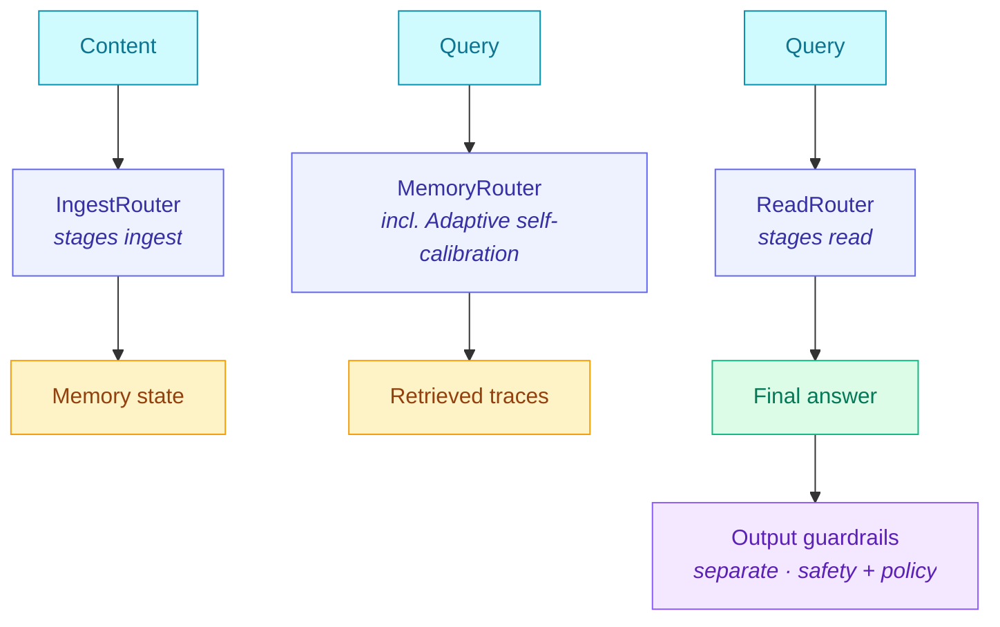

# Cognitive Pipeline

The Cognitive Pipeline routes each incoming message through a chain of small classifier calls and dispatches to the cheapest retrieval + reader strategy that handles its category. It does not block, refuse, or validate output. Content-level safety is a separate primitive — see [Guardrails Architecture](./GUARDRAILS_ARCHITECTURE.md).

The pipeline replaces single-path retrieval (embed → vector search → top-K → reader, same path every query) with three sequential routers — ingest, recall, read — each picking a strategy from a registered routing table. The result is per-message-adaptive cost: trivial queries skip retrieval entirely, complex queries get the architecture and reader best suited to their category.

## What it actually does

Every message goes through a chain of decisions. Each decision is a small `gpt-5-mini`-style classifier call that picks the best strategy for that specific message. The first decision is whether memory should be touched at all — single-path retrieval treats this as implicit ("always retrieve"), which means paying full embedding+rerank+reader cost on greetings, small-talk turns, and general-knowledge questions answerable from context.

For incoming content:

1. **Ingest stage**: when content arrives (a new conversation turn, a document, a code file), classify the content kind and pick a storage strategy. Short conversations don't need observation extraction; long articles benefit from session summarization. The stage decides per-content. See [Ingest Router](./INGEST_ROUTER.md).

For incoming queries:

2. **Stage 1: Memory-or-not gate ([QueryClassifier](./QUERY_ROUTER.md))**: assigns each query a retrieval tier (T0 / T1 / T2 / T3). T0 is "no retrieval, answer from context alone" — greetings, small talk, general-knowledge questions that don't need memory at all. T1+ activates the rest of the pipeline. This stage saves the embedding+rerank+reader cost on every memory-irrelevant query.

3. **Stage 2: Architecture dispatch ([MemoryRouter](./MEMORY_ROUTER.md))**: for T1+ queries only, classify the query category (one of six: single-session-user, single-session-assistant, single-session-preference, knowledge-update, multi-session, temporal-reasoning) and pick the best memory backend (canonical-hybrid, observational-memory-v10, or observational-memory-v11). Canonical-hybrid handles single-session-user and multi-session synthesis questions at low latency in sem-embed deployments. See [MEMORY_ROUTER.md](./MEMORY_ROUTER.md) for the full routing table.

4. **Stage 3: Reader-tier dispatch ([ReaderRouter](./READ_ROUTER.md))**: reuses Stage 2's category classification (zero extra LLM calls) to dispatch the answer call to the best reader for that category. gpt-4o for temporal-reasoning + single-session-user (long-context arithmetic and exact recall). gpt-5-mini for single-session-assistant + single-session-preference + knowledge-update + multi-session (structured extraction at ~12× lower per-token cost). The single-session-preference lift alone is +23.4 pp on a reader-tier swap (63.3% gpt-4o → 86.7% gpt-5-mini at the same retrieval).

5. **Read intent dispatch ([ReadRouter](./READ_ROUTER.md))**: a separate primitive that picks read strategy (precise-fact lookups use single-call; multi-source synthesis uses two-call extract-then-answer; time-interval questions use scratchpad-then-answer). Composable with ReaderRouter or used independently.

Each stage is a router. Each router is an LLM-as-judge that classifies its input, picks a strategy from its routing table, and dispatches to a registered executor. The pipeline costs **one classifier call per query** because Stages 2 and 3 reuse Stage 1's classification output. Cognitive Pipeline composes the routers into one orchestrator.

## Architecture



The cognitive pipeline is the three orchestrator stages on the left. Output guardrails on the right are a separate primitive ([Guardrails Architecture](./GUARDRAILS_ARCHITECTURE.md)) that runs after the pipeline finishes.

## How a single message flows through

Imagine a user types: *"What's my current job title?"*

1. **Recall stage** receives the query.
   - The [`MemoryRouter`](https://github.com/framerslab/agentos/blob/master/src/orchestration/pipeline/memory/MemoryRouter.ts)'s classifier (`gpt-5-mini`, ~$0.0002 per call) reads the query and emits `knowledge-update` (because "current X" with a state-evolution implication).
   - The routing table for the `minimize-cost` preset says `knowledge-update → canonical-hybrid` — because Phase B measurements show canonical wins on this category.
   - The dispatcher invokes the canonical-hybrid backend (BM25 + dense + Cohere rerank). Returns top-K retrieved traces.

2. **Read stage** receives the query + traces.
   - The [`ReadRouter`](https://github.com/framerslab/agentos/blob/master/src/orchestration/pipeline/read/ReadRouter.ts)'s classifier reads them and emits `precise-fact` intent.
   - The routing table for the `precise-fact` preset says `precise-fact → single-call`.
   - The dispatcher invokes the single-call reader. Returns the final answer.

3. **Output guardrails** (separate; existing core/guardrails primitive) validate the answer for grounding, topicality, PII before it reaches the user.

Total LLM calls: 1 classifier (recall) + 1 classifier (read) + 1 backend retrieval + 1 reader + N output guardrails. The classifier overhead is ~$0.0004 per message; the routing decision saves dollars on harder questions by picking the right architecture instead of paying the all-OM premium on questions where canonical wins.

## What you get from using it

1. **Per-message-adaptive cost.** Every question gets the cheapest backend that handles its category well. The same agent serves $0.018/correct on simple lookups and $0.04/correct on multi-session synthesis. The heavy machinery only runs when it earns its cost.

2. **No benchmark gaming**: the routing decisions are made by classifiers that read the actual question, not by static `if/else` heuristics that overfit to one benchmark. Same orchestrator works on LongMemEval, LOCOMO, BEAM, internal workloads.

3. **Single-provider reproducibility**: every classifier talks to a provider-agnostic LLM adapter interface ([`IMemoryClassifierLLM`](https://github.com/framerslab/agentos/blob/master/src/orchestration/pipeline/memory/classifier.ts), [`IIngestClassifierLLM`](https://github.com/framerslab/agentos/blob/master/src/orchestration/pipeline/ingest/classifier.ts), [`IReadIntentClassifierLLM`](https://github.com/framerslab/agentos/blob/master/src/orchestration/pipeline/read/classifier.ts)). Wire one OpenAI key and the whole pipeline reproduces. Custom providers, mocks, or local models slot in via the same interface.

4. **Budget-aware dispatch**: every router ships with three budget modes (`hard` / `soft` / `cheapest-fallback`). Set a per-stage USD ceiling and the dispatcher gracefully degrades (or escalates a typed error) instead of running away with cost.

5. **Calibration-driven, not opinion-driven**: shipping routing tables come from measured Phase B per-category cost-accuracy points. For workloads that diverge from LongMemEval-S, [`AdaptiveMemoryRouter`](./ADAPTIVE_MEMORY_ROUTER.md) derives tables from your own calibration data.

## Stage primitives

Each stage is its own shippable primitive with full README + 26-38 contract tests:

| Stage | Primitive | Subpath | Doc |
|---|---|---|---|
| Ingest | [`IngestRouter`](https://github.com/framerslab/agentos/blob/master/src/orchestration/pipeline/ingest/IngestRouter.ts) | `@framers/agentos/ingest-router` | [Ingest Router](./INGEST_ROUTER.md) |
| Recall | [`MemoryRouter`](https://github.com/framerslab/agentos/blob/master/src/orchestration/pipeline/memory/MemoryRouter.ts) | `@framers/agentos/memory-router` | [Memory Router](./MEMORY_ROUTER.md) |
| Recall (self-calibrating) | [`AdaptiveMemoryRouter`](https://github.com/framerslab/agentos/blob/master/src/orchestration/pipeline/memory/adaptive.ts) | `@framers/agentos/memory-router` | [Adaptive Memory Router](./ADAPTIVE_MEMORY_ROUTER.md) |
| Read | [`ReadRouter`](https://github.com/framerslab/agentos/blob/master/src/orchestration/pipeline/read/ReadRouter.ts) | `@framers/agentos/read-router` | [Read Router](./READ_ROUTER.md) |
| Composition | [`CognitivePipeline`](https://github.com/framerslab/agentos/blob/master/src/orchestration/pipeline/index.ts) | `@framers/agentos/orchestration/pipeline` | (this doc) |

Each primitive can be used standalone. CognitivePipeline is the convenience wrapper when you want all three stages coordinating.

## Quickstart

```ts
import {
  IngestRouter,
  LLMIngestClassifier,
  FunctionIngestDispatcher,
} from '@framers/agentos/ingest-router';
import {
  MemoryRouter,
  LLMMemoryClassifier,
  FunctionMemoryDispatcher,
} from '@framers/agentos/memory-router';
import {
  ReadRouter,
  LLMReadIntentClassifier,
  FunctionReadDispatcher,
} from '@framers/agentos/read-router';
import {
  CognitivePipeline,
  ingestRouterAsStage,
  memoryRouterAsStage,
  readRouterAsStage,
} from '@framers/agentos/orchestration/pipeline';

// One adapter that maps any provider's chat-completion API to the
// shape every classifier expects. Provider-agnostic — wire OpenAI,
// Anthropic, local, or a mock.
const adapter = {
  async invoke(req: { system: string; user: string; maxTokens: number; temperature: number }) {
    const res = await openai.chat.completions.create({
      model: 'gpt-5-mini',
      messages: [
        { role: 'system', content: req.system },
        { role: 'user', content: req.user },
      ],
      max_tokens: req.maxTokens,
      temperature: req.temperature,
    });
    return {
      text: res.choices[0]?.message.content ?? '',
      tokensIn: res.usage?.prompt_tokens ?? 0,
      tokensOut: res.usage?.completion_tokens ?? 0,
      model: res.model,
    };
  },
};

const ingestRouter = new IngestRouter({
  classifier: new LLMIngestClassifier({ llm: adapter }),
  preset: 'summarized',
  dispatcher: new FunctionIngestDispatcher({
    'raw-chunks': async (content) => ({ writtenTraces: await myRawIngest(content) }),
    summarized: async (content) => ({ writtenTraces: await mySummarizedIngest(content) }),
    observational: async (content) => ({ writtenTraces: await myObsIngest(content) }),
  }),
});

const memoryRouter = new MemoryRouter({
  classifier: new LLMMemoryClassifier({ llm: adapter }),
  preset: 'minimize-cost',
  budget: { perQueryUsd: 0.05, mode: 'cheapest-fallback' },
  dispatcher: new FunctionMemoryDispatcher({
    'canonical-hybrid': async (q, p) => myHybridRetrieve(q, p),
    'observational-memory-v10': async (q, p) => myOMv10Recall(q, p),
    'observational-memory-v11': async (q, p) => myOMv11Recall(q, p),
  }),
});

const readRouter = new ReadRouter({
  classifier: new LLMReadIntentClassifier({ llm: adapter }),
  preset: 'precise-fact',
  dispatcher: new FunctionReadDispatcher({
    'single-call': async (q, evidence) => mySingleCallReader(q, evidence),
    'two-call-extract-answer': async (q, evidence) => myTwoCallReader(q, evidence),
    'commit-vs-abstain': async (q, evidence) => myCommitOrAbstainReader(q, evidence),
    'verbatim-citation': async (q, evidence) => myVerbatimReader(q, evidence),
    'scratchpad-then-answer': async (q, evidence) => myScratchpadReader(q, evidence),
  }),
});

const pipeline = new CognitivePipeline({
  ingest: ingestRouterAsStage(ingestRouter),
  recall: memoryRouterAsStage(memoryRouter),
  read: readRouterAsStage(readRouter),
});

// Per-message use:
await pipeline.ingest(newConversationContent);
const result = await pipeline.recallAndRead("what's my current job title?");
console.log(result.outcome);                          // final answer
console.log(result.recallStage.backend);              // 'canonical-hybrid'
console.log(result.readStage.strategy);               // 'single-call'
console.log(result.recallStage.memoryRouterDecision); // full decision telemetry
```

## API surface

```ts
class CognitivePipeline<TTrace, TOutcome> {
  constructor(options: CognitivePipelineOptions<TTrace, TOutcome>);

  // independent stages:
  ingest(content: string, payload?: unknown): Promise<IngestStageResult>;
  recall(query: string, payload?: unknown): Promise<RecallStageResult<TTrace>>;
  read(query: string, traces: TTrace[], payload?: unknown): Promise<ReadStageResult<TOutcome>>;

  // composed:
  recallAndRead(
    query: string,
    recallPayload?: unknown,
    readPayload?: unknown,
  ): Promise<RecallAndReadResult<TTrace, TOutcome>>;

  readonly hasIngestStage: boolean;
  readonly hasRecallStage: boolean;
  readonly hasReadStage: boolean;
}
```

Stage interfaces:

```ts
interface IngestStage {
  ingest(content: string, payload?: unknown): Promise<IngestStageResult>;
}
interface RecallStage<TTrace> {
  recall(query: string, payload?: unknown): Promise<RecallStageResult<TTrace>>;
}
interface ReadStage<TTrace, TOutcome> {
  read(query: string, traces: TTrace[], payload?: unknown): Promise<ReadStageResult<TOutcome>>;
}
```

Stage adapters that wrap the agentos routers:

- `ingestRouterAsStage(IngestRouter)` → [`IngestStage`](https://github.com/framerslab/agentos/blob/master/src/orchestration/pipeline/index.ts)
- `memoryRouterAsStage(MemoryRouter)` → `RecallStage<TTrace>`
- `readRouterAsStage(ReadRouter, traceToString?)` → `ReadStage<TTrace, TOutcome>`

Errors: [`MissingStageError`](https://github.com/framerslab/agentos/blob/master/src/orchestration/pipeline/index.ts) (raised when a method is called without its required stage configured).

## When to use just one stage instead

If you only need recall routing, use [`MemoryRouter`](./MEMORY_ROUTER.md) directly. Cognitive Pipeline adds composition value when you want all three stages working together; it doesn't add anything for single-stage flows.

If you have a custom orchestrator and just want the per-stage primitives, import them directly:

```ts
import { MemoryRouter } from '@framers/agentos/memory-router';
import { ReadRouter } from '@framers/agentos/read-router';

// Compose them yourself however you want.
const traces = await memoryRouter.decideAndDispatch(query, { topK: 10 });
const answer = await readRouter.decideAndDispatch(
  query,
  traces.traces.map((t) => t.text),
);
```

## Design principles

1. **Provider-agnostic.** Every classifier talks to a provider-agnostic adapter interface. No SDK imports inside any module.
2. **Pure where possible.** [`selectIngestStrategy`](https://github.com/framerslab/agentos/blob/master/src/orchestration/pipeline/ingest/select-strategy.ts), [`selectBackend`](https://github.com/framerslab/agentos/blob/master/src/orchestration/pipeline/memory/select-backend.ts), [`selectReadStrategy`](https://github.com/framerslab/agentos/blob/master/src/orchestration/pipeline/read/select-strategy.ts) are pure functions: deterministic, no I/O. Safe inside cache keys and hot loops.
3. **Dispatch is injected.** Stage routers don't execute backends — they hand a decision to a `FunctionXDispatcher` whose registry of executors the consumer wires. Lets you connect to your standing infrastructure (existing HybridRetriever, OM pipeline, custom retriever) without touching this module.
4. **Pluggable composition.** [`CognitivePipeline`](https://github.com/framerslab/agentos/blob/master/src/orchestration/pipeline/index.ts) doesn't care if a stage is an agentos router or a custom impl. Anything satisfying the stage interface slots in.
5. **Frozen defaults.** Preset routing tables and default cost-points are `Object.freeze`d. Consumers cannot mutate the routing surface from outside the modules.
6. **Typed errors.** Every misuse path raises a specific error class so application-layer fallbacks are easy to write: [`MemoryRouterUnknownCategoryError`](https://github.com/framerslab/agentos/blob/master/src/orchestration/pipeline/memory/select-backend.ts), [`MemoryRouterBudgetExceededError`](https://github.com/framerslab/agentos/blob/master/src/orchestration/pipeline/memory/select-backend.ts), [`MemoryRouterDispatcherMissingError`](https://github.com/framerslab/agentos/blob/master/src/orchestration/pipeline/memory/MemoryRouter.ts), [`UnsupportedMemoryBackendError`](https://github.com/framerslab/agentos/blob/master/src/orchestration/pipeline/memory/dispatcher.ts), plus `IngestRouter*` and `ReadRouter*` siblings.

## Calibration

The shipping presets come from LongMemEval-S Phase B N=500 measurements. For workloads with non-LongMemEval cost/accuracy profiles, every router accepts an override `routingTable`, `mapping` (per-category override), and `backendCosts` / `strategyCosts`. Or use [`AdaptiveMemoryRouter`](./ADAPTIVE_MEMORY_ROUTER.md), which derives the routing table from your own calibration data.

## Related

- [Memory Router](./MEMORY_ROUTER.md) — recall stage primitive
- [Ingest Router](./INGEST_ROUTER.md) — input stage primitive
- [Read Router](./READ_ROUTER.md) — read stage primitive
- [Adaptive Memory Router](./ADAPTIVE_MEMORY_ROUTER.md) — self-calibrating router for non-LongMemEval workloads
- [Query Router](./QUERY_ROUTER.md) — sibling primitive for general Q&A (vector / graph / keyword fallback). MemoryRouter is for memory recall; QueryRouter is for ask-a-question retrieval.
- [Guardrails Architecture](./GUARDRAILS_ARCHITECTURE.md) — output-stage safety/policy (separate concern from this module)
