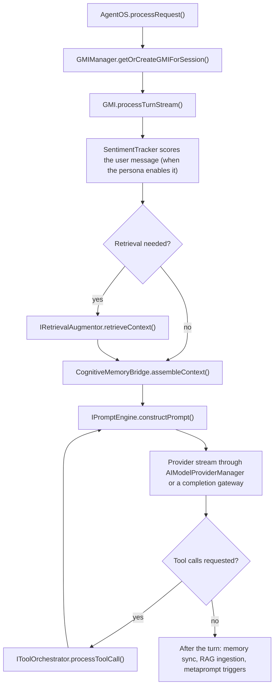

# Generalized Mind Instances (GMIs)

A **Generalized Mind Instance** (GMI) is the per-session agent of the full AgentOS runtime. Every request to [`AgentOS.processRequest()`](https://github.com/framerslab/agentos/blob/master/src/api/AgentOS.ts) is handled by the GMI bound to the request's session. The GMI holds that session's persona, working memory, conversation history, mood, user and task context, and a reasoning trace, and it runs the turn: retrieval, prompt construction, the streamed model call, and the tool calls the model makes.

The full runtime creates a GMI for each session, and a host can build one itself ([Model calls through a completion gateway](#model-calls-through-a-completion-gateway) shows how). The lightweight helpers, [`agent()`](https://github.com/framerslab/agentos/blob/master/src/api/agent.ts), [`agency()`](https://github.com/framerslab/agentos/blob/master/src/api/agency.ts), [`generateText()`](https://github.com/framerslab/agentos/blob/master/src/api/generateText.ts) and [`streamText()`](https://github.com/framerslab/agentos/blob/master/src/api/streamText.ts), never create a GMI. They call the model provider directly. `agent().session()` keeps each session's message history in process memory unless the agent is created with `history: false`, and `agency().session()` always keeps it; `generateText()`, `streamText()` and the `generate()` and `stream()` methods of an agent or an agency keep none, and a caller of `generateText()` or `streamText()` passes the earlier turns in `messages`.

| | Full runtime (`AgentOS`) | Lightweight helpers (`agent()`, `agency()`) |
|---|---|---|
| Entry point | `AgentOS.create()`, or `new AgentOS()` and `initialize(config)`; then `processRequest()` | `agent({...}).session(id).send()` or `.stream()`; `agency({...})` |
| Per-session state | A GMI from `GMIManager` | A message history held in process memory |
| Persona | A persona definition, named on every request by `selectedPersonaId` | `instructions` and `personality`, written into the system prompt |
| Sentiment tracking and metaprompts | Yes | No |
| Long-term memory | A cognitive memory manager, when `gmiManagerConfig.cognitiveMemoryFactory` supplies one | A `memoryProvider` you pass in |
| Guardrails, RAG, HITL, channels, emergent tools | Run by the runtime | `agent()` accepts them without applying them and logs a warning ([capability contract](https://github.com/framerslab/agentos/blob/master/src/api/runtime/capabilityContract.ts)); `agency()` applies guardrails, RAG context, HITL approvals and, on `hierarchical`, emergent specialists at the agency level, and wires no channels ([Agencies](./AGENCIES.md)) |
| Output | A stream of `AgentOSResponse` chunks | A `StreamTextResult` (`textStream`, `fullStream`) |

## What a GMI adds over a plain agent

A plain agent, `agent({...})`, calls the model with a system prompt built from your instructions and personality values, keeps the session's messages in process memory, and runs the tools you list. A GMI runs the same model, tools, extensions, guardrail packs and cognitive memory manager inside a turn loop the lightweight helper does not have:

| Only on a GMI | What it does | Where |
|---|---|---|
| Persona definition and overlays | A loaded persona with traits, a mood (PAD) state and per-session overlays, bound to the session by `GMIManager` | [`GMIManager.ts`](https://github.com/framerslab/agentos/blob/master/src/cognition/substrate/GMIManager.ts), [`persona_overlays/`](https://github.com/framerslab/agentos/tree/master/src/cognition/substrate/persona_overlays) |
| Sentiment scoring and events | When the persona enables `sentimentTracking`, the runtime's utility AI scores every user turn (one LLM call per turn with the default `LLMUtilityAI`, a lexicon scan with `StatisticalUtilityAI`), and score thresholds, runs of consecutive turns and confusion phrases raise events such as `USER_FRUSTRATED` and `USER_CONFUSED`; without it the sentiment path does not run | [`GMI.ts`](https://github.com/framerslab/agentos/blob/master/src/cognition/substrate/GMI.ts) (`processTurnStream()`, the sentiment step), [`SentimentTracker.ts`](https://github.com/framerslab/agentos/blob/master/src/cognition/substrate/SentimentTracker.ts) lines 130 and 258-324 |
| Metaprompts | Events and turn intervals run metaprompts: frustration recovery, confusion clarification, satisfaction reinforcement, error recovery, engagement, and a self-reflection metaprompt (`gmi_self_trait_adjustment`) that re-reads the GMI's mood, user skill and task context from evidence. It does not change HEXACO traits; only `adapt_personality` does. The sentiment presets merge into a persona that enables `sentimentTracking`; turn-interval and manual metaprompts run from the persona's own `metaPrompts` regardless. | [`MetapromptExecutor.ts`](https://github.com/framerslab/agentos/blob/master/src/cognition/substrate/MetapromptExecutor.ts), [`metaprompt_presets.ts`](https://github.com/framerslab/agentos/blob/master/src/cognition/substrate/personas/metaprompt_presets.ts), [`PersonaLoader.ts`](https://github.com/framerslab/agentos/blob/master/src/cognition/substrate/personas/PersonaLoader.ts) lines 199-222 |
| Mood-weighted memory bridge | With cognitive memory attached, every exchange is observed and encoded with the GMI's current PAD state and mood, and recalled with emotional congruence in the composite score | [`CognitiveMemoryBridge.ts`](https://github.com/framerslab/agentos/blob/master/src/cognition/substrate/CognitiveMemoryBridge.ts) lines 277-292, [`RetrievalPriorityScorer.ts`](https://github.com/framerslab/agentos/blob/master/src/cognition/memory/core/decay/RetrievalPriorityScorer.ts) lines 40-46 |
| Reasoning trace | The last N decision entries of the turn loop (500 by default; `reasoningTraceConfig.maxEntries` on the persona, `defaultReasoningTraceMaxEntries` on the runtime config), readable for debugging and used as evidence by the self-reflection metaprompt | [`GMI.ts`](https://github.com/framerslab/agentos/blob/master/src/cognition/substrate/GMI.ts) (`initialize()` and `addTraceEntry()`), [`reasoningTraceLimits.ts`](https://github.com/framerslab/agentos/blob/master/src/cognition/substrate/reasoningTraceLimits.ts) |
| Self-modification tools | With `emergentConfig.selfImprovement.enabled`, the runtime registers `adapt_personality`, `manage_skills`, `create_workflow` and `self_evaluate`. `adapt_personality` changes the running GMI's traits within bounds; a `PersonalityMutationStore` records the changes only when a storage adapter is supplied and `personality.persistWithDecay` is on, and stored mutations are not reloaded into later GMIs | [`ToolOrchestrator.ts`](https://github.com/framerslab/agentos/blob/master/src/core/tools/ToolOrchestrator.ts) lines 362-392, [`SelfImprovementSessionManager.ts`](https://github.com/framerslab/agentos/blob/master/src/api/runtime/SelfImprovementSessionManager.ts) line 369, [`AdaptPersonalityTool.ts`](https://github.com/framerslab/agentos/blob/master/src/cognition/emergent/AdaptPersonalityTool.ts) line 340 |
| RAG trigger and discovery context | The loop decides per turn whether to retrieve, and injects capability-discovery context when discovery is configured | [`GMI.ts`](https://github.com/framerslab/agentos/blob/master/src/cognition/substrate/GMI.ts) (`processTurnStream()`: the RAG decision and the discovery-context step) |

Reusable without a GMI, but not run by `agent()` itself: the eight memory mechanisms, the observer and reflector pipeline, HyDE and graph retrieval all belong to `CognitiveMemoryManager` and the RAG layer. A host wires them (wilds-ai and Wunderland build the manager themselves); `agent()` alone runs none of them and warns when given `cognitiveMechanisms`. Shared by both paths: the model and provider, tools and extensions, and the HEXACO trait values. `agent()` writes those values into the prompt once; a GMI carries them as persona state that `adapt_personality` can change.

## Getting a GMI

```typescript
import { AgentOS, AgentOSResponseChunkType, BUILT_IN_PERSONAS } from '@framers/agentos';

// AgentOS.create() reads persona files from ./personas by default. Personas can
// also be given inline, as parsed JSON or code-built objects; here, the five the
// package ships. A custom loader covers any other source.
const agentos = await AgentOS.create({ personas: BUILT_IN_PERSONAS });

for await (const chunk of agentos.processRequest({
  userId: 'user-42',
  sessionId: 'research-session-1',
  selectedPersonaId: 'v_researcher',
  textInput: 'Summarize the open incidents from this week.',
})) {
  if (chunk.type === AgentOSResponseChunkType.TEXT_DELTA) {
    process.stdout.write(chunk.textDelta);
  }
}
```

Persona definitions, the three loading paths (a directory of JSON files, an inline `personas` list, a custom loader) and validation are on [Defining and loading personas](./PERSONAS.md).

`AgentOS.create()` builds the default `AgentOSConfig` with [`createAgentOSConfig()`](https://github.com/framerslab/agentos/blob/master/src/core/config/AgentOSConfig.ts), which reads its settings from environment variables, and initializes the runtime. That configuration loads persona definitions from `./personas` and uses `v_researcher` as the default persona id (`DEFAULT_PERSONA_ID` overrides it). For full control, construct `new AgentOS()` and call `initialize(config)` with your own `AgentOSConfig`. An inline `personas` list (the sample passes `BUILT_IN_PERSONAS`, the five persona definitions the package exports; `getBuiltInPersona(id)` returns one by id) or a custom `personaLoader` replaces the `./personas` file loader; the two cannot be combined. A `./personas` directory of persona JSON files works without either override. When no source provides the requested persona id, `getOrCreateGMIForSession()` rejects it with `PERSONA_NOT_FOUND`.

A request that names no `selectedPersonaId` uses the configuration's `defaultPersonaId`; the turn pipeline rejects the request only when neither is set ([`TurnExecutionPipeline.ts`](https://github.com/framerslab/agentos/blob/master/src/api/runtime/TurnExecutionPipeline.ts)). The pipeline hands the turn to [`GMIManager.getOrCreateGMIForSession()`](https://github.com/framerslab/agentos/blob/master/src/cognition/substrate/GMIManager.ts), which loads the persona, checks that the user may use it, and either reuses the GMI already bound to the session or creates one. A GMI serves its session until the session asks for a persona refresh or the host removes it. `GMIManager.cleanupInactiveGMIs()` removes GMIs idle longer than a threshold (60 minutes by default); nothing in the runtime calls it on a schedule, so a long-running host calls it.

## What a turn does



[`GMI.processTurnStream()`](https://github.com/framerslab/agentos/blob/master/src/cognition/substrate/GMI.ts) runs these steps itself, calling its injected services at each one:

1. **Sentiment.** When the persona enables `sentimentTracking` and the latest message is from the user, `SentimentTracker` scores it before the first model call. Score thresholds, runs of consecutive turns and confusion phrases emit [`GMIEvent`](https://github.com/framerslab/agentos/blob/master/src/cognition/substrate/GMIEvent.ts)s, which drive event-based metaprompts ([Adaptive Prompt Intelligence](./ADAPTIVE_PROMPT_INTELLIGENCE.md) lists the conditions).
2. **Retrieval.** When `shouldTriggerRAGRetrieval()` decides the turn needs context and a retrieval augmentor is configured, the GMI calls `retrieveContext()` and emits a `RAG_SOURCES_AVAILABLE` chunk with the retrieved sources.
3. **Memory context.** With cognitive memory attached, `CognitiveMemoryBridge.assembleContext()` retrieves memories relevant to the user's message.
4. **Prompt.** `IPromptEngine.constructPrompt()` builds the messages for the model call.
5. **Model call.** `AIModelProviderManager` resolves the provider for the turn's model, and the GMI streams `generateCompletionStream()` with the persona's and the turn's [completion options](#completion-options). With a completion gateway, the gateway resolves the serving model before step 4 and streams the call ([Model calls through a completion gateway](#model-calls-through-a-completion-gateway)). A model step that completes ends with a `STEP_FINISHED` chunk. A step that fails emits none: an error after output, a failure that is not retryable, the end of the fallback chain or any other error inside the step ends the turn with an `ERROR` chunk. When `GMIBaseConfig.beforeModelCall` is set, the GMI calls it before every attempt, a fallback hop's included, with the turn id, the step index, the hop, the provider, the model and a copy of the attempt's prompt. Messages it returns replace that attempt's prompt and do not enter the history; a hook that throws or returns an empty list is recorded on the reasoning trace, and the built prompt is sent. A turn whose `metadata.options` sets `cacheDiagnostics` (`true`, or `{ previousMessageId }`) sends Anthropic's prompt-cache diagnostics on every step: the first step compares against the message the turn names, each later step against the previous step's response ([Cache Diagnostics](./features/CACHE_DIAGNOSTICS.md)).
6. **Tools.** The GMI runs each requested tool call through `IToolOrchestrator.processToolCall()` and emits a `TOOL_RESULT` chunk for each result it records in the history: a failed call's too, and, when a round stops early, the error result it records for each call the round did not finish. The loop then builds the next prompt with the tool results (step 4) and calls the model again, until the model answers without requesting tools or `maxToolLoopIterations` (5 by default) is reached. Retrieval and memory context (steps 2 and 3) run only for the turn's first model call.
7. **After the turn.** With cognitive memory attached, the bridge encodes the exchange (`syncForTurn()`). When the persona's RAG configuration enables turn-summary ingestion, the GMI ingests the exchange into the retrieval augmentor, summarizing it first if that is configured. Finally `MetapromptExecutor` checks its triggers.

## Model calls through a completion gateway

`GMIBaseConfig.completionGateway` gives a GMI one model layer, a [`CompletionGateway`](https://github.com/framerslab/agentos/blob/master/src/api/runtime/completionGateway.ts) built by `createCompletionGateway(defaults)`. A host that builds a GMI itself sets it, with a [`GatewayProviderManager`](https://github.com/framerslab/agentos/blob/master/src/api/runtime/gatewayProviderManager.ts) as the GMI's `llmProviderManager`:

```typescript
import { createCompletionGateway, GatewayProviderManager } from '@framers/agentos';
import { GMI } from '@framers/agentos/cognition/substrate';

const gmi = new GMI('support-gmi');
await gmi.initialize(persona, {
  ...services, // working memory, prompt engine, tool orchestrator, utility AI
  completionGateway: createCompletionGateway({
    fallbackProviders: [{ provider: 'anthropic', model: 'claude-opus-4-8' }],
  }),
  llmProviderManager: new GatewayProviderManager().asProviderManager(),
});
```

The defaults carry the routing inputs a turn does not: the router and its params, the host policy, the policy tier, the fallback chain and the primary's credentials. Without `fallbackProviders`, the chain is the one [`buildPolicyAwareFallbackChain()`](https://github.com/framerslab/agentos/blob/master/src/api/generateText.ts) builds for the policy tier from the provider keys in the environment, without the primary's provider ([Fallback Behavior](./features/LLM_PROVIDERS.md#fallback-behavior) lists its legs); `fallbackProviders: []` turns fallback off. A fallback entry's `effort`, `cache` and `maxTokensHeadroom` apply to the steps its hop serves. The GMI passes the model and provider it would call, the user's text as the router's task hint, the tools and its completion options. It also passes its own `onFallback` and `onHopFailure`, which record each fallback and each hop that could not start as `WARNING` entries in the reasoning trace; callbacks set in the defaults do not run for a GMI's turns. `GMIManager` sets no gateway, so the GMIs of the full runtime call their provider directly, one call per model step, with no fallback. [`examples/gmi-completion-gateway.mjs`](https://github.com/framerslab/agentos/blob/master/examples/gmi-completion-gateway.mjs) builds a GMI with a gateway and prints the chunks of a turn its fallback hop serves.

With a gateway, each model step runs this way:

- **Resolved before the prompt.** The gateway picks the hop (the router's choice or the primary, then the fallback chain), skips a hop whose provider circuit is open or whose provider cannot start (a failed initialisation, a fallback leg without credentials), initialises the hop's provider and reads its context window and capabilities. The GMI builds the prompt for that model.
- **Fallback before output.** An attempt that fails before its first content chunk (text, a tool call or a schema answer) emits none of its chunks. When the failure is retryable, the gateway resolves the next hop and the GMI rebuilds the prompt for that hop's model. A failure is retryable when `generateText()` would fail over on it ([`isRetryableError()`](https://github.com/framerslab/agentos/blob/master/src/api/generateText.ts): HTTP 401, 402, 403, 429, 500, 502, 503, 504 and 529, network failures, timeouts and a provider that cannot initialize, among others) or when it is a content-policy refusal; a caller's abort is never retried. A failure that is not retryable, or the end of the chain, ends the turn with `LLM_PROVIDER_ERROR`; a turn with no hop that can start ends with `LLM_PROVIDER_UNAVAILABLE`, and a primary with no credentials in the defaults or the environment fails the turn with that configuration error's message and the code `GMI_PROCESSING_ERROR`.
- **No fallback after output.** Once text or a tool call has streamed, an error ends the step and the turn with `LLM_PROVIDER_ERROR`.
- **Forward within a turn.** The next step of the turn, after a tool round or in a continuation through `handleToolResults()`, stays on the hop that served the last one. The next user turn starts at the primary again.
- **Billed failures count.** When the provider billed an attempt that failed before any output and reported it (a refused Claude turn reports its usage), that usage is added to the turn's total and emitted as a `USAGE_UPDATE` whose `metadata` holds `attemptFailed: true` and the failed hop's `hop`, `providerId` and `modelId`. No `STEP_FINISHED` carries it.
- **Metaprompts and utility calls.** `MetapromptExecutor`, and a utility AI built over the same manager, reach a provider through the `GatewayProviderManager`, whose `getProvider()` answers only for the serving hop's provider id and `getProviderForModel()` only for its model id. When a fallback hop on another provider serves the turn, a metaprompt that runs on the persona's provider finds none and records the failure in the reasoning trace. They have no fallback of their own.
- **Replay blocks stay in the history.** Each provider sends only its own replay blocks (Anthropic's thinking blocks, Gemini's thought signatures), so the history keeps them as the model produced them, whichever hop serves the next step.

## Completion options

Each model call of a turn carries the completion options the persona and the turn set. The GMI reads these keys from the persona's `defaultModelCompletionOptions`, then from the turn's `metadata.options`, and a value the turn sets replaces the persona's for that key: `temperature`, `maxTokens`, `topP`, `frequencyPenalty`, `presencePenalty`, `stopSequences`, `thinking`, `effort`, `cache`, `promptCacheKey`, `promptCacheRetention`, `serviceTier`, `requestTimeout`, `customModelParams`, `responseFormat` and `toolChoice` (`FORWARDED_COMPLETION_OPTION_KEYS` in [`GMI.ts`](https://github.com/framerslab/agentos/blob/master/src/cognition/substrate/GMI.ts)). When neither sets them, `temperature` is 0.7, `maxTokens` is 2048, and `toolChoice` is `auto` on a turn with tools. Other keys, `cacheDiagnostics` among them, are not sent. The tool definitions, the `userId` and streaming are the GMI's own.

On the full runtime, a request's `options` are the turn's `metadata.options`: the `temperature`, `topP`, `maxTokens` and `responseFormat` of a `processRequest()` call reach the provider, and its `preferredModelId` picks the turn's model.

A turn on a GMI with a completion gateway can ask for a schema answer: `metadata.options.responseSchema` takes a Zod schema and `schemaName` its name. The gateway sends each hop the structured-output payload its provider takes ([`responseFormatForProvider.ts`](https://github.com/framerslab/agentos/blob/master/src/api/runtime/responseFormatForProvider.ts)) and sends the step without tools. An Anthropic hop answers with a forced tool call, which arrives on `STEP_FINISHED` as `structuredOutput`; OpenAI, OpenRouter and Gemini hops return the JSON as the step's text. An Anthropic model that rejects a forced tool choice, and a provider with no structured-output payload, receive no schema. Without a gateway, `responseSchema` is not used.

## Conversation history

The GMI keeps the session's messages in its [`ConversationHistoryManager`](https://github.com/framerslab/agentos/blob/master/src/cognition/substrate/ConversationHistoryManager.ts). A turn records its input, then trims the history to the newest 20 messages, or to the persona's `conversationContextConfig.maxMessages`; the turn's assistant replies and tool results are added as it runs. A host sets the history with these calls ([`IGMI.ts`](https://github.com/framerslab/agentos/blob/master/src/cognition/substrate/IGMI.ts); optional on `IGMI`, all three implemented by `GMI`):

- `replaceHistory(messages)` makes `messages` the whole history. An empty array empties it.
- `clearHistory()` empties the history.
- `hydrateConversationHistory(messages)` replaces the history the same way. The runtime calls it when `resumeExternalToolRequest()` continues a stored turn.

Both replacing calls take [`ConversationMessage`](https://github.com/framerslab/agentos/blob/master/src/core/conversation/ConversationMessage.ts)s: they leave out messages with the `error` or `thought` role and turn a `summary` message into a system message. Neither trims what it sets; the next turn trims the history to its window when it records its input.

A turn whose `metadata.conversationHistoryForPrompt` is a non-empty array builds its prompts from that history instead of the GMI's own: the conversation before the turn, ending before the current user message. The full runtime passes its stored conversation this way. An empty array is ignored.

## What a GMI holds

From [`GMI.ts`](https://github.com/framerslab/agentos/blob/master/src/cognition/substrate/GMI.ts) (trimmed):

```typescript
export class GMI implements IGMI {
  public readonly gmiId: string;

  // Services injected by GMIManager
  private workingMemory!: IWorkingMemory;
  private promptEngine!: IPromptEngine;
  private retrievalAugmentor?: IRetrievalAugmentor;
  private toolOrchestrator!: IToolOrchestrator;
  private llmProviderManager!: AIModelProviderManager;
  private utilityAI!: IUtilityAI;
  private cognitiveMemory?: ICognitiveMemoryManager;

  // Per-session state
  private activePersona!: IPersonaDefinition;
  private currentGmiMood: GMIMood;
  private currentUserContext!: UserContext;
  private currentTaskContext!: TaskContext;
  private reasoningTrace: ReasoningTrace; // keeps the last N entries (500 by default; persona or runtime config)

  // Collaborators
  private conversationHistoryManager!: ConversationHistoryManager;
  private memoryBridge: CognitiveMemoryBridge | null = null;
  private sentimentTracker!: SentimentTracker;
  private metapromptExecutor!: MetapromptExecutor;
}
```

| Part | What it does |
|---|---|
| [`ConversationHistoryManager`](https://github.com/framerslab/agentos/blob/master/src/cognition/substrate/ConversationHistoryManager.ts) | Holds the session's messages. Keeps the newest 20 by default and drops older ones; a host replaces or clears them ([Conversation history](#conversation-history)). |
| [`CognitiveMemoryBridge`](https://github.com/framerslab/agentos/blob/master/src/cognition/substrate/CognitiveMemoryBridge.ts) | Connects the GMI to its cognitive memory manager: assembles memory context for the prompt and encodes each exchange. The GMI creates it only when it has cognitive memory. |
| [`SentimentTracker`](https://github.com/framerslab/agentos/blob/master/src/cognition/substrate/SentimentTracker.ts) | Scores user sentiment each turn when the persona enables `sentimentTracking`, and emits `GMIEvent`s when patterns cross thresholds. |
| [`MetapromptExecutor`](https://github.com/framerslab/agentos/blob/master/src/cognition/substrate/MetapromptExecutor.ts) | Runs metaprompts on a turn interval, on sentiment events, or on manual flags. The [presets](https://github.com/framerslab/agentos/blob/master/src/cognition/substrate/personas/metaprompt_presets.ts) cover frustration recovery, confusion clarification, satisfaction reinforcement, error recovery and engagement; the self-reflection handler (`gmi_self_trait_adjustment`) re-reads mood, user skill and task complexity. |
| `IWorkingMemory` | Key-value working memory for the session. `GMIManager` gives each GMI an in-memory instance. |
| [`IPromptEngine`](https://github.com/framerslab/agentos/blob/master/src/core/llm/IPromptEngine.ts) | Builds the prompt for each model call. |
| [`IRetrievalAugmentor`](https://github.com/framerslab/agentos/blob/master/src/cognition/rag/IRetrievalAugmentor.ts) | Optional RAG over document corpora; also receives turn summaries when ingestion is enabled. |
| [`IToolOrchestrator`](https://github.com/framerslab/agentos/blob/master/src/core/tools/IToolOrchestrator.ts) | Lists the tools available to the turn and executes tool calls. |
| [`AIModelProviderManager`](https://github.com/framerslab/agentos/blob/master/src/core/llm/providers/AIModelProviderManager.ts) | Resolves the provider for the turn's model. With a completion gateway it is a [`GatewayProviderManager`](https://github.com/framerslab/agentos/blob/master/src/api/runtime/gatewayProviderManager.ts), which answers from the hop serving the turn. |
| [`CompletionGateway`](https://github.com/framerslab/agentos/blob/master/src/api/runtime/completionGateway.ts) | Optional, set by `GMIBaseConfig.completionGateway`. Resolves the model that serves each step, initialises its provider and streams the call, moving to the next hop when a hop cannot start or an attempt fails before any output with a retryable error. |
| [`IUtilityAI`](https://github.com/framerslab/agentos/blob/master/src/cognition/nlp/ai_utilities/IUtilityAI.ts) | Smaller jobs, such as summarizing an exchange before RAG ingestion. |
| `ICognitiveMemoryManager` | Optional long-term cognitive memory, described below. |

## Cognitive memory

A GMI gets cognitive memory only through `gmiManagerConfig.cognitiveMemoryFactory`. `GMIManager` calls the factory for each new GMI with the GMI id, session id, user id, persona, working memory, and the runtime's provider manager, utility AI, tool orchestrator and retrieval augmentor, and attaches the `ICognitiveMemoryManager` it returns. `createAgentOSConfig()` sets no factory, so GMIs run without cognitive memory until you add one. If the factory throws, the GMI starts without cognitive memory and `GMIManager` logs a warning. Wunderland's [`CognitiveMemoryInitializer`](https://github.com/jddunn/wunderland/blob/master/src/memory/initialization/CognitiveMemoryInitializer.ts) is a working example of building a `CognitiveMemoryManager` with mechanisms and HEXACO traits.

### The eight mechanisms

The mechanisms belong to [`CognitiveMemoryManager`](https://github.com/framerslab/agentos/blob/master/src/cognition/memory/CognitiveMemoryManager.ts), not to the GMI. They run when the manager is initialized with a `cognitiveMechanisms` config. Without that config the mechanisms engine is never created; `{}` turns on all eight with the defaults below; per-mechanism fields override them. A host that builds a `CognitiveMemoryManager` directly gets the same mechanisms without a GMI. `agent()` and `agency()` accept a `cognitiveMechanisms` field but do not apply it.

Defaults from [`mechanisms/defaults.ts`](https://github.com/framerslab/agentos/blob/master/src/cognition/memory/mechanisms/defaults.ts):

| Mechanism | Default behavior |
|---|---|
| Reconsolidation | A recalled trace's emotional context drifts toward the current mood by 0.05 per recall, at most 0.4 in total. |
| Retrieval-induced forgetting | Related traces that were not recalled are suppressed: similarity threshold 0.7, suppression factor 0.12, at most 5 per query. |
| Involuntary recall | Probability 0.08 that an older related trace surfaces unprompted; the trace must be at least 14 days old with strength of at least 0.15. |
| Feeling of knowing | Partial activations above 0.3 surface as tip-of-the-tongue signals. |
| Temporal gist | Traces older than 60 days that were retrieved at least twice are reduced to a gist that keeps entities and emotional context. |
| Schema encoding | An observation that fits an existing cluster (similarity 0.75) is encoded at 0.85×; a novel one at 1.3×. |
| Source-confidence decay | Decay multipliers by source: user statements and tool results 1.0, observations 0.95, external sources 0.90, agent inferences 0.80, reflections 0.75. |
| Emotion regulation | Reappraisal rate 0.15, suppression above arousal 0.8, at most 10 regulations per cycle. |

The base decay model is Ebbinghaus forgetting, `S(t) = S₀ · e^(−Δt / stability)` ([`DecayModel.ts`](https://github.com/framerslab/agentos/blob/master/src/cognition/memory/core/decay/DecayModel.ts)).

### Personality modulation

When the manager receives HEXACO `traits` (each from 0 to 1), every mechanism except temporal gist scales with them ([`CognitiveMechanismsEngine.ts`](https://github.com/framerslab/agentos/blob/master/src/cognition/memory/mechanisms/CognitiveMechanismsEngine.ts)). For a trait value `v`:

| Trait | Parameter | Scaling |
|---|---|---|
| Emotionality | Reconsolidation drift rate | × (0.5 + v) |
| Conscientiousness | Retrieval-induced forgetting suppression | × (0.7 + 0.6v) |
| Openness | Involuntary recall probability | × (0.5 + v), capped at 1 |
| Openness | Schema-encoding novelty boost | × (0.8 + 0.4v) |
| Extraversion | Feeling-of-knowing threshold | × (1.3 − 0.6v): a lower threshold surfaces more tip-of-the-tongue signals |
| Honesty | Agent-inference and reflection decay multipliers | − 0.15v, with floors of 0.5 and 0.4 |
| Agreeableness | Emotion-regulation reappraisal rate | × (0.7 + 0.6v) |

Personality reaches the model separately on each path. `agent()` writes its `personality` traits into a "Personality & Communication Style" section of the system prompt, with distinct instructions for values above 0.65 and below 0.35. On the full runtime, persona definitions carry `personalityTraits`; `GMI.setPersonalityTrait()` changes one trait for one GMI, and the `adapt_personality` tool (with `emergentConfig.selfImprovement.enabled`) calls it for the GMI that runs the tool; no metaprompt changes traits.

### Retrieval

`CognitiveMemoryManager.retrieve()` runs in four layers:

1. **HyDE (opt in).** With the `hyde` retrieval option, or a retrieval policy whose `hyde` is `'always'`, the manager asks a model for a hypothetical memory and searches with its embedding. The [`MemoryHydeRetriever`](https://github.com/framerslab/agentos/blob/master/src/cognition/memory/retrieval/hyde/MemoryHydeRetriever.ts) is attached automatically when a model invoker is available.
2. **Composite score.** Each candidate is scored on embedding similarity, strength, emotional congruence with the current mood, recency, graph activation and importance. The default weights are 0.35, 0.25, 0.15, 0.10, 0.10 and 0.05 ([`RetrievalPriorityScorer.ts`](https://github.com/framerslab/agentos/blob/master/src/cognition/memory/core/decay/RetrievalPriorityScorer.ts)).
3. **Spreading activation.** The memory graph is on unless the config sets `graph.disabled: true`. Its backend is a knowledge graph by default, or Graphology with `graph.backend: 'graphology'` ([`config.ts`](https://github.com/framerslab/agentos/blob/master/src/cognition/memory/core/config.ts)). The top 5 results seed a spreading-activation pass, the activated memories are rescored and resorted, and the co-activation is recorded so memories recalled together link more strongly.
4. **Reranking (optional).** With a `rerankerService` configured, the final score blends 0.7 cognitive and 0.3 reranker.

## Output stream

`GMIOutputChunkType` ([`IGMI.ts`](https://github.com/framerslab/agentos/blob/master/src/cognition/substrate/IGMI.ts)) has twelve chunk types. A `GMI` yields eight of them: `RAG_SOURCES_AVAILABLE`, `TEXT_DELTA`, `TOOL_CALL_REQUEST`, `USAGE_UPDATE`, `STEP_FINISHED`, `TOOL_RESULT`, `ERROR` and, last, `FINAL_RESPONSE_MARKER`. `REASONING_STATE_UPDATE`, `SYSTEM_MESSAGE`, `LATENCY_REPORT` and `UI_COMMAND` are defined for `IGMI` implementations; `GMI` does not emit them. Three of the chunks describe the model steps:

| Chunk | Content |
|---|---|
| `USAGE_UPDATE` | The `ModelUsage` of every provider chunk that carries usage, a chunk without a choice included. Providers report the request's running total, so a step's last `USAGE_UPDATE` is that step's usage. A failed attempt's billed usage arrives with `metadata.attemptFailed: true` (see the gateway section above). |
| `STEP_FINISHED` | `StepFinishedChunkPayload`, one per model step that completes; a step that fails emits none ([What a turn does](#what-a-turn-does)). Fields: `stepIndex` (0-based within the turn), `text` (the step's own text: its deltas joined, or the final message content when the provider sent no deltas), `finishReason`, `providerId`, `modelId` and `hop` (0 for the primary); `usage`, `responseModel`, `serviceTier`, `providerMessageId` and `cacheDiagnostics` when the provider reported them; `structuredOutput` when a gateway hop returned a schema answer as a forced tool call ([Completion options](#completion-options)); `thinkingBlocks` when the step returned extended-thinking blocks (Anthropic), so a host that stores the turn can replay them. The chunk's own `finishReason` and `usage` fields repeat the step's. |
| `TOOL_RESULT` | `ToolResultChunkPayload`, one per result the GMI records for a call of its tool round: a failed call's too, and the error result a stopped round records for each call it did not finish. Fields: `toolCallId`, `name`, `result`, `isError`, and `errorDetails` when the result has them. Results a host passes to `handleToolResults()` enter the history without a `TOOL_RESULT` chunk. |

Within a step, each provider chunk yields its `TEXT_DELTA` and `TOOL_CALL_REQUEST` chunks, then its `USAGE_UPDATE`. The step's `STEP_FINISHED` follows its last chunk, and the `TOOL_RESULT` chunks of its tool round follow the `STEP_FINISHED`. A step's text is emitted once. The turn's usage total, `usage` on the `GMIOutput` the turn returns, adds each completed step's last report once and the billed usage of each attempt that failed before output; a step that fails after output adds nothing to it.

[`GMIChunkTransformer`](https://github.com/framerslab/agentos/blob/master/src/api/runtime/GMIChunkTransformer.ts) turns the chunks into the [`AgentOSResponse`](https://github.com/framerslab/agentos/blob/master/src/api/types/AgentOSResponse.ts) chunks that `processRequest()` yields: `TEXT_DELTA` and `TOOL_CALL_REQUEST` keep their type, `RAG_SOURCES_AVAILABLE` becomes a `METADATA_UPDATE` carrying `ragSources`, and `ERROR` becomes an `ERROR` chunk; from an `IGMI` that emits them, `SYSTEM_MESSAGE` becomes `SYSTEM_PROGRESS` and `UI_COMMAND` stays `UI_COMMAND`. The orchestrator builds the turn's `FINAL_RESPONSE` from the `GMIOutput` the turn returns, and `FINAL_RESPONSE_MARKER` is not forwarded. Neither are `USAGE_UPDATE`, `STEP_FINISHED` and `TOOL_RESULT`: the turn's usage reaches the runtime stream on `FINAL_RESPONSE.usage`, and step boundaries and tool results serve hosts that read the GMI's own stream.

On the lightweight path, `agent().session(id).stream()` returns a [`StreamTextResult`](https://github.com/framerslab/agentos/blob/master/src/api/streamText.ts): `textStream` for text deltas and `fullStream` for typed stream parts.

## Multi-agent work

`agency()` builds each roster member with `agent()`, so agency members are not GMIs. Its strategies are sequential, parallel, debate, review-loop, hierarchical and graph. With the hierarchical strategy and `emergent.enabled`, the manager gets a `spawn_specialist` tool; a specialist it creates becomes callable as `delegate_to_<role>` on the manager's next turn ([`hierarchical.ts`](https://github.com/framerslab/agentos/blob/master/src/api/runtime/strategies/hierarchical.ts)). `agency().session()` keeps per-session message history and usage totals; the roster and any session-tier specialists reset between `send()` calls.

The classes in [`src/agents/agency/`](https://github.com/framerslab/agentos/tree/master/src/agents/agency) ([`AgencyRegistry`](https://github.com/framerslab/agentos/blob/master/src/agents/agency/AgencyRegistry.ts), [`AgencyMemoryManager`](https://github.com/framerslab/agentos/blob/master/src/agents/agency/AgencyMemoryManager.ts) and [`AgentCommunicationBus`](https://github.com/framerslab/agentos/blob/master/src/agents/agency/AgentCommunicationBus.ts)) serve the full runtime's workflow layer ([`WorkflowRuntime`](https://github.com/framerslab/agentos/blob/master/src/orchestration/workflows/runtime/WorkflowRuntime.ts)), not `agency()`.

## Where things live

- [`src/api/AgentOS.ts`](https://github.com/framerslab/agentos/blob/master/src/api/AgentOS.ts): the full runtime and `processRequest()`
- [`src/cognition/substrate/GMI.ts`](https://github.com/framerslab/agentos/blob/master/src/cognition/substrate/GMI.ts): the GMI class and its turn loop
- [`src/cognition/substrate/GMIManager.ts`](https://github.com/framerslab/agentos/blob/master/src/cognition/substrate/GMIManager.ts): GMI lifecycle, persona loading and the cognitive memory factory
- [`src/cognition/substrate/personas/`](https://github.com/framerslab/agentos/tree/master/src/cognition/substrate/personas): persona definitions, loaders and metaprompt presets
- [`src/cognition/substrate/personas/InMemoryPersonaLoader.ts`](https://github.com/framerslab/agentos/blob/master/src/cognition/substrate/personas/InMemoryPersonaLoader.ts) and [`src/api/runtime/personaLoaderResolution.ts`](https://github.com/framerslab/agentos/blob/master/src/api/runtime/personaLoaderResolution.ts): inline persona lists and how a runtime picks its persona source; guide: [Defining and loading personas](./PERSONAS.md)
- [`src/cognition/substrate/persona_overlays/`](https://github.com/framerslab/agentos/tree/master/src/cognition/substrate/persona_overlays): per-session persona overlays
- [`src/cognition/memory/`](https://github.com/framerslab/agentos/tree/master/src/cognition/memory): cognitive memory, including [`mechanisms/`](https://github.com/framerslab/agentos/tree/master/src/cognition/memory/mechanisms) and [`retrieval/`](https://github.com/framerslab/agentos/tree/master/src/cognition/memory/retrieval)
- [`src/api/agent.ts`](https://github.com/framerslab/agentos/blob/master/src/api/agent.ts) and [`src/api/agency.ts`](https://github.com/framerslab/agentos/blob/master/src/api/agency.ts): the lightweight helpers
- [`src/cognition/emergent/`](https://github.com/framerslab/agentos/tree/master/src/cognition/emergent): emergent tool and agent forging

## Further reading

- [System Architecture](/architecture/system-architecture): module layout and request lifecycle
- [Cognitive Memory](/features/cognitive-memory): encoding, decay and retrieval in depth
- [Adaptive Prompt Intelligence](/features/adaptive-prompt-intelligence): the metaprompt loop that [`MetapromptExecutor`](https://github.com/framerslab/agentos/blob/master/src/cognition/substrate/MetapromptExecutor.ts) runs, its trigger types and presets
- [Skills vs Tools vs Extensions](/architecture/skills-vs-tools-vs-extensions): when each capability system applies
- [Emergent Capabilities](/features/emergent-capabilities): runtime tool forging and `spawn_specialist`
- [Guardrails](/features/guardrails): how guardrails intercept tool calls and generation
- [LLM Providers](/architecture/llm-providers): the provider implementations

---

## References

### Cognitive architectures for language agents

- Sumers, T. R., Yao, S., Narasimhan, K., & Griffiths, T. L. (2023). [*Cognitive architectures for language agents.*](https://arxiv.org/abs/2309.02427) arXiv:2309.02427. The CoALA framework, whose episodic, semantic and procedural memory taxonomy AgentOS follows.
- Park, J. S., O'Brien, J. C., Cai, C. J., Morris, M. R., Liang, P., & Bernstein, M. S. (2023). [*Generative agents: Interactive simulacra of human behavior.*](https://arxiv.org/abs/2304.03442) arXiv:2304.03442. Persona, memory and reflection combined in one agent.

### Personality structure

- Ashton, M. C., & Lee, K. (2007). [*Empirical, theoretical, and practical advantages of the HEXACO model of personality structure.*](https://doi.org/10.1177/1088868306294907) *Personality and Social Psychology Review*, 11(2), 150–166. The six-factor model the personality traits use.

### Memory mechanics

The mechanisms on this page draw on the cognitive-science papers listed in [Cognitive Memory](/features/cognitive-memory#references). The most directly relevant:

- Ebbinghaus, H. (1885). *Memory: A Contribution to Experimental Psychology.* The decay curve `S(t) = S₀ · e^(−Δt / stability)`.
- Anderson, J. R. (1983). *A spreading activation theory of memory.* The model behind the graph activation pass in retrieval.
- Hebb, D. O. (1949). *The Organization of Behavior: A Neuropsychological Theory.* Co-retrieval link strengthening.

### Implementation references

- [`src/cognition/substrate/GMI.ts`](https://github.com/framerslab/agentos/blob/master/src/cognition/substrate/GMI.ts): the GMI class
- [`src/cognition/substrate/GMIManager.ts`](https://github.com/framerslab/agentos/blob/master/src/cognition/substrate/GMIManager.ts): GMI lifecycle
- [`src/api/types.ts`](https://github.com/framerslab/agentos/blob/master/src/api/types.ts): `AgencyOptions`, `AgencyStrategy`, `EmergentConfig` and `EmergentPlannerConfig`
- [`src/agents/agency/`](https://github.com/framerslab/agentos/tree/master/src/agents/agency): the workflow layer's agency classes
- [`src/cognition/emergent/`](https://github.com/framerslab/agentos/tree/master/src/cognition/emergent): emergent tool and agent forge primitives
