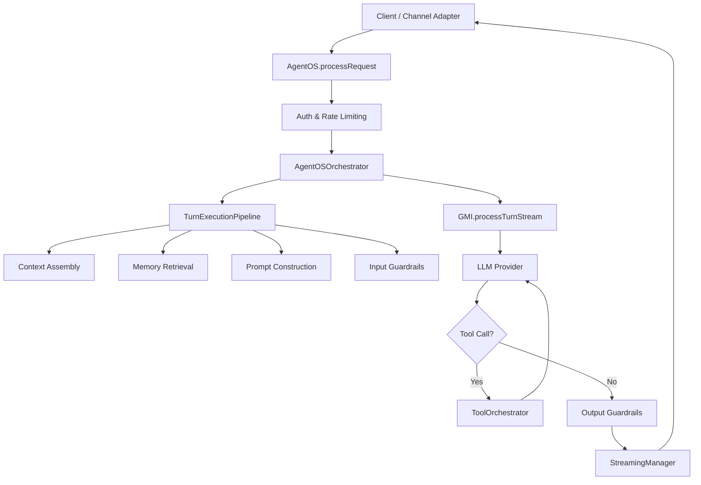
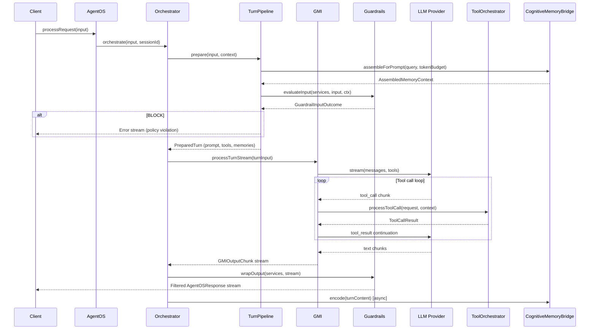
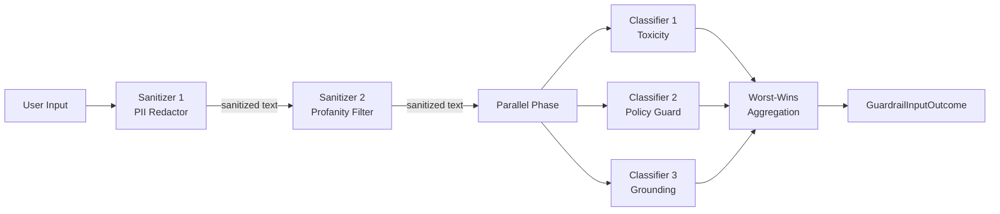
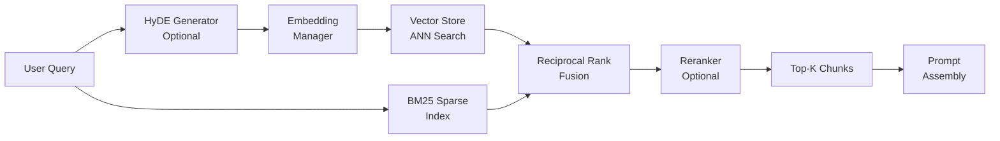
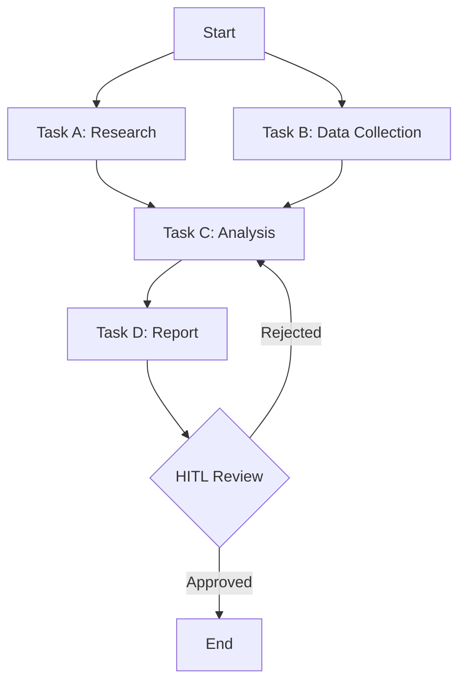
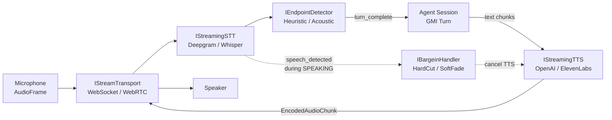

# System Architecture

The shape of an agent runtime tells you what its authors thought the hard problems were. Most agent SDKs are organized around a turn loop: take a prompt, call a model, parse for tool calls, execute, loop. The hard problems they expect you to have are about retries, structured output, and connector configuration. Their internal modules are named accordingly.

AgentOS is organized differently. The hard problems it expects you to have are about state — about what an agent knows across hours and conversations, about which version of itself is talking to which user, about whether a tool call should run, about what the agent should remember tomorrow that it learned today. The 26 top-level modules below are mostly subsystems for managing that state. The turn loop is in there, but it's a small piece in the middle.

This page is the map. For the *what* of any subsystem — what each piece is, who owns its lifecycle, where the source lives — read on. For deep-dives into individual concerns, jump out from the table of contents below.

For specific subsystem deep-dives, see:
- [Sandbox & Security](./sandbox-security.md)
- [CLI Subprocess](./cli-subprocess.md)
- [Tool Permissions](./tool-permissions.md)
- [Provenance & Immutability](../features/provenance-immutability.md)


---

## Source Directory Layout

The `src/` tree is organized into 26 domain-specific top-level modules. Only foundational infrastructure remains under `core/`.

**Perception model:** Vision, hearing, and speech are separated into three independent modules following the biological perception analogy -- **vision/** (OCR, scene detection, image analysis), **hearing/** (STT providers, VAD, silence detection), and **speech/** (TTS providers, resolver, session). Shared media generation (images, video, music, SFX) remains under **media/**.

**Key architectural patterns:**

- **GMI** (Generalized Mind Instance) delegates to focused collaborators: `ConversationHistoryManager`, `CognitiveMemoryBridge`, `SentimentTracker`, and `MetapromptExecutor`. Persona layering lives in `cognitive_substrate/persona_overlays/`.

- **AgentOS** is the public lifecycle facade. Setup and runtime concerns are in `api/runtime/` (`WorkflowFacade`, `CapabilityDiscoveryInitializer`, `RagMemoryInitializer`). High-level helpers (`generateText`, `streamText`, `agent`, `agency`) live under `api/`.

- **AgentOSOrchestrator** coordinates requests, delegating to `TurnExecutionPipeline` (pre-LLM preparation), `GMIChunkTransformer` (stream mapping), and `ExternalToolResultHandler` (tool-result continuation).

```
src/
├── agents/                  # Agent definitions + multi-agent collectives
│   ├── definitions/         # Agent type definitions
│   └── agency/              # Multi-agent coordination (AgencyRegistry, etc.)
│
├── api/                     # Public API surface (AgentOS, high-level helpers)
│   ├── runtime/             # Orchestrator collaborators, tool adapters, provider defaults
│   └── types/               # AgentOSInput, AgentOSResponse, etc.
│
├── channels/                # Channel adapters + telephony + social posting
│   ├── adapters/            # Platform-specific adapters (Discord, Slack, etc.)
│   ├── telephony/           # Voice call providers (Twilio, Vonage, etc.)
│   └── social-posting/      # Social media post management
│
├── cognitive_substrate/     # GMI + extracted collaborators
│   ├── personas/            # Persona definitions + loader
│   ├── persona_overlays/    # PersonaOverlayManager
│   ├── ConversationHistoryManager.ts
│   ├── CognitiveMemoryBridge.ts
│   ├── SentimentTracker.ts
│   └── MetapromptExecutor.ts
│
├── core/                    # Infrastructure (11 dirs)
│   ├── config/              # Configuration types
│   ├── conversation/        # ConversationManager
│   ├── embeddings/          # IEmbeddingManager (shared interface)
│   ├── llm/                 # LLM providers, routing
│   ├── logging/             # Logger abstraction
│   ├── rate-limiting/       # Rate limiter
│   ├── storage/             # IStorageAdapter
│   ├── streaming/           # StreamingManager
│   ├── tools/               # ITool, ToolOrchestrator
│   ├── utils/               # Shared helpers
│   └── vector-store/        # IVectorStore, IVectorStoreManager (shared interfaces)
│
├── discovery/               # Capability discovery engine (tiered semantic search)
│
├── emergent/                # Emergent capabilities (self-improvement)
│
├── evaluation/              # Eval framework + observability
│   └── observability/       # OpenTelemetry tracing & metrics
│
├── extensions/              # Extension system
│
├── hearing/                 # Listening: STT providers, VAD, silence detection
│
├── marketplace/             # Agent marketplace + workspace
│   ├── store/               # Marketplace listings & search
│   └── workspace/           # Per-agent workspace helpers
│
├── media/                   # Creative generation (images, video, music, SFX)
│   ├── audio/               # Music + SFX generation
│   ├── images/              # Image generation (DALL-E, Stability, etc.)
│   └── video/               # Video generation & analysis
│
├── memory/                  # Cognitive memory system
│   ├── core/                # Shared memory types, decay, working-memory helpers
│   ├── io/facade/           # Standalone Memory API (remember/recall)
│   ├── io/tools/            # MemoryAdd/Search/Update/Delete/Merge tools
│   ├── mechanisms/          # Neuroscience-grounded cognitive mechanisms
│   ├── pipeline/            # Consolidation, context, lifecycle, observation
│   └── retrieval/           # Brain, graphs, feedback, prospective memory
│
├── nlp/                     # NLP processing
│   ├── ai_utilities/        # AI utility helpers (LLM-backed summarization, etc.)
│   ├── language/            # Language detection & translation
│   ├── tokenizers/          # Tokenizer implementations
│   ├── stemmers/            # Stemmer implementations
│   └── ...                  # normalizers, lemmatizers, filters
│
├── orchestration/           # DAG workflow engine + planner + HITL
│   ├── planner/             # PlanningEngine, ReAct loops
│   ├── hitl/                # Human-in-the-loop approval
│   ├── workflows/           # Workflow definitions & execution
│   ├── turn-planner/        # TurnPlanner + telemetry
│   ├── ir/                  # Intermediate representation
│   ├── compiler/            # Graph compiler
│   ├── runtime/             # Workflow runtime
│   ├── checkpoint/          # Checkpoint/restore
│   └── events/              # Event bus
│
├── provenance/              # Content provenance + blockchain anchoring
│
├── query-router/            # Query classification + routing
│
├── rag/                     # Retrieval-augmented generation
│   ├── vector-search/       # HNSW sidecar, Postgres, etc.
│   ├── vector_stores/       # Vector store implementations
│   ├── chunking/            # Document chunking strategies
│   ├── reranking/           # Reranking models
│   ├── unified/             # Unified retriever
│   └── graphrag/            # Graph-augmented retrieval
│
├── safety/                  # Guardrails + runtime safety
│   ├── guardrails/          # IGuardrailService, ParallelGuardrailDispatcher
│   └── runtime/             # CircuitBreaker, CostGuard, StuckDetector, etc.
│
├── sandbox/                 # Sandboxed execution + subprocess
│   ├── executor/            # Sandboxed code execution
│   └── subprocess/          # CLISubprocessBridge, CLIRegistry
│
├── skills/                  # SKILL.md loader (content lives in agentos-skills)
│
├── speech/                  # Speaking: TTS providers, resolver, session
│
├── structured/              # Structured output + prompt routing
│   ├── output/              # StructuredOutputManager, JSON schema
│   └── prompting/           # Prompt routing & construction
│
├── types/                   # Shared types (auth)
│
├── vision/                  # Seeing: OCR, scene detection, image analysis
│
└── voice-pipeline/          # Real-time voice conversation orchestrator
```

### Architecture Layers

The diagram at the top of this page is the canonical layered view. From top to bottom:

1. **API surface** — `generateText` / `streamText` / `agent` / `agency` / `generateImage`, plus the `AgentOS` lifecycle facade.
2. **Orchestration** — DAG runtime, `workflow()`, `mission()`, `AgentGraph`, HITL, checkpointing, planning engine.
3. **GMI** — per-mind state: `ConversationHistory`, `CognitiveMemoryBridge`, `SentimentTracker`, `MetapromptExecutor`, persona overlays.
4. **Safety & Guardrails** alongside **Tools & Extensions** — 5-tier security (PII, toxicity, grounding, circuit breakers, cost guard) and the 110-extension / 88-skill catalog with capability discovery and runtime tool forging.
5. **Memory & RAG** — 4-tier cognitive memory, 8 mechanisms (Ebbinghaus decay, retrieval-induced forgetting, …), 7 vector backends, HyDE, GraphRAG, hybrid retrieval, `CitationVerifier`.
6. **LLM providers** — 11 direct providers + OpenRouter fan-out with automatic fallback chains.
7. **Perception & channels** — vision (OCR), hearing (STT, VAD), speech (TTS, voice pipeline), 12 messaging adapters, telephony.

The diagram above the prose shows how a typical request enters at layer 1 and traverses downward.

### API Surface Contract

`generateText()`, `streamText()`, `agent()`, `agency()`, and the `AgentOS` runtime share some configuration names, but the shared config surface does not imply identical enforcement.

- `agent()` is the lightweight stateful facade for prompt assembly, sessions, tools, hooks, personality shaping, and usage-ledger forwarding.
- `generateText()` / `streamText()` are low-level helper loops for provider selection, direct tool execution, and text-fallback tool calling.
- The full `AgentOS` runtime and `agency()` own the deeper runtime systems: emergent tooling, guardrails, discovery, RAG bootstrapping, permissions/security tiers, HITL, voice/channels, and provenance-aware orchestration.



---

## GMI (Generalized Mind Instance)

The GMI is the core cognitive engine of AgentOS. Each GMI instance represents a single "mind" bound to a specific persona, with its own working memory, mood state, reasoning trace, and conversation history.

### GMI Lifecycle

```
┌──────────┐     initialize()     ┌──────────┐
│  (new)   │ ──────────────────> │   IDLE   │
└──────────┘                      └────┬─────┘
                                       │ initialize(persona, config)
                                       v
                                 ┌──────────┐
                                 │  READY   │ <─────────────────────┐
                                 └────┬─────┘                       │
                                      │ processTurnStream()         │
                                      v                             │
                                ┌────────────┐   turn complete  ┌───┴──────┐
                                │ PROCESSING │ ──────────────> │  READY   │
                                └─────┬──────┘                  └──────────┘
                                      │ tool call
                                      v
                             ┌─────────────────────┐
                             │ AWAITING_TOOL_RESULT │
                             └─────────┬───────────┘
                                       │ tool result received
                                       v
                                ┌────────────┐
                                │ PROCESSING │ (continues LLM turn)
                                └────────────┘
```

### Initialization

`GMI.initialize(persona, config)` validates required dependencies, wires collaborators, and loads state:

```typescript
const gmi = new GMI('my-gmi-id');
await gmi.initialize(researchAssistantPersona, {
  workingMemory,
  promptEngine,
  toolOrchestrator,
  llmProviderManager,
  utilityAI,
  cognitiveMemory,       // Optional: enables CognitiveMemoryBridge
  retrievalAugmentor,    // Optional: enables RAG
});
```

Required dependencies: `workingMemory`, `promptEngine`, `toolOrchestrator`, `llmProviderManager`, `utilityAI`. Optional: `cognitiveMemory`, `retrievalAugmentor`.

### Collaborators

The GMI delegates to four extracted collaborators to keep the core class focused:

| Collaborator | Responsibility |
|---|---|
| `ConversationHistoryManager` | Maintains chat history, supports hydration from external stores |
| `CognitiveMemoryBridge` | Bridges GMI turns to the `CognitiveMemoryManager` (encode/retrieve/observe) |
| `SentimentTracker` | Tracks user sentiment via `IUtilityAI`, emits `GMIEvent` types (frustration, confusion, etc.) |
| `MetapromptExecutor` | Handles metaprompt triggers, self-reflection, and state updates |

### Turn Processing

`processTurnStream()` is an async generator that yields `GMIOutputChunk` objects:

```typescript
for await (const chunk of gmi.processTurnStream(turnInput)) {
  switch (chunk.type) {
    case GMIOutputChunkType.TEXT_DELTA:     // Streaming text
    case GMIOutputChunkType.TOOL_CALL:      // Tool call request
    case GMIOutputChunkType.TOOL_RESULT:    // Tool execution result
    case GMIOutputChunkType.FINAL_RESPONSE: // Aggregated final output
    case GMIOutputChunkType.ERROR:          // Error during processing
  }
}
```

### AgentOS Facade

`AgentOS` (`api/AgentOS.ts`) is the public-facing facade that manages GMI instances, streaming, and cross-cutting concerns. It exposes `processRequest()` as the primary entry point and coordinates:

- `GMIManager` -- Pool of GMI instances keyed by persona/session
- `AgentOSOrchestrator` -- Turn preparation and stream transformation
- `StreamingManager` -- WebSocket/SSE stream multiplexing
- `ExtensionManager` -- Tool, guardrail, and workflow extension loading
- `ConversationManager` -- Cross-session conversation persistence

`AgentOSConfig` is the comprehensive configuration object (~50 fields) that wires all subsystems together. Key optional features activated via config: `ragConfig`, `turnPlanning`, `emergent`, `observability`, `standaloneMemory`, `workflowEngineConfig`.

---

## Request Lifecycle

A user request flows through the following stages:

1. **Authentication & Rate Limiting** -- Validate auth context and check rate limits.
2. **Context Assembly** -- Load session history, conversation context, and temporal/environmental state.
3. **GMI Selection** -- Get or create a GMI instance for the user/persona/session tuple.
4. **Memory Retrieval** -- `CognitiveMemoryBridge` retrieves relevant memory traces; RAG retrieval runs if configured.
5. **Prompt Construction** -- `MetapromptExecutor` assembles system, persona, memory, RAG context, and conversation history into the prompt via `PromptBuilder`.
6. **Pre-execution Guardrails** -- `ParallelGuardrailDispatcher` runs input guardrails (sanitizers first, classifiers in parallel).
7. **Tool Orchestration** -- `ToolOrchestrator` resolves and executes any tool calls selected by the LLM.
8. **LLM Execution** -- `StreamingManager` sends the prompt to the selected LLM provider and streams chunks.
9. **Post-execution Guardrails** -- Output guardrails evaluate the response (toxicity, PII, grounding).
10. **Memory Update** -- `CognitiveMemoryBridge` encodes new memory traces; `MemoryObserver` queues background consolidation.
11. **Analytics** -- `Tracer` records OpenTelemetry spans; cost/token metrics are tracked.

The `TurnExecutionPipeline` (in `api/runtime/`) handles steps 2-6 before handing off to the LLM. `GMIChunkTransformer` maps raw LLM chunks into `AgentOSResponse` format. `ExternalToolResultHandler` manages tool-result continuation loops.

### Sequence Diagram

The following sequence diagram traces a single request through the system:



### Key Types

| Type | Module | Purpose |
|------|--------|---------|
| `AgentOSInput` | `api/types/` | Normalized request envelope (text, audio, images, metadata) |
| `AgentOSResponse` | `api/types/` | Streamed response chunks (TEXT_DELTA, TOOL_CALL, FINAL_RESPONSE, ERROR) |
| `GMITurnInput` | `cognitive_substrate/IGMI` | Internal turn representation consumed by the GMI |
| `GMIOutputChunk` | `cognitive_substrate/IGMI` | Per-chunk output from the cognitive engine |
| `ConversationContext` | `core/conversation/` | Session state: history, active persona, user context |

---

## Extension & Guardrail Runtime

The extension runtime is centered on three core pieces:

1. **`ExtensionManifest` / `ExtensionPack`** -- Declarative loading of tool bundles, guardrails, and channel adapters.
2. **`ExtensionManager`** -- Descriptor activation and runtime access.
3. **`ISharedServiceRegistry`** -- Lazy singleton reuse across packs (for NLP pipelines, ONNX classifiers, embedding functions).

```typescript
interface ExtensionPack {
  name: string;
  version?: string;
  descriptors: ExtensionDescriptor[];
  onActivate?: (context: ExtensionLifecycleContext) => Promise<void> | void;
  onDeactivate?: (context: ExtensionLifecycleContext) => Promise<void> | void;
}
```

### Creating an Extension Pack

Extension packs are the unit of distribution. Each pack bundles one or more descriptors of the same or different kinds (`tool`, `guardrail`, `workflow`, `provenance`, etc.) and can hook into the activation lifecycle to perform setup and teardown.

```typescript
import type { ExtensionPack, ExtensionLifecycleContext } from '@framers/agentos/extensions';
import { EXTENSION_KIND_TOOL } from '@framers/agentos/extensions';

export function createMyExtensionPack(): ExtensionPack {
  return {
    name: 'my-custom-tools',
    version: '1.0.0',
    descriptors: [
      {
        kind: EXTENSION_KIND_TOOL,
        tool: {
          id: 'my-search-tool',
          name: 'search_documents',
          displayName: 'Document Search',
          description: 'Search internal documents by query.',
          inputSchema: {
            type: 'object',
            properties: { query: { type: 'string' } },
            required: ['query'],
          },
          execute: async (args) => {
            const results = await searchIndex(args.query);
            return { success: true, output: results };
          },
        },
      },
    ],
    onActivate: async (ctx: ExtensionLifecycleContext) => {
      const apiKey = ctx.getSecret?.('MY_API_KEY');
      // Initialize resources, warm caches, etc.
    },
    onDeactivate: async () => {
      // Release resources
    },
  };
}
```

Packs are loaded by including them in the `extensionManifest` passed to `AgentOS.initialize()`, or by using the schema-on-demand meta-tools (`extensions_list`, `extensions_enable`) at runtime.

### Descriptor Kinds

| Kind | Constant | Payload Field | Description |
|------|----------|---------------|-------------|
| `tool` | `EXTENSION_KIND_TOOL` | `tool: ITool` | Callable tool registered in ToolOrchestrator |
| `guardrail` | `EXTENSION_KIND_GUARDRAIL` | `guardrail: IGuardrailService` | Input/output guardrail |
| `workflow` | `EXTENSION_KIND_WORKFLOW` | `workflow: WorkflowDescriptorPayload` | Reusable workflow definition |
| `provenance` | `EXTENSION_KIND_PROVENANCE` | `provenance: IProvenanceProvider` | Content anchoring provider |

### Guardrail Dispatch Model

`ParallelGuardrailDispatcher` uses a two-phase execution model:

1. **Phase 1 (sequential sanitizers)** -- Guardrails with `config.canSanitize === true` run in registration order and can chain `SANITIZE` results deterministically. A `BLOCK` in Phase 1 short-circuits the entire pipeline.
2. **Phase 2 (parallel classifiers)** -- All remaining guardrails run concurrently via `Promise.allSettled`. A Phase 2 `SANITIZE` is downgraded to `FLAG` because concurrent sanitization would produce non-deterministic results.

The final outcome uses worst-wins aggregation: `BLOCK (3) > FLAG (2) > ALLOW (0)`.



`GuardrailOutputPayload` carries `ragSources?: RagRetrievedChunk[]` so grounding-aware guardrails can verify claims against retrieved evidence.

Each guardrail service can also configure timeouts via `config.timeoutMs`. If a guardrail exceeds its timeout or throws, it fails open (returns `null`) rather than blocking the pipeline.

### Built-in Guardrail Packs

Six built-in packs ship from `packages/agentos-extensions/registry/curated/safety/`:

- `pii-redaction` — sanitizer; redacts personally identifiable information before tokens leave the runtime
- `ml-classifiers` — toxicity / hate-speech / harm classification via on-device ONNX models
- `topicality` — LLM-as-judge classifier that rejects off-topic / out-of-scope prompts
- `code-safety` — static + heuristic detection of dangerous code patterns in agent-emitted snippets
- `grounding-guard` — verifies output claims against retrieved RAG sources (citation faithfulness)
- `content-policy-rewriter` — sanitizer; rewrites policy-violating output in-place rather than blocking

For details on writing custom guardrails, see [Creating Guardrails](../safety/CREATING_GUARDRAILS.md) and [Guardrails Usage](../safety/GUARDRAILS_USAGE.md).

---

## Persona System

Personas define the identity, expertise, and behavioral configuration for a GMI instance.

**Key files:**
- `cognitive_substrate/personas/IPersonaDefinition.ts` -- The `IPersonaDefinition` interface
- `cognitive_substrate/personas/PersonaLoader.ts` -- Loads persona JSON files from disk or registry
- `cognitive_substrate/personas/PersonaValidation.ts` -- Schema validation
- `cognitive_substrate/persona_overlays/PersonaOverlayManager.ts` -- Runtime persona layering

A persona definition includes:

- **Identity** -- Name, role, title, personality traits, expertise domains, purpose/objectives
- **Cognitive config** -- Memory settings (working memory capacity, decay rate, consolidation frequency), attention priorities
- **Behavioral config** -- Communication style, problem-solving methodology, collaboration style
- **HEXACO personality traits** -- Six-factor personality model that modulates memory encoding, retrieval, and cognitive mechanisms

### HEXACO Trait Modulation

The HEXACO model provides six orthogonal personality dimensions. Each trait modulates specific cognitive subsystems:

| HEXACO Trait | Range | Cognitive Effect |
|---|---|---|
| **Honesty-Humility** | 0-1 | Source confidence skepticism. High H penalizes unverified claims. |
| **Emotionality** | 0-1 | Emotional drift in memory encoding. High E amplifies flashbulb memories. |
| **Extraversion** | 0-1 | Feeling-of-knowing threshold. High X lowers the threshold to share uncertain knowledge. |
| **Agreeableness** | 0-1 | Emotion regulation strategy. High A favors cooperative/supportive responses. |
| **Conscientiousness** | 0-1 | Retrieval-induced forgetting strength. High C enables stronger competitive suppression. |
| **Openness** | 0-1 | Involuntary recall sensitivity and novelty attention. High O increases creative associations. |

### Persona Definition Example

```typescript
const researchAssistant: IPersonaDefinition = {
  id: 'research-assistant',
  name: 'Research Assistant',
  role: 'Academic research aide',
  systemPrompt: 'You are a meticulous research assistant...',
  strengths: ['literature review', 'data analysis', 'citation management'],
  hexaco: {
    honestyHumility: 0.9,   // High source skepticism
    emotionality: 0.3,       // Low emotional bias
    extraversion: 0.5,       // Moderate sharing threshold
    agreeableness: 0.7,      // Cooperative communication
    conscientiousness: 0.9,  // Strong retrieval filtering
    openness: 0.8,           // High novelty attention
  },
  memoryConfig: {
    workingMemoryCapacity: 9,
    consolidationFrequencyMinutes: 15,
    ragConfig: {
      retrievalTriggers: { onUserQuery: true },
    },
  },
  moodAdaptation: { enabled: true, defaultMood: 'NEUTRAL', sensitivityFactor: 0.3 },
  defaultModelId: 'gpt-4o',
  defaultProviderId: 'openai',
};
```

The `PersonaOverlayManager` supports runtime persona blending -- applying temporary overlays (e.g., "be more formal") on top of the base persona definition without mutating the original.

For preset persona definitions, see `packages/wunderland/presets/`.

---

## Prompt Construction

`MetapromptExecutor` (`cognitive_substrate/MetapromptExecutor.ts`) is the prompt assembly engine. It builds the final LLM prompt from several components and supports three trigger types for metaprompt execution: `turn_interval` (periodic self-reflection), `event_based` (driven by `SentimentTracker` events like frustration or confusion), and `manual` (flags in working memory).

### Prompt Assembly Order

The prompt is assembled in a specific order, with each section receiving a token budget allocation:

```
┌──────────────────────────────────────────┐
│  1. System Instruction                   │  Fixed: persona systemPrompt
│     Base persona system prompt           │
├──────────────────────────────────────────┤
│  2. Persona Overlays                     │  Variable: active overlays
│     Runtime modifications                │
├──────────────────────────────────────────┤
│  3. Memory Context                       │  Budget: ~20% of available tokens
│     MemoryPromptAssembler output         │
│     (6 sections: episodic, semantic,     │
│      procedural, prospective, graph,     │
│      working memory)                     │
├──────────────────────────────────────────┤
│  4. RAG Context                          │  Budget: ~15% of available tokens
│     Retrieved document chunks            │
│     (when RAG is enabled)                │
├──────────────────────────────────────────┤
│  5. Tool Schemas                         │  Budget: ~10% or discovery tier
│     Available tools for LLM             │
│     (or capability discovery results)    │
├──────────────────────────────────────────┤
│  6. Conversation History                 │  Budget: remaining tokens
│     Managed by ConversationHistory-      │
│     Manager with overflow strategy:      │
│     truncate | summarize | hybrid        │
└──────────────────────────────────────────┘
```

### Token Budget Strategy

`ConversationHistoryManager` supports three overflow strategies when conversation history exceeds the allocated token budget:

- **`truncate`** -- Drop oldest messages first (lowest latency, no LLM call)
- **`summarize`** -- Use `IUtilityAI.summarize()` to compress older history into a summary block (triggered at `summarizationTriggerTokens`)
- **`hybrid`** -- Keep recent messages verbatim, summarize older ones (best quality/cost tradeoff)

The total token budget is derived from the model's context window minus reserves for system prompt and output tokens. `PromptProfileRouter` (`structured/prompting/PromptProfileRouter.ts`) can adjust the budget split based on task classification (e.g., RAG-heavy tasks get more retrieval budget).

### Built-in Metaprompt Handlers

MetapromptExecutor includes pre-built handlers for common situations:
- **Frustration recovery** -- Triggered by negative sentiment events
- **Confusion clarification** -- When the user signals misunderstanding
- **Satisfaction reinforcement** -- When the user is pleased
- **Error recovery** -- After tool failures
- **Engagement boost** -- When the conversation stalls
- **Trait adjustment** -- Periodic self-reflection that adjusts persona parameters within bounds

---

## Memory System

The cognitive memory system replaces flat key-value memory with a personality-modulated, decay-aware architecture grounded in cognitive science.

### Core Model

Memory traces follow the Ebbinghaus forgetting curve:

```
S(t) = S0 * e^(-dt / stability)
```

where `S0` (initial encoding strength) is set by personality traits, emotional arousal, and content features. The `stability` time constant grows with each successful retrieval via the **desirable difficulty effect** -- memories that were harder to retrieve (lower current strength at retrieval time) receive a larger stability boost.

From `memory/core/decay/DecayModel.ts`:

```typescript
// Ebbinghaus forgetting curve
function computeCurrentStrength(trace: MemoryTrace, now: number): number {
  const elapsed = Math.max(0, now - trace.lastAccessedAt);
  return trace.encodingStrength * Math.exp(-elapsed / trace.stability);
}
```

Traces below a configurable pruning threshold are soft-deleted (`isActive = false`) during consolidation.

### Memory Type Taxonomy

Four memory types (Tulving's taxonomy) across four ownership scopes:

| Type | Description | Example |
|------|-------------|---------|
| `episodic` | Personal experiences and events | "User mentioned they're moving to Berlin on Tuesday" |
| `semantic` | Facts, concepts, general knowledge | "The user's preferred language is Python" |
| `procedural` | How-to knowledge, learned procedures | "When deploying, run tests first, then build, then push" |
| `prospective` | Future intentions and reminders | "Remind user about the deadline next Monday" |

| Scope | Visibility | Shared Across |
|-------|------------|---------------|
| `thread` | Single conversation thread | Nothing |
| `user` | All conversations with one user | Threads |
| `persona` | All users of one persona | Users |
| `organization` | All personas in an org | Personas |

### Architecture

```
CognitiveMemoryManager (orchestrator)
  ├── EncodingModel         -- HEXACO traits -> encoding weights, flashbulb memories
  ├── DecayModel            -- Ebbinghaus curve, spaced repetition, interference
  ├── CognitiveWorkingMemory -- Baddeley's slot model (7+-2, personality-modulated)
  ├── MemoryStore           -- IVectorStore + IKnowledgeGraph unified persistence
  ├── MemoryPromptAssembler -- Token-budgeted 6-section prompt assembly
  ├── IMemoryGraph          -- Graphology adapter with 8 edge types
  ├── SpreadingActivation   -- Anderson's ACT-R BFS with Hebbian learning
  ├── MemoryObserver        -- Personality-biased background note extraction
  ├── MemoryReflector       -- LLM-driven consolidation of notes into long-term traces
  ├── ProspectiveMemoryManager -- Time/event/context-triggered future intentions
  └── ConsolidationPipeline -- 5-step periodic maintenance
```

### Cognitive Pipeline (per-message smart orchestration)

Above the storage substrate sits an LLM-as-judge orchestration layer that picks strategy per message at three pipeline boundaries. Each stage is its own router primitive — independently shippable, independently testable, composable via the `CognitivePipeline` facade. This is **smart orchestration, not safety guardrails** — orchestration picks strategies, guardrails enforce safety/policy at the output stage. They live in different packages on purpose.

```
   Content                 Query                    Query
      │                      │                       │
      ▼                      ▼                       ▼
  ┌─────────┐          ┌─────────────┐         ┌─────────────┐
  │ Ingest  │          │   Memory    │         │    Read     │
  │ Router  │          │   Router    │         │   Router    │
  │ (input) │          │  (recall)   │         │   (read)    │
  └─────────┘          └─────────────┘         └─────────────┘
      │                      │                       │
      ▼                      ▼                       ▼
  Memory state          Retrieved traces         Final answer
                                                       │
                                                       ▼
                                              ┌──────────────┐
                                              │ core/        │
                                              │ guardrails   │
                                              │ (output      │
                                              │  validation) │
                                              └──────────────┘
```

Every router has the same internal structure: a classifier (LLM-as-judge that maps input to a category/intent token), a pure `select*` function (category + routing table + budget policy → strategy decision), a dispatcher (registry of executors per strategy), and three shipping presets calibrated from LongMemEval-S Phase B N=500 measurements.

| Primitive | Subpath | Categories | Strategies |
|---|---|---|---|
| Memory Router | `@framers/agentos/memory-router` | 6 query categories | 3 backends (canonical-hybrid, OM-v10, OM-v11) |
| Ingest Router | `@framers/agentos/ingest-router` | 6 content kinds | 6 strategies (raw / summarized / observational / fact-graph / hybrid / skip) |
| Read Router | `@framers/agentos/read-router` | 5 read intents | 5 strategies (single-call / two-call extract+answer / commit-vs-abstain / verbatim / scratchpad) |
| Cognitive Pipeline | `@framers/agentos/cognitive-pipeline` | (composition) | wires all three stages |
| Adaptive Memory Router | `@framers/agentos/memory-router` | (self-calibrating) | derives routing tables from your own calibration data |

Each classifier is provider-agnostic — talks to a small `IXClassifierLLM` adapter interface, not an SDK. One OpenAI key reproduces the entire pipeline; no Claude / Gemini accounts required for the shipping configuration.

Each router ships 26-38 contract tests; the entire family ships 163 tests. See the dedicated [Cognitive Pipeline](../COGNITIVE_PIPELINE.md) guide for the unified architecture overview, or the per-stage docs ([Memory Router](../MEMORY_ROUTER.md), [Ingest Router](../INGEST_ROUTER.md), [Read Router](../READ_ROUTER.md), [Adaptive Memory Router](../ADAPTIVE_MEMORY_ROUTER.md)) for the routing tables and presets each stage exposes.

### The MemoryTrace Envelope

Every memory is stored as a `MemoryTrace` (defined in `memory/core/types.ts`):

```typescript
interface MemoryTrace {
  id: string;
  type: MemoryType;                    // episodic | semantic | procedural | prospective
  scope: MemoryScope;                  // thread | user | persona | organization
  content: string;                     // The memory content
  entities: string[];                  // Extracted entity references
  tags: string[];                      // Classification tags
  provenance: MemoryProvenance;        // Source type, confidence, verification count
  emotionalContext: EmotionalContext;   // PAD model: valence, arousal, dominance
  encodingStrength: number;            // S0: initial strength at creation
  stability: number;                   // Time constant (ms), grows with retrieval
  retrievalCount: number;              // Successful retrieval count
  lastAccessedAt: number;              // Unix ms of last access
  reinforcementInterval: number;       // Spaced repetition interval (ms)
  associatedTraceIds: string[];        // Graph linkage to related traces
  isActive: boolean;                   // Soft-delete flag
}
```

### Retrieval Scoring

Retrieval combines six weighted signals to rank candidate traces:

| Signal | Weight | Source |
|--------|--------|--------|
| Strength/decay | 0.25 | `computeCurrentStrength()` from DecayModel |
| Vector similarity | 0.35 | Cosine similarity from IVectorStore |
| Recency | 0.10 | Inverse time since last access |
| Emotional congruence | 0.15 | PAD distance between current mood and encoding mood |
| Graph activation | 0.10 | Spreading activation score from IMemoryGraph |
| Importance | 0.05 | Normalized salience score |

### Eight Cognitive Mechanisms

Located in `memory/mechanisms/`, each mechanism is HEXACO-modulated:

| Mechanism | HEXACO Modulator | Effect |
|-----------|-----------------|--------|
| Reconsolidation | Emotionality | Memories become labile during retrieval; high E increases drift |
| Retrieval-induced forgetting | Conscientiousness | Retrieving one trace suppresses competitors; high C strengthens suppression |
| Involuntary recall | Openness | Spontaneous memory surfacing; high O increases trigger sensitivity |
| Feeling-of-knowing | Extraversion | Metacognitive confidence judgment; high X lowers sharing threshold |
| Temporal gist extraction | Conscientiousness | Compresses episodic details into semantic gist over time |
| Schema encoding | Openness | Assimilates new information into existing knowledge schemas |
| Source confidence decay | Honesty-Humility | Provenance confidence degrades over time; high H accelerates skepticism |
| Emotion regulation | Agreeableness | Modulates emotional coloring of retrieved memories |

### GMI Integration

1. **After user message**: `CognitiveMemoryBridge.encode()` creates a MemoryTrace with personality-modulated strength
2. **Before prompt construction**: `assembleForPrompt()` retrieves and formats memory within a token budget
3. **After response**: `MemoryObserver` feeds the response to the observer buffer for background consolidation

For full details, see [Cognitive Memory](../memory/COGNITIVE_MEMORY.md), [Cognitive Mechanisms](../memory/COGNITIVE_MECHANISMS.md), and [Memory Architecture](../memory/MEMORY_ARCHITECTURE.md).

---

## RAG System

The RAG subsystem provides retrieval-augmented generation with multiple vector backends and retrieval strategies.

Runtime truth: the default AgentOS bootstrap path still wires `EmbeddingManager` -> `VectorStoreManager` -> `RetrievalAugmentor`. `UnifiedRetriever` is implemented as a higher-level orchestration layer, but it remains opt-in rather than the default runtime path.

### Retrieval Pipeline



The GMI integrates with RAG through persona-configurable hooks:
- `shouldTriggerRAGRetrieval()` checks `ragConfig.retrievalTriggers` (on user query, on tool failure, on intent detection)
- `retrievalAugmentor.retrieveContext()` runs the default runtime retrieval pipeline
- `performPostTurnIngestion()` summarizes and embeds conversation turns

When a host explicitly wires `QueryRouter.setUnifiedRetriever(...)`, plan-aware retrieval can run through `UnifiedRetriever` instead of the legacy dispatcher path. That path is real, but not the default bootstrap today.

Within the default QueryRouter path, `cacheResults` now provides in-memory `route()` result caching, and `verifyCitations` can attach `QueryResult.grounding` by running `CitationVerifier` over retrieved chunks when embeddings are available.

### Vector Store Backends

Seven `IVectorStore` implementations provide different tradeoffs:

| Backend | Latency (100K docs) | Persistence | Best For |
|---------|---------------------|-------------|----------|
| `HnswlibVectorStore` | 2-10ms (ANN) | File-based | Production (self-hosted) |
| `InMemoryVectorStore` | 10-50ms (linear scan) | None | Development / testing |
| `PostgresVectorStore` | 5-20ms (pgvector) | PostgreSQL | Production (SQL-native) |
| `QdrantVectorStore` | 5-15ms (API) | Managed/self-hosted | Default OSS production |
| `PineconeVectorStore` | 20-50ms (API) | Managed cloud | Optional vendor-managed scale |
| `SqliteVectorStore` | 10-30ms | SQLite file | Edge / embedded |
| `IndexedDBVectorStore` | 20-80ms | Browser | Client-side apps |

### Retrieval Strategies

| Strategy | Method | Tradeoff |
|----------|--------|----------|
| **Dense only** | Embedding cosine similarity | Fast, good for semantic match |
| **Sparse only** | BM25 keyword matching | Precise term matching, no semantic understanding |
| **Hybrid** | Dense + Sparse with reciprocal rank fusion | Best recall, slightly higher latency |
| **HyDE** | Generate hypothetical answer, embed that | Better recall for vague queries, extra LLM call |
| **GraphRAG** | Entity graph + community summaries | Best for multi-hop reasoning, highest setup cost |

### GraphRAG Engine

`GraphRAGEngine` (`rag/graphrag/GraphRAGEngine.ts`) implements Microsoft GraphRAG-inspired retrieval:

1. **Ingestion**: Entity extraction (LLM or pattern-based) -> graph construction (graphology) -> Louvain community detection -> hierarchical meta-graph -> LLM community summarization
2. **Global search**: Query community summary embeddings, synthesize across matched communities
3. **Local search**: Query entity embeddings, 1-hop graph expansion, include community context

### Chunking Strategies

Multiple strategies in `rag/chunking/`:
- **Fixed-size** -- Split by token count with configurable overlap
- **Semantic** -- Split at paragraph/section boundaries
- **Recursive** -- Hierarchical splitting (headers -> paragraphs -> sentences)
- **Code-aware** -- Split at function/class boundaries for source code

### Reranking

Pluggable providers in `rag/reranking/`:
- **Cohere API** -- Cloud-hosted cross-encoder
- **Transformers.js** -- Local cross-encoder ONNX model (no API calls)

For configuration details, see [RAG Memory Configuration](../memory/RAG_MEMORY_CONFIGURATION.md) and [HyDE Retrieval](../memory/HYDE_RETRIEVAL.md).

---

## Multi-Agent Coordination

### Agency System

The agency system enables multi-agent coordination across six strategies (defined in `AgencyStrategy` in `src/api/types.ts`):

| Strategy | Behavior |
|---|---|
| `sequential` | Each agent runs after the previous one completes; output of one feeds the next |
| `parallel` | All agents run concurrently against the same input; results are aggregated |
| `debate` | Agents critique and refine each other's outputs across multiple rounds |
| `review-loop` | One agent produces, another reviews; loop continues until reviewer accepts or `maxRounds` |
| `hierarchical` | A coordinator agent delegates to sub-agents and synthesizes their results |
| `graph` | Explicit DAG via `dependsOn` on each sub-agent; runs roots first, then dependents |

Coordination state lives in three classes under `src/agents/agency/`:

- [`AgencyRegistry`](https://github.com/framersai/agentos/blob/master/src/agents/agency/AgencyRegistry.ts) — tracks active agencies and the GMIs they contain
- [`AgencyMemoryManager`](https://github.com/framersai/agentos/blob/master/src/agents/agency/AgencyMemoryManager.ts) — shared memory across the agency's GMIs (separate from each GMI's private cognitive memory)
- [`AgentCommunicationBus`](https://github.com/framersai/agentos/blob/master/src/agents/agency/AgentCommunicationBus.ts) — the message channel GMIs use to coordinate

### Workflow DAG

The orchestration engine compiles workflow definitions into directed acyclic graphs for parallel execution:



Workflow definitions live in `orchestration/workflows/` with these key types:
- `WorkflowDefinition` -- The declarative task graph
- `WorkflowInstance` -- A running execution with state
- `IWorkflowStore` -- Persistence interface (in-memory default, SQL optional)

The compiler in `orchestration/compiler/` resolves task dependencies, detects cycles, and produces a topologically-sorted execution plan. The runtime in `orchestration/runtime/` executes tasks with configurable parallelism.

### Agent Communication Bus

`AgentCommunicationBus` (`agents/agency/AgentCommunicationBus.ts`) provides structured messaging between GMIs:
- **Direct send** -- Targeted messages to specific agents
- **Broadcast** -- Send to all agents in an agency
- **Request/Response** -- Query agents and await responses
- **Handoff** -- Transfer context between agents with state, findings, and memory references

Message types: `task_delegation`, `status_update`, `question`, `answer`, `finding`, `decision`, `critique`, `handoff`, `alert`, `proposal`, `agreement`, `disagreement`.

### Planning Engine

`PlanningEngine` (`orchestration/planner/PlanningEngine.ts`) converts high-level goals into multi-step `ExecutionPlan` objects using the ReAct (Reasoning and Acting) pattern. Supports plan generation, task decomposition, plan refinement, and autonomous plan-execute-reflect loops.

### Human-in-the-Loop

`HumanInteractionManager` (`orchestration/hitl/HumanInteractionManager.ts`) provides structured collaboration between AI agents and human operators:
- **Approval requests** for high-risk actions (with severity levels and reversibility flags)
- **Clarification requests** for ambiguous situations
- **Escalations** for transferring control to humans

The `ToolOrchestrator` integrates HITL directly: tools declaring side effects can be gated through `hitlManager` before execution, with configurable `approvalTimeoutMs` and auto-approve fallback.

### Using the API

```typescript
import { agency } from '@framers/agentos';

// Hierarchical agency with runtime agent synthesis. The manager LLM gets
// delegate_to_<name> tools for each static agent plus a spawn_specialist
// tool that lets it mint new specialists for sub-tasks the static roster
// doesn't cover. EmergentAgentForge validates each spec; EmergentAgentJudge
// gates it on safety/scope/risk before activation.
const research = agency({
  model: 'openai:gpt-4o',
  agents: {
    researcher: { instructions: 'Find authoritative sources and pull verbatim quotes.' },
    writer: { instructions: 'Write clear, well-cited prose.' },
  },
  strategy: 'hierarchical',
  emergent: {
    enabled: true,
    judge: true,
    planner: { maxSpecialists: 3, requireJustification: true },
  },
});

const result = await research.generate(
  'Research and summarize recent advances in retrieval-augmented generation.',
);
```

See [Multi-GMI Agency & Emergent Agent Synthesis](./emergent-agency-system.md) for the full worked example, runtime sequence, and tested rejection paths.

### Checkpoint/Restore

The orchestration engine supports checkpointing for long-running workflows via `ICheckpointStore` (`orchestration/checkpoint/`). Checkpoints capture the full execution state (completed tasks, pending tasks, intermediate results) and support fork/resume semantics -- you can snapshot a workflow at any point and resume it later, or fork from a checkpoint to explore alternative execution paths.

`InMemoryCheckpointStore` ships as the default implementation; persistent stores can be plugged in via the `ICheckpointStore` interface.

For details, see [Planning Engine](../orchestration/PLANNING_ENGINE.md), [HITL](../safety/HUMAN_IN_THE_LOOP.md), [Agency API](../orchestration/AGENCY_API.md), and [Agent Communication](./AGENT_COMMUNICATION.md).

---

## Tool System

`ToolOrchestrator` (`core/tools/ToolOrchestrator.ts`) manages tool registration, discovery, permission enforcement, and execution. It acts as a facade over `ToolPermissionManager` and `ToolExecutor`.

### ITool Interface

Every tool implements the `ITool` interface (`core/tools/ITool.ts`):

```typescript
interface ITool<TInput = any, TOutput = any> {
  readonly id: string;              // Globally unique ID (e.g. "web-search-v1")
  readonly name: string;            // LLM-facing name (e.g. "search_web")
  readonly displayName: string;     // Human-readable title
  readonly description: string;     // Detailed description for LLM tool selection
  readonly inputSchema: JSONSchemaObject;   // JSON Schema for arguments
  readonly outputSchema?: JSONSchemaObject; // Optional output schema
  readonly requiredCapabilities?: string[]; // Permission requirements
  readonly category?: string;              // Grouping (e.g. "data_analysis")
  readonly hasSideEffects?: boolean;       // Triggers HITL gating when true

  execute(
    args: TInput,
    context: ToolExecutionContext,
  ): Promise<ToolExecutionResult<TOutput>>;
}
```

### Custom Tool Example

```typescript
import type { ITool, ToolExecutionResult, ToolExecutionContext } from '@framers/agentos/core/tools/ITool';

const weatherTool: ITool = {
  id: 'weather-lookup-v1',
  name: 'get_weather',
  displayName: 'Weather Lookup',
  description: 'Get current weather for a city. Use when the user asks about weather conditions.',
  inputSchema: {
    type: 'object',
    properties: {
      city: { type: 'string', description: 'City name' },
      units: { type: 'string', enum: ['celsius', 'fahrenheit'], default: 'celsius' },
    },
    required: ['city'],
  },
  hasSideEffects: false,
  async execute(args: { city: string; units?: string }, ctx: ToolExecutionContext) {
    const data = await fetchWeatherAPI(args.city, args.units);
    return { success: true, output: data };
  },
};
```

### Tool Execution Flow

1. LLM emits a `tool_call` chunk with name and arguments
2. `ToolOrchestrator` resolves the tool by name from its registry
3. `ToolPermissionManager` checks persona capabilities and user subscription
4. If `hasSideEffects` and HITL is enabled, `HumanInteractionManager` gates the execution
5. `ToolExecutor` validates arguments against `inputSchema` and calls `execute()`
6. Result is formatted as `ToolCallResult` and fed back to the LLM

### Capability Discovery

The `CapabilityDiscoveryEngine` (`discovery/`) replaces static tool schema dumps in the prompt with a three-tier semantic search system, reducing tool-related tokens by ~90%:

| Tier | Content | Token Cost | When Used |
|------|---------|------------|-----------|
| Tier 0 | Category summaries | ~150 tokens | Always included in system prompt |
| Tier 1 | Top-5 semantic matches | ~200 tokens | Per-turn, based on user query |
| Tier 2 | Full JSON schemas | ~1,500 tokens | On-demand via `discover_capabilities` meta-tool |

The engine pipeline: `User Message -> CapabilityIndex.search() -> CapabilityGraph.rerank() -> CapabilityContextAssembler.assemble() -> CapabilityDiscoveryResult`.

### Extension-Provided Tools

Tools are typically loaded via `ExtensionPack` descriptors. The extension registry catalogs 23+ tools, 37 channels, 3 voice extensions, and 4 orchestration tools.

For details, see [Tool Calling & Loading](../extensions/TOOL_CALLING_AND_LOADING.md) and [Capability Discovery](../extensions/CAPABILITY_DISCOVERY.md).

---

## Guardrails

### GuardrailAction Enum

Four possible outcomes from any guardrail evaluation:

```typescript
enum GuardrailAction {
  ALLOW    = 'allow',     // Pass through unchanged
  FLAG     = 'flag',      // Pass through, record metadata for audit
  SANITIZE = 'sanitize',  // Replace content with modified version
  BLOCK    = 'block',     // Reject / terminate the interaction
}
```

### IGuardrailService Interface

```typescript
interface IGuardrailService {
  config?: {
    evaluateStreamingChunks?: boolean;  // Evaluate during streaming
    maxStreamingEvaluations?: number;   // Rate limit per stream
    canSanitize?: boolean;              // Runs in Phase 1 (sequential)
    timeoutMs?: number;                 // Per-evaluation timeout
  };
  evaluateInput?(payload: GuardrailInputPayload): Promise<GuardrailEvaluationResult | null>;
  evaluateOutput?(payload: GuardrailOutputPayload): Promise<GuardrailEvaluationResult | null>;
}
```

### Five Security Tiers

Security tiers define preset guardrail configurations for different deployment contexts:

| Tier | Name | Input Guardrails | Output Guardrails | Use Case |
|------|------|------------------|-------------------|----------|
| 1 | `dangerous` | None | None | Internal development only |
| 2 | `permissive` | PII redaction | Basic toxicity | Internal tools, trusted users |
| 3 | `balanced` | PII + toxicity | Toxicity + grounding | General-purpose deployment |
| 4 | `strict` | PII + toxicity + policy | Full suite | Customer-facing products |
| 5 | `paranoid` | All + custom validators | All + streaming evaluation | Regulated industries (healthcare, finance) |

### Custom Guardrail Example

```typescript
import { GuardrailAction, type IGuardrailService } from '@framers/agentos/safety/guardrails';

const domainRestrictionGuard: IGuardrailService = {
  config: { canSanitize: false, timeoutMs: 1000 },
  async evaluateInput({ input, context }) {
    const text = input.textInput ?? '';
    if (text.match(/\b(stock|invest|trade)\b/i)) {
      return {
        action: GuardrailAction.BLOCK,
        reason: 'Financial advice is outside this agent\'s scope.',
        reasonCode: 'DOMAIN_RESTRICTION',
      };
    }
    return { action: GuardrailAction.ALLOW };
  },
};
```

`ParallelGuardrailDispatcher` runs guardrails in two phases (sanitizers sequentially, classifiers in parallel). The safety runtime also includes `CircuitBreaker`, `CostGuard`, and `StuckDetector` in `safety/runtime/`.

For details, see [Safety Primitives](../safety/SAFETY_PRIMITIVES.md), [Creating Guardrails](../safety/CREATING_GUARDRAILS.md), and [Guardrails Usage](../safety/GUARDRAILS_USAGE.md).

---

## Voice Pipeline

The real-time voice conversation pipeline lives in `voice-pipeline/` and is orchestrated by `VoicePipelineOrchestrator`, a state machine that coordinates audio capture, speech recognition, endpoint detection, agent inference, text-to-speech synthesis, and barge-in handling.

### State Machine

```
IDLE -------> startSession() ---------> LISTENING
LISTENING --> turn_complete ----------> PROCESSING
PROCESSING -> LLM tokens start -------> SPEAKING
SPEAKING ---> TTS flush_complete -----> LISTENING
SPEAKING ---> barge-in (cancel) ------> INTERRUPTING -> LISTENING
ANY --------> transport disconnect ---> CLOSED
ANY --------> stopSession() ----------> CLOSED
```

### Component Wiring



### Provider Interfaces

| Interface | Purpose | Implementations |
|-----------|---------|-----------------|
| `IStreamTransport` | Bidirectional audio/text transport | `WebSocketStreamTransport`, `WebRTCStreamTransport` |
| `IStreamingSTT` | Speech-to-text recognition | Deepgram, Whisper, Google, Azure, browser WebSpeechAPI |
| `IStreamingTTS` | Text-to-speech synthesis | OpenAI TTS, ElevenLabs, Google, Azure, PlayHT |
| `IEndpointDetector` | Detect when the user finishes speaking | `HeuristicEndpointDetector`, `AcousticEndpointDetector` |
| `IBargeinHandler` | Handle user interruptions during playback | `HardCutBargeinHandler`, `SoftFadeBargeinHandler` |
| `IDiarizationEngine` | Multi-speaker identification | (optional, provider-specific) |

### Audio Types

- `AudioFrame` -- Raw PCM audio (Float32Array samples, sampleRate, timestamp). Typically 20ms frames at 16 kHz for STT.
- `EncodedAudioChunk` -- Compressed output (Buffer, format: `pcm`/`mp3`/`opus`, durationMs, text). Carries the synthesized text for barge-in tracking.

A watchdog timer prevents the pipeline from staying in LISTENING indefinitely if the user walks away (default 30s, resets after each completed turn).

For details, see [Voice Pipeline](../features/VOICE_PIPELINE.md) and [Speech Providers](../features/SPEECH_PROVIDERS.md).

---

## Channels

Twelve messaging adapters live in `src/channels/adapters/`, plus four telephony providers in `src/channels/telephony/providers/` (Twilio, Telnyx, Plivo, plus a mock for tests). Additional social-platform adapters ship as separate extension packs in [`packages/agentos-extensions/registry/curated/channels/`](https://github.com/framersai/agentos-extensions/tree/master/registry/curated/channels). Each adapter implements the `IChannelAdapter` interface and is loaded as an `ExtensionPack`.

### Platform Table

In-tree messaging adapters (`src/channels/adapters/`):

| Platform | Adapter | Category |
|----------|---------|----------|
| Discord | `DiscordChannelAdapter` | Messaging |
| Slack | `SlackChannelAdapter` | Messaging |
| Telegram | `TelegramChannelAdapter` | Messaging |
| WhatsApp | `WhatsAppChannelAdapter` | Messaging |
| Twitter/X | `TwitterChannelAdapter` | Social |
| Reddit | `RedditChannelAdapter` | Social |
| Signal | `SignalChannelAdapter` | Messaging |
| IRC | `IRCChannelAdapter` | Messaging |
| WebChat | `WebChatChannelAdapter` | Web |
| Teams | `TeamsChannelAdapter` | Enterprise |
| Google Chat | `GoogleChatChannelAdapter` | Enterprise |

Telephony (`src/channels/telephony/providers/`): Twilio, Telnyx, Plivo. Additional social-platform adapters (LinkedIn, Bluesky, Mastodon, Threads, etc.) ship as extension packs in [`packages/agentos-extensions/registry/curated/channels/`](https://github.com/framersai/agentos-extensions/tree/master/registry/curated/channels) rather than in-tree.

### Channel Routing

```typescript
import { ChannelRouter } from '@framers/agentos/channels';

const router = new ChannelRouter();
router.register('telegram', telegramAdapter);
router.register('discord', discordAdapter);

// Route an inbound message to the appropriate adapter
const response = await router.route(inboundMessage);
```

### Social Posting

`SocialPostManager` and `ContentAdaptationEngine` (in `channels/social-posting/`) handle cross-platform publishing. The adaptation engine reformats content for each platform's constraints (character limits, media formats, hashtag conventions).

Orchestration tools in `tools/`: `multi-channel-post`, `social-analytics`, `media-upload`, `bulk-scheduler`.

For details, see [Channels](../features/CHANNELS.md), [Social Posting](../features/SOCIAL_POSTING.md), and [Telephony Providers](../features/TELEPHONY_PROVIDERS.md).

---

## Observability

AgentOS provides opt-in observability through OpenTelemetry integration, configured via `AgentOSObservabilityConfig`.

### Tracing

When `observability.tracing.enabled` is true, AgentOS creates spans for:
- Agent turns (`agentos.turn`)
- Tool executions (`agentos.tool.{name}`)
- Guardrail evaluations (`agentos.guardrail.{phase}`)
- LLM calls (`agentos.llm.completion`)
- Memory retrieval (`agentos.memory.retrieve`)

The `Tracer` class (`evaluation/observability/Tracer.ts`) wraps `@opentelemetry/api` and uses the configured tracer name (default `"@framers/agentos"`). Trace context is propagated through `AgentOSResponse` metadata when `includeTraceInResponses` is enabled, allowing client-side correlation.

### Metrics

When `observability.metrics.enabled` is true, AgentOS exports:
- `agentos.turn.duration_ms` -- Histogram of turn latencies
- `agentos.turn.tokens` -- Counter of prompt/completion tokens
- `agentos.tool.invocations` -- Counter by tool name and outcome
- `agentos.guardrail.evaluations` -- Counter by guardrail name and action

### Logging

`PinoLogger` injects `trace_id` and `span_id` fields when `observability.logging.includeTraceIds` is true. Optional `exportToOtel` emits `LogRecord` objects via `@opentelemetry/api-logs`.

### Evaluation Framework

`Evaluator` and `LLMJudge` (`evaluation/`) provide a grading framework for agent outputs. `SqlTaskOutcomeTelemetryStore` persists per-turn outcome KPI windows so rolling quality metrics survive restarts.

For details, see [Observability](../observability/OBSERVABILITY.md), [Logging](../observability/LOGGING.md), and [Evaluation Framework](../observability/EVALUATION_FRAMEWORK.md).

---

## Emergent Capabilities

The `emergent/` module enables agents to create new tools at runtime within safety bounds.

### SandboxedToolForge

When `emergent: true` is set in `AgentOSConfig`, the agent gains access to the `forge_tool` meta-tool. The forge pipeline works as follows:

1. The agent generates JavaScript code for a new tool (name, description, input schema, implementation)
2. `SandboxedToolForge` performs static validation, rejecting dangerous patterns (`eval`, `Function`, `process`, `require`, `import`, `child_process`, `fs.write*`)
3. Validated code executes in a hardened node:vm sandbox via `CodeSandbox` with configurable bounds:
   - Memory: observed as a heap delta only, not preemptively capped
   - Timeout: 5,000 ms default
   - API allowlist: only `fetch` (domain-restricted), `fs.readFile` (path-restricted, 1 MB max), `crypto` (hash/HMAC only)
4. `EmergentJudge` evaluates the tool against safety criteria before permanent registration
5. `EmergentToolRegistry` persists approved tools via `IStorageAdapter`

### Additional Emergent Tools

- `ComposableToolBuilder` -- Declarative tool composition by chaining existing tools
- `AdaptPersonalityTool` / `PersonalityMutationStore` -- Controlled personality adaptation within safety bounds (bounded parameter ranges, mutation logging)
- `SelfEvaluateTool` -- Agent self-assessment using LLM-as-judge

For details, see [Emergent Capabilities](./EMERGENT_CAPABILITIES.md) and [Recursive Self-Building Agents](./RECURSIVE_SELF_BUILDING_AGENTS.md).
