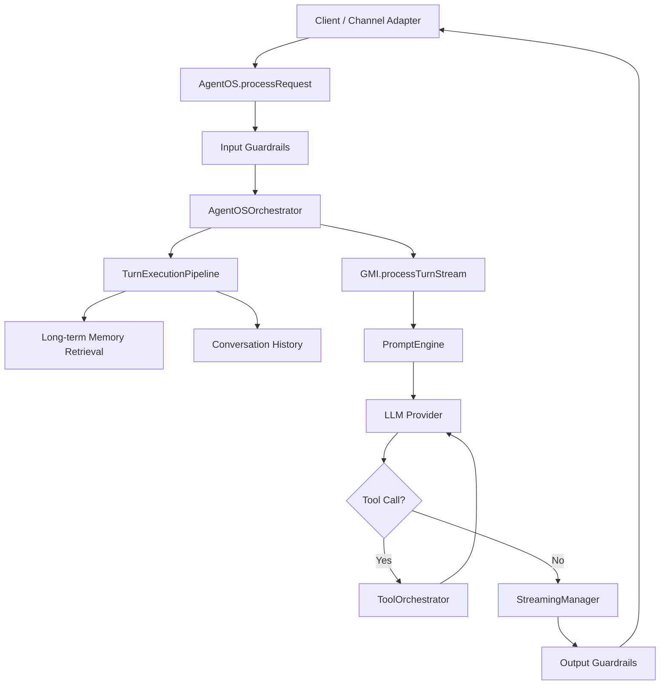
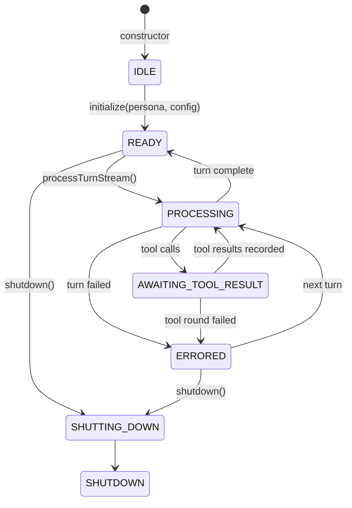
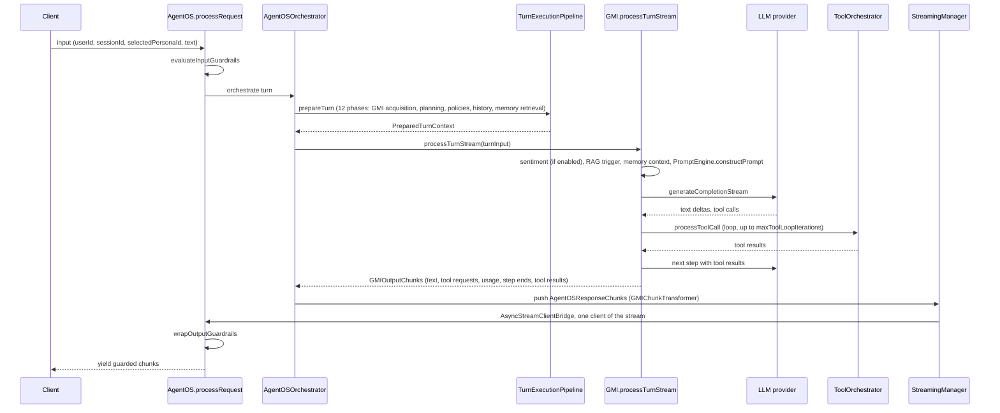
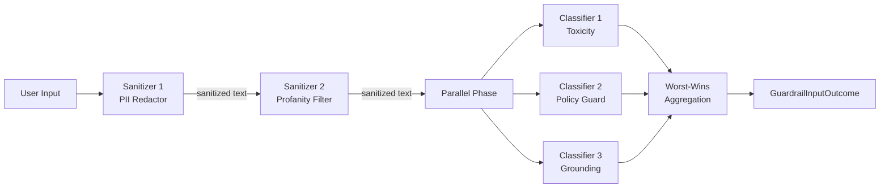
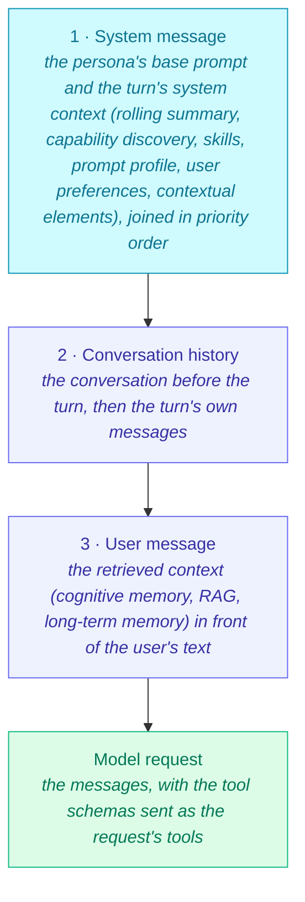
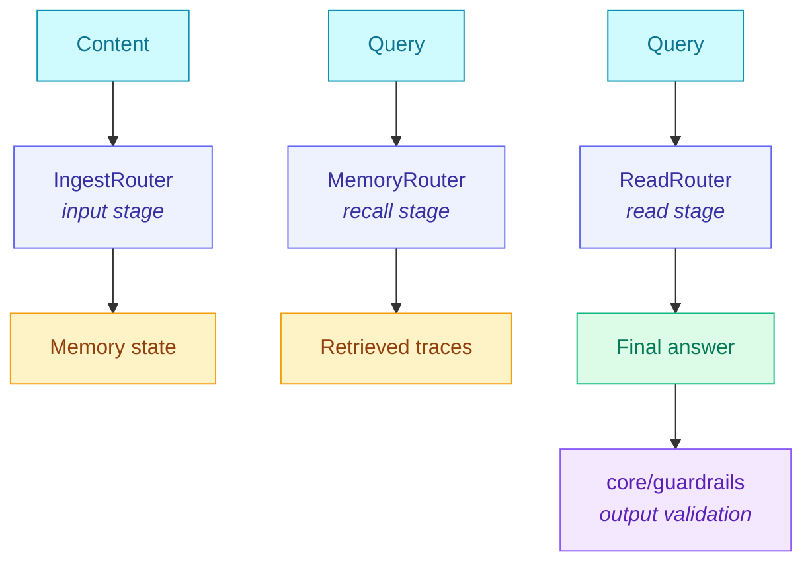
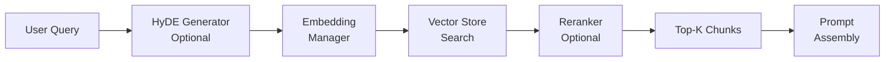
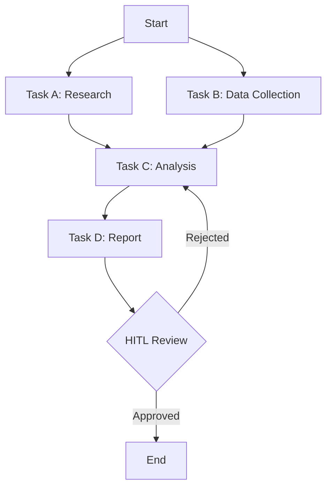
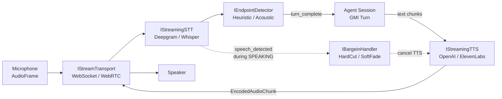

# System Architecture

AgentOS organizes the runtime around long-running agent state rather than around a single turn loop. Cross-session conversations, parallel agent instances with independent personality and memory, conditional tool execution, human-in-the-loop approval, and a memory layer that distinguishes verified user input from model-generated content are first-class subsystems with their own modules.

The modules documented below are predominantly state-management subsystems. The turn loop itself is one component among them, not the central abstraction.

This page is the system map. For the *what* of each subsystem — components, lifecycle ownership, source-tree location — read on. For deep-dives into individual concerns, follow the table of contents.

For specific subsystem deep-dives, see:
- [Provenance & Immutability](../safety/PROVENANCE_IMMUTABILITY.md)

![AgentOS layered architecture: seven cooperating layers from caller-facing API (generateText, streamText, agent, agency, mission) through cognitive substrate (GMI coordinator, PersonaOverlayManager, SentimentTracker, MetapromptExecutor), memory and RAG (4-tier memory, 8 cognitive mechanisms, HyDE, GraphRAG, 7 vector backends), tools and capabilities (100+ extension packs, 88 SKILL.md modules, runtime tool forging), guardrails and HITL (PII redaction, ML classifiers, NLI grounding, 5 approval triggers), orchestration (workflow, mission, AgentGraph, checkpointing), down to I/O and providers (voice pipeline, channels, media generation, 13 LLM providers, OpenRouter fanout).](/img/diagrams/system-architecture.svg)

Each layer above corresponds to a section below. The mapping is one-to-one: layer 1 → [API Surface Contract](#api-surface-contract), layer 2 → [GMI](#gmi-generalized-mind-instance), layer 3 → [Memory System](#memory-system), layer 4 → [Tools, Skills, Extensions](#tools-skills--extensions), layer 5 → [Safety & Guardrails](#safety--guardrails), layer 6 → [Orchestration](#orchestration), layer 7 → [Perception & Channels](#perception--channels). The component pills inside each layer in the diagram are the same class and function names you'll see in the subsystem write-ups.

---

## Source Directory Layout

The `src/` tree has eleven top-level directories; each groups the modules of one domain, and foundational infrastructure lives under `core/`.

**Perception model:** Vision, hearing, and speech are separate modules under `io/`, following the biological perception analogy -- **io/vision/** (OCR, scene detection, image analysis), **io/hearing/** (STT providers, VAD, silence detection), and **io/speech/** (TTS providers, resolver, session). Shared media generation (images, video, music, SFX) is under **io/media/**.

**Key architectural patterns:**

- **GMI** (Generalized Mind Instance) delegates to focused collaborators: [`ConversationHistoryManager`](https://github.com/framerslab/agentos/blob/master/src/cognition/substrate/ConversationHistoryManager.ts), [`CognitiveMemoryBridge`](https://github.com/framerslab/agentos/blob/master/src/cognition/substrate/CognitiveMemoryBridge.ts), [`SentimentTracker`](https://github.com/framerslab/agentos/blob/master/src/cognition/substrate/SentimentTracker.ts), and [`MetapromptExecutor`](https://github.com/framerslab/agentos/blob/master/src/cognition/substrate/MetapromptExecutor.ts). Persona layering lives in `cognition/substrate/persona_overlays/`. Personas can be loaded from JSON (the legacy [`IPersonaDefinition`](https://github.com/framerslab/agentos/blob/master/src/cognition/substrate/personas/IPersonaDefinition.ts) format) or from `SOUL.md` workspace directories via `SoulLoader` (`cognition/substrate/personas/SoulLoader.ts`) — both produce the same runtime [`IPersonaDefinition`](https://github.com/framerslab/agentos/blob/master/src/cognition/substrate/personas/IPersonaDefinition.ts). See [SOUL_FILES.md](../SOUL_FILES.md) for the per-agent identity convention.

- **AgentOS** is the public lifecycle facade. Setup and runtime concerns are in `api/runtime/` ([`WorkflowFacade`](https://github.com/framerslab/agentos/blob/master/src/api/runtime/WorkflowFacade.ts), [`CapabilityDiscoveryInitializer`](https://github.com/framerslab/agentos/blob/master/src/api/runtime/CapabilityDiscoveryInitializer.ts), [`RagMemoryInitializer`](https://github.com/framerslab/agentos/blob/master/src/api/runtime/RagMemoryInitializer.ts)). High-level helpers (`generateText`, [`streamText`](https://github.com/framerslab/agentos/blob/master/src/api/streamText.ts), [`agent`](https://github.com/framerslab/agentos/blob/master/src/api/agent.ts), [`agency`](https://github.com/framerslab/agentos/blob/master/src/api/agency.ts)) live under `api/`.

- **AgentOSOrchestrator** coordinates requests, delegating to [`TurnExecutionPipeline`](https://github.com/framerslab/agentos/blob/master/src/api/runtime/TurnExecutionPipeline.ts) (pre-LLM preparation), [`GMIChunkTransformer`](https://github.com/framerslab/agentos/blob/master/src/api/runtime/GMIChunkTransformer.ts) (stream mapping), and [`ExternalToolResultHandler`](https://github.com/framerslab/agentos/blob/master/src/api/runtime/ExternalToolResultHandler.ts) (tool-result continuation).

All paths below are under [`src/`](https://github.com/framerslab/agentos/tree/master/src/).

| Module | Subdirs | Purpose |
| --- | --- | --- |
| `agents/` | `agency/` · `definitions/` | Agent definitions and multi-agent coordination classes ([`AgencyRegistry`](https://github.com/framerslab/agentos/blob/master/src/agents/agency/AgencyRegistry.ts), [`AgencyMemoryManager`](https://github.com/framerslab/agentos/blob/master/src/agents/agency/AgencyMemoryManager.ts), [`AgentCommunicationBus`](https://github.com/framerslab/agentos/blob/master/src/agents/agency/AgentCommunicationBus.ts)) |
| `api/` | `runtime/` · `types/` · `structured/` · `server/` · `interfaces/` | Public API surface — [`AgentOS`](https://github.com/framerslab/agentos/blob/master/src/api/AgentOS.ts), `generateText`, [`streamText`](https://github.com/framerslab/agentos/blob/master/src/api/streamText.ts), [`agent`](https://github.com/framerslab/agentos/blob/master/src/api/agent.ts), [`agency`](https://github.com/framerslab/agentos/blob/master/src/api/agency.ts), the media helpers, orchestrator collaborators, provider defaults, [`StructuredOutputManager`](https://github.com/framerslab/agentos/blob/master/src/api/structured/output/StructuredOutputManager.ts); a few other folders re-export modules that moved |
| `cognition/` | `substrate/` · `memory/` · `rag/` · `emergent/` · `discovery/` · `nlp/` · `skills/` · `marketplace/` · `web-search/` | The GMI and personas (`substrate/`), cognitive memory, retrieval-augmented generation (vector stores, chunking, reranking, GraphRAG, HyDE), runtime tool forging, capability discovery, NLP utilities, the `SKILL.md` loader, marketplace listings and web search |
| `config/` | — | Configuration types for the embedding manager, memory lifecycle, retrieval augmentor, tool orchestrator and vector stores |
| `core/` | `config/` · `conversation/` · `embeddings/` · `guardrails/` · `llm/` · `logging/` · `providers/` · `rate-limiting/` · `safety/` · `storage/` · `streaming/` · `tools/` · `types/` · `utils/` · `vector-store/` | Foundational infrastructure: LLM providers and routing, shared interfaces, the [`IStorageAdapter`](https://github.com/framerslab/agentos/blob/master/src/core/storage/IStorageAdapter.ts), the [`StreamingManager`](https://github.com/framerslab/agentos/blob/master/src/core/streaming/StreamingManager.ts), the [`ITool`](https://github.com/framerslab/agentos/blob/master/src/core/tools/ITool.ts) / [`ToolOrchestrator`](https://github.com/framerslab/agentos/blob/master/src/core/tools/ToolOrchestrator.ts), embedding and vector-store abstractions |
| `extensions/` | `packs/` | Extension system: [`ExtensionPack`](https://github.com/framerslab/agentos/blob/master/src/extensions/manifest.ts), descriptor kinds, activation lifecycle, built-in packs |
| `io/` | `channels/` · `hearing/` · `speech/` · `vision/` · `voice-pipeline/` · `media/` · `avatar/` · `segmentation/` | Messaging adapters, telephony and social posting; STT, VAD and TTS; OCR and image analysis; the real-time voice pipeline; image, video, music and SFX generation; avatars; image segmentation |
| `logging/` | — | `ILogger` and the logger factory |
| `orchestration/` | `builders/` · `checkpoint/` · `compiler/` · `events/` · `hitl/` · `ir/` · `pipeline/` · `planner/` · `planning/` · `runtime/` · `tools/` · `turn-planner/` · `workflows/` | `workflow()`, `mission()` and `AgentGraph` builders, the graph IR, compiler and runtime, checkpoints, [`PlanningEngine`](https://github.com/framerslab/agentos/blob/master/src/orchestration/planner/PlanningEngine.ts), human-in-the-loop, the query, memory, ingest and read routers (`pipeline/`), the turn planner and the workflow engine |
| `safety/` | `guardrails/` · `runtime/` · `sandbox/` · `provenance/` · `evaluation/` · `validation/` · `auth/` | Guardrails ([`IGuardrailService`](https://github.com/framerslab/agentos/blob/master/src/safety/guardrails/IGuardrailService.ts), [`ParallelGuardrailDispatcher`](https://github.com/framerslab/agentos/blob/master/src/safety/guardrails/ParallelGuardrailDispatcher.ts)), runtime safety ([`CircuitBreaker`](https://github.com/framerslab/agentos/blob/master/src/safety/runtime/CircuitBreaker.ts), [`CostGuard`](https://github.com/framerslab/agentos/blob/master/src/safety/runtime/CostGuard.ts), [`StuckDetector`](https://github.com/framerslab/agentos/blob/master/src/safety/runtime/StuckDetector.ts)), code execution (`node:vm`) and [`CLISubprocessBridge`](https://github.com/framerslab/agentos/blob/master/src/safety/sandbox/subprocess/CLISubprocessBridge.ts) / [`CLIRegistry`](https://github.com/framerslab/agentos/blob/master/src/safety/sandbox/subprocess/CLIRegistry.ts), provenance and blockchain anchoring, evaluation and OpenTelemetry tracing |
| `utils/` | — | Shared error helpers |

### Architecture Layers

The diagram at the top of this page is the canonical layered view. From top to bottom:

1. **API surface** — `generateText` / [`streamText`](https://github.com/framerslab/agentos/blob/master/src/api/streamText.ts) / [`agent`](https://github.com/framerslab/agentos/blob/master/src/api/agent.ts) / [`agency`](https://github.com/framerslab/agentos/blob/master/src/api/agency.ts) / `generateImage`, plus the [`AgentOS`](https://github.com/framerslab/agentos/blob/master/src/api/AgentOS.ts) lifecycle facade.
2. **Orchestration** — DAG runtime, `workflow()`, `mission()`, [`AgentGraph`](https://github.com/framerslab/agentos/blob/master/src/orchestration/builders/AgentGraph.ts), HITL, checkpointing, planning engine.
3. **GMI** — per-mind state: `ConversationHistory`, [`CognitiveMemoryBridge`](https://github.com/framerslab/agentos/blob/master/src/cognition/substrate/CognitiveMemoryBridge.ts), [`SentimentTracker`](https://github.com/framerslab/agentos/blob/master/src/cognition/substrate/SentimentTracker.ts), [`MetapromptExecutor`](https://github.com/framerslab/agentos/blob/master/src/cognition/substrate/MetapromptExecutor.ts), persona overlays.
4. **Safety & Guardrails** alongside **Tools & Extensions** — guardrail packs (PII, toxicity, grounding, code safety, topicality), circuit breakers and the cost guard, and the 110-extension / 88-skill catalog with capability discovery and runtime tool forging.
5. **Memory & RAG** — cognitive memory (five trace types, working memory, Ebbinghaus decay, 8 mechanisms such as retrieval-induced forgetting and reconsolidation), 7 vector stores, HyDE, GraphRAG, hybrid retrieval, [`CitationVerifier`](https://github.com/framerslab/agentos/blob/master/src/cognition/rag/citation/CitationVerifier.ts).
6. **LLM providers** — 13 providers, OpenRouter among them, with fallback chains in `generateText()`, `streamText()`, `agent()` and `agency()`.
7. **Perception & channels** — vision (OCR), hearing (STT, VAD), speech (TTS, voice pipeline), 12 messaging adapters, telephony.

The diagram above the prose shows how a typical request enters at layer 1 and traverses downward.

### API Surface Contract

`generateText()`, `streamText()`, `agent()`, `agency()`, and the [`AgentOS`](https://github.com/framerslab/agentos/blob/master/src/api/AgentOS.ts) runtime share some configuration names, but the shared config surface does not imply identical enforcement.

- `agent()` is the lightweight stateful facade for prompt assembly, sessions, tools, hooks, personality shaping, and usage-ledger forwarding.
- `generateText()` / `streamText()` are low-level helper loops for provider selection, direct tool execution, and text-fallback tool calling.
- The full `AgentOS` runtime owns the deeper runtime systems: emergent tooling, guardrails, discovery, RAG bootstrapping, HITL, channels and provenance. `agency()` applies HITL approvals, emergent specialists (on `hierarchical`), output schemas and provenance records at the agency level; it accepts guardrails, RAG, permissions and security tiers without applying them ([Agencies](../AGENCIES.md)).


```mermaid
graph TB
    Client[Client / Channel Adapter] --> API[AgentOS.processRequest]
    API --> InputGuard[Input Guardrails]
    InputGuard --> Orch[AgentOSOrchestrator]
    Orch --> TurnPipe[TurnExecutionPipeline]
    TurnPipe --> MemRetrieve[Long-term Memory Retrieval]
    TurnPipe --> CtxAssembly[Conversation History]
    Orch --> GMI[GMI.processTurnStream]
    GMI --> PromptBuild[PromptEngine]
    PromptBuild --> LLM[LLM Provider]
    LLM --> ToolCall{Tool Call?}
    ToolCall -->|Yes| ToolOrch[ToolOrchestrator]
    ToolOrch --> LLM
    ToolCall -->|No| Stream[StreamingManager]
    Stream --> OutputGuard[Output Guardrails]
    OutputGuard --> Client
```

---

## GMI (Generalized Mind Instance)

GMI is what an agent actually *is* between turns: persona, working memory, mood, reasoning trace, conversation history. Each instance is a single mind bound to one persona. The [dedicated GMI page](../GMI.md) covers the turn loop, completion options, conversation history, the completion gateway and the output stream; this section covers how the GMI plugs into the wider runtime.

### GMI Lifecycle


```mermaid
stateDiagram-v2
    [*] --> IDLE: constructor
    IDLE --> READY: initialize(persona, config)
    READY --> PROCESSING: processTurnStream()
    PROCESSING --> AWAITING_TOOL_RESULT: tool calls
    AWAITING_TOOL_RESULT --> PROCESSING: tool results recorded
    PROCESSING --> READY: turn complete
    PROCESSING --> ERRORED: turn failed
    AWAITING_TOOL_RESULT --> ERRORED: tool round failed
    ERRORED --> PROCESSING: next turn
    READY --> SHUTTING_DOWN: shutdown()
    ERRORED --> SHUTTING_DOWN: shutdown()
    SHUTTING_DOWN --> SHUTDOWN
```

`ERRORED` records that the last turn failed; the next turn starts from it as from `READY` ([`GMIPrimeState`](https://github.com/framerslab/agentos/blob/master/src/cognition/substrate/IGMI.ts), which also defines `INITIALIZING` and `REFLECTING`).

### Initialization

`GMI.initialize(persona, config)` validates required dependencies, wires collaborators, and loads state:

```typescript
const gmi = new GMI('my-gmi-id');
await gmi.initialize(researchAssistantPersona, {
  workingMemory,
  promptEngine,
  toolOrchestrator,
  llmProviderManager,
  utilityAI,
  cognitiveMemory,       // Optional: enables CognitiveMemoryBridge
  retrievalAugmentor,    // Optional: enables RAG
});
```

Required dependencies: `workingMemory`, `promptEngine`, `toolOrchestrator`, `llmProviderManager`, `utilityAI`. Optional: `cognitiveMemory`, `retrievalAugmentor`, and `completionGateway`, which routes each model step and falls back across providers; with it, `llmProviderManager` is a `GatewayProviderManager` ([Model calls through a completion gateway](../GMI.md#model-calls-through-a-completion-gateway)).

### Collaborators

The GMI delegates to four extracted collaborators to keep the core class focused:

| Collaborator | Responsibility |
|---|---|
| [`ConversationHistoryManager`](https://github.com/framerslab/agentos/blob/master/src/cognition/substrate/ConversationHistoryManager.ts) | Maintains chat history, supports hydration from external stores |
| `CognitiveMemoryBridge` | Bridges GMI turns to the [`CognitiveMemoryManager`](https://github.com/framerslab/agentos/blob/master/src/cognition/memory/CognitiveMemoryManager.ts) (encode/retrieve/observe) |
| `SentimentTracker` | Tracks user sentiment via [`IUtilityAI`](https://github.com/framerslab/agentos/blob/master/src/cognition/nlp/ai_utilities/IUtilityAI.ts), emits [`GMIEvent`](https://github.com/framerslab/agentos/blob/master/src/cognition/substrate/GMIEvent.ts) types (frustration, confusion, etc.) |
| `MetapromptExecutor` | Handles metaprompt triggers, self-reflection, and state updates |

### Turn Processing

`processTurnStream()` is an async generator that yields [`GMIOutputChunk`](https://github.com/framerslab/agentos/blob/master/src/cognition/substrate/IGMI.ts) objects and returns the turn's `GMIOutput`:

```typescript
const turn = gmi.processTurnStream(turnInput);
let next = await turn.next();
while (!next.done) {
  const chunk = next.value;
  switch (chunk.type) {
    case GMIOutputChunkType.TEXT_DELTA:            // streamed text
    case GMIOutputChunkType.TOOL_CALL_REQUEST:     // tool calls the model requested
    case GMIOutputChunkType.USAGE_UPDATE:          // a provider usage report
    case GMIOutputChunkType.STEP_FINISHED:         // a model step completed
    case GMIOutputChunkType.TOOL_RESULT:           // a result of the GMI's tool round
    case GMIOutputChunkType.ERROR:                 // the turn failed
    case GMIOutputChunkType.FINAL_RESPONSE_MARKER: // the turn's last chunk
  }
  next = await turn.next();
}
const output = next.value; // GMIOutput: responseText, toolCalls, usage, error
```

The chunk types, their payloads and their order are on the [GMI page](../GMI.md#output-stream).

### AgentOS Facade

`AgentOS` (`api/AgentOS.ts`) is the public-facing facade that manages GMI instances, streaming, and cross-cutting concerns. It exposes `processRequest()` as the primary entry point and coordinates:

- [`GMIManager`](https://github.com/framerslab/agentos/blob/master/src/cognition/substrate/GMIManager.ts) -- Pool of GMI instances keyed by persona/session
- [`AgentOSOrchestrator`](https://github.com/framerslab/agentos/blob/master/src/api/runtime/AgentOSOrchestrator.ts) -- Turn preparation and stream transformation
- [`StreamingManager`](https://github.com/framerslab/agentos/blob/master/src/core/streaming/StreamingManager.ts) -- In-process stream registry that hands each response chunk to the stream's registered clients
- [`ExtensionManager`](https://github.com/framerslab/agentos/blob/master/src/extensions/ExtensionManager.ts) -- Tool, guardrail, and workflow extension loading
- [`ConversationManager`](https://github.com/framerslab/agentos/blob/master/src/core/conversation/ConversationManager.ts) -- Cross-session conversation persistence

[`AgentOSConfig`](https://github.com/framerslab/agentos/blob/master/src/api/AgentOS.ts) is the configuration object (about 40 fields) that wires all subsystems together. Key optional features activated via config: `ragConfig`, `turnPlanning`, `emergent`, `observability`, `standaloneMemory`, `workflowEngineConfig`.

---

## Request Lifecycle

A request to the full runtime passes through five stages. The stage boundaries below are the ones in the code; the facade owns guardrails, the pipeline owns preparation, the GMI owns the model call.

1. **Facade** ([`AgentOS.processRequest()`](https://github.com/framerslab/agentos/blob/master/src/api/AgentOS.ts)) fills `selectedPersonaId` from `defaultPersonaId` when the request has none, applies the self-improvement session overrides and the skill prompt context ([`SelfImprovementSessionManager`](https://github.com/framerslab/agentos/blob/master/src/api/runtime/SelfImprovementSessionManager.ts)), negotiates the language, evaluates the input guardrails with [`evaluateInputGuardrails`](https://github.com/framerslab/agentos/blob/master/src/safety/guardrails/guardrailDispatcher.ts) (the dispatcher runs sanitizers first, then classifiers, in parallel through [`ParallelGuardrailDispatcher`](https://github.com/framerslab/agentos/blob/master/src/safety/guardrails/ParallelGuardrailDispatcher.ts)), and hands the turn to the orchestrator. A blocked input ends the request with the guardrail's own stream (`createGuardrailBlockedStream`) before any turn starts, and while a guard named in `requiredGuardrails` is not active the request gets one `SYS_GUARDRAIL_REQUIRED_MISSING` error chunk and runs nothing. The facade performs no input validation (that is the pipeline's first phase), no authentication and no rate limiting; the host does the last two before calling it.
2. **Orchestrator** ([`AgentOSOrchestrator`](https://github.com/framerslab/agentos/blob/master/src/api/runtime/AgentOSOrchestrator.ts)) registers the stream and runs the pre-model pipeline.
3. **Preparation** ([`TurnExecutionPipeline.prepareTurn()`](https://github.com/framerslab/agentos/blob/master/src/api/runtime/TurnExecutionPipeline.ts)), twelve phases: input validation (`selectedPersonaId` must be present; the facade fills it from `defaultPersonaId`), GMI acquisition through [`GMIManager.getOrCreateGMIForSession()`](https://github.com/framerslab/agentos/blob/master/src/cognition/substrate/GMIManager.ts), stream context registration, GMI input construction, turn planning (when a turn planner is configured), adaptive execution policies, organization context and long-term memory policy, inbound message persistence, rolling summary compaction, prompt profile routing, long-term memory retrieval, and conversation history assembly with metadata and memory-sink persistence. The result is a `PreparedTurnContext`.
4. **The GMI turn** ([`GMI.processTurnStream()`](https://github.com/framerslab/agentos/blob/master/src/cognition/substrate/GMI.ts)): sentiment scoring when the persona enables it, the RAG trigger, memory context assembly through [`CognitiveMemoryBridge`](https://github.com/framerslab/agentos/blob/master/src/cognition/substrate/CognitiveMemoryBridge.ts) (only when a cognitive memory manager is attached), prompt construction by the [`PromptEngine`](https://github.com/framerslab/agentos/blob/master/src/core/llm/PromptEngine.ts), the streaming model call through the provider manager, the tool loop through [`ToolOrchestrator`](https://github.com/framerslab/agentos/blob/master/src/core/tools/ToolOrchestrator.ts) (up to `maxToolLoopIterations`, five by default), history and memory updates, and the metaprompts. The turn yields `GMIOutputChunk`s. Metaprompts run after the model call; they do not build the prompt.
5. **Delivery**: the orchestrator converts GMI chunks to `AgentOSResponseChunk`s with [`GMIChunkTransformer`](https://github.com/framerslab/agentos/blob/master/src/api/runtime/GMIChunkTransformer.ts) and pushes them into the [`StreamingManager`](https://github.com/framerslab/agentos/blob/master/src/core/streaming/StreamingManager.ts). The facade registers an `AsyncStreamClientBridge` as one client of that stream, wraps the bridge's output with [`wrapOutputGuardrails`](https://github.com/framerslab/agentos/blob/master/src/safety/guardrails/guardrailDispatcher.ts), and yields the guarded chunks to its caller. The output guardrails apply to the stream `processRequest()` returns (in hold mode its `TEXT_DELTA` chunks wait for the final verdict); any other client registered on the stream receives the chunks before and without them. When the model requests a tool the host executes, the facade yields that chunk and returns; the host continues the same turn through `handleToolResult()`, `handleToolResults()` or `resumeExternalToolRequest()`, whose streams pass through the same output guardrails. Delivery does not call the model. Tracing spans are recorded throughout ([`Tracer`](https://github.com/framerslab/agentos/blob/master/src/safety/evaluation/observability/Tracer.ts)).

An error inside the GMI turn reaches the stream as an `ERROR` chunk carrying the original message, with the code `GMI_PROCESSING_ERROR` unless the error carries its own (an error chunk in the provider's stream carries `LLM_PROVIDER_ERROR`); the turn's `FINAL_RESPONSE` follows it with the same error and the usage counted before the failure. An error outside the GMI turn ends the stream with an `ERROR` chunk ([The turn lifecycle](../TURN_LIFECYCLE.md#what-a-gmi-emits)).

### Sequence Diagram


```mermaid
sequenceDiagram
    participant C as Client
    participant F as AgentOS.processRequest
    participant O as AgentOSOrchestrator
    participant P as TurnExecutionPipeline
    participant G as GMI.processTurnStream
    participant L as LLM provider
    participant T as ToolOrchestrator
    participant S as StreamingManager

    C->>F: input (userId, sessionId, selectedPersonaId, text)
    F->>F: evaluateInputGuardrails
    F->>O: orchestrate turn
    O->>P: prepareTurn (12 phases: GMI acquisition, planning, policies, history, memory retrieval)
    P-->>O: PreparedTurnContext
    O->>G: processTurnStream(turnInput)
    G->>G: sentiment (if enabled), RAG trigger, memory context, PromptEngine.constructPrompt
    G->>L: generateCompletionStream
    L-->>G: text deltas, tool calls
    G->>T: processToolCall (loop, up to maxToolLoopIterations)
    T-->>G: tool results
    G->>L: next step with tool results
    G-->>O: GMIOutputChunks (text, tool requests, usage, step ends, tool results)
    O->>S: push AgentOSResponseChunks (GMIChunkTransformer)
    S->>F: AsyncStreamClientBridge, one client of the stream
    F->>F: wrapOutputGuardrails
    F-->>C: yield guarded chunks
```

### Key Types

| Type | Module | Purpose |
|------|--------|---------|
| [`AgentOSInput`](https://github.com/framerslab/agentos/blob/master/src/api/types/AgentOSInput.ts) | `api/types/` | Normalized request envelope (text, audio, images, metadata) |
| [`AgentOSResponse`](https://github.com/framerslab/agentos/blob/master/src/api/types/AgentOSResponse.ts) | `api/types/` | Streamed response chunks (TEXT_DELTA, TOOL_CALL_REQUEST, FINAL_RESPONSE, ERROR and others) |
| [`GMITurnInput`](https://github.com/framerslab/agentos/blob/master/src/cognition/substrate/IGMI.ts) | `cognition/substrate/IGMI` | Internal turn representation consumed by the GMI |
| [`GMIOutputChunk`](https://github.com/framerslab/agentos/blob/master/src/cognition/substrate/IGMI.ts) | `cognition/substrate/IGMI` | Per-chunk output from the cognitive engine |
| [`ConversationContext`](https://github.com/framerslab/agentos/blob/master/src/core/conversation/ConversationContext.ts) | `core/conversation/` | Session state: history, active persona, user context |

---

## Extension & Guardrail Runtime

The extension runtime is centered on three core pieces:

1. **[`ExtensionManifest`](https://github.com/framerslab/agentos/blob/master/src/extensions/manifest.ts) / [`ExtensionPack`](https://github.com/framerslab/agentos/blob/master/src/extensions/manifest.ts)** -- Declarative loading of tool bundles, guardrails, and channel adapters.
2. **[`ExtensionManager`](https://github.com/framerslab/agentos/blob/master/src/extensions/ExtensionManager.ts)** -- Descriptor activation and runtime access.
3. **[`ISharedServiceRegistry`](https://github.com/framerslab/agentos/blob/master/src/extensions/ISharedServiceRegistry.ts)** -- Lazy singleton reuse across packs (for NLP pipelines, ONNX classifiers, embedding functions).

```typescript
interface ExtensionPack {
  name: string;
  version?: string;
  descriptors: ExtensionDescriptor[];
  onActivate?: (context: ExtensionLifecycleContext) => Promise<void> | void;
  onDeactivate?: (context: ExtensionLifecycleContext) => Promise<void> | void;
}
```

### Creating an Extension Pack

Extension packs are the unit of distribution. Each pack bundles one or more descriptors of the same or different kinds (`tool`, `guardrail`, [`workflow`](https://github.com/framerslab/agentos/blob/master/src/orchestration/builders/WorkflowBuilder.ts), `provenance`, etc.) and can hook into the activation lifecycle to perform setup and teardown.

```typescript
import type { ExtensionPack, ExtensionLifecycleContext } from '@framers/agentos/extensions';
import { EXTENSION_KIND_TOOL } from '@framers/agentos/extensions';

export function createMyExtensionPack(): ExtensionPack {
  return {
    name: 'my-custom-tools',
    version: '1.0.0',
    descriptors: [
      {
        id: 'search_documents',
        kind: EXTENSION_KIND_TOOL,
        payload: {
          id: 'my-search-tool',
          name: 'search_documents',
          displayName: 'Document Search',
          description: 'Search internal documents by query.',
          inputSchema: {
            type: 'object',
            properties: { query: { type: 'string' } },
            required: ['query'],
          },
          execute: async (args) => {
            const results = await searchIndex(args.query);
            return { success: true, output: results };
          },
        },
      },
    ],
    onActivate: async (ctx: ExtensionLifecycleContext) => {
      const apiKey = ctx.getSecret?.('MY_API_KEY');
      // Initialize resources, warm caches, etc.
    },
    onDeactivate: async () => {
      // Release resources
    },
  };
}
```

Packs are loaded by including them in the `extensionManifest` passed to `AgentOS.create()` (`{ packs: [{ factory: () => createMyExtensionPack() }] }`, or a `package` or `module` entry), or by using the schema-on-demand meta-tools (`extensions_list`, `extensions_enable`) at runtime.

### Descriptor Kinds

Every descriptor carries an `id`, a `kind` and a `payload`, plus optional `priority`, `enableByDefault`, `requiredSecrets` and lifecycle hooks ([`ExtensionDescriptor`](https://github.com/framerslab/agentos/blob/master/src/extensions/types.ts)).

| Kind | Constant | Payload | Description |
|------|----------|---------|-------------|
| `tool` | [`EXTENSION_KIND_TOOL`](https://github.com/framerslab/agentos/blob/master/src/extensions/types.ts) | `ITool` | Callable tool registered in ToolOrchestrator |
| `guardrail` | [`EXTENSION_KIND_GUARDRAIL`](https://github.com/framerslab/agentos/blob/master/src/extensions/types.ts) | `IGuardrailService` | Input/output guardrail |
| `workflow` | [`EXTENSION_KIND_WORKFLOW`](https://github.com/framerslab/agentos/blob/master/src/extensions/types.ts) | `WorkflowDescriptorPayload` | Reusable workflow definition |
| `provenance` | [`EXTENSION_KIND_PROVENANCE`](https://github.com/framerslab/agentos/blob/master/src/extensions/types.ts) | provenance pack payload | Content anchoring provider |

The other kinds are `response-processor`, `workflow-executor`, `persona`, `planning-strategy`, `hitl-handler`, `communication-channel`, `memory-provider`, `stt-provider`, `tts-provider`, `vad-provider`, `wake-word-provider`, `messaging-channel`, `http-handler`, `streaming-stt-provider`, `streaming-tts-provider` and `diarization-provider`.

### Guardrail Dispatch Model

[`ParallelGuardrailDispatcher`](https://github.com/framerslab/agentos/blob/master/src/safety/guardrails/ParallelGuardrailDispatcher.ts) uses a two-phase execution model:

1. **Phase 1 (sequential sanitizers)** -- Guardrails with `config.canSanitize === true` run in registration order and can chain `SANITIZE` results deterministically. A `BLOCK` in Phase 1 short-circuits the entire pipeline.
2. **Phase 2 (parallel classifiers)** -- All remaining guardrails run concurrently via `Promise.allSettled`. A Phase 2 `SANITIZE` is downgraded to `FLAG` because concurrent sanitization would produce non-deterministic results.

The final outcome uses worst-wins aggregation: `BLOCK (3) > FLAG (2) > ALLOW (0)`.


```mermaid
graph LR
    Input[User Input] --> S1[Sanitizer 1<br/>PII Redactor]
    S1 -->|sanitized text| S2[Sanitizer 2<br/>Profanity Filter]
    S2 -->|sanitized text| P[Parallel Phase]
    P --> C1[Classifier 1<br/>Toxicity]
    P --> C2[Classifier 2<br/>Policy Guard]
    P --> C3[Classifier 3<br/>Grounding]
    C1 --> Agg[Worst-Wins<br/>Aggregation]
    C2 --> Agg
    C3 --> Agg
    Agg --> Result[GuardrailInputOutcome]
```

[`GuardrailOutputPayload`](https://github.com/framerslab/agentos/blob/master/src/safety/guardrails/IGuardrailService.ts) carries `ragSources?: RagRetrievedChunk[]` so grounding-aware guardrails can verify claims against retrieved evidence.

Each guardrail service can also configure timeouts via `config.timeoutMs`. If a guardrail exceeds its timeout or throws, it fails open (returns `null`) rather than blocking the pipeline, unless its `config.failClosed` is true, in which case the failure counts as a `BLOCK`.

### Built-in Guardrail Packs

Six built-in packs ship from [`packages/agentos-extensions/registry/curated/safety/`](https://github.com/framerslab/agentos-extensions/tree/master/registry/curated/safety):

- `pii-redaction` — sanitizer; redacts personally identifiable information before tokens leave the runtime
- `ml-classifiers` — toxicity / hate-speech / harm classification via on-device ONNX models
- `topicality` — LLM-as-judge classifier that rejects off-topic / out-of-scope prompts
- `code-safety` — static + heuristic detection of dangerous code patterns in agent-emitted snippets
- `grounding-guard` — verifies output claims against retrieved RAG sources (citation faithfulness)
- `content-policy-rewriter` — sanitizer; rewrites policy-violating output in-place rather than blocking

For details on writing custom guardrails, see [Creating Guardrails](../safety/CREATING_GUARDRAILS.md) and [Guardrails Usage](../safety/GUARDRAILS_USAGE.md).

---

## Persona System

Personas define the identity, expertise, and behavioral configuration for a GMI instance.

**Key files:**
- `cognition/substrate/personas/IPersonaDefinition.ts` -- The [`IPersonaDefinition`](https://github.com/framerslab/agentos/blob/master/src/cognition/substrate/personas/IPersonaDefinition.ts) interface
- `cognition/substrate/personas/PersonaLoader.ts` -- Loads persona JSON files from disk or registry
- `cognition/substrate/personas/PersonaValidation.ts` -- Schema validation
- `cognition/substrate/persona_overlays/PersonaOverlayManager.ts` -- Runtime persona layering

A persona definition includes:

- **Identity** -- `id`, `name`, `description`, `version`, `strengths`, and the `baseSystemPrompt`
- **Model settings** -- `defaultModelId`, `defaultProviderId`, `defaultModelCompletionOptions`, tool ids and capabilities
- **Memory and context** -- `memoryConfig` (RAG retrieval and ingestion triggers), `cognitiveMemoryConfig`, `conversationContextConfig`
- **Adaptation** -- `moodAdaptation`, `sentimentTracking`, `metaPrompts`, `contextualPromptElements`
- **Personality traits** -- `personalityTraits`, where the HEXACO scores go (`honesty`, `emotionality`, `extraversion`, `agreeableness`, `conscientiousness`, `openness`)

### HEXACO Trait Modulation

The HEXACO model provides six personality dimensions. In cognitive memory (the traits a host passes as `CognitiveMemoryConfig.traits`), each one weights a content feature at encoding and scales one mechanism:

| HEXACO Trait | Range | Cognitive Effect |
|---|---|---|
| **Honesty-Humility** | 0-1 | Ethical-content attention at encoding; stronger source-confidence decay of reflections. |
| **Emotionality** | 0-1 | Emotional-content attention at encoding; faster reconsolidation drift toward the current mood. |
| **Extraversion** | 0-1 | Social-content attention at encoding; a lower feeling-of-knowing threshold, so more partial recalls surface. |
| **Agreeableness** | 0-1 | Cooperative-content attention at encoding; a faster emotion-regulation reappraisal rate. |
| **Conscientiousness** | 0-1 | Procedural-content attention at encoding; stronger retrieval-induced forgetting; above 0.6, one working-memory slot fewer. |
| **Openness** | 0-1 | Novelty attention at encoding; a higher involuntary-recall probability; above 0.6, one working-memory slot more. |

### Persona Definition Example

```typescript
const researchAssistant: IPersonaDefinition = {
  id: 'research-assistant',
  name: 'Research Assistant',
  description: 'Academic research aide',
  version: '1.0.0',
  baseSystemPrompt: 'You are a meticulous research assistant...',
  strengths: ['literature review', 'data analysis', 'citation management'],
  personalityTraits: {
    honesty: 0.9,
    emotionality: 0.3,
    extraversion: 0.5,
    agreeableness: 0.7,
    conscientiousness: 0.9,
    openness: 0.8,
  },
  memoryConfig: {
    enabled: true,
    ragConfig: {
      enabled: true,
      retrievalTriggers: { onUserQuery: true },
    },
  },
  moodAdaptation: { enabled: true, defaultMood: 'neutral', sensitivityFactor: 0.3 },
  defaultModelId: 'gpt-4o',
  defaultProviderId: 'openai',
};
```

The [`PersonaOverlayManager`](https://github.com/framerslab/agentos/blob/master/src/cognition/substrate/persona_overlays/PersonaOverlayManager.ts) supports runtime persona blending -- applying temporary overlays (e.g., "be more formal") on top of the base persona definition without mutating the original.

For the bundled persona definitions, see [Personas](../PERSONAS.md).

---

## Prompt Construction

The GMI builds each model call's prompt with the [`PromptEngine`](https://github.com/framerslab/agentos/blob/master/src/core/llm/PromptEngine.ts), which fits the parts to the model's context window and assembles the messages. `MetapromptExecutor` (`cognition/substrate/MetapromptExecutor.ts`) does not build the prompt: it runs metaprompts after the model call, on three trigger types: `turn_interval` (periodic self-reflection), `event_based` (driven by `SentimentTracker` events like frustration or confusion), and `manual` (flags in working memory).

### Prompt Assembly Order

The GMI uses the `openai_chat` template for every provider; each provider converts the messages to its own wire format. The template assembles them in this order:


```mermaid
flowchart TB
    P1["1 · System message<br/><i>the persona's base prompt and the turn's system context (rolling summary, capability discovery, skills, prompt profile, user preferences, contextual elements), joined in priority order</i>"]:::input
    P2["2 · Conversation history<br/><i>the conversation before the turn, then the turn's own messages</i>"]:::process
    P3["3 · User message<br/><i>the retrieved context (cognitive memory, RAG, long-term memory) in front of the user's text</i>"]:::process
    LLM["Model request<br/><i>the messages, with the tool schemas sent as the request's tools</i>"]:::output

    P1 --> P2 --> P3 --> LLM

    classDef input fill:#cffafe,stroke:#0891b2,color:#0e7490
    classDef process fill:#eef2ff,stroke:#6366f1,color:#3730a3
    classDef output fill:#dcfce7,stroke:#10b981,color:#047857
```

The diagram shows a turn's first model call. On the turn's later calls, after a tool round, the user's message is part of the history.

### Token Budget Strategy

The `PromptEngine` measures the prompt against the model's context window (`optimalContextTokens`, else `maxContextTokens`) and enforces two shares of it:

- **Conversation history, 35%.** When the history is over its share, or the whole prompt over the window, the turn's own messages stay whole and the earlier history is reduced. The prompt engine's utility AI summarizes it when one is configured and the history is over `historyManagement.summarizationTriggerRatio` of its share; otherwise the oldest messages are dropped.
- **Retrieved context, 20%.** When the retrieved context is over its share, or the whole prompt over the window, the utility AI summarizes it, or it is cut to its share when there is none.

The GMI's `ConversationHistoryManager` keeps a window of messages (20 by default) and nothing else; the persona fields `overflowStrategy` and `summarizationTriggerTokens` are not read.

### Built-in Metaprompt Handlers

MetapromptExecutor includes pre-built handlers for common situations:
- **Frustration recovery** -- Triggered by negative sentiment events
- **Confusion clarification** -- When the user signals misunderstanding
- **Satisfaction reinforcement** -- When the user is pleased
- **Error recovery** -- After tool failures
- **Engagement boost** -- When the conversation stalls
- **Self-reflection** (`gmi_self_trait_adjustment`) -- Periodic review that updates the GMI's mood, the user's skill level and the task complexity from evidence; it does not change HEXACO traits

See [Adaptive Prompt Intelligence](../ADAPTIVE_PROMPT_INTELLIGENCE.md) for the full guide: the three trigger types, the five preset templates, the state surfaces metaprompts mutate, and concrete cost numbers.

---

## Memory System

The cognitive memory system replaces flat key-value memory with a personality-modulated, decay-aware architecture grounded in cognitive science.

### Core Model

Memory traces follow the Ebbinghaus forgetting curve:

```
S(t) = S0 * e^(-dt / stability)
```

where `S0` (initial encoding strength) is set by personality traits, emotional arousal, and content features. The `stability` time constant grows with each successful retrieval via the **desirable difficulty effect** -- memories that were harder to retrieve (lower current strength at retrieval time) receive a larger stability boost.

From `cognition/memory/core/decay/DecayModel.ts`:

```typescript
// Ebbinghaus forgetting curve
function computeCurrentStrength(trace: MemoryTrace, now: number): number {
  const elapsed = Math.max(0, now - trace.lastAccessedAt);
  return trace.encodingStrength * Math.exp(-elapsed / trace.stability);
}
```

Traces below a configurable pruning threshold are soft-deleted (`isActive = false`) during consolidation.

### Memory Type Taxonomy

Five memory types (Tulving's taxonomy plus `relational`) across four ownership scopes:

| Type | Description | Example |
|------|-------------|---------|
| `episodic` | Personal experiences and events | "User mentioned they're moving to Berlin on Tuesday" |
| `semantic` | Facts, concepts, general knowledge | "The user's preferred language is Python" |
| `procedural` | How-to knowledge, learned procedures | "When deploying, run tests first, then build, then push" |
| `prospective` | Future intentions and reminders | "Remind user about the deadline next Monday" |
| `relational` | Trust signals, boundaries and emotional bonds between the agent and the user | "The user asked not to be messaged after 9 pm" |

| Scope | Visibility | Shared Across |
|-------|------------|---------------|
| `thread` | Single conversation thread | Nothing |
| `user` | All conversations with one user | Threads |
| `persona` | All users of one persona | Users |
| `organization` | All personas in an org | Personas |

### Architecture


```mermaid
flowchart TB
    CM["CognitiveMemoryManager<br/><i>orchestrator</i>"]:::process
    E["EncodingModel<br/><i>HEXACO weights · flashbulb</i>"]:::process
    D["DecayModel<br/><i>Ebbinghaus · spaced rep · interference</i>"]:::process
    W["CognitiveWorkingMemory<br/><i>Baddeley 7±2 · personality-modulated</i>"]:::process
    M["MemoryStore<br/><i>IVectorStore + IKnowledgeGraph</i>"]:::data
    P["MemoryPromptAssembler<br/><i>7-section token-budgeted assembly</i>"]:::process
    G["IMemoryGraph<br/><i>Graphology · 8 edge types</i>"]:::data
    SA["SpreadingActivation<br/><i>Anderson ACT-R · Hebbian</i>"]:::process
    O["MemoryObserver<br/><i>personality-biased note extraction</i>"]:::process
    R["MemoryReflector<br/><i>LLM consolidates notes → traces</i>"]:::process
    Pr["ProspectiveMemoryManager<br/><i>time / event / context triggers</i>"]:::process
    Co["ConsolidationPipeline<br/><i>7-step periodic maintenance</i>"]:::process

    CM --> E
    CM --> D
    CM --> W
    CM --> M
    CM --> P
    CM --> G
    CM --> SA
    CM --> O
    CM --> R
    CM --> Pr
    CM --> Co

    classDef process fill:#eef2ff,stroke:#6366f1,color:#3730a3
    classDef data fill:#fef3c7,stroke:#f59e0b,color:#92400e
```

### Cognitive Pipeline (per-message smart orchestration)

Above the storage substrate sits an LLM-as-judge orchestration layer that picks strategy per message at three pipeline boundaries. Each stage is its own router primitive — independently shippable, independently testable, composable via the [`CognitivePipeline`](https://github.com/framerslab/agentos/blob/master/src/orchestration/pipeline/index.ts) facade. This is **smart orchestration, not safety guardrails** — orchestration picks strategies, guardrails enforce safety/policy at the output stage. They live in different modules on purpose.


```mermaid
flowchart TB
    Content["Content"]:::input
    Q1["Query"]:::input
    Q2["Query"]:::input

    Ingest["IngestRouter<br/><i>input stage</i>"]:::process
    Memory["MemoryRouter<br/><i>recall stage</i>"]:::process
    Read["ReadRouter<br/><i>read stage</i>"]:::process

    State["Memory state"]:::data
    Traces["Retrieved traces"]:::data
    Answer["Final answer"]:::output
    Guard["core/guardrails<br/><i>output validation</i>"]:::external

    Content --> Ingest --> State
    Q1 --> Memory --> Traces
    Q2 --> Read --> Answer --> Guard

    classDef input fill:#cffafe,stroke:#0891b2,color:#0e7490
    classDef process fill:#eef2ff,stroke:#6366f1,color:#3730a3
    classDef data fill:#fef3c7,stroke:#f59e0b,color:#92400e
    classDef output fill:#dcfce7,stroke:#10b981,color:#047857
    classDef external fill:#f3e8ff,stroke:#8b5cf6,color:#5b21b6
```

Every router has the same internal structure: a classifier (LLM-as-judge that maps input to a category/intent token), a pure `select*` function (category + routing table + budget policy → strategy decision), a dispatcher (registry of executors per strategy), and shipping presets (three for the memory and read routers, four for the ingest router) calibrated from LongMemEval-S Phase B N=500 measurements.

| Primitive | Subpath | Categories | Strategies |
|---|---|---|---|
| Memory Router | `@framers/agentos/memory-router` | 6 query categories | 3 backends (canonical-hybrid, OM-v10, OM-v11) |
| Ingest Router | `@framers/agentos/ingest-router` | 6 content kinds | 6 strategies (raw / summarized / observational / fact-graph / hybrid / skip) |
| Read Router | `@framers/agentos/read-router` | 5 read intents | 5 strategies (single-call / two-call extract+answer / commit-vs-abstain / verbatim / scratchpad) |
| Cognitive Pipeline | `@framers/agentos/orchestration/pipeline` | (composition) | wires all three stages |
| Adaptive Memory Router | `@framers/agentos/memory-router` | (self-calibrating) | derives routing tables from your own calibration data |

Each classifier is provider-agnostic — talks to a small `IXClassifierLLM` adapter interface, not an SDK. One OpenAI key reproduces the entire pipeline; no Claude / Gemini accounts required for the shipping configuration.

See the dedicated [Cognitive Pipeline](../COGNITIVE_PIPELINE.md) guide for the unified architecture overview, or the per-stage docs ([Memory Router](../MEMORY_ROUTER.md), [Ingest Router](../INGEST_ROUTER.md), [Read Router](../READ_ROUTER.md), [Adaptive Memory Router](../ADAPTIVE_MEMORY_ROUTER.md)) for the routing tables and presets each stage exposes.

### The MemoryTrace Envelope

Every memory is stored as a [`MemoryTrace`](https://github.com/framerslab/agentos/blob/master/src/cognition/memory/core/types.ts) (defined in `cognition/memory/core/types.ts`; abridged):

```typescript
interface MemoryTrace {
  id: string;
  type: MemoryType;                    // episodic | semantic | procedural | prospective | relational
  scope: MemoryScope;                  // thread | user | persona | organization
  scopeId: string;                     // Id of the thread, user, persona or organization
  content: string;                     // The memory content
  entities: string[];                  // Extracted entity references
  tags: string[];                      // Classification tags
  provenance: MemoryProvenance;        // Source type, confidence, verification count
  emotionalContext: EmotionalContext;   // PAD model: valence, arousal, dominance
  encodingStrength: number;            // S0: initial strength at creation
  stability: number;                   // Time constant (ms), grows with retrieval
  retrievalCount: number;              // Successful retrieval count
  lastAccessedAt: number;              // Unix ms of last access
  reinforcementInterval: number;       // Spaced repetition interval (ms)
  associatedTraceIds: string[];        // Graph linkage to related traces
  createdAt: number;                   // Unix ms of creation
  updatedAt: number;                   // Unix ms of the last update
  isActive: boolean;                   // Soft-delete flag
}
```

### Retrieval Scoring

Retrieval combines six weighted signals to rank candidate traces ([`RetrievalPriorityScorer`](https://github.com/framerslab/agentos/blob/master/src/cognition/memory/core/decay/RetrievalPriorityScorer.ts); a recall's `scoringWeights` replaces the weights for that call):

| Signal | Weight | Source |
|--------|--------|--------|
| Strength/decay | 0.25 | `computeCurrentStrength()` from DecayModel |
| Vector similarity | 0.35 | Cosine similarity from IVectorStore |
| Recency | 0.10 | A boost for traces accessed within about a day (24-hour half-life) |
| Emotional congruence | 0.15 | Current mood valence times the trace's valence, when both have the same sign |
| Graph activation | 0.10 | Spreading activation score from IMemoryGraph (0 without a graph) |
| Importance | 0.05 | The trace's provenance confidence, scaled to 0.5–1 |

### Eight Cognitive Mechanisms

Located in `cognition/memory/mechanisms/`; six of the eight are scaled by a HEXACO trait. They run when `CognitiveMemoryManager` is initialized with a `cognitiveMechanisms` config:

| Mechanism | HEXACO Modulator | Effect |
|-----------|-----------------|--------|
| Reconsolidation | Emotionality | Memories become labile during retrieval; high E increases drift |
| Retrieval-induced forgetting | Conscientiousness | Retrieving one trace suppresses competitors; high C strengthens suppression |
| Involuntary recall | Openness | Spontaneous memory surfacing; high O increases trigger sensitivity |
| Feeling-of-knowing | Extraversion | Metacognitive confidence judgment; high X lowers sharing threshold |
| Temporal gist extraction | None | Compresses old, rarely retrieved traces into a gist at consolidation |
| Schema encoding | None | Strengthens novel traces and weakens schema-congruent ones at encoding, once the host sets cluster centroids |
| Source confidence decay | Honesty-Humility | Shortens the stability of inferred and reflected traces at consolidation; high H decays reflections faster |
| Emotion regulation | Agreeableness | Reappraises high-arousal traces at consolidation; high A reappraises faster |

### GMI Integration

1. **Before prompt construction**: `CognitiveMemoryBridge.assembleContext()` calls the manager's `assembleForPrompt()`, which retrieves and formats memory within a token budget
2. **After the turn**: `CognitiveMemoryBridge.syncForTurn()` encodes the user's input as an episodic trace (`user_statement`) and the reply as a semantic trace (`agent_inference`), each with personality-modulated strength
3. **Before each encode**: the bridge passes the text to the manager's `observe()`, which feeds the [`MemoryObserver`](https://github.com/framerslab/agentos/blob/master/src/cognition/memory/pipeline/observation/MemoryObserver.ts) buffer when an observer is configured

For full details, see [Cognitive Memory](../memory/COGNITIVE_MEMORY.md) (theory + mechanism implementation reference) and the [Memory System Overview](../MEMORY_SYSTEM_OVERVIEW.md) (composition, archive, vendor comparison).

---

## RAG System

The RAG subsystem provides retrieval-augmented generation with multiple vector backends and retrieval strategies.

The AgentOS bootstrap path wires [`EmbeddingManager`](https://github.com/framerslab/agentos/blob/master/src/cognition/rag/EmbeddingManager.ts) -> [`VectorStoreManager`](https://github.com/framerslab/agentos/blob/master/src/cognition/rag/VectorStoreManager.ts) -> [`RetrievalAugmentor`](https://github.com/framerslab/agentos/blob/master/src/cognition/rag/RetrievalAugmentor.ts). [`UnifiedRetriever`](https://github.com/framerslab/agentos/blob/master/src/cognition/rag/unified/UnifiedRetriever.ts) is a higher-level orchestration layer that runs only when a host wires it in.

### Retrieval Pipeline


```mermaid
graph LR
    Q[User Query] --> HyDE[HyDE Generator<br/>Optional]
    HyDE --> Embed[Embedding<br/>Manager]
    Embed --> VS[Vector Store<br/>Search]
    VS --> Rerank[Reranker<br/>Optional]
    Rerank --> Chunks[Top-K Chunks]
    Chunks --> Prompt[Prompt<br/>Assembly]
```

The GMI integrates with RAG through persona-configurable hooks:
- `shouldTriggerRAGRetrieval()` checks `ragConfig.retrievalTriggers` (on user query, on tool failure, on intent detection)
- `retrievalAugmentor.retrieveContext()` runs the default runtime retrieval pipeline
- `performPostTurnIngestion()` summarizes and embeds conversation turns

When a host wires `QueryRouter.setUnifiedRetriever(...)`, plan-aware retrieval runs through [`UnifiedRetriever`](https://github.com/framerslab/agentos/blob/master/src/cognition/rag/unified/UnifiedRetriever.ts) instead of the legacy dispatcher path. BM25 + dense fusion is available through [`HybridSearcher`](https://github.com/framerslab/agentos/blob/master/src/cognition/rag/search/HybridSearcher.ts) and, for memory traces, [`HybridRetriever`](./hybrid-retriever.md).

Within the default QueryRouter path, `cacheResults` provides in-memory `route()` result caching, and `verifyCitations` can attach `QueryResult.grounding` by running [`CitationVerifier`](https://github.com/framerslab/agentos/blob/master/src/cognition/rag/citation/CitationVerifier.ts) over retrieved chunks when embeddings are available.

### Vector Store Backends

Seven [`IVectorStore`](https://github.com/framerslab/agentos/blob/master/src/core/vector-store/IVectorStore.ts) implementations ship in [`cognition/rag/vector_stores/`](https://github.com/framerslab/agentos/tree/master/src/cognition/rag/vector_stores):

| Backend | Persistence | Best For |
|---------|-------------|----------|
| [`InMemoryVectorStore`](https://github.com/framerslab/agentos/blob/master/src/cognition/rag/vector_stores/InMemoryVectorStore.ts) | None | Development / testing |
| [`HnswlibVectorStore`](https://github.com/framerslab/agentos/blob/master/src/cognition/rag/vector_stores/HnswlibVectorStore.ts) | File-based | Self-hosted approximate nearest-neighbour search |
| [`SqlVectorStore`](https://github.com/framerslab/agentos/blob/master/src/cognition/rag/vector_stores/SqlVectorStore.ts) | Any `@framers/sql-storage-adapter` backend (SQLite, PostgreSQL, IndexedDB, Capacitor) | Embedded, edge and browser apps |
| [`PostgresVectorStore`](https://github.com/framerslab/agentos/blob/master/src/cognition/rag/vector_stores/PostgresVectorStore.ts) | PostgreSQL with pgvector | SQL-native production |
| [`QdrantVectorStore`](https://github.com/framerslab/agentos/blob/master/src/cognition/rag/vector_stores/QdrantVectorStore.ts) | Managed or self-hosted Qdrant | Open-source vector database |
| [`PineconeVectorStore`](https://github.com/framerslab/agentos/blob/master/src/cognition/rag/vector_stores/PineconeVectorStore.ts) | Managed cloud | Vendor-managed scale |
| [`Neo4jVectorStore`](https://github.com/framerslab/agentos/blob/master/src/cognition/rag/vector_stores/Neo4jVectorStore.ts) | Neo4j | Vector search beside a knowledge graph |

### Retrieval Strategies

| Strategy | Method | Tradeoff |
|----------|--------|----------|
| **Dense only** | Embedding cosine similarity | Fast, good for semantic match |
| **Sparse only** | BM25 keyword matching | Precise term matching, no semantic understanding |
| **Hybrid** | Dense + Sparse with reciprocal rank fusion | Best recall, slightly higher latency |
| **HyDE** | Generate hypothetical answer, embed that | Better recall for vague queries, extra LLM call |
| **GraphRAG** | Entity graph + community summaries | Best for multi-hop reasoning, highest setup cost |

### GraphRAG Engine

[`GraphRAGEngine`](https://github.com/framerslab/agentos/blob/master/src/cognition/memory/retrieval/graph/graphrag/GraphRAGEngine.ts) (`cognition/memory/retrieval/graph/graphrag/`, re-exported from `cognition/rag/graphrag/`) implements Microsoft GraphRAG-inspired retrieval:

1. **Ingestion**: Entity extraction (LLM or pattern-based) -> graph construction (graphology) -> Louvain community detection -> hierarchical meta-graph -> LLM community summarization
2. **Global search**: Query community summary embeddings, synthesize across matched communities
3. **Local search**: Query entity embeddings, 1-hop graph expansion, include community context

### Chunking Strategies

[`SemanticChunker`](https://github.com/framerslab/agentos/blob/master/src/cognition/rag/chunking/SemanticChunker.ts) in `cognition/rag/chunking/` splits text at headings, then paragraphs, then sentences, keeps fenced code blocks whole, and falls back to fixed-size splits for text with no boundaries.

### Reranking

Pluggable providers in `cognition/rag/reranking/providers/`:
- **Cohere API** ([`CohereReranker`](https://github.com/framerslab/agentos/blob/master/src/cognition/rag/reranking/providers/CohereReranker.ts)) -- Cloud-hosted cross-encoder
- **Transformers.js** ([`LocalCrossEncoderReranker`](https://github.com/framerslab/agentos/blob/master/src/cognition/rag/reranking/providers/LocalCrossEncoderReranker.ts)) -- Local cross-encoder model (no API calls)
- **LLM judge** ([`LlmJudgeReranker`](https://github.com/framerslab/agentos/blob/master/src/cognition/rag/reranking/providers/LlmJudgeReranker.ts)) -- A model scores each passage

For configuration details, see [RAG Memory Configuration](../memory/RAG_MEMORY_CONFIGURATION.md) and [HyDE Retrieval](../memory/HYDE_RETRIEVAL.md).

---

## Multi-Agent Coordination

### Agency System

The agency system enables multi-agent coordination across six strategies (defined in [`AgencyStrategy`](https://github.com/framerslab/agentos/blob/master/src/api/types.ts) in [`src/api/types.ts`](https://github.com/framerslab/agentos/blob/master/src/api/types.ts)):

| Strategy | Behavior |
|---|---|
| `sequential` | Each agent runs after the previous one completes; output of one feeds the next |
| `parallel` | All agents run concurrently against the same input; the agency's model synthesizes their results |
| `debate` | Agents critique and refine each other's outputs across multiple rounds |
| `review-loop` | One agent produces, another reviews; loop continues until reviewer accepts or `maxRounds` |
| `hierarchical` | A coordinator agent delegates to sub-agents and synthesizes their results |
| `graph` | Explicit DAG via `dependsOn` on each sub-agent; runs roots first, then dependents |

`agency()` keeps its coordination state in the call itself. Three classes under [`src/agents/agency/`](https://github.com/framerslab/agentos/tree/master/src/agents/agency) serve the full runtime and hosts; `agency()` uses none of them:

- [`AgencyRegistry`](https://github.com/framerslab/agentos/blob/master/src/agents/agency/AgencyRegistry.ts) — tracks agencies and the GMIs they contain, for the workflow runtime ([`WorkflowRuntime`](https://github.com/framerslab/agentos/blob/master/src/orchestration/workflows/runtime/WorkflowRuntime.ts))
- [`AgencyMemoryManager`](https://github.com/framerslab/agentos/blob/master/src/agents/agency/AgencyMemoryManager.ts) — shared memory across an agency's GMIs (separate from each GMI's private cognitive memory)
- [`AgentCommunicationBus`](https://github.com/framerslab/agentos/blob/master/src/agents/agency/AgentCommunicationBus.ts) — an in-process message channel a host wires between its agents ([Agent Communication](./AGENT_COMMUNICATION.md))

### Workflow DAG

The orchestration engine compiles workflow definitions into directed acyclic graphs for parallel execution:


```mermaid
graph TD
    Start[Start] --> A[Task A: Research]
    Start --> B[Task B: Data Collection]
    A --> C[Task C: Analysis]
    B --> C
    C --> D[Task D: Report]
    D --> Review{HITL Review}
    Review -->|Approved| End[End]
    Review -->|Rejected| C
```

Workflow definitions live in `orchestration/workflows/` with these key types:
- [`WorkflowDefinition`](https://github.com/framerslab/agentos/blob/master/src/orchestration/workflows/WorkflowTypes.ts) -- The declarative task graph
- [`WorkflowInstance`](https://github.com/framerslab/agentos/blob/master/src/orchestration/workflows/WorkflowTypes.ts) -- A running execution with state
- [`IWorkflowStore`](https://github.com/framerslab/agentos/blob/master/src/orchestration/workflows/storage/IWorkflowStore.ts) -- Persistence interface; `InMemoryWorkflowStore` is the implementation that ships

[`WorkflowEngine`](https://github.com/framerslab/agentos/blob/master/src/orchestration/workflows/WorkflowEngine.ts) runs these definitions for the full runtime. The `workflow()`, `mission()` and `AgentGraph` builders are a separate path: [`GraphCompiler`](https://github.com/framerslab/agentos/blob/master/src/orchestration/compiler/GraphCompiler.ts) in `orchestration/compiler/` compiles them to the graph IR, and [`GraphRuntime`](https://github.com/framerslab/agentos/blob/master/src/orchestration/runtime/GraphRuntime.ts) in `orchestration/runtime/` runs it ([Unified Orchestration](../orchestration/UNIFIED_ORCHESTRATION.md)).

### Agent Communication Bus

[`AgentCommunicationBus`](https://github.com/framerslab/agentos/blob/master/src/agents/agency/AgentCommunicationBus.ts) (`agents/agency/AgentCommunicationBus.ts`) provides structured messaging between the agents a host registers on it:
- **Direct send** -- Targeted messages to specific agents
- **Broadcast** -- Send to all agents in an agency
- **Request/Response** -- Query agents and await responses
- **Handoff** -- Transfer context between agents with state, findings, and memory references

Message types: `task_delegation`, `status_update`, `question`, `answer`, `finding`, `decision`, `critique`, `handoff`, `acknowledgment`, `error`, `broadcast`, `heartbeat`.

### Planning Engine

[`PlanningEngine`](https://github.com/framerslab/agentos/blob/master/src/orchestration/planner/PlanningEngine.ts) (`orchestration/planner/PlanningEngine.ts`) converts high-level goals into multi-step [`ExecutionPlan`](https://github.com/framerslab/agentos/blob/master/src/orchestration/planner/IPlanningEngine.ts) objects using the ReAct (Reasoning and Acting) pattern. Supports plan generation, task decomposition, plan refinement, and autonomous plan-execute-reflect loops.

### Human-in-the-Loop

[`HumanInteractionManager`](https://github.com/framerslab/agentos/blob/master/src/orchestration/hitl/HumanInteractionManager.ts) (`orchestration/hitl/HumanInteractionManager.ts`) provides structured collaboration between AI agents and human operators:
- **Approval requests** for high-risk actions (with severity levels and reversibility flags)
- **Clarification requests** for ambiguous situations
- **Escalations** for transferring control to humans

The [`ToolOrchestrator`](https://github.com/framerslab/agentos/blob/master/src/core/tools/ToolOrchestrator.ts) integrates HITL directly: with `hitl.enabled` in its config (off by default), a tool with `hasSideEffects` waits for the `hitlManager`'s approval before it runs, within `approvalTimeoutMs`; without a manager the call fails unless `autoApproveWhenNoManager` is set.

### Using the API

```typescript
import { agency } from '@framers/agentos';

// Hierarchical agency with runtime agent synthesis. The manager LLM gets
// delegate_to_<name> tools for each static agent plus a spawn_specialist
// tool that lets it mint new specialists for sub-tasks the static roster
// doesn't cover. EmergentAgentForge validates each spec; EmergentAgentJudge
// gates it on safety/scope/risk before activation.
const research = agency({
  provider: 'openai', model: 'gpt-4o',
  agents: {
    researcher: { instructions: 'Find authoritative sources and pull verbatim quotes.' },
    writer: { instructions: 'Write clear, well-cited prose.' },
  },
  strategy: 'hierarchical',
  emergent: {
    enabled: true,
    judge: true,
    planner: { maxSpecialists: 3, requireJustification: true },
  },
});

const result = await research.generate(
  'Research and summarize recent advances in retrieval-augmented generation.',
);
```

See [Emergent Capabilities](./EMERGENT_CAPABILITIES.md) for the full worked example of multi-GMI synthesis via `spawn_specialist`, runtime sequence, and tested rejection paths.

### Checkpoint/Restore

The orchestration engine supports checkpointing for long-running workflows via [`ICheckpointStore`](https://github.com/framerslab/agentos/blob/master/src/orchestration/checkpoint/ICheckpointStore.ts) (`orchestration/checkpoint/`). Checkpoints capture the full execution state (completed tasks, pending tasks, intermediate results) and support fork/resume semantics -- you can snapshot a workflow at any point and resume it later, or fork from a checkpoint to explore alternative execution paths.

[`InMemoryCheckpointStore`](https://github.com/framerslab/agentos/blob/master/src/orchestration/checkpoint/InMemoryCheckpointStore.ts) ships as the default implementation; persistent stores can be plugged in via the [`ICheckpointStore`](https://github.com/framerslab/agentos/blob/master/src/orchestration/checkpoint/ICheckpointStore.ts) interface.

For details, see [Planning Engine](../orchestration/PLANNING_ENGINE.md), [HITL](../safety/HUMAN_IN_THE_LOOP.md), [Agency API](../orchestration/AGENCY_API.md), and [Agent Communication](./AGENT_COMMUNICATION.md).

---

## Tool System

`ToolOrchestrator` (`core/tools/ToolOrchestrator.ts`) manages tool registration, discovery, permission enforcement, and execution. It acts as a facade over [`ToolPermissionManager`](https://github.com/framerslab/agentos/blob/master/src/core/tools/permissions/ToolPermissionManager.ts) and [`ToolExecutor`](https://github.com/framerslab/agentos/blob/master/src/core/tools/ToolExecutor.ts).

### ITool Interface

Every tool implements the [`ITool`](https://github.com/framerslab/agentos/blob/master/src/core/tools/ITool.ts) interface (`core/tools/ITool.ts`):

```typescript
interface ITool<TInput = any, TOutput = any> {
  readonly id: string;              // Globally unique ID (e.g. "web-search-v1")
  readonly name: string;            // LLM-facing name (e.g. "search_web")
  readonly displayName: string;     // Human-readable title
  readonly description: string;     // Detailed description for LLM tool selection
  readonly inputSchema: JSONSchemaObject;   // JSON Schema for arguments
  readonly outputSchema?: JSONSchemaObject; // Optional output schema
  readonly requiredCapabilities?: string[]; // Permission requirements
  readonly category?: string;              // Grouping (e.g. "data_analysis")
  readonly hasSideEffects?: boolean;       // Triggers HITL gating when true

  execute(
    args: TInput,
    context: ToolExecutionContext,
  ): Promise<ToolExecutionResult<TOutput>>;
}
```

### Custom Tool Example

```typescript
import type { ITool, ToolExecutionResult, ToolExecutionContext } from '@framers/agentos/core/tools/ITool';

const weatherTool: ITool = {
  id: 'weather-lookup-v1',
  name: 'get_weather',
  displayName: 'Weather Lookup',
  description: 'Get current weather for a city. Use when the user asks about weather conditions.',
  inputSchema: {
    type: 'object',
    properties: {
      city: { type: 'string', description: 'City name' },
      units: { type: 'string', enum: ['celsius', 'fahrenheit'], default: 'celsius' },
    },
    required: ['city'],
  },
  hasSideEffects: false,
  async execute(args: { city: string; units?: string }, ctx: ToolExecutionContext) {
    const data = await fetchWeatherAPI(args.city, args.units);
    return { success: true, output: data };
  },
};
```

### Tool Execution Flow

1. LLM emits a `tool_call` chunk with name and arguments
2. `ToolOrchestrator` resolves the tool by name from its registry
3. [`ToolPermissionManager`](https://github.com/framerslab/agentos/blob/master/src/core/tools/permissions/ToolPermissionManager.ts) checks persona capabilities and user subscription
4. If `hasSideEffects` and the orchestrator's `hitl.enabled` is set, [`HumanInteractionManager`](https://github.com/framerslab/agentos/blob/master/src/orchestration/hitl/HumanInteractionManager.ts) gates the execution
5. [`ToolExecutor`](https://github.com/framerslab/agentos/blob/master/src/core/tools/ToolExecutor.ts) validates arguments against `inputSchema` and calls `execute()`
6. Result is formatted as [`ToolCallResult`](https://github.com/framerslab/agentos/blob/master/src/cognition/substrate/IGMI.ts) and fed back to the LLM

### Capability Discovery

The [`CapabilityDiscoveryEngine`](https://github.com/framerslab/agentos/blob/master/src/cognition/discovery/CapabilityDiscoveryEngine.ts) (`cognition/discovery/`) replaces static tool schema dumps in the prompt with a three-tier semantic search system:

| Tier | Content | Default token budget | When Used |
|------|---------|------------|-----------|
| Tier 0 | Category summaries | 200 | Always included in system prompt |
| Tier 1 | Top-5 semantic matches (name, description, key parameters) | 800 | Per-turn, based on user query |
| Tier 2 | Full JSON schemas | 2,000 | On-demand via `discover_capabilities` meta-tool |

The engine pipeline: `User Message -> CapabilityIndex.search() -> CapabilityGraph.rerank() -> CapabilityContextAssembler.assemble() -> CapabilityDiscoveryResult`.

### Extension-Provided Tools

Tools are typically loaded via [`ExtensionPack`](https://github.com/framerslab/agentos/blob/master/src/extensions/manifest.ts) descriptors. The curated registry in `@framers/agentos-extensions` holds 110 extension manifests, 37 of them channels and 16 voice extensions.

For details, see [Tool Calling & Loading](../extensions/TOOL_CALLING_AND_LOADING.md) and [Capability Discovery](../extensions/CAPABILITY_DISCOVERY.md).

---

## Guardrails

### GuardrailAction Enum

Four possible outcomes from any guardrail evaluation:

```typescript
enum GuardrailAction {
  ALLOW    = 'allow',     // Pass through unchanged
  FLAG     = 'flag',      // Pass through, record metadata for audit
  SANITIZE = 'sanitize',  // Replace content with modified version
  BLOCK    = 'block',     // Reject / terminate the interaction
}
```

### IGuardrailService Interface

```typescript
interface IGuardrailService {
  config?: {
    evaluateStreamingChunks?: boolean;  // Evaluate during streaming
    maxStreamingEvaluations?: number;   // Rate limit per stream
    canSanitize?: boolean;              // Runs in Phase 1 (sequential)
    timeoutMs?: number;                 // Per-evaluation timeout
    failClosed?: boolean;               // Block instead of passing on a timeout or an error
  };
  evaluateInput?(payload: GuardrailInputPayload): Promise<GuardrailEvaluationResult | null>;
  evaluateOutput?(payload: GuardrailOutputPayload): Promise<GuardrailEvaluationResult | null>;
}
```

### Security Tiers

`SecurityTier` names five levels: `dangerous`, `permissive`, `balanced`, `strict` and `paranoid` ([`types.ts`](https://github.com/framerslab/agentos/blob/master/src/api/types.ts)). `agency()` accepts one as `security.tier` and as `guardrails.tier`. AgentOS defines no guardrail set for any tier and applies none: a host that wants tiers maps each one to its own list of guardrail packs.

### Custom Guardrail Example

```typescript
import { GuardrailAction, type IGuardrailService } from '@framers/agentos/safety/guardrails';

const domainRestrictionGuard: IGuardrailService = {
  config: { canSanitize: false, timeoutMs: 1000 },
  async evaluateInput({ input, context }) {
    const text = input.textInput ?? '';
    if (text.match(/\b(stock|invest|trade)\b/i)) {
      return {
        action: GuardrailAction.BLOCK,
        reason: 'Financial advice is outside this agent\'s scope.',
        reasonCode: 'DOMAIN_RESTRICTION',
      };
    }
    return { action: GuardrailAction.ALLOW };
  },
};
```

`ParallelGuardrailDispatcher` runs guardrails in two phases (sanitizers sequentially, classifiers in parallel). The safety runtime also includes [`CircuitBreaker`](https://github.com/framerslab/agentos/blob/master/src/safety/runtime/CircuitBreaker.ts), [`CostGuard`](https://github.com/framerslab/agentos/blob/master/src/safety/runtime/CostGuard.ts), and [`StuckDetector`](https://github.com/framerslab/agentos/blob/master/src/safety/runtime/StuckDetector.ts) in `safety/runtime/`.

For details, see [Safety Primitives](../safety/SAFETY_PRIMITIVES.md), [Creating Guardrails](../safety/CREATING_GUARDRAILS.md), and [Guardrails Usage](../safety/GUARDRAILS_USAGE.md).

---

## Voice Pipeline

The real-time voice conversation pipeline lives in `io/voice-pipeline/` and is orchestrated by [`VoicePipelineOrchestrator`](https://github.com/framerslab/agentos/blob/master/src/io/voice-pipeline/VoicePipelineOrchestrator.ts), a state machine that coordinates audio capture, speech recognition, endpoint detection, agent inference, text-to-speech synthesis, and barge-in handling.

### State Machine

```
IDLE -------> startSession() ---------> LISTENING
LISTENING --> turn_complete ----------> PROCESSING
PROCESSING -> LLM tokens start -------> SPEAKING
SPEAKING ---> TTS flush_complete -----> LISTENING
SPEAKING ---> barge-in (cancel) ------> INTERRUPTING -> LISTENING
ANY --------> transport disconnect ---> CLOSED
ANY --------> stopSession() ----------> CLOSED
```

### Component Wiring


```mermaid
graph LR
    Mic[Microphone<br/>AudioFrame] --> Transport[IStreamTransport<br/>WebSocket / WebRTC]
    Transport --> STT[IStreamingSTT<br/>Deepgram / Whisper]
    STT --> EP[IEndpointDetector<br/>Heuristic / Acoustic]
    EP -->|turn_complete| Agent[Agent Session<br/>GMI Turn]
    Agent -->|text chunks| TTS[IStreamingTTS<br/>OpenAI / ElevenLabs]
    TTS -->|EncodedAudioChunk| Transport
    Transport --> Speaker[Speaker]
    STT -.->|speech_detected<br/>during SPEAKING| Bargein[IBargeinHandler<br/>HardCut / SoftFade]
    Bargein -.->|cancel TTS| TTS
```

### Provider Interfaces

| Interface | Purpose | Implementations |
|-----------|---------|-----------------|
| [`IStreamTransport`](https://github.com/framerslab/agentos/blob/master/src/io/voice-pipeline/types.ts) | Bidirectional audio/text transport | [`WebSocketStreamTransport`](https://github.com/framerslab/agentos/blob/master/src/io/voice-pipeline/WebSocketStreamTransport.ts), [`WebRTCStreamTransport`](https://github.com/framerslab/agentos/blob/master/src/io/voice-pipeline/WebRTCStreamTransport.ts) |
| [`IStreamingSTT`](https://github.com/framerslab/agentos/blob/master/src/io/voice-pipeline/types.ts) | Speech-to-text recognition | In tree ([`providers/`](https://github.com/framerslab/agentos/tree/master/src/io/voice-pipeline/providers)): Deepgram streaming, ElevenLabs streaming, OpenAI Realtime transcription, and batch fallbacks over Deepgram pre-recorded and OpenAI Whisper |
| [`IStreamingTTS`](https://github.com/framerslab/agentos/blob/master/src/io/voice-pipeline/types.ts) | Text-to-speech synthesis | In tree: OpenAI, ElevenLabs, Deepgram Aura, Cartesia and Hume, streaming and batch |
| [`IEndpointDetector`](https://github.com/framerslab/agentos/blob/master/src/io/voice-pipeline/types.ts) | Detect when the user finishes speaking | [`HeuristicEndpointDetector`](https://github.com/framerslab/agentos/blob/master/src/io/voice-pipeline/HeuristicEndpointDetector.ts), [`AcousticEndpointDetector`](https://github.com/framerslab/agentos/blob/master/src/io/voice-pipeline/AcousticEndpointDetector.ts) |
| [`IBargeinHandler`](https://github.com/framerslab/agentos/blob/master/src/io/voice-pipeline/types.ts) | Handle user interruptions during playback | [`HardCutBargeinHandler`](https://github.com/framerslab/agentos/blob/master/src/io/voice-pipeline/HardCutBargeinHandler.ts), [`SoftFadeBargeinHandler`](https://github.com/framerslab/agentos/blob/master/src/io/voice-pipeline/SoftFadeBargeinHandler.ts) |
| [`IDiarizationEngine`](https://github.com/framerslab/agentos/blob/master/src/io/voice-pipeline/types.ts) | Multi-speaker identification | (optional, provider-specific) |

### Audio Types

- [`AudioFrame`](https://github.com/framerslab/agentos/blob/master/src/io/voice-pipeline/types.ts) -- Raw PCM audio (Float32Array samples, sampleRate, timestamp). Typically 20ms frames at 16 kHz for STT.
- [`EncodedAudioChunk`](https://github.com/framerslab/agentos/blob/master/src/io/voice-pipeline/types.ts) -- Compressed output (Buffer, format: `pcm`/`mp3`/`opus`, durationMs, text). Carries the synthesized text for barge-in tracking.

A watchdog timer prevents the pipeline from staying in LISTENING indefinitely if the user walks away (default 30s, resets after each completed turn).

For details, see [Voice Pipeline](../features/VOICE_PIPELINE.md) and [Speech Providers](../features/SPEECH_PROVIDERS.md).

---

## Channels

Twelve messaging adapters live in `src/io/channels/adapters/`, plus four telephony providers in `src/io/channels/telephony/providers/` (Twilio, Telnyx, Plivo, plus a mock for tests). Additional social-platform adapters ship as separate extension packs in [`registry/curated/channels/`](https://github.com/framerslab/agentos-extensions/tree/master/registry/curated/channels) of `agentos-extensions`. Each adapter implements the [`IChannelAdapter`](https://github.com/framerslab/agentos/blob/master/src/io/channels/IChannelAdapter.ts) interface; a host initializes an in-tree adapter and registers it on a `ChannelRouter`, or loads a channel extension pack through the manifest.

### Platform Table

In-tree messaging adapters (`src/io/channels/adapters/`):

| Platform | Adapter | Category |
|----------|---------|----------|
| Discord | [`DiscordChannelAdapter`](https://github.com/framerslab/agentos/blob/master/src/io/channels/adapters/DiscordChannelAdapter.ts) | Messaging |
| Slack | [`SlackChannelAdapter`](https://github.com/framerslab/agentos/blob/master/src/io/channels/adapters/SlackChannelAdapter.ts) | Messaging |
| Telegram | [`TelegramChannelAdapter`](https://github.com/framerslab/agentos/blob/master/src/io/channels/adapters/TelegramChannelAdapter.ts) | Messaging |
| WhatsApp | [`WhatsAppChannelAdapter`](https://github.com/framerslab/agentos/blob/master/src/io/channels/adapters/WhatsAppChannelAdapter.ts) | Messaging |
| Twitter/X | [`TwitterChannelAdapter`](https://github.com/framerslab/agentos/blob/master/src/io/channels/adapters/TwitterChannelAdapter.ts) | Social |
| Reddit | [`RedditChannelAdapter`](https://github.com/framerslab/agentos/blob/master/src/io/channels/adapters/RedditChannelAdapter.ts) | Social |
| Signal | [`SignalChannelAdapter`](https://github.com/framerslab/agentos/blob/master/src/io/channels/adapters/SignalChannelAdapter.ts) | Messaging |
| IRC | [`IRCChannelAdapter`](https://github.com/framerslab/agentos/blob/master/src/io/channels/adapters/IRCChannelAdapter.ts) | Messaging |
| WebChat | [`WebChatChannelAdapter`](https://github.com/framerslab/agentos/blob/master/src/io/channels/adapters/WebChatChannelAdapter.ts) | Web |
| Teams | [`TeamsChannelAdapter`](https://github.com/framerslab/agentos/blob/master/src/io/channels/adapters/TeamsChannelAdapter.ts) | Enterprise |
| Google Chat | [`GoogleChatChannelAdapter`](https://github.com/framerslab/agentos/blob/master/src/io/channels/adapters/GoogleChatChannelAdapter.ts) | Enterprise |
| SMS (Plivo) | [`PlivoSmsChannelAdapter`](https://github.com/framerslab/agentos/blob/master/src/io/channels/adapters/PlivoSmsChannelAdapter.ts) | Messaging |

Telephony (`src/io/channels/telephony/providers/`): Twilio, Telnyx, Plivo. Additional social-platform adapters (LinkedIn, Bluesky, Mastodon, Threads, etc.) ship as extension packs in [`registry/curated/channels/`](https://github.com/framerslab/agentos-extensions/tree/master/registry/curated/channels) of `agentos-extensions` rather than in-tree.

### Channel Routing

```typescript
import { ChannelRouter } from '@framers/agentos/channels';

const router = new ChannelRouter();
router.registerAdapter(telegramAdapter); // an initialized IChannelAdapter

// Bind a conversation to an agent; onMessage handlers run only for bound conversations
router.addBinding({
  bindingId: 'support-telegram',
  seedId: 'support-agent',
  ownerUserId: 'owner-1',
  platform: 'telegram',
  channelId: '123456789',
  conversationType: 'direct',
  isActive: true,
  autoBroadcast: false,
});

router.onMessage(async (message, binding, session) => {
  await router.sendMessage(binding.seedId, message.platform, message.conversationId, {
    blocks: [{ type: 'text', text: `You said: ${message.text}` }],
  });
});
```

### Social Posting

[`SocialPostManager`](https://github.com/framerslab/agentos/blob/master/src/io/channels/social-posting/SocialPostManager.ts) and [`ContentAdaptationEngine`](https://github.com/framerslab/agentos/blob/master/src/io/channels/social-posting/ContentAdaptationEngine.ts) (in `channels/social-posting/`) handle cross-platform publishing. The adaptation engine reformats content for each platform's constraints (character limits, media formats, hashtag conventions).

The `multi-channel-post`, `social-analytics`, `media-upload` and `bulk-scheduler` tools ship as extension packs in [`registry/curated/tools/`](https://github.com/framerslab/agentos-extensions/tree/master/registry/curated/tools) of `agentos-extensions`.

For details, see [Channels](../features/CHANNELS.md), [Social Posting](../features/SOCIAL_POSTING.md), and [Telephony Providers](../features/TELEPHONY_PROVIDERS.md).

---

## Observability

AgentOS provides opt-in observability through OpenTelemetry integration, configured via [`AgentOSObservabilityConfig`](https://github.com/framerslab/agentos/blob/master/src/safety/evaluation/observability/otel.ts).

### Tracing

When `observability.tracing.enabled` is true, AgentOS creates spans for:
- Runtime turns (`agentos.turn`), GMI acquisition (`agentos.gmi.get_or_create`) and the GMI turn (`agentos.gmi.process_turn_stream`)
- Tool-result handoffs (`agentos.tool_result`) and resumed external tool calls (`agentos.resume_external_tool_request`)
- Conversation saves (`agentos.conversation.save`)
- The high-level helpers (`agentos.api.generate_text`, `agentos.api.stream_text`, `agentos.api.generate_image` and the other media calls)

The [`Tracer`](https://github.com/framerslab/agentos/blob/master/src/safety/evaluation/observability/Tracer.ts) class (`safety/evaluation/observability/Tracer.ts`) wraps `@opentelemetry/api` and uses the configured tracer name (default `"@framers/agentos"`). Trace context is propagated through [`AgentOSResponse`](https://github.com/framerslab/agentos/blob/master/src/api/types/AgentOSResponse.ts) metadata when `includeTraceInResponses` is enabled, allowing client-side correlation.

### Metrics

When `observability.metrics.enabled` is true, AgentOS exports ([`otel.ts`](https://github.com/framerslab/agentos/blob/master/src/safety/evaluation/observability/otel.ts)):
- `agentos.turns` -- Counter of completed turns
- `agentos.turn.duration_ms` and `agentos.turn.first_part_ms` -- Histograms of turn latency
- `agentos.turn.tokens.total`, `.prompt`, `.completion`, `.cache_read`, `.cache_creation` -- Histograms of tokens per turn
- `agentos.turn.cost.usd` and `agentos.turn.task_success_score` -- Histograms of cost and outcome score per turn
- `agentos.tool_results` and `agentos.tool_result.duration_ms` -- Tool-result handoffs and their duration

### Logging

[`PinoLogger`](https://github.com/framerslab/agentos/blob/master/src/core/logging/PinoLogger.ts) injects `trace_id` and `span_id` fields when `observability.logging.includeTraceIds` is true. Optional `exportToOtel` emits `LogRecord` objects via `@opentelemetry/api-logs`.

### Evaluation Framework

[`Evaluator`](https://github.com/framerslab/agentos/blob/master/src/safety/evaluation/Evaluator.ts) and [`LLMJudge`](https://github.com/framerslab/agentos/blob/master/src/safety/evaluation/LLMJudge.ts) (`safety/evaluation/`) provide a grading framework for agent outputs. [`SqlTaskOutcomeTelemetryStore`](https://github.com/framerslab/agentos/blob/master/src/orchestration/turn-planner/SqlTaskOutcomeTelemetryStore.ts) persists per-turn outcome KPI windows so rolling quality metrics survive restarts.

For details, see [Observability](../observability/OBSERVABILITY.md), [Logging](../observability/LOGGING.md), and [Evaluation Framework](../observability/EVALUATION_FRAMEWORK.md).

---

## Emergent Capabilities

The `cognition/emergent/` module enables agents to create new tools at runtime within safety bounds.

### SandboxedToolForge

When `emergent: true` is set in [`AgentOSConfig`](https://github.com/framerslab/agentos/blob/master/src/api/AgentOS.ts), the agent gains access to the `forge_tool` meta-tool. The forge pipeline works as follows:

1. The agent generates JavaScript code for a new tool (name, description, input schema, implementation)
2. [`SandboxedToolForge`](https://github.com/framerslab/agentos/blob/master/src/cognition/emergent/SandboxedToolForge.ts) performs static validation, rejecting dangerous patterns (`eval`, `Function`, `process`, `require`, `import`, `child_process`, and every file-mutating call but `fs.writeFile` and `fs.unlink`, which need the request to name `fs.write` and `fs.delete`)
3. Validated code executes on the forge's executor: by default an in-process node:vm context (not a security boundary, per Node's documentation) via [`CodeSandbox`](https://github.com/framerslab/agentos/blob/master/src/safety/sandbox/executor/CodeSandbox.ts), or a QuickJS WebAssembly instance per call with [`QuickJSExecutor`](https://github.com/framerslab/agentos/blob/master/src/cognition/emergent/executor/QuickJSExecutor.ts), with configurable bounds:
   - Memory: observed as a heap delta in-process; `QuickJSExecutor` stops the guest at it
   - Timeout: 5,000 ms default
   - API allowlist without a ceiling: `fetch` (any method and host; `fetchDomainAllowlist` checks the first URL's host when a host sets it), `fs.readFile` (under `fsReadRoots`, the working directory by default; 1 MB, checked after the read), `crypto` (hash, HMAC, UUID)
   - Under a ceiling (`emergentConfig.capabilities`): each capability scoped to the host's hosts, roots and bounds through one broker that records every call; `fs.write`, `fs.delete` and the state-changing `fetch` methods can be granted on `QuickJSExecutor`, and a forge's test cases run as dry runs (see [EMERGENT_CAPABILITIES.md](./EMERGENT_CAPABILITIES.md#effects-writes-deletes-and-state-changing-requests))
4. [`EmergentJudge`](https://github.com/framerslab/agentos/blob/master/src/cognition/emergent/EmergentJudge.ts) evaluates the tool against safety criteria before permanent registration
5. [`EmergentToolRegistry`](https://github.com/framerslab/agentos/blob/master/src/cognition/emergent/EmergentToolRegistry.ts) persists approved tools via [`IStorageAdapter`](https://github.com/framerslab/agentos/blob/master/src/cognition/emergent/EmergentToolRegistry.ts)

### Additional Emergent Tools

- [`ComposableToolBuilder`](https://github.com/framerslab/agentos/blob/master/src/cognition/emergent/ComposableToolBuilder.ts) -- Declarative tool composition by chaining existing tools
- [`AdaptPersonalityTool`](https://github.com/framerslab/agentos/blob/master/src/cognition/emergent/AdaptPersonalityTool.ts) / [`PersonalityMutationStore`](https://github.com/framerslab/agentos/blob/master/src/cognition/emergent/PersonalityMutationStore.ts) -- Controlled personality adaptation within safety bounds (bounded parameter ranges, mutation logging)
- [`SelfEvaluateTool`](https://github.com/framerslab/agentos/blob/master/src/cognition/emergent/SelfEvaluateTool.ts) -- Agent self-assessment using LLM-as-judge

For details, see [Emergent Capabilities](./EMERGENT_CAPABILITIES.md) and [Self-Extension](../SELF_EXTENSION.md).
