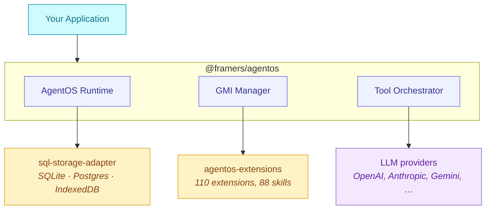

# AgentOS Ecosystem

> Related repositories, packages, and resources for building with AgentOS.

---

## Core Packages

### [@framers/agentos](https://github.com/framerslab/agentos)
**Main SDK** — The core orchestration runtime for building adaptive AI agents.

```bash
npm install @framers/agentos
```

[](https://www.npmjs.com/package/@framers/agentos)
[](https://github.com/framerslab/agentos)

---

### [@framers/sql-storage-adapter](https://github.com/framerslab/sql-storage-adapter)
**SQL Storage** — Cross-platform SQL storage abstraction with automatic fallbacks. Supports SQLite, PostgreSQL, and in-memory storage.

```bash
npm install @framers/sql-storage-adapter
```

[](https://www.npmjs.com/package/@framers/sql-storage-adapter)
[](https://github.com/framerslab/sql-storage-adapter)

**Features:**
- SQLite (better-sqlite3, sql.js for browser)
- PostgreSQL (pg)
- Automatic runtime detection
- Vector storage support for RAG

---

### [@framers/agentos-extensions-registry](https://github.com/framerslab/agentos-extensions)
**Curated Extensions Registry** — Load all official extensions with a single `createCuratedManifest()` call. Handles lazy loading, secret resolution, and factory invocation.

```bash
npm install @framers/agentos-extensions-registry
```

[](https://www.npmjs.com/package/@framers/agentos-extensions-registry)
[](https://github.com/framerslab/agentos-extensions)

```typescript
import { createCuratedManifest } from '@framers/agentos-extensions-registry';

const manifest = await createCuratedManifest({
  tools: 'all',
  channels: 'none',
  secrets: { 'serper.apiKey': process.env.SERPER_API_KEY! },
});

const agentos = new AgentOS();
await agentos.initialize({ extensionManifest: manifest });
```

Only installed extension packages will load — missing ones are skipped silently.

---

### [@framers/agentos-extensions](https://github.com/framerslab/agentos-extensions)
**Extension Source** — Implementations, templates, and manifests for tools, channel adapters, and integrations. The `agentos-extensions-registry` package catalogs and loads these.

```bash
npm install @framers/agentos-extensions
```

[](https://www.npmjs.com/package/@framers/agentos-extensions)

**Available Extensions:**

| Category | Extensions |
|----------|-----------|
| **Research** | web-search, web-browser, news-search |
| **Media** | giphy, image-search, speech-runtime, voice-synthesis |
| **System** | cli-executor, auth |
| **Integrations** | telegram, telegram-bot |
| **Provenance** | anchor-providers, tip-ingestion |
| **Channels** | telegram, whatsapp, discord, slack, webchat |

---

### [@framers/agentos-skills-registry](https://github.com/framerslab/agentos-skills-registry)
**Curated Skills Catalog SDK** — typed catalog (SKILLS_CATALOG), query helpers, and lazy-loading factories for [`SkillRegistry`](https://github.com/framerslab/agentos/blob/master/src/cognition/skills/SkillRegistry.ts) and snapshots.

```bash
npm install @framers/agentos-skills-registry
```

```typescript
// Lightweight catalog queries (zero peer deps)
import { searchSkills, getSkillsByCategory } from '@framers/agentos-skills-registry/catalog';

// Full registry with lazy-loaded @framers/agentos
import { createCuratedSkillSnapshot } from '@framers/agentos-skills-registry';
const snapshot = await createCuratedSkillSnapshot({ skills: ['github', 'weather'] });
```

---

### [@framers/agentos-skills](https://github.com/framerslab/agentos-skills)
**Skills Content** — 88 curated SKILL.md prompt modules + `registry.json` index.

```bash
npm install @framers/agentos-skills
```

This is the content package for skills. The runtime engine (SkillLoader, SkillRegistry, path utilities) now lives in `@framers/agentos/cognition/skills`.

```
@framers/agentos/cognition/skills               <- Engine (SkillLoader, SkillRegistry, path utils)
@framers/agentos-skills               <- Content (88 SKILL.md files + registry.json)
@framers/agentos-skills-registry      <- Catalog SDK (SKILLS_CATALOG, query helpers, factories)
```

---

## Applications

### [Paracosm](https://github.com/framerslab/paracosm)
**AI Agent Swarm Simulation Engine** — Define worlds as JSON, assign AI leaders with HEXACO personality profiles, and watch their decisions compound into measurably different outcomes from identical starting conditions. Built on `@framers/agentos`.

```bash
npm install paracosm
```

[](https://www.npmjs.com/package/paracosm)
[](https://github.com/framerslab/paracosm)

**Features:**
- Universal [`RunArtifact`](https://github.com/framerslab/paracosm/blob/master/src/engine/schema/types.ts) schema at `paracosm/schema` covering turn-loop civilization sims, batch-trajectory digital twins, and batch-point forecasts
- HEXACO personality-driven commander decisions with runtime tool forging through AgentOS's [`EmergentCapabilityEngine`](https://github.com/framerslab/agentos/blob/master/src/cognition/emergent/EmergentCapabilityEngine.ts)
- Deterministic kernel + LLM Event Director: same leader on the same seed replays byte-for-byte; two different leaders on the same seed get divergent events from turn 1 (the director reads each leader's HEXACO + accumulated state)
- [`SubjectConfig`](https://github.com/framerslab/paracosm/blob/master/src/engine/schema/types.ts) and [`InterventionConfig`](https://github.com/framerslab/paracosm/blob/master/src/engine/schema/types.ts) input primitives for digital-twin adoption

🌐 **Live demo:** [paracosm.agentos.sh/sim](https://paracosm.agentos.sh/sim) · **Docs:** [paracosm.agentos.sh/docs](https://paracosm.agentos.sh/docs)

---

### [agentos.sh](https://github.com/framerslab/agentos.sh)
**Documentation Website** — Official documentation and marketing site.

🌐 **Live:** [agentos.sh](https://agentos.sh)

---

### [agentos-workbench](https://github.com/framerslab/agentos-workbench)
**Development Workbench** — Visual development environment for building and testing AgentOS agents.

**Features:**
- Interactive agent playground
- Tool testing interface
- Conversation history viewer
- Real-time streaming visualization

---

### [Wunderland](https://wunderland.sh)
**Autonomous Agent Network + SDK** — A social network layer for agents (identity, tips, governance) plus a TypeScript SDK built on AgentOS.

```bash
npm install wunderland
```

**Docs:** https://docs.wunderland.sh  
**Rabbit Hole (control plane):** https://rabbithole.inc (self-hosted runtime by default; managed runtime is enterprise)

---

## Quick Links

| Resource | Link |
|----------|------|
| Documentation | [agentos.sh/docs](https://agentos.sh/docs) |
| API Reference | [docs.agentos.sh/api](https://docs.agentos.sh/api/) |
| npm | [@framers/agentos](https://www.npmjs.com/package/@framers/agentos) |
| Discord | [Join Community](https://wilds.ai/discord) |
| Twitter | [@framerslab](https://twitter.com/framerslab) |

---

## Contributing

We welcome contributions to any repository in the ecosystem:

1. **Bug reports** — [Open an issue](https://github.com/framerslab/agentos/issues)
2. **Feature requests** — [Start a discussion](https://github.com/framerslab/agentos/discussions)
3. **Extensions** — Submit to [agentos-extensions](https://github.com/framerslab/agentos-extensions)
4. **Documentation** — PRs welcome on any repo

---

## Architecture Overview



---

<p align="center">
  <sub>Part of the <a href="https://agentos.sh">AgentOS</a> ecosystem by <a href="https://frame.dev">Frame.dev</a></sub>
</p>
