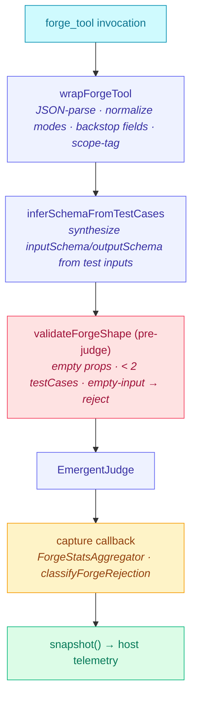

# Emergent Capabilities: Runtime Tool Forging

Agents constructed with `emergent: true` receive the [`forge_tool`](/api/classes/ForgeToolMetaTool) meta-tool. When the agent encounters a task no existing capability covers, it composes a candidate implementation (or sandboxes generated code), runs the declared test cases against it, routes the result through an LLM-as-judge that scores code safety, test correctness, and determinism, and on approval registers the new tool at session tier so subsequent turns can call it by name. Three classes do the work: [`EmergentCapabilityEngine`](/api/classes/EmergentCapabilityEngine), [`EmergentJudge`](/api/classes/EmergentJudge), and [`EmergentToolRegistry`](/api/classes/EmergentToolRegistry).

Emergent tooling requires a full runtime entry point. Use `new AgentOS()` or another constructor that initializes `ToolOrchestrator` with emergent support. The lightweight `agent()` helper accepts `emergent: true` for config compatibility but does not activate `forge_tool` on its own.

## Live run: a manager spawns a specialist mid-task


The image above is captured from a real run of [`examples/emergent-hierarchical-spawning.mjs`](https://github.com/framersai/agentos/blob/master/examples/emergent-hierarchical-spawning.mjs). The team starts with `researcher` + `writer`; the prompt asks for a security audit of sandbox isolation primitives, which neither static agent covers. The manager calls `spawn_specialist`, [`EmergentAgentJudge`](/api/classes/EmergentAgentJudge) approves the synthesised config, and `security_audit_specialist` joins the live roster. The `[FORGE]` line in the right panel is the moment that happens.

Reproduce locally:

```bash
npm install @framers/agentos
export OPENAI_API_KEY="sk-..."
node examples/emergent-hierarchical-spawning.mjs
```

## Quick Start

```typescript
import { AgentOS } from '@framers/agentos';

const agent = await AgentOS.create({
  provider: 'openai',
  emergent: true,
});

// The agent now has forge_tool in its tool list.
// When it encounters a task with no matching tool, it can create one.
```

## How It Works

![forge_tool runtime forging loop: agent calls forge_tool, the Build stage offers two creation modes (compose chains existing tools via ComposableToolBuilder; sandbox runs new code in a hardened node:vm via SandboxedToolForge), the Test stage runs declared test cases and validates output against the tool's schema, the Judge stage runs an LLM-as-judge over code safety, test correctness, and determinism, and on approval the tool is registered at the session tier — otherwise the rejection reason is returned to the agent.](/img/diagrams/emergent-capabilities-forge-loop.svg)

## Two Creation Modes

### Compose Mode -- Chain Existing Tools

The safest default. Compose mode uses the [`ComposableToolBuilder`](/api/classes/ComposableToolBuilder) to chain existing registered tools into a pipeline. No sandbox is needed because it only invokes tools the agent already has access to.

**Example: Research-and-summarize pipeline**

```typescript
// The agent calls forge_tool with this request:
const forgeRequest = {
  name: 'research_and_summarize',
  description: 'Search the web for a topic and produce a concise summary',
  inputSchema: {
    type: 'object',
    properties: {
      topic: { type: 'string', description: 'The research topic' },
    },
    required: ['topic'],
  },
  outputSchema: {
    type: 'object',
    properties: {
      summary: { type: 'string' },
      sources: { type: 'array', items: { type: 'string' } },
    },
  },
  implementation: {
    mode: 'compose',
    steps: [
      {
        name: 'search',
        tool: 'web_search',
        inputMapping: { q: '$input.topic' },
      },
      {
        name: 'summarize',
        tool: 'generate_text',
        inputMapping: {
          prompt: 'Summarize these search results about "$input.topic":\n$prev.output',
        },
      },
    ],
  },
  testCases: [
    { input: { topic: 'agent orchestration frameworks' } },
  ],
};
```

**Reference expression syntax** for `inputMapping`:

| Expression | Resolves to |
|---|---|
| `$input` | The original input to the composed tool |
| `$input.fieldName` | A specific field from the input |
| `$prev` | Output of the immediately preceding step |
| `$prev.output` | A field from the preceding step's output |
| `$steps.searchStep` | Output of a named step |
| Any other value | Used as a literal |

**Example: Multi-step data pipeline**

```json
{
  "name": "fetch_analyze_report",
  "description": "Fetch API data, analyze trends, generate a report",
  "inputSchema": {
    "type": "object",
    "properties": {
      "endpoint": { "type": "string" },
      "timeRange": { "type": "string" }
    },
    "required": ["endpoint"]
  },
  "implementation": {
    "mode": "compose",
    "steps": [
      {
        "name": "fetch",
        "tool": "http_request",
        "inputMapping": { "url": "$input.endpoint", "method": "GET" }
      },
      {
        "name": "analyze",
        "tool": "generate_text",
        "inputMapping": {
          "prompt": "Analyze trends in this data for $input.timeRange:\n$steps.fetch.body"
        }
      },
      {
        "name": "format",
        "tool": "generate_text",
        "inputMapping": {
          "prompt": "Format this analysis as a markdown report:\n$prev.output"
        }
      }
    ]
  },
  "testCases": [
    { "input": { "endpoint": "https://api.example.com/metrics", "timeRange": "last 7 days" } }
  ]
}
```

### Sandbox Mode -- Write Novel Code

Sandbox mode runs agent-written JavaScript in a hardened node:vm context. The forge-specific [`SandboxedToolForge`](/api/classes/SandboxedToolForge) layers the `function execute(input)` contract and allowlist-injected APIs on top of [`CodeSandbox`](/api/classes/CodeSandbox), which provides the hardening: `codeGeneration: { strings: false, wasm: false }`, frozen console, and explicit `process` / `globalThis` / `require` set to undefined. Wall-clock timeouts are enforced; memory limits are not (node:vm shares the host heap; an isolated-vm soft dependency would be required for preemptive memory limits and is deferred).

**Example: CSV parser**

```json
{
  "name": "parse_csv",
  "description": "Parse CSV text into structured rows with headers",
  "inputSchema": {
    "type": "object",
    "properties": {
      "csv": { "type": "string", "description": "Raw CSV text" },
      "delimiter": { "type": "string", "default": "," }
    },
    "required": ["csv"]
  },
  "outputSchema": {
    "type": "object",
    "properties": {
      "headers": { "type": "array", "items": { "type": "string" } },
      "rows": { "type": "array", "items": { "type": "object" } }
    }
  },
  "implementation": {
    "mode": "sandbox",
    "code": "function execute(input) {\n  const delim = input.delimiter || ',';\n  const lines = input.csv.trim().split('\\n');\n  const headers = lines[0].split(delim).map(h => h.trim());\n  const rows = lines.slice(1).map(line => {\n    const values = line.split(delim);\n    return Object.fromEntries(headers.map((h, i) => [h, values[i]?.trim()]));\n  });\n  return { headers, rows };\n}",
    "allowlist": []
  },
  "testCases": [
    {
      "input": { "csv": "name,age\nAlice,30\nBob,25" },
      "expectedOutput": {
        "headers": ["name", "age"],
        "rows": [{ "name": "Alice", "age": "30" }, { "name": "Bob", "age": "25" }]
      }
    }
  ]
}
```

**Example: Temperature converter**

```json
{
  "name": "convert_temperature",
  "description": "Convert between Celsius, Fahrenheit, and Kelvin",
  "inputSchema": {
    "type": "object",
    "properties": {
      "value": { "type": "number" },
      "from": { "type": "string", "enum": ["C", "F", "K"] },
      "to": { "type": "string", "enum": ["C", "F", "K"] }
    },
    "required": ["value", "from", "to"]
  },
  "outputSchema": {
    "type": "object",
    "properties": { "result": { "type": "number" } }
  },
  "implementation": {
    "mode": "sandbox",
    "code": "function execute(input) {\n  const { value, from, to } = input;\n  let celsius;\n  if (from === 'C') celsius = value;\n  else if (from === 'F') celsius = (value - 32) * 5 / 9;\n  else celsius = value - 273.15;\n  let result;\n  if (to === 'C') result = celsius;\n  else if (to === 'F') result = celsius * 9 / 5 + 32;\n  else result = celsius + 273.15;\n  return { result: Math.round(result * 100) / 100 };\n}",
    "allowlist": []
  },
  "testCases": [
    { "input": { "value": 100, "from": "C", "to": "F" }, "expectedOutput": { "result": 212 } },
    { "input": { "value": 32, "from": "F", "to": "C" }, "expectedOutput": { "result": 0 } },
    { "input": { "value": 0, "from": "C", "to": "K" }, "expectedOutput": { "result": 273.15 } }
  ]
}
```

**Example: Sandbox with `fetch` allowlist**

```json
{
  "name": "check_http_status",
  "description": "Check if a URL is reachable and return its HTTP status code",
  "inputSchema": {
    "type": "object",
    "properties": { "url": { "type": "string" } },
    "required": ["url"]
  },
  "outputSchema": {
    "type": "object",
    "properties": {
      "status": { "type": "number" },
      "ok": { "type": "boolean" },
      "redirected": { "type": "boolean" }
    }
  },
  "implementation": {
    "mode": "sandbox",
    "code": "async function execute(input) {\n  const res = await fetch(input.url, { method: 'HEAD', redirect: 'follow' });\n  return { status: res.status, ok: res.ok, redirected: res.redirected };\n}",
    "allowlist": ["fetch"]
  },
  "testCases": [
    { "input": { "url": "https://httpstat.us/200" }, "expectedOutput": { "status": 200, "ok": true } }
  ]
}
```

## Sandbox Safety

### Blocked APIs

These are rejected at code validation time (before execution):

| Blocked | Why |
|---|---|
| `eval`, `Function` | Arbitrary code execution escape |
| `require`, `import()` | Module system escape |
| `process`, `child_process` | System access |
| `fs.writeFile`, `fs.unlink`, `fs.mkdir` | Filesystem mutation |

### Allowed APIs (opt-in via `allowlist`)

| API | What it grants |
|---|---|
| `fetch` | Outbound HTTP/HTTPS (domain-restricted via `fetchDomainAllowlist`) |
| `fs.readFile` | Read-only file access in a pre-approved path whitelist |
| `crypto` | Node.js `crypto` module for hashing / HMAC |

### Resource Limits

| Resource | Default | Config key |
|---|---|---|
| Execution timeout | 5,000 ms | `sandboxTimeoutMs` |
| Memory observed (heap delta heuristic, NOT preempted) | 128 MB nominal | `sandboxMemoryMB` |
| Session tools | 10 | `maxSessionTools` |
| Agent tools | 50 | `maxAgentTools` |

## LLM-as-Judge Verification

Every forged tool undergoes review by the [`EmergentJudge`](/api/classes/EmergentJudge). No tool activates without judge approval.

| Review stage | When | What it checks |
|---|---|---|
| **Creation review** | First forge | Code safety, test correctness, schema compliance, determinism |
| **Reuse validation** | Each invocation | Output matches declared outputSchema |
| **Promotion panel** | Tier upgrade request | Two independent reviewers: safety + correctness |

If no LLM callback is configured for the judge, **creation review fails closed** — all forge requests are rejected. This is the safe default.

## Tiered Promotion

Tools start at session tier in the [`EmergentToolRegistry`](/api/classes/EmergentToolRegistry) and can be promoted as they prove reliability:

```
session ──(5+ uses, >0.8 confidence, panel approved)──→ agent ──(human approval)──→ shared
```

| Tier | Scope | Lifetime | Promotion rule |
|---|---|---|---|
| **Session** | Current conversation only | Discarded on session end | Auto on creation + judge approval |
| **Agent** | Persisted for the creating agent | Survives restarts | 5+ uses, confidence > 0.8, two-reviewer panel |
| **Shared** | All agents in the runtime | Permanent until demoted | Human approval required (HITL gate) |

## Forge Observability

The forge pipeline ships with a five-utility observability layer under `@framers/agentos/emergent` so any consumer can see live forge health without re-implementing the instrumentation. Each utility is standalone, pure, and composes with whatever telemetry the host already has.



### API surface

| Utility | Kind | Purpose |
|---|---|---|
| [`wrapForgeTool`](/api/functions/wrapForgeTool) | wrapper (`ForgeToolMetaTool → ITool`) | Normalizes messy LLM forge args, runs pre-judge shape check, captures every attempt to the caller's sink regardless of outcome. Takes an optional `scope` label and `log` event callback so consumers can group attempts (e.g., `dept: 'medical'`) and render lifecycle events to stdout / pm2 / structured logs without the wrapper owning any console dependency. |
| [`validateForgeShape`](/api/functions/validateForgeShape) | pure function (`ForgeShapeRequest → string[]`) | Catches the three failure modes that dominate cheap-tier rejections before the judge LLM runs: empty schema properties, fewer than 2 testCases, empty-input testCases. Every shape-check rejection saves one judge invocation plus the sandbox round-trip that would have followed it. |
| [`inferSchemaFromTestCases`](/api/functions/inferSchemaFromTestCases) | pure function (in-place mutation) | Synthesizes `inputSchema.properties` / `outputSchema.properties` from concrete testCase values when the LLM forgot to declare them. Rescues the "examples without formalization" failure mode without relaxing schema discipline. Unions fields across every testCase so a single incomplete case does not narrow the inferred schema. |
| [`classifyForgeRejection`](/api/functions/classifyForgeRejection) | pure function (`string → ForgeRejectionCategory`) | Bins rejection-reason text into six categories: `schema_extra_field`, `shape_check`, `syntax_error`, `parse_error`, `judge_correctness`, `other`. Order matters: `schema_extra_field` wins over `judge_correctness` because it is the more specific and more actionable signal. A growing `other` bucket is the signal to read raw reasons and extend the pattern set. |
| [`ForgeStatsAggregator`](/api/classes/ForgeStatsAggregator) | class | Per-run rollup: `attempts`, `approved`, `rejected`, `approvedConfidenceSum`, `uniqueNames`, `uniqueApproved`, `uniqueTerminalRejections`, and the `rejectionReasons` histogram. `uniqueApproved` vs `uniqueTerminalRejections` is the real quality signal: unique-tool approval rate, not attempt-level approval rate. Shape pinned — extend by adding fields, never rename existing ones. |

### Composed wiring

```typescript
import {
  EmergentCapabilityEngine, ForgeToolMetaTool,
  wrapForgeTool, ForgeStatsAggregator,
} from '@framers/agentos/emergent';

const engine = new EmergentCapabilityEngine({ /* ... */ });
const forgeTool = new ForgeToolMetaTool(engine);

const stats = new ForgeStatsAggregator();

const wrapped = wrapForgeTool({
  raw: forgeTool,
  agentId: 'agent-1',
  sessionId: 'session-1',
  scope: 'medical',  // optional; propagated onto every CapturedForge
  capture: record => stats.recordAttempt(
    record.approved, record.confidence, record.name, record.errorReason,
  ),
  log: event => {
    // event: { kind: 'start' | 'approved' | 'rejected' | 'error', toolName, ... }
    // Optional; omit for quiet mode.
  },
});

// Expose `wrapped` to the agent. After the run:
const snapshot = stats.snapshot();
// → { attempts, approved, rejected, uniqueApproved, uniqueTerminalRejections, rejectionReasons, ... }
```

### Interpreting the histogram

- Dominant `schema_extra_field` bucket — the LLM declares strict output schemas then returns extra fields. Mitigation: tighten the forge-guidance prompt or fix the sandbox's schema discipline.
- Dominant `shape_check` bucket — the LLM keeps producing well-intentioned requests that the pre-judge validator rejects (empty properties, too few testCases). Usually fixable with a better system prompt that shows a worked forge example.
- Dominant `judge_correctness` bucket — tool code has real logic bugs the judge catches (division, threshold inversions, unbounded outputs). Investigate the specific forges.
- Non-zero `syntax_error` — LLM is emitting TypeScript syntax in a JavaScript sandbox, or single-line `if`/`for` without braces. Prompt fix.
- `uniqueApproved / uniqueNames` near 1.0 — retry loop recovers well. Near 0 — LLM gets stuck on the same name across retries.

### Reference consumer: paracosm

Paracosm threads these utilities end-to-end through its SSE + cost telemetry surface. Every forge attempt shows up as a `forge_attempt` SSE event, is folded into the run's `_cost.forgeStats` payload on every subsequent event, lands in the run artifact's `finalCost().forgeStats`, and is aggregated across the last 100 runs at `/retry-stats.forges`. See [`apps/paracosm/src/runtime/emergent-setup.ts`](https://github.com/framersai/paracosm/blob/master/src/runtime/emergent-setup.ts) and [`cost-tracker.ts`](https://github.com/framersai/paracosm/blob/master/src/runtime/cost-tracker.ts) for the integration pattern.

## End-to-End Example: Agent Conversation

```
User: I need to frequently check if JSON is valid and extract specific fields.

Agent: I don't have a JSON validation tool. Let me create one.
       [Calling forge_tool with mode: "sandbox"...]

       ✓ Created "validate_and_extract_json" — sandboxed tool that validates
         JSON and extracts fields by path. Passed safety review (score: 0.95).

User: Check if this is valid JSON and extract the "name" field:
      {"name": "AgentOS", "version": "0.1.96", "emergent": true}

Agent: [Calling validate_and_extract_json...]
       ✓ Valid JSON
       Extracted fields:
       - name: "AgentOS"

User: Now extract "version" and "emergent" from the same data.

Agent: [Calling validate_and_extract_json...]
       ✓ Valid JSON
       Extracted fields:
       - version: "0.1.96"
       - emergent: true

[After 5+ successful invocations, the tool auto-promotes to agent tier]
```

## Programmatic Usage

### Direct Engine Access

```typescript
import { AgentOS } from '@framers/agentos';

const agent = await AgentOS.create({
  provider: 'openai',
  emergent: true,
  emergentConfig: {
    maxSessionTools: 10,
    sandboxTimeoutMs: 5000,
    judgeModel: 'gpt-4o-mini',
    promotionJudgeModel: 'gpt-4o',
  },
});

// Access the engine directly
const engine = agent.orchestrator.getEmergentEngine();

// Forge a tool programmatically
const result = await engine.forge(
  {
    name: 'slugify',
    description: 'Convert a string to a URL-friendly slug',
    inputSchema: {
      type: 'object',
      properties: { text: { type: 'string' } },
      required: ['text'],
    },
    outputSchema: {
      type: 'object',
      properties: { slug: { type: 'string' } },
    },
    implementation: {
      mode: 'sandbox',
      code: `function execute(input) {
        const slug = input.text
          .toLowerCase()
          .replace(/[^a-z0-9]+/g, '-')
          .replace(/^-|-$/g, '');
        return { slug };
      }`,
      allowlist: [],
    },
    testCases: [
      { input: { text: 'Hello World!' }, expectedOutput: { slug: 'hello-world' } },
      { input: { text: '  Spaces & Symbols!! ' }, expectedOutput: { slug: 'spaces-symbols' } },
    ],
  },
  { agentId: 'agent-1', sessionId: 'session-1' },
);

console.log(result.success); // true
console.log(result.tool?.name); // 'slugify'
console.log(result.verdict?.approved); // true

// Clean up session tools when done
agent.orchestrator.cleanupEmergentSession('session-1');
```

### Listing and Inspecting Tools

```typescript
const engine = agent.orchestrator.getEmergentEngine();

// Get all tools for a session
const sessionTools = engine.getSessionTools('session-1');

// Get tools for an agent (includes promoted tools)
const agentTools = engine.getAgentTools('agent-1');

// Check tool usage stats
const stats = engine.getToolStats('slugify', 'agent-1');
console.log(stats.totalCalls, stats.successRate, stats.avgLatencyMs);
```

## Export and Reuse

Emergent tools can be exported as portable `agentos.emergent-tool.v1` YAML packages and imported into another agent.

```typescript
import { exportEmergentTool, importEmergentTool } from '@framers/agentos';

// Export a tool
await exportEmergentTool(toolId, { output: './slugify.emergent-tool.yaml' });

// Import into another agent
await importEmergentTool('./slugify.emergent-tool.yaml', { seedId: agentSeedId });
```

- `compose` tools are portable by default
- `sandbox` tools are portable only when source code is persisted (`persistSandboxSource: true`)
- Redacted sandbox exports are useful for audit and Git review but intentionally not importable

## Configuration Reference

```typescript
{
  emergent: true,
  emergentConfig: {
    // Tool count limits
    maxSessionTools: 10,           // Max tools per session
    maxAgentTools: 50,             // Max persisted per agent

    // Sandbox resource limits and telemetry
    sandboxTimeoutMs: 5000,        // VM execution timeout
    sandboxMemoryMB: 128,          // Nominal budget; node:vm reports heap delta only

    // Judge configuration
    judgeModel: 'gpt-4o-mini',    // Model for creation reviews
    promotionJudgeModel: 'gpt-4o', // Model for promotion panels

    // Promotion criteria
    promotionThreshold: {
      uses: 5,                     // Minimum successful invocations
      confidence: 0.8,             // Minimum judge confidence score
    },

    // Sandbox allowlists
    allowedSandboxAPIs: [],        // e.g. ['fetch', 'crypto']
    fetchDomainAllowlist: [],      // e.g. ['api.example.com']

    // Persistence
    persistSandboxSource: false,   // Store raw code at rest (enables export)
  },
}
```

## Safety Invariants

- Emergent tools **cannot** modify the guardrail pipeline
- Emergent tools **cannot** access other agents' memory or credentials
- Sandbox runs in a hardened node:vm context (own realm, `process` / `globalThis` / `require` set to undefined, `codeGeneration: { strings: false, wasm: false }` blocks runtime `eval`/`Function` reflection). Host-realm escape is blocked; runaway memory is not preempted (use isolated-vm for that, currently deferred).
- All forge decisions and metadata are logged to the provenance audit trail
- Human approval is required for shared-tier promotion
- Raw sandbox source is redacted at rest by default
- If no LLM is configured, all forge requests are rejected (fail-closed)

## Self-Improvement Tools

When `selfImprovement.enabled` is `true`, the engine registers four additional meta-tools that let agents modify their own behavior at runtime. All four are bounded by configurable limits to prevent runaway self-modification.

| Tool | What it does |
|------|-------------|
| `adapt_personality` | Shift HEXACO traits by bounded deltas with per-session budgets and Ebbinghaus decay |
| `manage_skills` | Enable, disable, search, and list skills with allowlist-based permission gating |
| `self_evaluate` | LLM-as-judge response scoring (relevance, clarity, accuracy, helpfulness) with parameter adjustment |
| `create_workflow` | Compose multi-step tool pipelines at runtime with reference resolution ($input, $prev, $steps[N]) |

Configuration:

```typescript
{
  selfImprovement: {
    enabled: true,
    personality: { maxDeltaPerSession: 0.15, persistWithDecay: true, decayRate: 0.05 },
    skills: { allowlist: ['*'], requireApprovalForNewCategories: true },
    workflows: { maxSteps: 10, allowedTools: ['*'] },
    selfEval: { autoAdjust: true, adjustableParams: ['temperature', 'verbosity', 'personality'], maxEvaluationsPerSession: 10 },
  },
}
```

See [Emergent Capabilities](https://docs.agentos.sh/docs/features/emergent-capabilities#self-improvement-tools) for full documentation of each tool.

## Skill Export

The `SkillExporter` converts runtime-forged tools into `SKILL.md` + `CAPABILITY.yaml` format, bridging emergent tools into the curated skills ecosystem and capability discovery.

```typescript
import { exportToolAsSkillPack } from '@framers/agentos/emergent';
await exportToolAsSkillPack(forgedTool, './skills/slugify');
```

## Related

- [Adaptive Prompt Intelligence](/features/adaptive-prompt-intelligence) -- the per-turn metaprompt loop that runs on state-mutating triggers, with the `adapt_personality` tool, `PersonaDriftMechanism`, and concrete cost numbers
- [Adaptive vs. Emergent Intelligence](https://agentos.sh/blog/adaptive-vs-emergent) -- how adaptive and emergent behavior differ in the AgentOS architecture
- [Self-Improving Agents](/features/self-improving-agents) -- broader patterns for agents that improve over time
- [Recursive Self-Building](/features/recursive-self-building) -- recursive tool creation and agent spawning
- [Guardrails](/features/guardrails) -- safety mechanisms that constrain emergent behavior
- [Agency API](/features/agency-api) -- multi-agent coordination strategies
- **API Reference:** [`EmergentCapabilityEngine`](/api/classes/EmergentCapabilityEngine) | [`EmergentJudge`](/api/classes/EmergentJudge) | [`EmergentToolRegistry`](/api/classes/EmergentToolRegistry) | [`ForgeToolMetaTool`](/api/classes/ForgeToolMetaTool) | [`ComposableToolBuilder`](/api/classes/ComposableToolBuilder) | [`CodeSandbox`](/api/classes/CodeSandbox) | [`AdaptPersonalityTool`](/api/classes/AdaptPersonalityTool) | [`ManageSkillsTool`](/api/classes/ManageSkillsTool) | [`SelfEvaluateTool`](/api/classes/SelfEvaluateTool) | [`CreateWorkflowTool`](/api/classes/CreateWorkflowTool) | [`exportToolAsSkill`](/api/functions/exportToolAsSkill)
