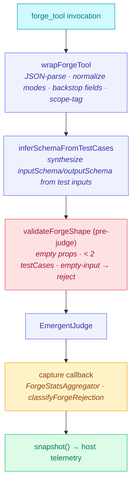

# Emergent Capabilities: Runtime Tool Forging

Agents constructed with `emergent: true` receive the [`forge_tool`](/api/classes/ForgeToolMetaTool) meta-tool. When the agent encounters a task no existing capability covers, it composes a candidate implementation (or sandboxes generated code), runs the declared test cases against it, routes the result through an LLM-as-judge that scores code safety, test correctness, and determinism, and on approval registers the new tool at session tier so subsequent turns can call it by name. Three classes do the work: [`EmergentCapabilityEngine`](/api/classes/EmergentCapabilityEngine), [`EmergentJudge`](/api/classes/EmergentJudge), and [`EmergentToolRegistry`](/api/classes/EmergentToolRegistry).

Emergent tooling requires a full runtime entry point. Use `new AgentOS()` or another constructor that initializes [`ToolOrchestrator`](https://github.com/framerslab/agentos/blob/master/src/core/tools/ToolOrchestrator.ts) with emergent support. The lightweight `agent()` helper accepts `emergent: true` for config compatibility but does not activate `forge_tool` on its own.

## Live run: a manager spawns a specialist mid-task


The image above is captured from a real run of [`examples/emergent-hierarchical-spawning.mjs`](https://github.com/framerslab/agentos/blob/master/examples/emergent-hierarchical-spawning.mjs). The team starts with `researcher` + `writer`; the prompt asks for a security audit of sandbox isolation primitives, which neither static agent covers. The manager calls `spawn_specialist`, [`EmergentAgentJudge`](/api/classes/EmergentAgentJudge) approves the synthesised config, and `security_audit_specialist` joins the live roster. The `[FORGE]` line in the right panel is the moment that happens.

Reproduce locally:

```bash
npm install @framers/agentos
export OPENAI_API_KEY="sk-..."
node examples/emergent-hierarchical-spawning.mjs
```

## Quick Start

```typescript
import { AgentOS } from '@framers/agentos';

const agentos = await AgentOS.create({
  emergent: true,
  // Compose mode (chaining existing tools) is always available once emergent is on.
  // Sandbox mode (agent-written code) stays off until you set
  // emergentConfig.allowSandboxTools. Read "Sandbox allowlists" below first:
  // sandboxed fetch is unrestricted, and reads cover the working directory.
});

// Every GMI on this runtime now has forge_tool in its tool list. Providers
// come from the environment keys (OPENAI_API_KEY and the others), not from
// a `provider` option.
// When an agent meets a task with no matching tool, it can create one.
```

## How It Works

![forge_tool runtime forging loop: agent calls forge_tool, the Build stage offers two creation modes (compose chains existing tools via ComposableToolBuilder; sandbox runs new code in an in-process node:vm context via SandboxedToolForge), the Test stage runs declared test cases and validates output against the tool's schema, the Judge stage runs an LLM-as-judge over code safety, test correctness, and determinism, and on approval the tool is registered at the session tier — otherwise the rejection reason is returned to the agent.](/img/diagrams/emergent-capabilities-forge-loop.svg)

## Two Creation Modes

### Compose Mode -- Chain Existing Tools

Compose mode uses the [`ComposableToolBuilder`](/api/classes/ComposableToolBuilder) to chain registered tools into a pipeline. No agent-written code runs: each step is a call to a registered tool, made through a step gate. In an AgentOS runtime the gate is `ToolOrchestrator.processToolCall`, so every step meets the disabled list, the permission check with the caller's capabilities, the approval for a tool with side effects, and argument validation, as a direct call does. A host that builds the engine itself passes a gate from `createStepGate` (see "Building the engine yourself" below); an engine without one forges code and refuses to compose (`compose_needs_gate`).

Which tools a step may name is one rule, checked when the composition is forged, at every load, before a promotion, and at every run:

| The step tool declares | It is chained |
|---|---|
| `hasSideEffects: false` | freely |
| `hasSideEffects: true` | only when the host lists its name in `emergentConfig.compose.sideEffectingTools` |
| nothing | never: the host declares the flag first |

While a composition is forged, a step whose tool has side effects, or is itself a composition, is not executed. Each test case gives that step's output in `stepOutputs`, keyed by step name (`dry_run_needs_output` otherwise), and the judge sees the step listed as an effect that would have run, with its arguments. The other test steps run as the forging caller: `forge_tool` passes its own call context, and a direct `engine.forge(request, { agentId, sessionId, caller })` passes it as `caller`, so a step that needs a capability the caller lacks fails its test. A direct `forge` without `caller` whose test step is refused a capability, by the permission manager or by the executor's own capability check, is refused with `caller_context_required`. A composition whose steps reach it again, at any depth, is refused (`step_cycle`): the steps are checked when the forge starts and again after the judge, and the cycle once more after the composition is registered, so two forges that would close a cycle between them are never both registered. At run time a composition that is already running further up the same call is refused there, before any of its steps run, and suspended (`step_cycle`); a chain nested deeper than eight is refused (`nesting_too_deep`) and suspends no composition, since a long chain is not a cycle.

At run time every step is checked again, since a tool is replaced by name, and the gate runs the very instance it checked: a tool registered under the name between the check and the call is refused (`step_replaced`) and nothing runs. A composed tool declares side effects when any of its steps does or is itself a composition; each such step is asked for approval when it runs, not the composed call. An approval is for one registration, its tool id in the action id: every call through `processToolCall` runs the instance its checks and approval were for, and a call whose name another registration took meanwhile is refused with nothing run (`STEP_REPLACED` for a composed or workflow step, `TOOL_REPLACED` for a direct call). A step that can no longer be chained (its tool was removed, or replaced by one that no longer declares its flag, or the chain reaches itself) suspends the composition as the library's suspension; it is checked again when a tool one of its steps names is registered by any path (`registerTool`, an extension pack's descriptor), and at every load. A suspension or a demotion the host set stays as it is: a run's refusal, or a promotion check, never writes the library's suspension over it, in this process or over a row another process restricted, and a suspended or demoted tool is not promoted. A composition suspended because its step's tool changed between the check and the call is checked again at once, against the tool that now holds the name, and so is one suspended at run time that fits the tools registered by the time its suspension is held. A run's suspension takes its turn with the composition's admissions, so a re-check that a registration starts while the suspension is being written runs after it and reads it. A nested composition's refusal of one of its own steps suspends that composition only: the enclosing composition's call fails with its error, and the inner code arrives as `details.innerCode`.

**Example: Research-and-summarize pipeline**

```typescript
// The agent calls forge_tool with this request:
const forgeRequest = {
  name: 'research_and_summarize',
  description: 'Search the web for a topic and produce a concise summary',
  inputSchema: {
    type: 'object',
    properties: {
      topic: { type: 'string', description: 'The research topic' },
    },
    required: ['topic'],
  },
  outputSchema: {
    type: 'object',
    properties: {
      summary: { type: 'string' },
      sources: { type: 'array', items: { type: 'string' } },
    },
  },
  implementation: {
    mode: 'compose',
    steps: [
      {
        name: 'search',
        tool: 'web_search',
        inputMapping: { q: '$input.topic' },
      },
      {
        name: 'summarize',
        tool: 'generate_text',
        inputMapping: {
          prompt: 'Summarize these search results about "$input.topic":\n$prev.output',
        },
      },
    ],
  },
  testCases: [
    { input: { topic: 'agent orchestration frameworks' } },
  ],
};
// This forges with no configuration when both step tools declare
// hasSideEffects: false. A step tool that declares true needs listing in
// compose.sideEffectingTools and its output in each test case's stepOutputs.
```

**Reference expression syntax** for `inputMapping`:

| Expression | Resolves to |
|---|---|
| `$input` | The original input to the composed tool |
| `$input.fieldName` | A specific field from the input |
| `$prev` | Output of the immediately preceding step |
| `$prev.output` | A field from the preceding step's output |
| `$steps.searchStep` | Output of a named step |
| Any other value | Used as a literal |

**Example: Multi-step data pipeline**

```json
{
  "name": "fetch_analyze_report",
  "description": "Fetch API data, analyze trends, generate a report",
  "inputSchema": {
    "type": "object",
    "properties": {
      "endpoint": { "type": "string" },
      "timeRange": { "type": "string" }
    },
    "required": ["endpoint"]
  },
  "implementation": {
    "mode": "compose",
    "steps": [
      {
        "name": "fetch",
        "tool": "http_request",
        "inputMapping": { "url": "$input.endpoint", "method": "GET" }
      },
      {
        "name": "analyze",
        "tool": "generate_text",
        "inputMapping": {
          "prompt": "Analyze trends in this data for $input.timeRange:\n$steps.fetch.body"
        }
      },
      {
        "name": "format",
        "tool": "generate_text",
        "inputMapping": {
          "prompt": "Format this analysis as a markdown report:\n$prev.output"
        }
      }
    ]
  },
  "testCases": [
    {
      "input": { "endpoint": "https://api.example.com/metrics", "timeRange": "last 7 days" },
      "stepOutputs": { "fetch": { "body": "{\"visits\":[120,180,240]}" } }
    }
  ]
}
```

A request tool has side effects: when `http_request` declares `hasSideEffects: true`, this composition forges only when the host lists `http_request` in `compose.sideEffectingTools`, and the test case gives the fetch step's output instead of calling the endpoint.

### Sandbox Mode -- Write Novel Code

Sandbox mode runs agent-written JavaScript in an in-process `node:vm` context. Node's documentation says of that module: "The `node:vm` module is not a security mechanism. Do not use it to run untrusted code." The forge-specific [`SandboxedToolForge`](/api/classes/SandboxedToolForge) layers the `function execute(input)` contract and the granted functions on top of [`CodeSandbox`](/api/classes/CodeSandbox), which sets `codeGeneration: { strings: false, wasm: false }`, freezes the console and sets `process`, `globalThis` and `require` to undefined in the context. A scope on a granted function (a domain list, a read root) is a guardrail for code that acts through that function. Wall-clock timeouts are enforced, but a host call the code started keeps running after its timeout; memory is not limited (`node:vm` shares the host heap, and `sandboxMemoryMB` is reported, not enforced).

**Example: CSV parser**

```json
{
  "name": "parse_csv",
  "description": "Parse CSV text into structured rows with headers",
  "inputSchema": {
    "type": "object",
    "properties": {
      "csv": { "type": "string", "description": "Raw CSV text" },
      "delimiter": { "type": "string", "default": "," }
    },
    "required": ["csv"]
  },
  "outputSchema": {
    "type": "object",
    "properties": {
      "headers": { "type": "array", "items": { "type": "string" } },
      "rows": { "type": "array", "items": { "type": "object" } }
    }
  },
  "implementation": {
    "mode": "sandbox",
    "code": "function execute(input) {\n  const delim = input.delimiter || ',';\n  const lines = input.csv.trim().split('\\n');\n  const headers = lines[0].split(delim).map(h => h.trim());\n  const rows = lines.slice(1).map(line => {\n    const values = line.split(delim);\n    return Object.fromEntries(headers.map((h, i) => [h, values[i]?.trim()]));\n  });\n  return { headers, rows };\n}",
    "allowlist": []
  },
  "testCases": [
    {
      "input": { "csv": "name,age\nAlice,30\nBob,25" },
      "expectedOutput": {
        "headers": ["name", "age"],
        "rows": [{ "name": "Alice", "age": "30" }, { "name": "Bob", "age": "25" }]
      }
    }
  ]
}
```

**Example: Temperature converter**

```json
{
  "name": "convert_temperature",
  "description": "Convert between Celsius, Fahrenheit, and Kelvin",
  "inputSchema": {
    "type": "object",
    "properties": {
      "value": { "type": "number" },
      "from": { "type": "string", "enum": ["C", "F", "K"] },
      "to": { "type": "string", "enum": ["C", "F", "K"] }
    },
    "required": ["value", "from", "to"]
  },
  "outputSchema": {
    "type": "object",
    "properties": { "result": { "type": "number" } }
  },
  "implementation": {
    "mode": "sandbox",
    "code": "function execute(input) {\n  const { value, from, to } = input;\n  let celsius;\n  if (from === 'C') celsius = value;\n  else if (from === 'F') celsius = (value - 32) * 5 / 9;\n  else celsius = value - 273.15;\n  let result;\n  if (to === 'C') result = celsius;\n  else if (to === 'F') result = celsius * 9 / 5 + 32;\n  else result = celsius + 273.15;\n  return { result: Math.round(result * 100) / 100 };\n}",
    "allowlist": []
  },
  "testCases": [
    { "input": { "value": 100, "from": "C", "to": "F" }, "expectedOutput": { "result": 212 } },
    { "input": { "value": 32, "from": "F", "to": "C" }, "expectedOutput": { "result": 0 } },
    { "input": { "value": 0, "from": "C", "to": "K" }, "expectedOutput": { "result": 273.15 } }
  ]
}
```

**Example: Sandbox with `fetch` allowlist**

```json
{
  "name": "check_http_status",
  "description": "Check if a URL is reachable and return its HTTP status code",
  "inputSchema": {
    "type": "object",
    "properties": { "url": { "type": "string" } },
    "required": ["url"]
  },
  "outputSchema": {
    "type": "object",
    "properties": {
      "status": { "type": "number" },
      "ok": { "type": "boolean" },
      "redirected": { "type": "boolean" }
    }
  },
  "implementation": {
    "mode": "sandbox",
    "code": "async function execute(input) {\n  const res = await fetch(input.url, { method: 'HEAD', redirect: 'follow' });\n  return { status: res.status, ok: res.ok, redirected: res.redirected };\n}",
    "allowlist": ["fetch"]
  },
  "testCases": [
    { "input": { "url": "https://httpstat.us/200" }, "expectedOutput": { "status": 200, "ok": true } }
  ]
}
```

## Sandbox Safety

### Blocked APIs

These are rejected at code validation time (before execution):

| Blocked | Why |
|---|---|
| `eval`, `Function` | Arbitrary code execution escape |
| `require`, `import()` | Module system escape |
| `process`, `child_process` | System access |
| `fs.write*`, `fs.appendFile`, `fs.truncate`, `fs.unlink`, `fs.rm`, `fs.rmdir` | Filesystem mutation (only `fs.readFile` is ever exposed, and only when the request's allowlist names it) |

### Allowed APIs (opt-in via `allowlist`)

| API | What it grants |
|---|---|
| `fetch` | Without a ceiling: outbound HTTP/HTTPS; the injected function sends the caller's method, headers and body to the host and follows redirects; `fetchDomainAllowlist` checks the first URL's host when a host sets it, and the standard wiring does not set it. Under a ceiling: GET and HEAD to the ceiling's hosts, every redirect checked, the body capped (see [A ceiling for code-forged tools](#a-ceiling-for-code-forged-tools)). A grant that holds `fetch` and `fs.read` together can send out what it reads. |
| `fs.read` (the function `fs.readFile` in code; a list may name either) | Read-only file access under the roots, after symlinks are resolved: `fsReadRoots` without a ceiling (the working directory by default), the ceiling's `roots` with one |
| `crypto` | `randomUUID`, `createHash` and `createHmac` from Node's `crypto` |

### Resource Limits

| Resource | Default | Config key |
|---|---|---|
| Execution timeout | 5,000 ms | `sandboxTimeoutMs` |
| Memory budget (the in-process executor observes a heap delta and does not preempt; an executor that can limit memory takes it as its limit) | 128 MB | `sandboxMemoryMB` |
| Session tools | 10 | `maxSessionTools` |
| Agent tools | 50 | `maxAgentTools` |
| Sandbox mode | off: a `mode: 'sandbox'` request is rejected and a stored code tool loads suspended (`sandbox_tools_off`) until it is enabled; compose mode needs no switch | `allowSandboxTools` |
| Side-effecting steps | none: a composition or a workflow chains a tool that declares side effects only when it is listed | `compose.sideEffectingTools` |
| Settling after a run ends | up to 1 s; what is still in flight is listed `pending` | fixed (`CALL_SETTLE_MS`) |
| Output, in-process executor | 1 MB of UTF-8 on each of stdout (the result, `console.log`, `console.info`) and stderr (`console.error`, `console.warn`); a call that passes either fails | fixed |

### Executors

The forge validates the source, pre-parses it and builds the functions the grant allows; an executor runs the code and calls `execute(input)` or `run(input)`. The library ships one executor, `InProcessExecutor`, the default: a `node:vm` context inside the host's process, through `CodeSandbox`. It declares `isolates: false`.

```typescript
import { SandboxedToolForge, type ForgedCodeExecutor } from '@framers/agentos';

const executor: ForgedCodeExecutor = {
  name: 'my-executor',
  isolates: true, // the author's claim: forged code reaches the host only through `globals`
  async run({ code, input, globals, timeoutMs, memoryMB, signal }) {
    // Run `code` in a realm of its own with `globals` installed (`fetch`, `fs`, `crypto`
    // when granted), call execute(input) or run(input), stop it at `timeoutMs` or when
    // `signal` aborts, and return the value it resolved to after a JSON round trip.
    return { status: 'ok', output: null, memoryUsedBytes: 0 };
  },
};

const sandboxForge = new SandboxedToolForge({ executor });
```

`run` resolves in every case, with `{ status: 'ok', output }`, `{ status: 'error', error }` (the whole message the forge returns), `{ status: 'timeout' }` or `{ status: 'memory_exceeded' }`, each carrying `memoryUsedBytes`; the forge reports a rejection as an execution error. Under a ceiling, `globals` holds the broker's functions and `signal` aborts when the call's handle ends; the broker refuses capability calls after that, whatever the executor does. The library does not check an executor's `isolates`: it is what the executor's author claims.

A host that builds the engine itself passes such a forge as `sandboxForge` (see [Building the engine yourself](#building-the-engine-yourself)); under a ceiling the engine checks it against the ceiling as it checks any host-built forge. When the runtime builds the engine, forged code runs on the in-process executor.

### A ceiling for code-forged tools

A host scopes what code-forged tools reach with `emergentConfig.capabilities`. A capability the ceiling leaves out is granted to no forged tool, and an empty `domains` or `roots` list grants nothing:

```typescript
emergentConfig: {
  allowSandboxTools: true,
  capabilities: {
    fetch: { domains: ['api.example.com'] },     // '*' is every host
    'fs.read': { roots: ['/srv/agent-data'] },   // absolute paths
    crypto: {},
  },
},
```

| Key | Default | What it does |
|---|---|---|
| `fetch.domains` | (required) | Hosts, matched exactly and case-insensitively; no wildcards, and an internationalised name is listed in its punycode form. `'*'` is every host |
| `fetch.methods` | `['GET', 'HEAD']` | The methods a tool may send; this release accepts no others |
| `fetch.maxResponseBytes` | 5 MB | A body larger than this is refused while it streams |
| `fetch.maxRedirects` | 5 | Redirects followed, each hop's host checked like the first |
| `fetch.timeoutMs` | 30 s | One request, redirects and body included |
| `'fs.read'.roots` | (required) | Absolute directories, compared after symlinks are resolved |
| `'fs.read'.maxBytesPerRead` | 1 MB | A file larger than this is refused while it streams |
| `'fs.read'.timeoutMs` | 30 s | One read |

The engine validates the whole ceiling when it is built, the settings of a capability that an empty list removes included, and each error names its key: `unknown_capability`; `invalid_domain` (`domains` is `'*'` or a list of host names); `root_not_absolute` (`roots` is a list of absolute paths); `method_not_allowed` (`methods` is a list of `'GET'` and `'HEAD'`); `invalid_bound` (each bound is an integer, a time bound at most 2,147,483,647 ms, the longest delay Node's timers keep, and a byte bound or `maxRedirects` at most `Number.MAX_SAFE_INTEGER`); `invalid_audit` (`audit.store` is `'storage'` or `'none'`, `audit.content` is `'digest'` or `'full'`); or `audit_needs_storage` (a ceiling records every capability call, so it needs a storage adapter unless `audit.store` is `'none'`). A configuration read from JSON gets no type check, and these checks stand in for it.

**The request.** A forging agent names capabilities in `implementation.allowlist`; under a ceiling the list is a request. A name the ceiling does not grant refuses the forge before any test case runs, with `capability_not_granted` and the names the host grants. A tool gets the functions it asked for that the ceiling allows, with the ceiling's scopes, and cannot widen a scope.

**The broker.** Under a ceiling the functions injected into forged code come from one host-side broker, [`CapabilityBroker`](https://github.com/framerslab/agentos/blob/master/src/cognition/emergent/broker/CapabilityBroker.ts). Before each capability call it checks that the tool's call is still running, that the capability is in the tool's grant, and that the target fits the scope:

- `fetch` sends GET or HEAD with the caller's headers and nothing else from its options. It follows redirects itself, checks the host of every hop, drops `authorization`, `proxy-authorization` and `cookie` when a hop changes the origin, and reads the body as a stream refused past `maxResponseBytes`.
- `fs.readFile` checks the path against the roots, then its real path against the roots' real paths, and reads it as a stream refused past `maxBytesPerRead`, so no file is held whole before the limit applies.
- `crypto` is unscoped and synchronous.

On `node:vm` these checks are a guardrail: they hold for forged code that acts through its granted functions. Node's documentation says `node:vm` is not a security mechanism.

**A host-built forge.** An engine given its own `SandboxedToolForge` under a ceiling reads the forge's `effectiveOptions()`. Options narrower than the ceiling narrow it; options wider fail construction with `forge_wider_than_ceiling` and the option's name. Read roots are compared after their symlinks are resolved, the forge's and the ceiling's alike, since the broker reads by real path: a forge root that is a link inside a ceiling root to a directory outside it is wider (a root that does not exist is compared as written, and reads nothing). `new SandboxedToolForge()` with no options allows every host and the working directory, which is wider than any ceiling that lists hosts or roots, so a host with a ceiling leaves `sandboxForge` out and the engine builds the forge.

**Stored tools.** The ceiling is checked again whenever a stored tool loads: a tool whose request the ceiling no longer covers loads suspended with `capability_not_granted`, and loads active again once a ceiling covers it. Under a ceiling, a tool whose stored request this release cannot read (a later release wrote it) loads suspended with `request_unreadable`, since a request derived from its source could narrow it silently.

**Without a ceiling** (the legacy path), forged tools take the three APIs as before, and the engine logs one line when it is built: what runs unscoped, and the ceiling that comes closest.

### The call deadline

Under a ceiling every run of a code-forged tool, a forge test or a call, has its own handle, and the handle ends when the run does: it returns, throws, or reaches `sandboxTimeoutMs`. From then on the broker refuses the run's capability calls (`call_ended`) and aborts the ones in flight: a `fetch` through its `AbortSignal`, a read by destroying its stream. The run's result waits up to one second for them to settle; one still unsettled is listed `pending`, and its record completes when it settles. Ending one run never touches another run's calls, of the same tool or another.

The bound holds while the host's event loop is responsive. `node:vm` bounds synchronous time only, so a tool that yields once and then spins in a loop is not stopped by the in-process executor. Without a ceiling there is no broker: a run that times out while a host call is in flight is reported failed while the call keeps running.

### Effect records

Under a ceiling, a tool call's result carries `effects`, one entry per capability call, attached by AgentOS whatever the tool's code returns:

```typescript
const result = await orchestrator.processToolCall(request);
result.effects;
// [{ kind: 'capability', capability: 'fetch', decision: 'allowed', decidedBy: 'ceiling',
//    outcome: 'ok', bytes: 512, target: '9f2c…', record: 'written', toolId, callId }]
```

`outcome` is `ok`, `error`, `aborted`, `timed_out`, `refused` or `pending`. A call refused before it ran says why in `decidedBy` (`capability_not_granted`, `host_not_allowed`, `call_ended`, `audit_unavailable`); one ended while it ran says why in `code` (`host_not_allowed` at a redirect, `response_too_large`, `file_too_large`). `crypto` has one entry per run, with `uses`, the number of calls. A composition's result lists its steps' entries: a step's own effects when it reports them, and `{ kind: 'step', step, tool, ran: true }` for a step with side effects that reports none.

With `audit.store: 'storage'`, the default under a ceiling, every capability call is also written to `agentos_emergent_effects`: an intent row before the call (tool id, call id, agent id, capability, target, decision, what decided it, a timestamp) and a terminal update after it (outcome, code, bytes, a timestamp). The target is what the broker checked and acted on: the URL of the first request it sent, as parsed (`http://API.example.com/x` is recorded as `http://api.example.com/x`), or the path it read, resolved; the tool's argument is read once, so the URL recorded is the URL sent. A call refused before its checks passed records the value the tool passed. `target` is a SHA-256 digest unless `audit.content` is `'full'`. A failed intent write refuses the call (`audit_unavailable`), so a storage outage stops forged tools that have a ceiling. A failed terminal write leaves the row without an outcome, which reads as unknown, and the result's entry says `record: 'intent_only'`; after a crash, intent rows without an outcome are unknown, and nothing undoes an operation that ran. A refused call is one row. `audit.retainDays` deletes rows older than that many days from this table, once per engine before its first record, through an index on `intent_at`, so the delete's cost follows the rows it deletes rather than the size of the table; tool rows and state rows are never pruned. A host without a storage adapter sets `audit.store: 'none'`: its results still carry `effects`, and no record is kept.

Without a ceiling no effect record is written and results carry no `effects`.

## LLM-as-Judge Verification

Every forged tool undergoes review by the [`EmergentJudge`](/api/classes/EmergentJudge). No tool activates without judge approval.

| Review stage | When | What it checks |
|---|---|---|
| **Creation review** | First forge | Code safety, test correctness, schema compliance, determinism |
| **Reuse validation** | Each invocation | Output matches declared outputSchema |
| **Promotion panel** | Tier upgrade request | Two independent reviewers: safety + correctness |

If no LLM callback is configured for the judge, **creation review fails closed** — all forge requests are rejected. This is the safe default.

## Tiered Promotion

Tools start at session tier in the [`EmergentToolRegistry`](/api/classes/EmergentToolRegistry) and can be promoted as they prove reliability:

```
session ──(5 or more uses, confidence 0.8 or higher, panel approved)──→ agent ──(explicit promote() call; approvedBy optional)──→ shared
```

| Tier | Scope | Lifetime | Promotion rule |
|---|---|---|---|
| **Session** | Current conversation only | Discarded on session end | Auto on creation + judge approval |
| **Agent** | Persisted for the creating agent | Survives restarts | 5 or more uses, confidence 0.8 or higher, two-reviewer panel |
| **Shared** | All agents in the runtime | Permanent until demoted | An explicit `promote()` call; `approvedBy` is optional and recorded when passed (null otherwise); the runtime ships no human-in-the-loop gate for it |

### Stored tools: state, loading and suspension

Agent and shared tier tools live in `agentos_emergent_tools`. Their state lives beside them in `agentos_emergent_tool_state`: one row per tool with `state` (`active`, `suspended` or `demoted`), `state_reason`, `set_by` (who recorded the state: `library` or `host`), `state_at` and `request_json`, the capabilities the tool was forged with (catalogue names: `fetch`, `fs.read`, `crypto`; `fs.readFile` is accepted as an alias of `fs.read`). The state row is its own table because the tool row is rewritten whole on every persist, which would reset any column added to it. Every path that writes `state` writes `is_active` on the tool row to match, so a host that reads `is_active` with its own SQL sees the same values as before.

A host loads stored tools at start, after its own tools are registered:

```typescript
const engine = orchestrator.getEmergentEngine();
const loaded = await engine.loadPersistedTools({ tiers: ['agent', 'shared'], agentId: 'gmi-42' });
// loaded.active, loaded.suspended, loaded.demoted, loaded.outcomes (one per row), loaded.failed
```

`shared` rows load for every caller; `agent` rows load for the `agentId` given and `session` rows for the `sessionId` given, and naming either tier without its selector throws `selector_required`, so one agent's private tools never reach another's executor. The agent identity is the persona: `forge_tool` records the forging caller's `personaId` as `created_by_agent`, `agentId` is that id, and an `agent` tool, loaded or forged, refuses a call from any other `personaId` before anything runs or a use is recorded (a GMI instance id is minted per session, so it cannot own a tool meant to outlive one). A row written by an earlier release holds the forging instance's id instead, which no persona can match: loaded by that id, such a tool is suspended with the reason `legacy_owner` (re-checked at every load, like the library's other suspensions) and a call to it is refused as an owner mismatch; forging the tool again makes it the persona's. The instance-id prefix `gmi-instance-` (`GMI_INSTANCE_ID_PREFIX`) is reserved for telling those rows apart: a tool whose owner begins with it is never promoted to the `agent` tier (`checkPromotion` leaves it at the session tier and `promote` refuses), so an `agent`-tier row whose owner carries the prefix is always one an earlier release wrote. A session tool is callable by name within its process until `cleanupSession`, as before: the execution context carries no session identifier. Every row goes through one path. A demoted row stays off. A row a host turned off with its own SQL (`is_active = 0` and no suspension on record) is recorded demoted. A suspension the host set stays until the host clears it, whatever words its reason uses; one the library set is re-checked at every load and lifted when its cause is gone. A source that cannot be rebuilt is suspended with its reason: a redacted record (`source_not_persisted`, see `persistSandboxSource`), or a composition with no runnable steps, JSON of an unknown shape, a stored list naming a capability outside the catalogue, or a schema column that is not a JSON object (`source_unreadable`). A stored code tool loads suspended while `allowSandboxTools` is off (`sandbox_tools_off`), and a stored composition whose steps cannot be chained under the rule above (`step_missing`, `step_not_chainable`, `side_effects_undeclared`, `compose_needs_gate`) or that reaches itself (`step_cycle`) loads suspended; all of these are the library's and are checked again at every load. Under a ceiling, a stored code tool whose request the ceiling does not cover loads suspended with `capability_not_granted`, and one whose stored request this release cannot read with `request_unreadable`; both are the library's. Code tools load before compositions, and compositions suspended for a missing step are admitted again, pass after pass, until a pass activates none, so a stored composition can chain another stored after it at any depth. Admissions of one tool run one after another, whether they come from a load, a re-check after a registration or a host's sync. Nothing is narrowed to the part that could be read. Three stored forms of a code tool are read: the raw code, `{ "mode": "sandbox", "code": ..., "allowlist": [...] }`, and the redacted record. For a raw-code row with no stored request, the request is inferred from the code with the same text scan `validateCode` applies and stored with `inferred: true`. A load also takes in a suspension or a demotion another process stored, and lets go of the executable; its own active write lands only while the row is still as it read it, so a restriction stored in between stays. Every state write writes the state row with its flag write marked pending (`flag_synced = 0`), sets `is_active` from the state row inside the flag's own statement, then clears the mark; a write the state row refuses changes nothing, flag included. On PostgreSQL under READ COMMITTED a flag statement reads the state row from its own snapshot, so one that another process's state write overtook can land after that write's own flag write with the older state: a state write whose row reads back another write's id after its flag write, and a whole-row write during which a state write landed, write the flag again from the state row as it reads then. A load that finds the mark still pending finishes the flag write itself before deciding anything about the row, so a crash or a failed write between the two never leaves the pair apart beyond the next load, and a lowered flag beside an active state row whose mark is clear is the host's own disable. A host that lowers the flag with its own SQL during the few milliseconds of a library state write, or between a crash that cut a state write short and the next load, can have it overwritten by that write or by the load that finishes it; `suspendTool` and `demoteTool` are never overwritten. A whole-row write never raises a flag the host lowered. A load with nothing to write for a row reads its state row again before adopting the tool, so a restriction another process stored after the first read is taken in. A restriction this process holds that the row does not show is kept only while its own write is under way or settled after the load's read began, or when it is a host's restriction whose write failed (that one stays in force in the process until the host reactivates the tool); otherwise the row decides, whatever the processes' clocks say, so a library suspension whose write failed, or a tool held off as contended, is admitted from the row at the next load or re-check. Every state write reads its row back, after the upsert and after the flag write, and a state another process stored meanwhile is what the caller gets and holds; a tool another process removed while a load or a write had it in hand reads as `demoted` with the reason `removed`, is not registered, and gets no orphan state row (a new state row is inserted only while the tool row exists, and every read of a state row checks the tool row is still there). A load's own writes (a demotion for a lowered flag, a suspension for a source that does not read, an activation) land only while the row is as the load read it; a refused one admits the tool again from the row as it stands. A rebuilt code tool may reach what its stored request names, not what its text, its stored list or the list held in memory shows, and never more than a stored list names. Loading never rewrites a row, and a stored request is replaced only where the row holds none.

The host's controls are `suspendTool(toolId, reason)`, `demoteTool(toolId, reason)` and `reactivateTool(toolId)`; `removeTool(toolId)` deletes a stored tool's rows whether or not it is loaded in the process. Every registration, adoption, promotion, row write and removal of a tool is a change point in the process, and so is the moment a removal's row deletes, or a promotion's or an `upsert`'s row write, land: a load notes where its read of the rows began and adopts a row only when the tool has not changed since and no removal or rewrite of its rows is still pending, so a row read before a removal or a promotion, or during one, is not put back, with or without storage; a refused adoption waits for the tool's queued writes and reads the row again. A promotion's and an `upsert`'s row writes run in the tool's write queue, so a removal that comes after either deletes the row it wrote. Once the host has registered an executable, the admission checks that the registry still holds that very tool, and reads the registry again after every registration it makes to settle a change: the current tool's executable is registered when another took the id (the old name's executable taken out first when the name changed), and the stale executable is taken out when none did. A registration that fails during this, or a tool that keeps changing, leaves no executable under the name and is reported as a failed load; a forge reports it as a failed forge. A host's row write for a tool whose removal is still deleting runs after the deletes, in the tool's write queue. `cleanupSession(sessionId)` takes the session's tools out of the executor and out of both indexes, as `removeTool` does; a tool forged in the session and promoted out of it since stays registered, held and indexed under its agent. The session's rows that a load in the process admitted without activating (suspended or demoted) are deleted too, with the state the process held for them; rows of the session the process never loaded are left alone. A forge whose state write finds no tool row keeps the tool in its process, held active, until the process ends: a row that never landed and a row another process removed inside the forge's own write window read the same, and the next load finds no row either way. A suspension or a demotion is an awaited write of the state row, and the orchestrator takes the tool's executable out of the executor; the executable also refuses a call to a tool that is not active. `recordUse` records nothing for a suspended or demoted tool and returns `false`. State writes for one tool run in call order; a reactivation overtaken by a suspension or demotion while its write runs yields to it, in memory and in the row. `syncPersistedTool(tool)` remains for hosts that hydrate one tool at a time; it reads the tool's stored row when there is one, writes the row first when there is none (so the tool's uses are recorded and the next load finds it), and returns the outcome. A call to a tool the registry no longer holds (removed, or its session cleaned up) is refused even when its executable is still registered; a call already running when its tool is removed returns its result, `effects` included, and records no use. The registry's `upsert(tool)` rewrites the tool's row from the object it is given and is not a way to load stored tools; a tool whose state the process does not hold keeps the `is_active` its row has.

## Forge Observability

The forge pipeline ships with a five-utility observability layer under `@framers/agentos/emergent` so any consumer can see live forge health without re-implementing the instrumentation. Each utility is standalone, pure, and composes with whatever telemetry the host already has.


```mermaid
flowchart TD
    Inv["forge_tool invocation"]:::input
    Wrap["wrapForgeTool<br/><i>JSON-parse · normalize modes · backstop fields · scope-tag</i>"]:::process
    Infer["inferSchemaFromTestCases<br/><i>synthesize inputSchema/outputSchema from test inputs</i>"]:::process
    Shape["validateForgeShape (pre-judge)<br/><i>empty props · &lt; 2 testCases · empty-input → reject</i>"]:::warning
    Judge["EmergentJudge"]:::process
    Capture["capture callback<br/><i>ForgeStatsAggregator · classifyForgeRejection</i>"]:::data
    Snap["snapshot() → host telemetry"]:::output

    Inv --> Wrap --> Infer --> Shape --> Judge --> Capture --> Snap

    classDef input fill:#cffafe,stroke:#0891b2,color:#0e7490
    classDef process fill:#eef2ff,stroke:#6366f1,color:#3730a3
    classDef warning fill:#fee2e2,stroke:#f43f5e,color:#9f1239
    classDef data fill:#fef3c7,stroke:#f59e0b,color:#92400e
    classDef output fill:#dcfce7,stroke:#10b981,color:#047857
```

### API surface

| Utility | Kind | Purpose |
|---|---|---|
| [`wrapForgeTool`](/api/functions/wrapForgeTool) | wrapper (`ForgeToolMetaTool → ITool`) | Normalizes messy LLM forge args, runs pre-judge shape check, captures every attempt to the caller's sink regardless of outcome. Takes an optional `scope` label and `log` event callback so consumers can group attempts (e.g., `dept: 'medical'`) and render lifecycle events to stdout / pm2 / structured logs without the wrapper owning any console dependency. |
| [`validateForgeShape`](/api/functions/validateForgeShape) | pure function (`ForgeShapeRequest → string[]`) | Catches the three failure modes that dominate cheap-tier rejections before the judge LLM runs: empty schema properties, fewer than 2 testCases, empty-input testCases. Every shape-check rejection saves one judge invocation plus the sandbox round-trip that would have followed it. |
| [`inferSchemaFromTestCases`](/api/functions/inferSchemaFromTestCases) | pure function (in-place mutation) | Synthesizes `inputSchema.properties` / `outputSchema.properties` from concrete testCase values when the LLM forgot to declare them. Rescues the "examples without formalization" failure mode without relaxing schema discipline. Unions fields across every testCase so a single incomplete case does not narrow the inferred schema. |
| [`classifyForgeRejection`](/api/functions/classifyForgeRejection) | pure function (`string → ForgeRejectionCategory`) | Bins rejection-reason text into six categories: `schema_extra_field`, `shape_check`, `syntax_error`, `parse_error`, `judge_correctness`, `other`. Order matters: `schema_extra_field` wins over `judge_correctness` because it is the more specific and more actionable signal. A growing `other` bucket is the signal to read raw reasons and extend the pattern set. |
| [`ForgeStatsAggregator`](/api/classes/ForgeStatsAggregator) | class | Per-run rollup: `attempts`, `approved`, `rejected`, `approvedConfidenceSum`, `uniqueNames`, `uniqueApproved`, `uniqueTerminalRejections`, and the `rejectionReasons` histogram. `uniqueApproved` vs `uniqueTerminalRejections` is the real quality signal: unique-tool approval rate, not attempt-level approval rate. Shape pinned — extend by adding fields, never rename existing ones. |

### Composed wiring

```typescript
import {
  EmergentCapabilityEngine, ForgeToolMetaTool,
  wrapForgeTool, ForgeStatsAggregator,
} from '@framers/agentos/emergent';

const engine = new EmergentCapabilityEngine({ /* ... */ });
const forgeTool = new ForgeToolMetaTool(engine);

const stats = new ForgeStatsAggregator();

const wrapped = wrapForgeTool({
  raw: forgeTool,
  agentId: 'agent-1',
  sessionId: 'session-1',
  scope: 'medical',  // optional; propagated onto every CapturedForge
  capture: record => stats.recordAttempt(
    record.approved, record.confidence, record.name, record.errorReason,
  ),
  log: event => {
    // event: { kind: 'start' | 'approved' | 'rejected' | 'error', toolName, ... }
    // Optional; omit for quiet mode.
  },
});

// Expose `wrapped` to the agent. After the run:
const snapshot = stats.snapshot();
// → { attempts, approved, rejected, uniqueApproved, uniqueTerminalRejections, rejectionReasons, ... }
```

### Interpreting the histogram

- Dominant `schema_extra_field` bucket — the LLM declares strict output schemas then returns extra fields. Mitigation: tighten the forge-guidance prompt or fix the sandbox's schema discipline.
- Dominant `shape_check` bucket — the LLM keeps producing well-intentioned requests that the pre-judge validator rejects (empty properties, too few testCases). Usually fixable with a better system prompt that shows a worked forge example.
- Dominant `judge_correctness` bucket — tool code has real logic bugs the judge catches (division, threshold inversions, unbounded outputs). Investigate the specific forges.
- Non-zero `syntax_error` — LLM is emitting TypeScript syntax in a JavaScript sandbox, or single-line `if`/`for` without braces. Prompt fix.
- `uniqueApproved / uniqueNames` near 1.0 — retry loop recovers well. Near 0 — LLM gets stuck on the same name across retries.

### Reference consumer: paracosm

Paracosm threads these utilities end-to-end through its SSE + cost telemetry surface. Every forge attempt shows up as a `forge_attempt` SSE event, is folded into the run's `_cost.forgeStats` payload on every subsequent event, lands in the run artifact's `finalCost().forgeStats`, and is aggregated across the last 100 runs at `/retry-stats.forges`. See [`apps/paracosm/src/runtime/emergent-setup.ts`](https://github.com/framerslab/paracosm/blob/master/src/runtime/emergent-setup.ts) and [`cost-tracker.ts`](https://github.com/framerslab/paracosm/blob/master/src/runtime/cost-tracker.ts) for the integration pattern.

## End-to-End Example: Agent Conversation

```
User: I need to frequently check if JSON is valid and extract specific fields.

Agent: I don't have a JSON validation tool. Let me create one.
       [Calling forge_tool with mode: "sandbox"...]

       ✓ Created "validate_and_extract_json" — sandboxed tool that validates
         JSON and extracts fields by path. Passed safety review (score: 0.95).

User: Check if this is valid JSON and extract the "name" field:
      {"name": "AgentOS", "version": "0.1.96", "emergent": true}

Agent: [Calling validate_and_extract_json...]
       ✓ Valid JSON
       Extracted fields:
       - name: "AgentOS"

User: Now extract "version" and "emergent" from the same data.

Agent: [Calling validate_and_extract_json...]
       ✓ Valid JSON
       Extracted fields:
       - version: "0.1.96"
       - emergent: true

[After 5+ successful invocations, the tool auto-promotes to agent tier]
```

## Programmatic Usage

### Direct Engine Access

```typescript
import { AgentOS } from '@framers/agentos';

const agent = await AgentOS.create({
  provider: 'openai',
  emergent: true,
  emergentConfig: {
    maxSessionTools: 10,
    sandboxTimeoutMs: 5000,
    judgeModel: 'gpt-4o-mini',
    promotionJudgeModel: 'gpt-4o',
  },
});

// Access the engine directly
const engine = agent.orchestrator.getEmergentEngine();

// Forge a tool programmatically
const result = await engine.forge(
  {
    name: 'slugify',
    description: 'Convert a string to a URL-friendly slug',
    inputSchema: {
      type: 'object',
      properties: { text: { type: 'string' } },
      required: ['text'],
    },
    outputSchema: {
      type: 'object',
      properties: { slug: { type: 'string' } },
    },
    implementation: {
      mode: 'sandbox',
      code: `function execute(input) {
        const slug = input.text
          .toLowerCase()
          .replace(/[^a-z0-9]+/g, '-')
          .replace(/^-|-$/g, '');
        return { slug };
      }`,
      allowlist: [],
    },
    testCases: [
      { input: { text: 'Hello World!' }, expectedOutput: { slug: 'hello-world' } },
      { input: { text: '  Spaces & Symbols!! ' }, expectedOutput: { slug: 'spaces-symbols' } },
    ],
  },
  { agentId: 'agent-1', sessionId: 'session-1' },
);

console.log(result.success); // true
console.log(result.tool?.name); // 'slugify'
console.log(result.verdict?.approved); // true

// Clean up session tools when done
agent.orchestrator.cleanupEmergentSession('session-1');
```

### Building the engine yourself

A host that constructs `EmergentCapabilityEngine` without `ToolOrchestrator` gives composed tools a gate of its own. Built with `resolve` alone, a gate calls each step's tool with no permission check and no approval, as a direct call has in a host with neither manager; the chaining rule applies either way.

```typescript
import {
  ComposableToolBuilder,
  DEFAULT_EMERGENT_CONFIG,
  EmergentCapabilityEngine,
  createStepGate,
} from '@framers/agentos';

const gate = createStepGate({
  resolve: (name) => myTools.get(name),   // the step's tool as registered now
  permissionManager,                        // optional: each step is checked with the caller's capabilities
  hitlManager,                              // optional, with hitl.enabled: a side-effecting step asks approval (a nested composition is not asked; its own steps are)
  hitl: { enabled: true },
});

const engine = new EmergentCapabilityEngine({
  config: { ...DEFAULT_EMERGENT_CONFIG, enabled: true, compose: { sideEffectingTools: ['send_email'] } },
  composableBuilder: new ComposableToolBuilder(gate),
  sandboxForge,
  judge,
  registry,
});

// A composition's test steps run as this caller.
await engine.forge(request, { agentId: 'agent-1', sessionId: 'session-1', caller: callContext });

// When the host registers a tool, compositions waiting on it are checked again.
await engine.onHostToolRegistered('send_email');
```

The gate can be passed to the builder, as here, or as `stepGate` in the engine's deps. A builder given a bare `(name, args, context)` callback keeps constructing, so existing construction does not throw, but it composes nothing.

### Listing and Inspecting Tools

```typescript
const engine = agent.orchestrator.getEmergentEngine();

// Get all tools for a session
const sessionTools = engine.getSessionTools('session-1');

// Get tools for an agent (includes promoted tools)
const agentTools = engine.getAgentTools('agent-1');

// Check tool usage stats
const stats = engine.getToolStats('slugify', 'agent-1');
console.log(stats.totalCalls, stats.successRate, stats.avgLatencyMs);
```

## Export and Reuse

Emergent tools can be exported as portable `agentos.emergent-tool.v1` YAML packages and imported into another agent.

```typescript
import { exportEmergentTool, importEmergentTool } from '@framers/agentos';

// Export a tool
await exportEmergentTool(toolId, { output: './slugify.emergent-tool.yaml' });

// Import into another agent
await importEmergentTool('./slugify.emergent-tool.yaml', { seedId: agentSeedId });
```

- `compose` tools are portable by default
- `sandbox` tools are portable only when source code is persisted (`persistSandboxSource: true`)
- Redacted sandbox exports are useful for audit and Git review but intentionally not importable

## Configuration Reference

```typescript
{
  emergent: true,
  emergentConfig: {
    // Tool count limits
    maxSessionTools: 10,           // Max tools per session
    maxAgentTools: 50,             // Max persisted per agent

    // Sandbox resource limits and telemetry
    sandboxTimeoutMs: 5000,        // VM execution timeout
    sandboxMemoryMB: 128,          // Nominal budget; node:vm reports heap delta only

    // Judge configuration
    judgeModel: 'gpt-4o-mini',    // Model for creation reviews
    promotionJudgeModel: 'gpt-4o', // Model for promotion panels

    // Promotion criteria
    promotionThreshold: {
      uses: 5,                     // Minimum successful invocations
      confidence: 0.8,             // Minimum judge confidence score
    },

    // Sandbox mode
    allowSandboxTools: false,      // Sandbox mode (agent-written code) stays off until enabled;
                                   // stored code tools load suspended while it is off

    // Ceiling for code-forged tools (absent: the legacy path)
    capabilities: {
      fetch: { domains: ['api.example.com'] },
      'fs.read': { roots: ['/srv/agent-data'] },
      crypto: {},
    },

    // Effect records under a ceiling
    audit: {
      store: 'storage',   // 'none' without a storage adapter: no records kept
      content: 'digest',  // 'full' keeps URLs and paths as written
      retainDays: 90,     // unset: kept until deleted
    },

    // Compose mode
    compose: {
      sideEffectingTools: [],      // Tools with side effects a composition or workflow may chain
    },

    // Persistence
    persistSandboxSource: false,   // Store raw code at rest (enables export)
  },
}
```

Without `capabilities`, a forge request names the APIs it needs in `implementation.allowlist` (`fetch`, `fs.read` or its alias `fs.readFile`, `crypto`) and gets them unscoped: the runtime builds the `SandboxedToolForge` with `sandboxMemoryMB` and `sandboxTimeoutMs` only, on the in-process executor, so `fetchDomainAllowlist` stays empty (a tool granted `fetch` reaches any host) and `fsReadRoots` stays at the process working directory (`.env` files included). With `capabilities`, the ceiling above scopes all three.

## Safety Invariants

- Emergent tools **cannot** modify the guardrail pipeline
- Emergent tools get no memory or credential API. Without a ceiling, a tool granted `fs.read` reads any file under `fsReadRoots`, which defaults to the working directory, so a `.env` kept there is readable; under a ceiling it reads only under the ceiling's `roots`
- By default, sandbox code runs in an in-process `node:vm` context (`process` / `globalThis` / `require` set to undefined; `codeGeneration: { strings: false, wasm: false }` applies to the context's own intrinsics). The context is handed the host's own constructors (`Object`, `Array`, `Promise` and others) and functions, and through them forged code can reach the host's `Function`. `node:vm` is not a security mechanism (Node's documentation), and runaway memory is not preempted. A host may run forged code on another executor (see [Executors](#executors)); its `isolates` is its author's claim.
- Forge, promotion and removal decisions are written to the `agentos_emergent_audit_log` table when a storage adapter is configured; in memory the registry keeps the newest 1,000 entries. Under a ceiling, capability calls are recorded in `agentos_emergent_effects` (see [Effect records](#effect-records))
- Shared-tier promotion needs an explicit `promote()` call; the approver is recorded only when the caller passes `approvedBy`; there is no built-in human-in-the-loop gate
- Raw sandbox source is redacted at rest by default
- If no LLM is configured, all forge requests are rejected (fail-closed)

## Self-Improvement Tools

When `selfImprovement.enabled` is `true`, the engine registers four additional meta-tools that let agents modify their own behavior at runtime. All four are bounded by configurable limits to prevent runaway self-modification.

| Tool | What it does |
|------|-------------|
| `adapt_personality` | Shift HEXACO traits by bounded deltas with per-session budgets and Ebbinghaus decay |
| `manage_skills` | Enable, disable, search, and list skills with allowlist-based permission gating |
| `self_evaluate` | LLM-as-judge response scoring (relevance, clarity, accuracy, helpfulness) with parameter adjustment |
| `create_workflow` | Compose multi-step tool pipelines at runtime with reference resolution ($input, $prev, $steps[N]); each step meets the chaining rule at create and at every run, and runs through `processToolCall` as the caller with the instance its check resolved; a step that expires starts nothing afterwards, and a composed step passes its expiry on to its own steps (`ToolExecutionContext.signal`) |

Configuration:

```typescript
{
  selfImprovement: {
    enabled: true,
    personality: { maxDeltaPerSession: 0.15, persistWithDecay: true, decayRate: 0.05 },
    skills: { allowlist: ['*'], requireApprovalForNewCategories: true },
    workflows: { maxSteps: 10, allowedTools: ['*'] },
    selfEval: { autoAdjust: true, adjustableParams: ['temperature', 'verbosity', 'personality'], maxEvaluationsPerSession: 10 },
  },
}
```

See [Emergent Capabilities](https://docs.agentos.sh/docs/features/emergent-capabilities#self-improvement-tools) for full documentation of each tool.

## Skill Export

The `SkillExporter` converts runtime-forged tools into `SKILL.md` + `CAPABILITY.yaml` format, bridging emergent tools into the curated skills ecosystem and capability discovery.

```typescript
import { exportToolAsSkillPack } from '@framers/agentos/emergent';
await exportToolAsSkillPack(forgedTool, './skills/slugify');
```

## Related

- [Adaptive Prompt Intelligence](/features/adaptive-prompt-intelligence) -- the per-turn metaprompt loop that runs on state-mutating triggers, with the `adapt_personality` tool, `PersonaDriftMechanism`, and concrete cost numbers
- [Adaptive vs. Emergent Intelligence](https://agentos.sh/blog/adaptive-vs-emergent) -- how adaptive and emergent behavior differ in the AgentOS architecture
- [Self-Improving Agents](/features/self-improving-agents) -- broader patterns for agents that improve over time
- [Self-Extension](/architecture/self-extension) -- forged tools, self-improvement tools and specialist spawning
- [Guardrails](/features/guardrails) -- safety mechanisms that constrain emergent behavior
- [Agency API](/features/agency-api) -- multi-agent coordination strategies
- **API Reference:** [`EmergentCapabilityEngine`](/api/classes/EmergentCapabilityEngine) | [`EmergentJudge`](/api/classes/EmergentJudge) | [`EmergentToolRegistry`](/api/classes/EmergentToolRegistry) | [`ForgeToolMetaTool`](/api/classes/ForgeToolMetaTool) | [`ComposableToolBuilder`](/api/classes/ComposableToolBuilder) | [`CodeSandbox`](/api/classes/CodeSandbox) | [`AdaptPersonalityTool`](/api/classes/AdaptPersonalityTool) | [`ManageSkillsTool`](/api/classes/ManageSkillsTool) | [`SelfEvaluateTool`](/api/classes/SelfEvaluateTool) | [`CreateWorkflowTool`](/api/classes/CreateWorkflowTool) | [`exportToolAsSkill`](/api/functions/exportToolAsSkill)
