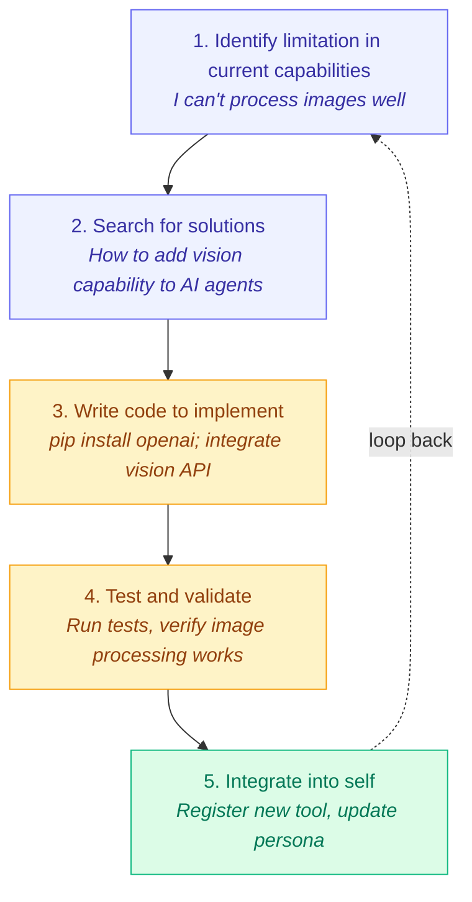

# Recursive Self-Building Agents: The CLI + Web Search Hypothesis

## The Hypothesis

> **Can an AI agent with only two capabilities—CLI execution and web search/scraping—recursively build anything that humanity can build?**

The question is about the minimal toolset for a general-purpose agent. This page analyzes it and maps each piece to what AgentOS ships.

---

## The Two Primitives

### 1. CLI Execution (Code Interpreter)

The ability to:
- Execute arbitrary shell commands
- Run code in any language (Python, Node.js, Rust, etc.)
- Read/write files on the filesystem
- Install packages and dependencies
- Start/stop services
- Query system state

In AgentOS this is the `shell_execute`, `file_read`, `file_write` and `list_directory` tools of the [`@framers/agentos-ext-cli-executor`](https://www.npmjs.com/package/@framers/agentos-ext-cli-executor) extension pack.

### 2. Web Search + Scraping (Information Gathering)

The ability to:
- Query search engines (Google, Bing, etc.)
- Navigate to URLs
- Extract content from web pages
- Click links and follow navigation
- Handle dynamic JavaScript-rendered content
- Parse structured data (tables, lists, etc.)

In AgentOS this is the [`@framers/agentos-ext-web-search`](https://www.npmjs.com/package/@framers/agentos-ext-web-search) and [`@framers/agentos-ext-web-browser`](https://www.npmjs.com/package/@framers/agentos-ext-web-browser) extension packs, with the scraper, content-extraction and browser-automation packs beside them in the curated registry.

---

## Theoretical Analysis: Is This Sufficient?

### The Church-Turing Thesis Argument

From a pure computation standpoint:

1. **CLI = Universal Computation**: A shell with access to compilers/interpreters can compute anything computable. This is Turing-complete.

2. **Web Search = Universal Knowledge Access**: The internet contains (or can generate via queries) essentially all human knowledge ever documented.

3. **Combined = Knowledge + Computation**: Together, these provide:
   - Access to all documented procedures (how to do anything)
   - Ability to execute those procedures
   - Feedback loops to verify results

**In theory, this is sufficient to build anything that can be specified in natural language.**

### The Practical Reality

However, several critical gaps exist:

#### Gap 1: Physical World Interface

```
❌ Cannot manipulate physical objects
❌ Cannot operate machinery
❌ Cannot perform experiments
❌ Cannot perceive the physical world (without cameras/sensors)
```

**Implication**: Can build software, but cannot build hardware or physical artifacts.

#### Gap 2: Real-Time Interaction

```
❌ Cannot have real-time voice conversations
❌ Cannot react to dynamic environments
❌ Cannot operate in time-critical scenarios
```

**Implication**: Best suited for asynchronous, deliberative tasks.

#### Gap 3: Security & Access Boundaries

```
❌ Many systems require authentication
❌ Paywalls block information
❌ Some knowledge is not on the internet
❌ Sensitive operations blocked by sandboxing
```

**Implication**: Limited by permissions and access.

#### Gap 4: Verification & Correctness

```
⚠️ How do you know the code works?
⚠️ How do you verify factual claims from web?
⚠️ How do you handle conflicting information?
⚠️ How do you detect hallucination vs reality?
```

**Implication**: Needs robust evaluation and testing.

---

## What CAN Be Built With CLI + Web Search

### ✅ Fully Achievable

| Category | Examples |
|----------|----------|
| **Software** | Web apps, APIs, CLI tools, mobile apps |
| **Documentation** | Technical docs, reports, analysis |
| **Research** | Literature reviews, data analysis |
| **Automation** | CI/CD pipelines, scripts, bots |
| **Content** | Articles, code tutorials, datasets |
| **Infrastructure** | Cloud deployments, Docker setups |

### ⚠️ Partially Achievable

| Category | Limitation |
|----------|------------|
| **Hardware Design** | Can design, cannot fabricate |
| **Physical Products** | Can spec, cannot manufacture |
| **Scientific Experiments** | Can plan, cannot execute physically |
| **Art/Music** | Can generate digital, not physical |

### ❌ Not Achievable

| Category | Reason |
|----------|--------|
| **Physical Construction** | No robotic arm |
| **Medical Procedures** | No physical intervention |
| **Agriculture** | No physical planting/harvesting |
| **Transportation** | No vehicle operation |

---

## Recursive Self-Improvement: The Meta-Capability

The most powerful aspect of this setup is **recursive self-improvement**:



**This is the key insight**: With CLI + Web, an agent can:
1. Discover it needs a new capability
2. Research how to implement it
3. Write the code
4. Test it
5. Install/enable it for itself

---

## Implementing This in AgentOS

### The extensions

Both primitives ship as extension packs. A runtime loads them from the manifest it is created with:

```typescript
import { AgentOS } from '@framers/agentos';
import { createCuratedManifest } from '@framers/agentos-extensions-registry';

// Loads the curated extensions that are installed, among them the CLI executor,
// web search and web browser packs.
const extensionManifest = await createCuratedManifest({ tools: 'all', channels: 'none' });

const agentos = await AgentOS.create({ extensionManifest });
```

A host that writes its own pack declares each tool as a descriptor whose `payload` is an `ITool` ([Extension & Guardrail Runtime](./ARCHITECTURE.md#extension--guardrail-runtime)).

### Autonomous loop

[`PlanningEngine.runAutonomousLoop()`](https://github.com/framerslab/agentos/blob/master/src/orchestration/planner/PlanningEngine.ts) pursues a goal step by step and yields its progress:

```typescript
const loop = planningEngine.runAutonomousLoop(
  'Build a real-time stock trading dashboard with React and WebSocket',
  {
    maxIterations: 100,
    goalConfidenceThreshold: 0.95,
    enableReflection: true,
    reflectionFrequency: 5,                          // Reflect every 5 steps
    requireApprovalFor: ['tool_call'],               // Plan action types that need approval
    onApprovalRequired: async (request) => hitlApprove(request), // Host's human-in-the-loop decision
  },
);

for await (const progress of loop) {
  console.log(progress.iteration, progress.currentStep, progress.goalConfidence);
}
```

`requireApprovalFor` takes plan action types (`tool_call`, `reasoning`, `information_gathering`, `subgoal`, `synthesis`, `validation`, `human_input`, `checkpoint`), not tool names.

---

## Pros and Cons

### Pros ✅

| Advantage | Explanation |
|-----------|-------------|
| **Minimal Primitives** | Only 2 core tools needed |
| **Turing Complete** | Can compute anything computable |
| **Self-Improving** | Can enhance own capabilities |
| **Knowledge Access** | All documented human knowledge available |
| **Reproducible** | Everything is code/commands that can be replayed |
| **Auditable** | Full trace of actions |

### Cons ❌

| Disadvantage | Explanation |
|--------------|-------------|
| **Security Risk** | CLI access is dangerous |
| **Physical Limit** | Cannot affect physical world |
| **Latency** | Web scraping is slow |
| **Reliability** | Web content changes, sites block scrapers |
| **Cost** | Many searches/scrapes = expensive |
| **Legal Issues** | Some scraping violates ToS |
| **Verification Gap** | Hard to verify correctness |
| **Hallucination Risk** | May generate plausible but wrong code |

---

## Critical Safety Considerations

### The Recursive Self-Improvement Risk

If an agent can modify its own code and tools, it could:

1. **Remove safety constraints** - Disable guardrails
2. **Escalate privileges** - Gain more system access
3. **Replicate uncontrollably** - Spawn copies of itself
4. **Acquire resources** - Use cloud APIs without authorization

### Mitigation Strategies

AgentOS provides these controls for a self-building agent; how strict each is, is the host's choice:

- **Guardrails the agent cannot change.** Guardrails are registered by the host on the runtime; no tool an agent forges or calls changes the guardrail pipeline ([Guardrails Usage](../safety/GUARDRAILS_USAGE.md)).
- **Approval for side effects.** With `hitl.enabled` on the tool orchestrator, a tool that declares `hasSideEffects` waits for a human approval before it runs ([Human-in-the-loop](../safety/HUMAN_IN_THE_LOOP.md)).
- **A ceiling for forged code.** `emergentConfig.capabilities` scopes what forged code may fetch and read, and `QuickJSExecutor` runs it in a WebAssembly instance of its own with a memory limit ([Emergent Capabilities](./EMERGENT_CAPABILITIES.md)).
- **Records.** Forge, promotion and removal decisions go to the emergent audit log, and capability calls under a ceiling to the effect records.

---

## Assessment

### Is the hypothesis right?

**Partially, with caveats.**

1. **For digital/software creation**: Yes, CLI + Web Search is theoretically sufficient. An intelligent enough agent with these tools could build any software, documentation, or digital artifact.

2. **For physical world impact**: No, without actuators (robotics, 3D printers, etc.), the agent cannot create physical things directly.

3. **For "everything of humanity"**: The statement is too broad. Humanity's achievements include physical structures (buildings, bridges), biological advances (medicine, agriculture), and social systems (governments, cultures) that cannot be directly created by software alone.

4. **The "intelligent enough" qualifier**: Everything rests on it. LLM agents are not reliable enough for fully autonomous recursive self-improvement. They:
   - Hallucinate
   - Lose coherence over long chains
   - Make logical errors
   - Lack true understanding

### What LLM agents achieve with these two tools

| Achievability | Examples |
|---------------|----------|
| **Highly Achievable** | Write code, fix bugs, create docs, build web apps |
| **Moderately Achievable** | Complex multi-step projects, research synthesis |
| **Marginally Achievable** | Self-improving tool creation (needs heavy supervision) |
| **Not achievable without supervision** | Fully autonomous recursive self-improvement |

---

## What AgentOS provides for each piece

| Piece | AgentOS |
|---|---|
| Shell, files, package managers | `@framers/agentos-ext-cli-executor` (`shell_execute`, `file_read`, `file_write`, `list_directory`) |
| Search and browsing | `@framers/agentos-ext-web-search`, `@framers/agentos-ext-web-browser`, the scraper and browser-automation packs |
| New tools at runtime | `forge_tool`: composition of existing tools, or agent-written JavaScript tested and judged before registration ([Emergent Capabilities](./EMERGENT_CAPABILITIES.md)) |
| Self-assessment | The `self_evaluate` tool and the emergent judge's confidence scores |
| Approval and audit | Tool-level human approval, the emergent audit log and effect records |

---

## Conclusion

The CLI + Web Search hypothesis is **directionally correct** for digital/software creation. These two primitives provide:

1. **Universal computation** (CLI)
2. **Universal knowledge** (Web)
3. **Recursive improvement** (CLI can modify code, Web finds how)

However, true "building everything of humanity" requires:
- Physical actuators
- More reliable reasoning
- Better verification mechanisms
- Stronger safety controls than a host can enforce on an agent


