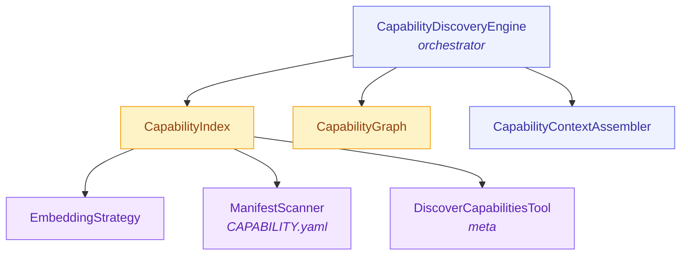

# Capability Discovery Engine

:::tip See also
For discovery architecture and integration points, see [Capability Discovery — Token-Efficient Tool Context](./DISCOVERY.md).
:::

> Semantic, tiered capability discovery that replaces static tool dumps with per-turn, token-budgeted context — cutting capability context by ~90% (from ~20,000 to ~1,850 tokens) while improving retrieval accuracy.

---

## Overview

Traditional agent frameworks dump every registered tool schema into the system prompt. At scale (20+ tools, 40 skills, 20 channels), this creates ~20,000 tokens of static context that the model must parse every turn — most of it irrelevant. Research calls this **context rot** (Chroma 2025): degrading output quality as irrelevant context accumulates.

The Capability Discovery Engine solves this with a **three-tier context model**:

| Tier | Budget | Content | When |
|------|--------|---------|------|
| **Tier 0** | ~150 tokens | Category summaries | Always in context |
| **Tier 1** | ~200 tokens | Top-5 capability summaries | Per-turn semantic retrieval |
| **Tier 2** | ~1,500 tokens | Full schema/content for top-2 | Per-turn deep pull |
| **Total** | **~1,850 tokens** | | |

Agents also get a meta-tool (`discover_capabilities`, ~80 tokens in tool list) for active search when passive tiers miss something.

---

## Architecture



**Per-turn data flow:**

```
User Message
  → CapabilityIndex.search()                // semantic vector search
  → CapabilityGraph.rerank()                // boost related capabilities via graph edges
  → CapabilityContextAssembler.assemble()   // token-budgeted tier assembly
  → CapabilityDiscoveryResult               // injected into prompt
```

| Component | Responsibility |
|-----------|---------------|
| `CapabilityDiscoveryEngine` | Top-level orchestrator — coordinates index, graph, and assembler |
| `CapabilityIndex` | Normalizes sources into `CapabilityDescriptor`; embeds and stores in vector index |
| `CapabilityGraph` | Graphology relationship graph (4 edge types); provides re-ranking boosts |
| `CapabilityContextAssembler` | Builds Tier 0/1/2 context within hard token budgets |
| `CapabilityEmbeddingStrategy` | Constructs intent-oriented embedding text per capability |
| `CapabilityManifestScanner` | Scans for `CAPABILITY.yaml` manifests; hot-reload via `fs.watch` |
| `createDiscoverCapabilitiesTool` | Factory for the `discover_capabilities` meta-tool |

---

## Three-Tier Context Model

### Tier 0 — Always in Context (~150 tokens)

Category summaries giving the model a high-level map. Regenerated only when capabilities change (version-tracked cache).

```
Available capability categories:
- Communication: telegram, discord, slack, whatsapp (+16 more) (20)
- Information: web-search, news-search, web-browser (3)
- Developer-tools: github, git, cli-executor (3)
Use discover_capabilities tool to get details on any capability.
```

### Tier 1 — Semantic Retrieval (~200 tokens)

Per-turn top-5 retrieval as compact summaries (~30-50 tokens each). Minimum relevance threshold: 0.3.

```
Relevant capabilities:
1. web-search (tool). Search the web for current information. Params: query, max_results
2. news-search (tool). Search news articles by keyword. Params: query, date_range
3. web-browser (tool). Browse a URL and extract content. Params: url, selector
4. github (skill). Use the GitHub CLI for issues, PRs, repos. Requires: gh
5. summarizer (skill). Summarize long documents into key points
```

### Tier 2 — Full Details (~1,500 tokens)

Full schema or SKILL.md content for the top-2 from Tier 1:

```
# Web Search
Kind: tool | Category: information

Search the web for current information using the Serper API.

## Input Schema
  query (string, required): The search query
  max_results (number): Maximum results to return (default: 5)
  search_type (string): Type of search [search|news|images] (default: "search")

Required secrets: SERPER_API_KEY
```

Token budgets are hard-enforced by the assembler using a ~4 chars/token heuristic.

---

## Source Normalization

`CapabilityIndex` normalizes five source types into unified `CapabilityDescriptor` objects:

| Source | ID Convention | Kind | Example |
|--------|--------------|------|---------|
| Tools (`ITool`) | `tool:{name}` | `tool` | `tool:web-search` |
| Skills (`SKILL.md`) | `skill:{name}` | `skill` | `skill:github` |
| Extensions (catalog) | `extension:{name}` | `extension` | `extension:giphy` |
| Channels (platform) | `channel:{platform}` | `channel` | `channel:telegram` |
| Manifests (CAPABILITY.yaml) | `{kind}:{name}` or custom | any | `tool:my-custom-tool` |

Each descriptor carries: `id`, `kind`, `name`, `displayName`, `description`, `category`, `tags`, `requiredSecrets`, `requiredTools`, `available`, `hasSideEffects`, and lazy-load fields `fullSchema` (Tier 2 tool schemas) and `fullContent` (Tier 2 skill content). A `sourceRef` discriminated union points back to the original source for on-demand loading.

Normalization is deterministic and runs during `initialize()`. Skills derive `displayName` by capitalizing name segments. Channels always get `category: 'communication'`. Extensions inherit availability from the catalog entry.

---

## Embedding Strategy

`CapabilityEmbeddingStrategy` constructs a concise text per capability (100-300 tokens) optimized for semantic matching against user intents. Informed by ToolLLM (NDCG@5 of 84.9 on 16K+ APIs) and MCP-RAG parameter-level decomposition.

| Field | Why | Example |
|-------|-----|---------|
| Name + display name | Exact-match queries | `"Web Search (web-search)"` |
| Description | Core semantic content | `"Search the web for current information"` |
| Category | Categorical queries | `"Category: information"` |
| Tags | Use-case queries | `"Use cases: search, api, news"` |
| Parameter names (tools) | Action queries | `"Parameters: query, max_results"` |
| Dependencies | Composition queries | `"Requires: gh, git"` |

Fields **not** embedded: `fullSchema`, `fullContent`, `requiredSecrets` — these are Tier 2 data loaded on demand to keep embedding text lean.

---

## Graph Relationships

`CapabilityGraph` uses [graphology](https://graphology.github.io/) (shared with `GraphRAGEngine`) for O(1) neighbor lookups and sub-millisecond traversal. All edges are built deterministically from metadata.

### Edge Types

| Edge Type | Source | Weight | Example |
|-----------|--------|--------|---------|
| `DEPENDS_ON` | `requiredTools` frontmatter | 1.0 | `skill:github` -> `tool:cli-executor` |
| `COMPOSED_WITH` | Preset co-occurrence | 0.5 | `tool:web-search` <-> `skill:summarizer` |
| `TAGGED_WITH` | Shared tags (>= 2 overlap) | 0.3/tag | `tool:news-search` <-> `tool:web-search` |
| `SAME_CATEGORY` | Same `kind:category` (2-8 group) | 0.1 | `tool:web-search` <-> `tool:web-browser` |

### Re-Ranking Algorithm

`CapabilityGraph.rerank()` runs after semantic search:

1. For each result, look up 1-hop graph neighbors.
2. If a neighbor is also in results, mutual boost: `score += graphBoostFactor * edgeWeight`.
3. If a neighbor is not in results but has `DEPENDS_ON` or `COMPOSED_WITH`, pull it in: `score = parentScore * graphBoostFactor * edgeWeight`.
4. Re-sort by score descending.

If a user asks about GitHub issues and `skill:github` ranks high, `tool:cli-executor` (its dependency) gets pulled in even without a direct query match.

---

## Meta-Tool: `discover_capabilities`

When passive tiers miss something, agents actively search via the `discover_capabilities` tool (~80 tokens in tool list):

```typescript
discover_capabilities({ query: "send a message on Discord", kind: "channel" })
// → { capabilities: [{ id: "channel:discord", relevance: 0.91, ... }], totalIndexed: 66 }
```

The tool runs through the same `discover()` pipeline and returns Tier 1 results. It is always included in `listDiscoveredTools()` output regardless of query relevance.

```typescript
import { createDiscoverCapabilitiesTool } from '@framers/agentos/discovery';
const metaTool = createDiscoverCapabilitiesTool(discoveryEngine);
toolOrchestrator.registerTool(metaTool);
```

---

## File-Based Discovery

Custom capabilities defined via `CAPABILITY.yaml`, scanned by `CapabilityManifestScanner`.

**Scan directories** (priority order):
1. `~/.agentos/capabilities/` (user-global)
2. `./.agentos/capabilities/` (workspace-local)
3. `$AGENTOS_CAPABILITY_DIRS` (env var, colon-separated)

**Directory structure:**
```
~/.agentos/capabilities/my-custom-tool/
  CAPABILITY.yaml   # required
  SKILL.md          # optional (loaded as fullContent)
  schema.json       # optional (loaded as fullSchema)
```

**CAPABILITY.yaml format:**
```yaml
id: tool:my-custom-tool
kind: tool
name: my-custom-tool
displayName: My Custom Tool
description: Searches a proprietary API for internal documents
category: information
tags: [search, internal, documents]
requiredSecrets: [INTERNAL_API_KEY]
hasSideEffects: false
inputSchema: { type: object, properties: { query: { type: string } } }
skillContent: ./SKILL.md
```

Required fields: `name`, `kind`, `description`. The `id` defaults to `${kind}:${name}`.

**Hot-reload** via `fs.watch` with debouncing (default 500ms):
```typescript
const scanner = new CapabilityManifestScanner();
scanner.watch(scanner.getDefaultDirs(), async (descriptors) => {
  await discoveryEngine.refreshIndex({ manifests: descriptors });
});
```

---

## Integration Points

**PromptBuilder** — render discovery result into system prompt text:
```typescript
const result = await discoveryEngine.discover(userMessage);
const contextText = discoveryEngine.renderForPrompt(result);
```

**ToolOrchestrator** — filter tool schemas to only discovered tools via `listDiscoveredTools()`:
```typescript
const toolSchemas = await toolOrchestrator.listDiscoveredTools(discoveryResult);
// Returns only Tier 1/2 tools + discover_capabilities meta-tool
```

**Chat runtime** — wire before prompt composition in the GMI loop:
```typescript
const discoveryResult = await discoveryEngine.discover(userMessage);
const tools = await toolOrchestrator.listDiscoveredTools(discoveryResult);
const capabilityContext = discoveryEngine.renderForPrompt(discoveryResult);
const prompt = promptBuilder.build({ capabilityContext, ...otherInputs });
const response = await provider.complete({ prompt, tools });
```

### AgentOS Turn Planner (Core Integration)

AgentOS now supports a first-class turn planner that runs before each GMI turn:

- Sets tool failure policy (`fail_open` or `fail_closed`)
- Applies dynamic tool selection (`discovered` or `all`)
- Injects discovery context into prompt metadata

Default behavior is success-rate optimized:

- `defaultToolFailureMode: "fail_open"`
- discovery enabled
- fallback to full toolset when discovery fails or yields no tool matches

```typescript
await agentos.initialize({
  // ...
  turnPlanning: {
    enabled: true,
    defaultToolFailureMode: 'fail_open',
    allowRequestOverrides: true,
    discovery: {
      enabled: true,
      autoInitializeEngine: true,
      registerMetaTool: true,
      onlyAvailable: true,
      defaultToolSelectionMode: 'discovered',
      includePromptContext: true,
      maxRetries: 1,
      retryBackoffMs: 150,
    },
  },
});
```

Per-request overrides can be provided via `options.customFlags`:

- `toolFailureMode`: `fail_open` | `fail_closed`
- `toolSelectionMode`: `all` | `discovered`
- `capabilityDiscoveryKind`: `tool` | `skill` | `extension` | `channel` | `any`

Runtime metadata updates now also include `executionLifecycle` transitions:

- `planned` -> `executing`
- `degraded` (if discovery fallback is applied in fail-open mode)
- `recovered` (optional, when turn completes successfully after degradation)
- `completed` or `errored`

AgentOS also emits `taskOutcome` in metadata updates at the end of each turn:

- `status`: `success` | `partial` | `failed`
- `score`: normalized score in `[0, 1]`
- `source`: `heuristic` or `request_override`

When task outcome telemetry is enabled (default), AgentOS also emits `taskOutcomeKpi`
as a rolling stream payload (windowed success stats):

- `scopeKey`: aggregation key (global / org / org+persona)
- `sampleCount`, `successCount`, `partialCount`, `failedCount`
- `successRate`
- `averageScore` / `weightedSuccessRate`

`taskOutcome` can be overridden per request via `options.customFlags`:

- `taskOutcome`: `success` | `partial` | `failed` | numeric `0..1`
- `taskSuccess`: boolean

Task outcome telemetry can be configured under `orchestratorConfig.taskOutcomeTelemetry`:

- `enabled` (default `true`)
- `rollingWindowSize` (default `100`)
- `scope`: `global` | `organization` | `organization_persona` (default)
- `emitAlerts` (default `true`)
- `alertBelowWeightedSuccessRate` (default `0.55`)
- `alertMinSamples` (default `8`)
- `alertCooldownMs` (default `60000`)

When alerting is enabled and KPI degrades, metadata updates include `taskOutcomeAlert`
with severity/reason/threshold/value so clients can trigger automated remediation.

To persist KPI windows across restarts, provide `taskOutcomeTelemetryStore` in
orchestrator dependencies. The store contract is:

- `loadWindows(): Promise<Record<string, TaskOutcomeKpiWindowEntry[]>>`
- `saveWindow(scopeKey, entries): Promise<void>`

AgentOS includes a built-in SQL implementation:

```ts
import { SqlTaskOutcomeTelemetryStore } from '@framers/agentos';

const taskOutcomeTelemetryStore = new SqlTaskOutcomeTelemetryStore({
  // Uses @framers/sql-storage-adapter resolution rules.
  priority: ['better-sqlite3', 'sqljs'],
  database: './data/agentos_task_outcomes.db',
});
```

Adaptive recovery can be configured under `orchestratorConfig.adaptiveExecution`:

- `enabled` (default `true`)
- `minSamples` (default `5`)
- `minWeightedSuccessRate` (default `0.7`)
- `forceAllToolsWhenDegraded` (default `true`)
- `forceFailOpenWhenDegraded` (default `true`)

When enabled, if rolling task KPI degrades below threshold, AgentOS can automatically
switch turn policy from `toolSelectionMode=discovered` to `toolSelectionMode=all` to
recover task success rate. It can also force `toolFailureMode=fail_open` unless the
request explicitly pinned `toolFailureMode=fail_closed` via `options.customFlags`.

---

## Configuration

```typescript
interface CapabilityDiscoveryConfig {
  tier0TokenBudget: number;     // Default: 200
  tier1TokenBudget: number;     // Default: 800
  tier2TokenBudget: number;     // Default: 2000
  tier1TopK: number;            // Default: 5
  tier2TopK: number;            // Default: 2
  tier1MinRelevance: number;    // Default: 0.3 (0-1 scale)
  useGraphReranking: boolean;   // Default: true
  collectionName: string;       // Default: 'capability_index'
  embeddingModelId?: string;    // Default: undefined (use system default)
  graphBoostFactor: number;     // Default: 0.15 (0-1 scale)
}
```

Override at construction time or per-query:
```typescript
const engine = new CapabilityDiscoveryEngine(embeddingManager, vectorStore, {
  tier1TopK: 8, tier2TopK: 3, graphBoostFactor: 0.2,
});

const result = await engine.discover("search the web", {
  config: { tier2TokenBudget: 3000 },
  kind: 'tool',
  onlyAvailable: true,
});
```

---

## Performance

| Metric | Value | Notes |
|--------|-------|-------|
| Index build (`initialize`) | ~3s | One-time; embedding API calls for ~100 capabilities |
| Per-turn `discover()` cold | ~50ms | Embedding generation for the query |
| Per-turn `discover()` warm | ~5ms | Embedding cache hit (LRU) |
| Graph re-ranking | <1ms | Sub-millisecond for ~100 nodes |
| Memory overhead | ~2MB | Descriptor map + graphology graph + embedding cache |
| Context tokens (static) | ~20,000 | All tools + skills + channels dumped |
| Context tokens (discovery) | ~1,850 | Tier 0 + Tier 1 + Tier 2 combined |
| Token reduction | **~90%** | 20,000 -> 1,850 |
| Meta-tool cost | ~80 tokens | `discover_capabilities` in tool list |

---

## Usage Example

```typescript
import {
  CapabilityDiscoveryEngine,
  CapabilityManifestScanner,
  createDiscoverCapabilitiesTool,
} from '@framers/agentos/discovery';

// Stand-ins. Replace each with the runtime-supplied instance you already
// have (embeddingManager / vectorStore from your memory wiring; the four
// catalog managers from your AgentOS instance).
declare const embeddingManager: any;
declare const vectorStore: any;
declare const toolOrchestrator: any;
declare const skillRegistry: any;
declare const extensionCatalog: any;
declare const channelRouter: any;

// --- Initialization (once at startup) ---

const engine = new CapabilityDiscoveryEngine(embeddingManager, vectorStore);
const scanner = new CapabilityManifestScanner();
const manifests = await scanner.scan();

await engine.initialize({
  tools: toolOrchestrator.getToolDescriptors(),
  skills: skillRegistry.getSkillEntries(),
  extensions: extensionCatalog.listAll(),
  channels: channelRouter.listPlatforms(),
  manifests,
});

toolOrchestrator.registerTool(createDiscoverCapabilitiesTool(engine));

scanner.watch(scanner.getDefaultDirs(), async (descs) => {
  await engine.refreshIndex({ manifests: descs });
});

console.log(engine.getStats());
// { capabilityCount: 66, graphNodes: 66, graphEdges: 142, indexVersion: 1 }

// --- Per-turn discovery (in GMI loop) ---

const discoveryResult = await engine.discover("Search the web for AI news and summarize it");
// discoveryResult.tokenEstimate.totalTokens ≈ 1,850

const tools = await toolOrchestrator.listDiscoveredTools(discoveryResult);
// tools.length ≈ 3 (web-search, news-search, discover_capabilities)

const capabilityContext = engine.renderForPrompt(discoveryResult);
// Inject into system prompt via PromptBuilder
```

---

## Source Files

All source lives in `packages/agentos/src/discovery/`:

| File | Export |
|------|--------|
| `types.ts` | All types, `DEFAULT_DISCOVERY_CONFIG` |
| `CapabilityDiscoveryEngine.ts` | `CapabilityDiscoveryEngine` |
| `CapabilityIndex.ts` | `CapabilityIndex` |
| `CapabilityGraph.ts` | `CapabilityGraph` |
| `CapabilityContextAssembler.ts` | `CapabilityContextAssembler` |
| `CapabilityEmbeddingStrategy.ts` | `CapabilityEmbeddingStrategy` |
| `CapabilityManifestScanner.ts` | `CapabilityManifestScanner` |
| `DiscoverCapabilitiesTool.ts` | `createDiscoverCapabilitiesTool()` |
| `index.ts` | Barrel re-exports for `@framers/agentos/discovery` |
