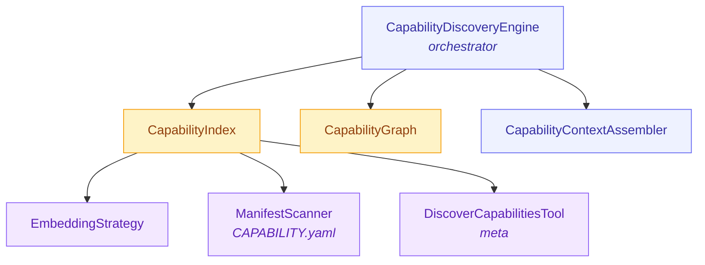

# Capability Discovery Engine

:::tip See also
For discovery architecture and integration points, see [Capability Discovery — Token-Efficient Tool Context](./DISCOVERY.md).
:::

> Semantic, tiered capability discovery that replaces a static dump of every tool schema with per-turn context held to token budgets (200 + 800 + 2,000 tokens at the defaults).

---

## Overview

Putting every registered tool schema into the system prompt grows the prompt with each tool, skill and channel, and the model reads all of it on every turn, most of it irrelevant to the turn. Research calls the quality loss that follows **context rot** (Chroma 2025).

The Capability Discovery Engine solves this with a **three-tier context model**:

| Tier | Default budget | Content | When |
|------|--------|---------|------|
| **Tier 0** | 200 tokens | Category summaries | Always in context |
| **Tier 1** | 800 tokens | Top-5 capability summaries | Per-turn semantic retrieval |
| **Tier 2** | 2,000 tokens | Full schema/content for top-2 | Per-turn deep pull |
| **Total** | **at most 3,000 tokens** | | |

The budgets, `tier1TopK` and `tier2TopK` are configurable ([Configuration](#configuration)). Agents also get a meta-tool, `discover_capabilities`, for active search when the passive tiers miss something.

---

## Architecture


```mermaid
flowchart TB
    Engine["CapabilityDiscoveryEngine<br/><i>orchestrator</i>"]:::process

    Index["CapabilityIndex"]:::data
    Graph["CapabilityGraph"]:::data
    Assembler["CapabilityContextAssembler"]:::process

    Embed["EmbeddingStrategy"]:::external
    Scanner["ManifestScanner<br/><i>CAPABILITY.yaml</i>"]:::external
    Tool["DiscoverCapabilitiesTool<br/><i>meta</i>"]:::external

    Engine --> Index
    Engine --> Graph
    Engine --> Assembler
    Index --> Embed
    Index --> Scanner
    Index --> Tool

    classDef process fill:#eef2ff,stroke:#6366f1,color:#3730a3
    classDef data fill:#fef3c7,stroke:#f59e0b,color:#92400e
    classDef external fill:#f3e8ff,stroke:#8b5cf6,color:#5b21b6
```

**Per-turn data flow:**

```
User Message
  → CapabilityIndex.search()                // semantic vector search
  → CapabilityGraph.rerank()                // boost related capabilities via graph edges
  → CapabilityContextAssembler.assemble()   // token-budgeted tier assembly
  → CapabilityDiscoveryResult               // injected into prompt
```

| Component | Responsibility |
|-----------|---------------|
| [`CapabilityDiscoveryEngine`](https://github.com/framerslab/agentos/blob/master/src/cognition/discovery/CapabilityDiscoveryEngine.ts) | Top-level orchestrator — coordinates index, graph, and assembler |
| [`CapabilityIndex`](https://github.com/framerslab/agentos/blob/master/src/cognition/discovery/CapabilityIndex.ts) | Normalizes sources into [`CapabilityDescriptor`](https://github.com/framerslab/agentos/blob/master/src/cognition/discovery/types.ts); embeds and stores in vector index |
| [`CapabilityGraph`](https://github.com/framerslab/agentos/blob/master/src/cognition/discovery/CapabilityGraph.ts) | Graphology relationship graph (4 edge types); provides re-ranking boosts |
| [`CapabilityContextAssembler`](https://github.com/framerslab/agentos/blob/master/src/cognition/discovery/CapabilityContextAssembler.ts) | Builds Tier 0/1/2 context within hard token budgets |
| [`CapabilityEmbeddingStrategy`](https://github.com/framerslab/agentos/blob/master/src/cognition/discovery/CapabilityEmbeddingStrategy.ts) | Constructs intent-oriented embedding text per capability |
| [`CapabilityManifestScanner`](https://github.com/framerslab/agentos/blob/master/src/cognition/discovery/CapabilityManifestScanner.ts) | Scans for `CAPABILITY.yaml` manifests; hot-reload via `fs.watch` |
| [`createDiscoverCapabilitiesTool`](https://github.com/framerslab/agentos/blob/master/src/cognition/discovery/DiscoverCapabilitiesTool.ts) | Factory for the `discover_capabilities` meta-tool |

---

## Three-Tier Context Model

### Tier 0 — Always in Context (200-token default budget)

Category summaries giving the model a high-level map. Regenerated only when capabilities change (version-tracked cache).

```
Available capability categories:
- Communication: telegram, discord, slack, whatsapp (+16 more) (20)
- Information: web-search, news-search, web-browser (3)
- Developer-tools: github, git, cli-executor (3)
Use discover_capabilities tool to get details on any capability.
```

### Tier 1 — Semantic Retrieval (800-token default budget)

Per-turn top-5 retrieval as compact summaries. Minimum relevance threshold: 0.3.

```
Relevant capabilities:
1. web-search (tool). Search the web for current information. Params: query, max_results
2. news-search (tool). Search news articles by keyword. Params: query, date_range
3. web-browser (tool). Browse a URL and extract content. Params: url, selector
4. github (skill). Use the GitHub CLI for issues, PRs, repos. Requires: gh
5. summarizer (skill). Summarize long documents into key points
```

### Tier 2 — Full Details (2,000-token default budget)

Full schema or SKILL.md content for the top-2 from Tier 1:

```
# Web Search
Kind: tool | Category: information

Search the web for current information using the Serper API.

## Input Schema
  query (string, required): The search query
  max_results (number): Maximum results to return (default: 5)
  search_type (string): Type of search [search|news|images] (default: "search")

Required secrets: SERPER_API_KEY
```

The assembler holds each tier to its budget, counting four characters as one token.

---

## Source Normalization

[`CapabilityIndex`](https://github.com/framerslab/agentos/blob/master/src/cognition/discovery/CapabilityIndex.ts) normalizes five source types into unified [`CapabilityDescriptor`](https://github.com/framerslab/agentos/blob/master/src/cognition/discovery/types.ts) objects:

| Source | ID Convention | Kind | Example |
|--------|--------------|------|---------|
| Tools ([`ITool`](https://github.com/framerslab/agentos/blob/master/src/core/tools/ITool.ts)) | `tool:{name}` | `tool` | `tool:web-search` |
| Skills (`SKILL.md`) | `skill:{name}` | `skill` | `skill:github` |
| Extensions (catalog) | `extension:{name}` | `extension` | `extension:giphy` |
| Channels (platform) | `channel:{platform}` | `channel` | `channel:telegram` |
| Manifests (CAPABILITY.yaml) | `{kind}:{name}` or custom | any | `tool:my-custom-tool` |

Each descriptor carries: `id`, `kind`, `name`, `displayName`, `description`, `category`, `tags`, `requiredSecrets`, `requiredTools`, `available`, `hasSideEffects`, and lazy-load fields `fullSchema` (Tier 2 tool schemas) and `fullContent` (Tier 2 skill content). A `sourceRef` discriminated union points back to the original source for on-demand loading.

Normalization is deterministic and runs during `initialize()`. Skills derive `displayName` by capitalizing name segments. Channels always get `category: 'communication'`. Extensions inherit availability from the catalog entry.

---

## Embedding Strategy

[`CapabilityEmbeddingStrategy`](https://github.com/framerslab/agentos/blob/master/src/cognition/discovery/CapabilityEmbeddingStrategy.ts) constructs a concise text per capability (100-300 tokens) optimized for semantic matching against user intents. Informed by ToolLLM (NDCG@5 of 84.9 on 16K+ APIs) and MCP-RAG parameter-level decomposition.

| Field | Why | Example |
|-------|-----|---------|
| Name + display name | Exact-match queries | `"Web Search (web-search)"` |
| Description | Core semantic content | `"Search the web for current information"` |
| Category | Categorical queries | `"Category: information"` |
| Tags | Use-case queries | `"Use cases: search, api, news"` |
| Parameter names (tools) | Action queries | `"Parameters: query, max_results"` |
| Dependencies | Composition queries | `"Requires: gh, git"` |

Fields **not** embedded: `fullSchema`, `fullContent`, `requiredSecrets` — these are Tier 2 data loaded on demand to keep embedding text lean.

---

## Graph Relationships

[`CapabilityGraph`](https://github.com/framerslab/agentos/blob/master/src/cognition/discovery/CapabilityGraph.ts) uses [graphology](https://graphology.github.io/) (shared with [`GraphRAGEngine`](https://github.com/framerslab/agentos/blob/master/src/cognition/memory/retrieval/graph/graphrag/GraphRAGEngine.ts)) for neighbor lookups. All edges are built deterministically from metadata.

### Edge Types

| Edge Type | Source | Weight | Example |
|-----------|--------|--------|---------|
| `DEPENDS_ON` | `requiredTools` frontmatter | 1.0 | `skill:github` -> `tool:cli-executor` |
| `COMPOSED_WITH` | Preset co-occurrence | 0.5 | `tool:web-search` <-> `skill:summarizer` |
| `TAGGED_WITH` | Shared tags (>= 2 overlap) | 0.3/tag | `tool:news-search` <-> `tool:web-search` |
| `SAME_CATEGORY` | Same `kind:category` (2-8 group) | 0.1 | `tool:web-search` <-> `tool:web-browser` |

### Re-Ranking Algorithm

`CapabilityGraph.rerank()` runs after semantic search:

1. For each result, look up 1-hop graph neighbors.
2. If a neighbor is also in results, mutual boost: `score += graphBoostFactor * edgeWeight`.
3. If a neighbor is not in results but has `DEPENDS_ON` or `COMPOSED_WITH`, pull it in: `score = parentScore * graphBoostFactor * edgeWeight`.
4. Re-sort by score descending.

If a user asks about GitHub issues and `skill:github` ranks high, `tool:cli-executor` (its dependency) gets pulled in even without a direct query match.

---

## Meta-Tool: `discover_capabilities`

When passive tiers miss something, agents actively search via the `discover_capabilities` tool:

```typescript
discover_capabilities({ query: "send a message on Discord", kind: "channel" })
// → { capabilities: [{ id: "channel:discord", relevance: 0.91, ... }], totalIndexed: 66 }
```

The tool runs through the same `discover()` pipeline and returns Tier 1 results. It is always included in `listDiscoveredTools()` output regardless of query relevance.

```typescript
import { createDiscoverCapabilitiesTool } from '@framers/agentos/discovery';
// With the tool orchestrator as the second argument, each result also says whether it is
// loadable at run time (an extension in the registry catalog that is not loaded yet) and its extensionId.
const metaTool = createDiscoverCapabilitiesTool(discoveryEngine, toolOrchestrator);
await toolOrchestrator.registerTool(metaTool);
```

---

## File-Based Discovery

Custom capabilities defined via `CAPABILITY.yaml`, scanned by [`CapabilityManifestScanner`](https://github.com/framerslab/agentos/blob/master/src/cognition/discovery/CapabilityManifestScanner.ts).

**Default scan directories** (`scanner.getDefaultDirs()`, in order; `scan(dirs)` takes your own list):
1. `~/.wunderland/capabilities/` (user-global)
2. `./.wunderland/capabilities/` (workspace-local)
3. `$WUNDERLAND_CAPABILITY_DIRS` (env var, colon-separated)

**Directory structure** (one folder per capability):
```
~/.wunderland/capabilities/my-custom-tool/
  CAPABILITY.yaml   # required (or CAPABILITY.yml)
  SKILL.md          # optional (loaded as fullContent when skillContent is not set)
  schema.json       # optional (loaded as fullSchema when inputSchema is not set)
```

**CAPABILITY.yaml format:**
```yaml
id: tool:my-custom-tool
kind: tool
name: my-custom-tool
displayName: My Custom Tool
description: Searches a proprietary API for internal documents
category: information
tags: [search, internal, documents]
requiredSecrets: [INTERNAL_API_KEY]
hasSideEffects: false
inputSchema: {"type": "object", "properties": {"query": {"type": "string"}}}
skillContent: ./SKILL.md
```

Required fields: `name`, `kind`, `description`; a manifest without one is skipped with a warning. The `id` defaults to `${kind}:${name}`, `displayName` to the name and `category` to `custom`. The scanner reads a simple YAML subset: scalars, lists (inline, or one indented `- item` per line), and objects written inline as JSON, so `inputSchema` is JSON on one line or lives in `schema.json`.

**Hot-reload** via `fs.watch` with debouncing (default 500ms):
```typescript
const scanner = new CapabilityManifestScanner();
scanner.watch(scanner.getDefaultDirs(), async (descriptors) => {
  await discoveryEngine.refreshIndex({ manifests: descriptors });
});
```

---

## Integration Points

**PromptBuilder** — render discovery result into system prompt text:
```typescript
const result = await discoveryEngine.discover(userMessage);
const contextText = discoveryEngine.renderForPrompt(result);
```

**ToolOrchestrator** — filter tool schemas to only discovered tools via `listDiscoveredTools()`:
```typescript
const toolSchemas = await toolOrchestrator.listDiscoveredTools(discoveryResult);
// Returns only Tier 1/2 tools + discover_capabilities meta-tool
```

**A host's own loop** — wire it before prompt composition (`promptBuilder` and `provider` stand for the host's own; the AgentOS runtime does this itself through the turn planner below):
```typescript
const discoveryResult = await discoveryEngine.discover(userMessage);
const tools = await toolOrchestrator.listDiscoveredTools(discoveryResult);
const capabilityContext = discoveryEngine.renderForPrompt(discoveryResult);
const prompt = promptBuilder.build({ capabilityContext, ...otherInputs });
const response = await provider.complete({ prompt, tools });
```

### AgentOS Turn Planner (Core Integration)

The AgentOS runtime runs a turn planner before each GMI turn:

- Sets tool failure policy (`fail_open` or `fail_closed`)
- Applies dynamic tool selection (`discovered` or `all`)
- Injects discovery context into prompt metadata

Defaults:

- `defaultToolFailureMode: "fail_open"`
- discovery enabled
- fallback to full toolset when discovery fails or yields no tool matches

With `autoInitializeEngine` (the default), the runtime builds the engine itself on an in-memory vector store: it indexes the runtime's tools, the loaded extension packs, the messaging channels, the curated registry's capability manifests and what `discovery.sources` adds (skills, manifests, extra extensions and channels), and registers the `discover_capabilities` and `load_capability_extension` tools unless `registerMetaTool` is `false`.

```typescript
await agentos.initialize({
  // ...
  turnPlanning: {
    enabled: true,
    defaultToolFailureMode: 'fail_open',
    allowRequestOverrides: true,
    discovery: {
      enabled: true,
      autoInitializeEngine: true,
      registerMetaTool: true,
      onlyAvailable: true,
      defaultToolSelectionMode: 'discovered',
      includePromptContext: true,
      maxRetries: 1,
      retryBackoffMs: 150,
    },
  },
});
```

Per-request overrides can be provided via `options.customFlags`:

- `toolFailureMode`: `fail_open` | `fail_closed`
- `toolSelectionMode`: `all` | `discovered`
- `capabilityDiscoveryKind`: `tool` | `skill` | `extension` | `channel` | `any`

Runtime metadata updates include `executionLifecycle` transitions:

- `planned` -> `executing`
- `degraded` (if discovery fallback is applied in fail-open mode)
- `recovered` (optional, when turn completes successfully after degradation)
- `completed` or `errored`

AgentOS also emits `taskOutcome` in metadata updates at the end of each turn:

- `status`: `success` | `partial` | `failed`
- `score`: normalized score in `[0, 1]`
- `source`: `heuristic` or `request_override`

When task outcome telemetry is enabled (default), AgentOS also emits `taskOutcomeKpi`
as a rolling stream payload (windowed success stats):

- `scopeKey`: aggregation key (global / org / org+persona)
- `sampleCount`, `successCount`, `partialCount`, `failedCount`
- `successRate`
- `averageScore` / `weightedSuccessRate`

`taskOutcome` can be overridden per request via `options.customFlags`:

- `taskOutcome`: `success` | `partial` | `failed` | numeric `0..1`
- `taskSuccess`: boolean

Task outcome telemetry can be configured under `orchestratorConfig.taskOutcomeTelemetry`:

- `enabled` (default `true`)
- `rollingWindowSize` (default `100`)
- `scope`: `global` | `organization` | `organization_persona` (default)
- `emitAlerts` (default `true`)
- `alertBelowWeightedSuccessRate` (default `0.55`)
- `alertMinSamples` (default `8`)
- `alertCooldownMs` (default `60000`)

When alerting is enabled and KPI degrades, metadata updates include `taskOutcomeAlert`
with severity/reason/threshold/value so clients can trigger automated remediation.

To persist KPI windows across restarts, set `AgentOSConfig.taskOutcomeTelemetryStore`
(the runtime passes it to the orchestrator). The store contract is:

- `loadWindows(): Promise<Record<string, TaskOutcomeKpiWindowEntry[]>>`
- `saveWindow(scopeKey, entries): Promise<void>`

AgentOS includes a built-in SQL implementation:

```ts
import { SqlTaskOutcomeTelemetryStore } from '@framers/agentos';

const taskOutcomeTelemetryStore = new SqlTaskOutcomeTelemetryStore({
  // @framers/sql-storage-adapter resolution options, plus an optional tableName
  // (default agentos_task_outcome_kpi_windows).
  priority: ['better-sqlite3', 'sqljs'],
  filePath: './data/agentos_task_outcomes.db',
});
```

Adaptive recovery can be configured under `orchestratorConfig.adaptiveExecution`:

- `enabled` (default `true`)
- `minSamples` (default `5`)
- `minWeightedSuccessRate` (default `0.7`)
- `forceAllToolsWhenDegraded` (default `true`)
- `forceFailOpenWhenDegraded` (default `true`)

When enabled, if rolling task KPI degrades below threshold, AgentOS can automatically
switch turn policy from `toolSelectionMode=discovered` to `toolSelectionMode=all` to
recover task success rate. It can also force `toolFailureMode=fail_open` unless the
request explicitly pinned `toolFailureMode=fail_closed` via `options.customFlags`.

---

## Configuration

```typescript
interface CapabilityDiscoveryConfig {
  tier0TokenBudget: number;     // Default: 200
  tier1TokenBudget: number;     // Default: 800
  tier2TokenBudget: number;     // Default: 2000
  tier1TopK: number;            // Default: 5
  tier2TopK: number;            // Default: 2
  tier1MinRelevance: number;    // Default: 0.3 (0-1 scale)
  useGraphReranking: boolean;   // Default: true
  collectionName: string;       // Default: 'capability_index'
  embeddingModelId?: string;    // Default: undefined (use system default)
  graphBoostFactor: number;     // Default: 0.15 (0-1 scale)
}
```

Override at construction time or per-query:
```typescript
const engine = new CapabilityDiscoveryEngine(embeddingManager, vectorStore, {
  tier1TopK: 8, tier2TopK: 3, graphBoostFactor: 0.2,
});

const result = await engine.discover("search the web", {
  config: { tier2TokenBudget: 3000 },
  kind: 'tool',
  onlyAvailable: true,
});
```

---

## Cost

- `initialize()` embeds every indexed capability once; `refreshIndex()` embeds and upserts the capabilities it is given, then rebuilds the graph.
- Each `discover()` embeds the query once, searches the vector store and re-ranks over the in-memory graph.
- The prompt context is held to the tier budgets: at most 3,000 tokens at the defaults, counted at four characters a token. The `discover_capabilities` schema adds one tool to the tool list.

---

## Usage Example

```typescript
import {
  CapabilityDiscoveryEngine,
  CapabilityManifestScanner,
  createDiscoverCapabilitiesTool,
  type CapabilityIndexSources,
} from '@framers/agentos/discovery';

// Stand-ins: an embedding manager and a vector store from your memory wiring,
// the runtime's tool orchestrator, and your catalog entries in the
// CapabilityIndexSources shape (tools, skills, extensions, channels).
declare const embeddingManager: any;
declare const vectorStore: any;
declare const toolOrchestrator: any;
declare const catalog: Omit<CapabilityIndexSources, 'manifests'>;

// --- Initialization (once at startup) ---

const engine = new CapabilityDiscoveryEngine(embeddingManager, vectorStore);
const scanner = new CapabilityManifestScanner();
const manifests = await scanner.scan();

await engine.initialize({ ...catalog, manifests });

await toolOrchestrator.registerTool(createDiscoverCapabilitiesTool(engine, toolOrchestrator));

scanner.watch(scanner.getDefaultDirs(), async (descs) => {
  await engine.refreshIndex({ manifests: descs });
});

console.log(engine.getStats());
// { capabilityCount, graphNodes, graphEdges, indexVersion }

// --- Per-turn discovery ---

const discoveryResult = await engine.discover('Search the web for AI news and summarize it');
// discoveryResult.tokenEstimate.totalTokens stays within the tier budgets

const tools = await toolOrchestrator.listDiscoveredTools(discoveryResult);
// the Tier 1/2 tools plus discover_capabilities

const capabilityContext = engine.renderForPrompt(discoveryResult);
// Inject into the system prompt
```

---

## Source Files

All source lives in `src/cognition/discovery/`:

| File | Export |
|------|--------|
| `types.ts` | All types, [`DEFAULT_DISCOVERY_CONFIG`](https://github.com/framerslab/agentos/blob/master/src/cognition/discovery/types.ts) |
| `CapabilityDiscoveryEngine.ts` | [`CapabilityDiscoveryEngine`](https://github.com/framerslab/agentos/blob/master/src/cognition/discovery/CapabilityDiscoveryEngine.ts) |
| `CapabilityIndex.ts` | [`CapabilityIndex`](https://github.com/framerslab/agentos/blob/master/src/cognition/discovery/CapabilityIndex.ts) |
| `CapabilityGraph.ts` | [`CapabilityGraph`](https://github.com/framerslab/agentos/blob/master/src/cognition/discovery/CapabilityGraph.ts) |
| `CapabilityContextAssembler.ts` | [`CapabilityContextAssembler`](https://github.com/framerslab/agentos/blob/master/src/cognition/discovery/CapabilityContextAssembler.ts) |
| `CapabilityEmbeddingStrategy.ts` | [`CapabilityEmbeddingStrategy`](https://github.com/framerslab/agentos/blob/master/src/cognition/discovery/CapabilityEmbeddingStrategy.ts) |
| `CapabilityManifestScanner.ts` | [`CapabilityManifestScanner`](https://github.com/framerslab/agentos/blob/master/src/cognition/discovery/CapabilityManifestScanner.ts) |
| `DiscoverCapabilitiesTool.ts` | `createDiscoverCapabilitiesTool()` |
| `index.ts` | Barrel re-exports for `@framers/agentos/discovery` |
