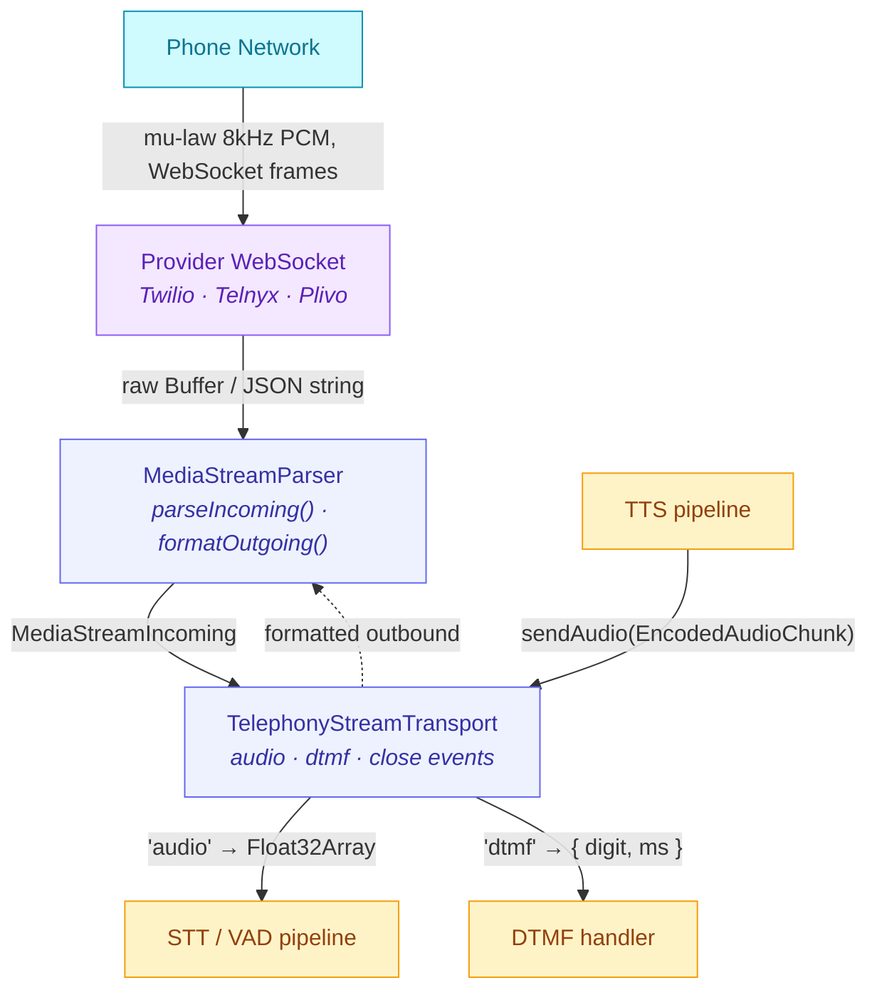

# Telephony Providers

The telephony layer connects AgentOS to phone calls. A provider places and ends calls through its REST API and verifies and parses its webhooks; [`CallManager`](https://github.com/framerslab/agentos/blob/master/src/io/channels/telephony/CallManager.ts) tracks each call's state; [`TelephonyStreamTransport`](https://github.com/framerslab/agentos/blob/master/src/io/channels/telephony/TelephonyStreamTransport.ts) carries a call's audio over the provider's WebSocket media stream, decoding caller audio to Float32 frames for VAD and STT and encoding outbound TTS audio to 8 kHz mu-law.

Three providers ship in [`src/io/channels/telephony/providers/`](https://github.com/framerslab/agentos/tree/master/src/io/channels/telephony/providers): **Twilio**, **Telnyx** and **Plivo**. Each implements [`IVoiceCallProvider`](https://github.com/framerslab/agentos/blob/master/src/io/channels/telephony/IVoiceCallProvider.ts). The package root and `@framers/agentos/io/channels/telephony` export them with `CallManager`, the transport, the media stream parsers and the XML helpers. A mock provider in the same folder backs the tests and is not exported.

---

## Table of Contents

1. [Overview](#overview)
2. [Provider Setup](#provider-setup)
   - [Twilio](#twilio)
   - [Telnyx](#telnyx)
   - [Plivo](#plivo)
3. [Placing a call](#placing-a-call)
4. [Call Modes](#call-modes)
5. [Webhook Configuration](#webhook-configuration)
6. [Inbound calls](#inbound-calls)
7. [DTMF Handling](#dtmf-handling)
8. [Media Stream Flow](#media-stream-flow)
9. [CallManager configuration](#callmanager-configuration)
10. [Wunderland CLI flags](#wunderland-cli-flags)

---

## Overview

| Layer | Purpose |
|---|---|
| [`IVoiceCallProvider`](https://github.com/framerslab/agentos/blob/master/src/io/channels/telephony/IVoiceCallProvider.ts) | Places and hangs up calls, verifies webhooks, parses webhook events |
| [`CallManager`](https://github.com/framerslab/agentos/blob/master/src/io/channels/telephony/CallManager.ts) | Registers providers, places calls, tracks each call's state, emits call events |
| [`TelephonyStreamTransport`](https://github.com/framerslab/agentos/blob/master/src/io/channels/telephony/TelephonyStreamTransport.ts) | Bridges a provider's WebSocket media stream to the voice pipeline |
| [`MediaStreamParser`](https://github.com/framerslab/agentos/blob/master/src/io/channels/telephony/MediaStreamParser.ts) (per provider) | Normalises provider-specific WebSocket frames |

---

## Provider Setup

The providers read no environment variables: the host passes each credential to the constructor. The variable names below are the ones the examples use.

### Twilio

1. Create a Twilio account and note the **Account SID** and **Auth Token** from the Console.
2. Buy or port a phone number with *Voice* capability.

```typescript
import { TwilioVoiceProvider } from '@framers/agentos';

const provider = new TwilioVoiceProvider({
  accountSid: process.env.TWILIO_ACCOUNT_SID!,
  authToken: process.env.TWILIO_AUTH_TOKEN!,
});
```

### Telnyx

1. Create a Telnyx account and generate an **API key** (Mission Control Portal → Auth → API Keys).
2. Buy a phone number and assign it to a TeXML or Call Control application; its id is the `connectionId`.
3. Copy the account's Ed25519 **public key** for webhook verification.

```typescript
import { TelnyxVoiceProvider } from '@framers/agentos';

const provider = new TelnyxVoiceProvider({
  apiKey: process.env.TELNYX_API_KEY!,
  connectionId: process.env.TELNYX_CONNECTION_ID!,
  publicKey: process.env.TELNYX_PUBLIC_KEY!, // without publicKey, verifyWebhook() accepts every webhook
});
```

### Plivo

1. Create a Plivo account and note the **Auth ID** and **Auth Token** from the Console.
2. Buy or rent a phone number with *Voice* capability.

```typescript
import { PlivoVoiceProvider } from '@framers/agentos';

const provider = new PlivoVoiceProvider({
  authId: process.env.PLIVO_AUTH_ID!,
  authToken: process.env.PLIVO_AUTH_TOKEN!,
});
```

No provider takes a caller number. The number a call is placed from comes from the `CallManager` configuration (`provider.config.fromNumber`) or from the call itself.

---

## Placing a call

```typescript
import { CallManager, TwilioVoiceProvider } from '@framers/agentos';

const manager = new CallManager({
  provider: {
    provider: 'twilio',
    config: {
      accountSid: process.env.TWILIO_ACCOUNT_SID!,
      authToken: process.env.TWILIO_AUTH_TOKEN!,
      fromNumber: '+15551234567',
    },
  },
  webhookBaseUrl: 'https://your-domain.com',
  streaming: { enabled: true, wsPath: '/voice/media-stream' },
});
manager.registerProvider(
  new TwilioVoiceProvider({
    accountSid: process.env.TWILIO_ACCOUNT_SID!,
    authToken: process.env.TWILIO_AUTH_TOKEN!,
  }),
);

const call = await manager.initiateCall({ toNumber: '+15550001234', mode: 'conversation' });
console.log(call.callId, call.state); // 'failed' or 'error', with call.errorMessage, when the call was not placed
```

`initiateCall()` uses the provider registered under the configured name (or `providerName`), the configured `fromNumber` unless the call names one, and the configured `defaultMode` (`'conversation'` when unset) unless the call names one. A provider that refuses the call leaves the record in the `failed` state, and one that throws leaves it in the `error` state; both emit `call:error`.

---

## Call Modes

A call record carries one of two modes:

| Mode | Meaning |
|---|---|
| `conversation` | Full duplex: caller audio to STT, the agent's reply to TTS, over a media stream |
| `notify` | Speak a message and hang up |

The providers do not act on the mode. Each one sends its API the destination, the caller number and the webhook URL (Twilio also the status callback URL); the mode, the message, the TTS voice and the media stream URL are not sent. When a Twilio or Plivo call connects, the provider requests the webhook URL, and the host's route answers with the XML for the mode, built with the helpers in [`twiml.ts`](https://github.com/framerslab/agentos/blob/master/src/io/channels/telephony/twiml.ts):

```typescript
import { twilioConversationTwiml, twilioNotifyTwiml } from '@framers/agentos';

// conversation: open a media stream back to your server
const streamXml = twilioConversationTwiml('wss://your-domain.com/voice/media-stream', call.callId);

// notify: speak and hang up
const notifyXml = twilioNotifyTwiml('Your order has shipped.');
```

`plivoStreamXml(streamUrl)` and `plivoNotifyXml(text, voice?)` build the same two answers for Plivo.

A Telnyx call goes through Telnyx's Call Control API, which posts the call's events (`call.initiated`, `call.answered`, `call.hangup` and the others) to the webhook URL and takes [commands](https://developers.telnyx.com/docs/voice/programmable-voice/voice-api-fundamentals) that control the call. AgentOS sends no command when a Telnyx call connects. For a conversation, the host starts the media stream after `call.answered` with Telnyx's [`streaming_start`](https://developers.telnyx.com/api-reference/call-commands/streaming-start) command. For a notify call, it speaks the message with `TelnyxVoiceProvider.playTts({ providerCallId, text, voice })`, which sends the `speak` command (voice `female` unless one is given, language `en-US`) and does not hang up. `telnyxStreamXml(streamUrl)` returns `<Response><Stream url="…" /></Response>`, and there is no Telnyx notify helper.

---

## Webhook Configuration

`CallManager` gives each call two URLs under `webhookBaseUrl` (`http://localhost:3000` when unset):

```
<webhookBaseUrl>/voice/webhook/<provider>   answer URL: the provider requests it when the call connects
<webhookBaseUrl>/voice/status/<provider>    status callback (sent to Twilio)
```

The host serves those routes on its own HTTP server. A status or event webhook goes to `manager.processWebhook(providerName, { method, url, headers, body })`, which verifies it, parses its events and applies them to the call they name. AgentOS ships no webhook server.

### Signature verification

All three providers sign their webhook payloads:

| Provider | Algorithm | Headers |
|---|---|---|
| Twilio | HMAC-SHA1 over the URL and the form params sorted by key | `x-twilio-signature` |
| Telnyx | Ed25519 over the timestamp and the raw body; a timestamp more than 300 seconds old is rejected | `telnyx-signature-ed25519`, `telnyx-timestamp` |
| Plivo | HMAC-SHA256 (V3) over the URL, its query, the sorted form params and the nonce | `x-plivo-signature-v3` or `x-plivo-signature-ma-v3`, `x-plivo-signature-v3-nonce` |

`CallManager.processWebhook()` calls the provider's `verifyWebhook()` before it parses any event, and drops a webhook that fails. A Telnyx provider constructed without `publicKey` skips the check and accepts every webhook, so anyone who can reach the webhook URL can post call events to `CallManager`; pass the key outside local development. `webhookToleranceSec` (300 by default, 0 turns it off) sets the timestamp window.

### Provider console settings

With `webhookBaseUrl` set to `https://your-domain.com`:

**Twilio**: phone number → Voice Configuration: "A call comes in" → `https://your-domain.com/voice/webhook/twilio`; "Call Status Changes" → `https://your-domain.com/voice/status/twilio`.

**Telnyx**: the application's webhook URL → `https://your-domain.com/voice/webhook/telnyx`.

**Plivo**: the application's "Answer URL" → `https://your-domain.com/voice/webhook/plivo`; "Hangup URL" → `https://your-domain.com/voice/status/plivo`.

---

## Inbound calls

`processWebhook()` applies events only to calls the manager knows; an event for an unknown call is logged and dropped. For an inbound call, the host's answer route registers the call first:

```typescript
const record = manager.handleInboundCall({
  providerCallId: 'CA123',          // the provider's call id from the webhook
  provider: 'twilio',
  fromNumber: '+15550001111',
  toNumber: '+15551234567',
});
// null: the inbound policy refused the caller
```

`inboundPolicy` decides: `'disabled'` (the default) refuses every call, `'allowlist'` accepts the numbers in `allowedNumbers`, and `'pairing'` and `'open'` accept every number. An accepted call starts in the `ringing` state in `conversation` mode and emits `call:ringing`.

---

## DTMF Handling

Key presses reach `CallManager` as `call-dtmf` webhook events (Twilio `<Gather>`, Telnyx call events, Plivo `<GetDigits>`) and come out as `call:dtmf`:

```typescript
manager.on((event) => {
  if (event.type === 'call:dtmf') {
    const { digit, durationMs } = event.data as { digit: string; durationMs?: number };
    console.log(`Caller pressed: ${digit}`);
  }
});
```

A DTMF event does not change the call's state. On a Twilio media stream, [`TelephonyStreamTransport`](https://github.com/framerslab/agentos/blob/master/src/io/channels/telephony/TelephonyStreamTransport.ts) also emits `dtmf` with the key-hold duration; the Telnyx and Plivo parsers produce no DTMF events, and their webhooks carry no duration.

```typescript
transport.on('dtmf', ({ digit, durationMs }) => {
  // a key press during a Twilio media stream
});
```

---

## Media Stream Flow

The following diagram shows the path of inbound audio (phone → pipeline) and
outbound TTS audio (pipeline → phone) for a `conversation` mode call.



**Inbound path (phone → pipeline)**

1. Provider delivers a WebSocket frame (JSON string or binary Buffer).
2. `MediaStreamParser.parseIncoming()` normalises it to a [`MediaStreamIncoming`](https://github.com/framerslab/agentos/blob/master/src/io/channels/telephony/MediaStreamParser.ts)
   discriminated union (`start | audio | dtmf | stop | mark`).
3. `audio` events: mu-law 8 kHz → Int16 PCM → resampled to the transport's `outputSampleRate` (16 kHz unless the constructor's config sets another) → Float32.
4. The [`AudioFrame`](https://github.com/framerslab/agentos/blob/master/src/io/voice-pipeline/types.ts) is emitted from the transport for VAD / STT consumption.

**Outbound path (pipeline → phone)**

1. TTS pipeline produces an [`EncodedAudioChunk`](https://github.com/framerslab/agentos/blob/master/src/io/voice-pipeline/types.ts) (PCM Int16 at pipeline sample rate).
2. `TelephonyStreamTransport.sendAudio()` resamples it to 8 kHz.
3. PCM is mu-law encoded.
4. `MediaStreamParser.formatOutgoing()` wraps it in the provider envelope (e.g., Twilio JSON).
5. The formatted payload is sent over the WebSocket.

---

## CallManager configuration

[`VoiceCallConfig`](https://github.com/framerslab/agentos/blob/master/src/io/channels/telephony/types.ts) is the `CallManager` constructor's argument:

| Field | Type | Used for |
|---|---|---|
| `provider` | `{ provider: 'twilio' \| 'telnyx' \| 'plivo' \| 'mock', config }` | The default provider's name and, in `config.fromNumber`, the default caller number |
| `webhookBaseUrl` | `string` | Base of the webhook, status and media stream URLs (`http://localhost:3000` when unset) |
| `defaultMode` | `'conversation' \| 'notify'` | Mode of a call that names none (`'conversation'` when unset) |
| `inboundPolicy` | `'disabled' \| 'allowlist' \| 'pairing' \| 'open'` | `handleInboundCall()` (see [Inbound calls](#inbound-calls)) |
| `allowedNumbers` | `string[]` | The `'allowlist'` policy |
| `streaming.enabled`, `streaming.wsPath` | `boolean`, `string` | With `streaming.enabled` true, each call is passed a media stream URL: `webhookBaseUrl` with `http` replaced by `ws`, plus `wsPath` (`/voice/media-stream` by default). `wsPath` alone passes none. No provider sends it |
| `tts.voice` | `string` | Passed with each call; no provider sends it |

`tts.provider`, `tts.speed`, `tts.options`, `stt` and `maxDurationSeconds` are part of the type and are not read.

---

## Wunderland CLI flags

The [`wunderland`](https://wunderland.sh) CLI (`npm install -g @framers/wunderland`) starts a local voice WebSocket server from `wunderland chat`:

| Flag | Type | Description |
|---|---|---|
| `--voice` | boolean | Start the local voice pipeline WebSocket server |
| `--voice-stt=<id>` | string | STT provider (e.g. `deepgram`, `whisper-chunked`) |
| `--voice-tts=<id>` | string | TTS provider (e.g. `openai`, `elevenlabs`) |
| `--voice-endpointing=<strategy>` | string | `acoustic`, `heuristic` or `semantic` |
| `--voice-diarization` | boolean | Speaker diarization |
| `--voice-barge-in=<mode>` | string | `hard-cut`, `soft-fade` or `disabled` |
| `--voice-port=<n>` | number | WebSocket server port (`0` = OS-assigned) |

`wunderland chat` also accepts `--telephony-provider`, `--telephony-webhook-port`, `--telephony-webhook-host` and `--telephony-webhook-path`, parses them and does not use them: no telephony webhook server starts.
