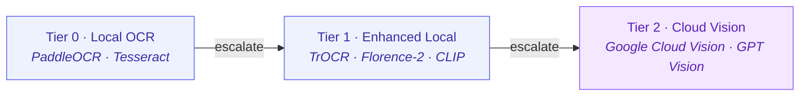

# Vision Pipeline — OCR, Image Understanding & CLIP Embeddings

> A 3-tier progressive enhancement pipeline for extracting text, understanding images, and generating visual embeddings.

---

## Table of Contents

1. [Overview](#overview)
2. [Quick Start](#quick-start)
3. [Architecture](#architecture)
4. [Three-Tier Progressive Enhancement](#three-tier-progressive-enhancement)
5. [Processing Strategies](#processing-strategies)
6. [Content Detection](#content-detection)
7. [CLIP Embeddings](#clip-embeddings)
8. [Integration with Multimodal RAG](#integration-with-multimodal-rag)
9. [VisionPipeline API Reference](#visionpipeline-api-reference)
10. [createVisionPipeline() Options](#createvisionpipeline-options)
11. [VisionResult Shape](#visionresult-shape)
12. [Installation](#installation)
13. [Provider Configuration](#provider-configuration)
14. [Examples](#examples)
15. [Related Documentation](#related-documentation)

---

## Overview

The Vision Pipeline provides a unified interface for extracting text, detecting
content types, and generating embeddings from images. It uses a tiered
architecture that automatically selects the best available provider, from
lightweight local OCR to high-accuracy cloud vision APIs.

**Key capabilities:**

| Capability | Description |
|------------|-------------|
| **OCR** | Extract printed and handwritten text from images |
| **Document Layout** | Detect headers, paragraphs, tables, figures |
| **Image Description** | Generate natural-language descriptions |
| **Content Classification** | Identify content type (printed, handwritten, document, photo) |
| **CLIP Embeddings** | Generate 512-d vectors for semantic image search |
| **Region Detection** | Locate text regions with bounding boxes and confidence |

---

## Quick Start

```typescript
import { createVisionPipeline } from '@framers/agentos';
import { readFileSync } from 'node:fs';

// Create a pipeline with progressive strategy (local-first, cloud fallback)
const vision = await createVisionPipeline({ strategy: 'progressive' });

// Process an image
const image = readFileSync('./document.png');
const result = await vision.process(image);

console.log(result.text);            // Extracted text content
console.log(result.confidence);      // Overall confidence (0.0–1.0)
console.log(result.contentType);     // 'printed' | 'handwritten' | 'document-layout' | 'photograph'
console.log(result.regions);         // Array of detected text regions with bounding boxes
console.log(result.tierBreakdown);   // Which tiers ran and their timing
```

### Programmatic

```typescript
// Extract text from an image
const ocrResult = await vision.ocr(imageBuffer);

// Describe an image
const description = await vision.describe(imageBuffer);

// Generate a CLIP embedding
const embedResult = await vision.embed(imageBuffer);
```

---

## Architecture

The pipeline uses a 3-tier progressive enhancement model. Each tier represents
a different level of capability and cost:



The pipeline dispatches to available tiers based on the chosen strategy, falling back gracefully when a tier is unavailable or fails.

---

## Three-Tier Progressive Enhancement

### Tier 0 — Local OCR (Lightweight)

The fastest tier, optimized for printed text. Zero cloud dependency.

| Provider | Install | Strengths |
|----------|---------|-----------|
| **PaddleOCR** | `npm install ppu-paddle-ocr` | SOTA accuracy for printed text, fast inference |
| **Tesseract.js** | `npm install tesseract.js` | 100+ languages, widely supported, pure JS |

Tier 0 runs first in the `progressive` strategy. If confidence is high enough
(default threshold: `0.85`), higher tiers are skipped.

```typescript
const vision = await createVisionPipeline({
  strategy: 'local-only',
  tier0: {
    provider: 'paddle-ocr',    // 'paddle-ocr' | 'tesseract'
    confidenceThreshold: 0.85,
    languages: ['en'],          // Tesseract language codes
  },
});
```

### Tier 1 — Enhanced Local (Transformers)

Uses `@huggingface/transformers` (already included in AgentOS) for
capabilities beyond basic OCR:

| Model | Purpose |
|-------|---------|
| **TrOCR** | Handwriting recognition — outperforms Tesseract on cursive/informal text |
| **Florence-2** | Document layout understanding — headers, tables, figures, reading order |
| **CLIP** | Image embeddings for semantic search — 512-dimensional vectors |

Tier 1 activates when Tier 0 confidence is below threshold or when the
content type requires it (e.g., handwritten text, document layout analysis).

```typescript
const vision = await createVisionPipeline({
  strategy: 'progressive',
  tier1: {
    enableTrOCR: true,           // Handwriting recognition
    enableFlorence2: true,       // Document layout
    enableCLIP: true,            // Image embeddings
    modelCacheDir: '~/.cache/huggingface',
  },
});
```

### Tier 2 — Cloud Vision (Highest Accuracy)

Cloud APIs provide the highest accuracy and broadest capability set.

| Provider | Env Var | Strengths |
|----------|---------|-----------|
| **Google Cloud Vision** | `GOOGLE_CLOUD_VISION_KEY` | Document AI, handwriting, 100+ languages |
| **OpenAI GPT Vision** | `OPENAI_API_KEY` | Image understanding, description, reasoning |
| **Anthropic Vision** | `ANTHROPIC_API_KEY` | Detailed analysis, document comprehension |

Tier 2 is used as the final fallback in `progressive` strategy, or exclusively
in `cloud-only` strategy.

```typescript
const vision = await createVisionPipeline({
  strategy: 'progressive',
  tier2: {
    provider: 'google-cloud-vision',  // 'google-cloud-vision' | 'openai' | 'anthropic'
    maxCostPerRequest: 0.02,          // Budget cap per image (USD)
  },
});
```

---

## Processing Strategies

Four strategies control how tiers are orchestrated:

### `progressive` (Default)

Starts at Tier 0, escalates to higher tiers only when confidence is below
threshold. Optimal cost/quality tradeoff.

```typescript
const vision = await createVisionPipeline({ strategy: 'progressive' });
// Tier 0 → if low confidence → Tier 1 → if still low → Tier 2
```

### `local-only`

Never calls cloud APIs. Uses only Tier 0 and Tier 1. Suitable for
air-gapped environments, privacy-sensitive content, or cost elimination.

```typescript
const vision = await createVisionPipeline({ strategy: 'local-only' });
// Tier 0 → Tier 1 (never Tier 2)
```

### `cloud-only`

Skips local processing entirely and sends directly to cloud APIs. Best when
accuracy is paramount and latency/cost are acceptable.

```typescript
const vision = await createVisionPipeline({ strategy: 'cloud-only' });
// Tier 2 only
```

### `parallel`

Runs all available tiers simultaneously and merges results. Highest accuracy
but also highest resource usage. Useful for critical document processing.

```typescript
const vision = await createVisionPipeline({ strategy: 'parallel' });
// Tier 0 + Tier 1 + Tier 2 in parallel → merge best results
```

---

## Content Detection

The pipeline automatically classifies the type of visual content to route
processing appropriately:

| Content Type | Description | Best Tier |
|-------------|-------------|-----------|
| `printed` | Machine-printed text (documents, signs, screenshots) | Tier 0 (PaddleOCR) |
| `handwritten` | Handwritten or cursive text | Tier 1 (TrOCR) |
| `document-layout` | Structured documents with headers, tables, figures | Tier 1 (Florence-2) |
| `photograph` | Natural photographs (people, scenes, objects) | Tier 2 (GPT/Cloud Vision) |

Content detection runs as a lightweight pre-processing step using CLIP
zero-shot classification. You can also force a content type:

```typescript
const result = await vision.process(image, {
  contentType: 'handwritten',  // Skip auto-detection, go directly to TrOCR
});
```

---

## CLIP Embeddings

Generate 512-dimensional embedding vectors for semantic image search and
retrieval. CLIP embeddings enable cross-modal search (find images by text
description and vice versa).

```typescript
import { createVisionPipeline } from '@framers/agentos';

const vision = await createVisionPipeline({
  strategy: 'local-only',
  tier1: { enableCLIP: true },
});

// Generate an embedding vector
const result = await vision.embed(imageBuffer);
console.log(result.embedding);     // Float32Array(512)
console.log(result.model);         // 'clip-vit-base-patch32'

// Use with vector stores for image search
import { HnswlibVectorStore } from '@framers/agentos';

const store = new HnswlibVectorStore({
  id: 'image-index',
  type: 'hnsw',
  dimension: 512,
});
await store.initialize();
await store.upsert({ id: 'img-1', vector: result.embedding, metadata: { path: './photo.jpg' } });

// Search by text
const textEmbedding = await vision.embedText('a sunset over the ocean');
const matches = await store.query(textEmbedding, { topK: 5 });
```

---

## Integration with Multimodal RAG

The vision pipeline integrates directly with the [Multimodal RAG](./MULTIMODAL_RAG.md)
system for indexing and retrieving image content. Configure RAG via the
`rag` field on `agent({ ... })` — its shape is the [`RagConfig`](https://github.com/framerslab/agentos/blob/master/src/api/types.ts#L97) interface, with `multimodal.images` toggling image indexing.

```typescript
import { agent } from '@framers/agentos';

const myAgent = agent({
  provider: 'openai',
  rag: {
    multimodal: { images: true, audio: false },
    vectorStore: { provider: 'hnswlib', embeddingModel: 'clip-vit-base-patch32' },
    topK: 5,
  },
});

// The agent can now answer questions about images in its indexed corpus
const result = await myAgent.generate('What did the receipt from yesterday say?');
console.log(result.text);
```

For richer indexing pipelines (auto-describe on ingest, multi-modal embedding fusion),
see the lower-level [Multimodal RAG guide](./MULTIMODAL_RAG.md) — it shows the
[`VisionPipeline`](https://github.com/framerslab/agentos/blob/master/src/io/vision/VisionPipeline.ts) + [`IngestRouter`](https://github.com/framerslab/agentos/blob/master/src/orchestration/pipeline/ingest/IngestRouter.ts) wiring directly, without going through the
high-level `agent()` helper.

---

## VisionPipeline API Reference

### Methods

| Method | Signature | Description |
|--------|-----------|-------------|
| `process()` | `(image: Buffer, options?) => Promise<VisionResult>` | Full processing: OCR + content detection + layout |
| `ocr()` | `(image: Buffer, options?) => Promise<OcrResult>` | Text extraction only |
| `describe()` | `(image: Buffer, options?) => Promise<DescribeResult>` | Natural-language image description |
| `embed()` | `(image: Buffer) => Promise<EmbedResult>` | CLIP embedding vector |
| `embedText()` | `(text: string) => Promise<Float32Array>` | Text embedding (same CLIP space) |
| `detectContent()` | `(image: Buffer) => Promise<ContentType>` | Content type classification |
| `dispose()` | `() => Promise<void>` | Release model resources |

---

## createVisionPipeline() Options

```typescript
interface VisionPipelineOptions {
  /** Processing strategy. Default: 'progressive'. */
  strategy: 'progressive' | 'local-only' | 'cloud-only' | 'parallel';

  /** Tier 0 configuration (local OCR). */
  tier0?: {
    provider?: 'paddle-ocr' | 'tesseract';
    confidenceThreshold?: number;   // Default: 0.85
    languages?: string[];           // Default: ['en']
  };

  /** Tier 1 configuration (enhanced local). */
  tier1?: {
    enableTrOCR?: boolean;          // Default: true
    enableFlorence2?: boolean;      // Default: true
    enableCLIP?: boolean;           // Default: true
    modelCacheDir?: string;         // Default: ~/.cache/huggingface
  };

  /** Tier 2 configuration (cloud vision). */
  tier2?: {
    provider?: 'google-cloud-vision' | 'openai' | 'anthropic';
    maxCostPerRequest?: number;     // Budget cap in USD
  };

  /** Global options. */
  maxImageSize?: number;            // Max dimension in pixels (auto-resize). Default: 4096
  timeout?: number;                 // Per-tier timeout in ms. Default: 30000
  enableRegionDetection?: boolean;  // Bounding boxes for text regions. Default: true
}
```

---

## VisionResult Shape

```typescript
interface VisionResult {
  /** Extracted text content (all tiers merged). */
  text: string;

  /** Overall confidence score (0.0–1.0). */
  confidence: number;

  /** Detected content type. */
  contentType: 'printed' | 'handwritten' | 'document-layout' | 'photograph';

  /** Detected text regions with bounding boxes and per-region confidence. */
  regions: VisionRegion[];

  /** Document layout elements (headers, paragraphs, tables, figures). */
  layout?: LayoutElement[];

  /** Natural-language description of the image (if Tier 2 ran). */
  description?: string;

  /** CLIP embedding vector (if enabled). */
  embedding?: Float32Array;

  /** Breakdown of which tiers ran and their timing. */
  tierBreakdown: TierReport[];
}

interface VisionRegion {
  text: string;
  confidence: number;
  bbox: { x: number; y: number; width: number; height: number };
  tier: 0 | 1 | 2;
}

interface TierReport {
  tier: 0 | 1 | 2;
  provider: string;
  durationMs: number;
  confidence: number;
  skipped: boolean;
  skipReason?: string;
}
```

---

## Installation

The vision pipeline works out of the box with `@huggingface/transformers`
(bundled with AgentOS). Install optional providers for better results:

```bash
# Tier 0: Local OCR providers (install one or both)
npm install ppu-paddle-ocr          # SOTA OCR for printed text (~50 MB)
npm install tesseract.js            # Fallback OCR, 100+ languages (~15 MB)

# Tier 1: Already included via @huggingface/transformers
# TrOCR, Florence-2, and CLIP models are downloaded on first use (~200 MB each)

# Tier 2: Cloud providers — just set environment variables
export GOOGLE_CLOUD_VISION_KEY=your-key    # Google Cloud Vision
export OPENAI_API_KEY=sk-...               # OpenAI GPT Vision
export ANTHROPIC_API_KEY=sk-ant-...        # Anthropic Vision
```

---

## Provider Configuration

### PaddleOCR (Tier 0)

```bash
npm install ppu-paddle-ocr
```

PaddleOCR is a PaddlePaddle-based OCR engine with state-of-the-art accuracy on
printed text. It supports English, Chinese, Japanese, Korean, and many other
languages.

### Tesseract.js (Tier 0)

```bash
npm install tesseract.js
```

Tesseract.js runs entirely in JavaScript/WASM. It supports 100+ languages and
is a reliable fallback when PaddleOCR is not installed.

### TrOCR (Tier 1)

Loaded automatically via `@huggingface/transformers`. Excels at handwriting
recognition. The model (`microsoft/trocr-base-handwritten`) is downloaded on
first use.

### Florence-2 (Tier 1)

Loaded automatically via `@huggingface/transformers`. Provides document layout
understanding including headers, tables, and reading order detection. The model
(`microsoft/Florence-2-base`) is downloaded on first use.

### CLIP (Tier 1)

Loaded automatically via `@huggingface/transformers`. Generates 512-d embedding
vectors for semantic image search. The model (`openai/clip-vit-base-patch32`)
is downloaded on first use.

---

## Examples

### Batch OCR Processing

```typescript
import { createVisionPipeline } from '@framers/agentos';
import { readdir, readFile } from 'node:fs/promises';
import { join } from 'node:path';

const vision = await createVisionPipeline({ strategy: 'progressive' });

const imageDir = './scanned-documents';
const files = (await readdir(imageDir)).filter(f => /\.(png|jpg|jpeg|tiff)$/i.test(f));

for (const file of files) {
  const image = await readFile(join(imageDir, file));
  const result = await vision.process(image);
  console.log(`${file}: ${result.contentType} (${(result.confidence * 100).toFixed(1)}%)`);
  console.log(`  Text: ${result.text.slice(0, 200)}...`);
  console.log(`  Tiers: ${result.tierBreakdown.map(t => `T${t.tier}:${t.durationMs}ms`).join(', ')}`);
}

await vision.dispose();
```

### Image Search Index

```typescript
import { createVisionPipeline, HnswlibVectorStore } from '@framers/agentos';
import { readFile } from 'node:fs/promises';

const vision = await createVisionPipeline({
  strategy: 'local-only',
  tier1: { enableCLIP: true },
});
const store = new HnswlibVectorStore({
  id: 'image-index',
  type: 'hnsw',
  dimension: 512,
});
await store.initialize();

// Index images
const images = ['photo1.jpg', 'photo2.jpg', 'photo3.jpg'];
for (const path of images) {
  const buffer = await readFile(path);
  const { embedding } = await vision.embed(buffer);
  await store.upsert({ id: path, vector: embedding, metadata: { path } });
}

// Search by text description
const query = await vision.embedText('a dog playing in the park');
const results = await store.query(query, { topK: 3 });
console.log('Best matches:', results.map(r => r.metadata.path));
```

---

## Related Documentation

- [Image Generation](./IMAGE_GENERATION.md) — Generate images from text
- [Image Editing](./IMAGE_EDITING.md) — Edit, upscale, and variate images
- [Image Segmentation](./IMAGE_SEGMENTATION.md) — Pixel masks via SAM2 / GroundedSAM
- [Multimodal RAG](./MULTIMODAL_RAG.md) — Image + audio retrieval-augmented generation
- [High-Level API](./HIGH_LEVEL_API.md) — Full API reference
