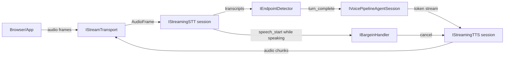
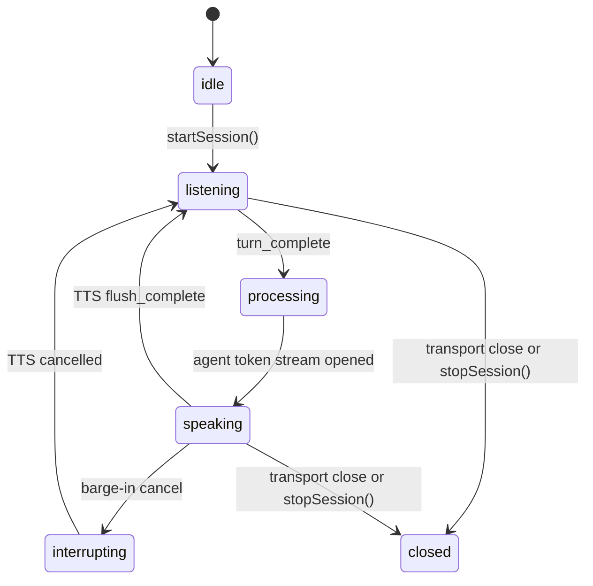

# Streaming voice pipeline

[`VoicePipelineOrchestrator`](https://github.com/framerslab/agentos/blob/master/src/io/voice-pipeline/VoicePipelineOrchestrator.ts) runs one spoken conversation over a transport. Audio frames from the client go to a streaming speech-to-text (STT) session; its transcripts go to an endpoint detector, which decides when the user's turn is over; the turn's text goes to an agent session; the reply's tokens go to a streaming text-to-speech (TTS) session; and its audio goes back through the transport. A barge-in handler decides what happens when the user speaks over the reply.

## Architecture



The orchestrator takes every component from the caller. `startSession(transport, agentSession, overrides)` throws when `overrides` lacks `streamingSTT`, `streamingTTS`, `endpointDetector` or `bargeinHandler`; it resolves no provider from configuration or from installed extension packs. `overrides.diarizationEngine` is accepted and not used. One orchestrator runs one session; start another with a new instance.

## State Machine



- On `turn_complete` the orchestrator sends `agent_thinking`, calls `agentSession.sendText(transcript, metadata)`, sends `agent_speaking` and pushes each token to TTS. When TTS reports `flush_complete` it sends `agent_done` with the spoken text and the played duration, resets the endpoint detector and returns to `listening`.
- On a barge-in `cancel` it cancels the TTS session, calls `agentSession.abort()`, sends `barge_in` and returns to `listening` at once.
- A transport `close` or `stopSession()` moves any state to `closed` and closes the STT and TTS sessions.
- While `listening`, a watchdog gives the endpoint detector a synthetic `speech_end` after `maxTurnDurationMs` (default `30000`); the detector decides whether that ends the turn.

## Quick Start

```typescript
import { randomUUID } from 'node:crypto';
import { WebSocketServer } from 'ws';
import { agent } from '@framers/agentos';
import {
  AgentSessionVoiceAdapter,
  DeepgramStreamingSTT,
  ElevenLabsStreamingTTS,
  HardCutBargeinHandler,
  HeuristicEndpointDetector,
  VoicePipelineOrchestrator,
  WebSocketStreamTransport,
} from '@framers/agentos/io/voice-pipeline';

const assistant = agent({ provider: 'openai', instructions: 'You are a voice assistant. Answer in short sentences.' });
const wss = new WebSocketServer({ port: 8765 });

wss.on('connection', async (ws) => {
  // The page sends 16 kHz mono 16-bit PCM as binary messages.
  const transport = new WebSocketStreamTransport(ws, { sampleRate: 16000, inboundEncoding: 'linear16' });
  const orchestrator = new VoicePipelineOrchestrator({ stt: 'deepgram', tts: 'elevenlabs', language: 'en-US' });

  await orchestrator.startSession(transport, new AgentSessionVoiceAdapter(assistant.session(randomUUID())), {
    streamingSTT: new DeepgramStreamingSTT({ apiKey: process.env.DEEPGRAM_API_KEY! }),
    streamingTTS: new ElevenLabsStreamingTTS({ apiKey: process.env.ELEVENLABS_API_KEY! }),
    endpointDetector: new HeuristicEndpointDetector(),
    bargeinHandler: new HardCutBargeinHandler({ minSpeechMs: 0 }), // see Barge-in
  });
});
```

`AgentSessionVoiceAdapter` sends each turn through `session.stream(text)` and hands its text deltas to TTS; `abort()` stops reading the stream without cancelling the model call. The config's `stt` and `tts` strings are required by the type and not read by the orchestrator; it reads `language` and `sttOptions` for the STT session, `voice`, `format`, `ttsOptions` and `ttsExpressiveness` for the TTS session, and `maxTurnDurationMs` for the watchdog.

`agent({ voice })` accepts a [`VoiceConfig`](https://github.com/framerslab/agentos/blob/master/src/api/types.ts) and does not read it. `agency({ voice: { enabled: true } })` adds `listen()`, which exchanges JSON text messages over a WebSocket and runs no speech recognition or synthesis ([Agency API](../orchestration/AGENCY_API.md)).

### Wunderland CLI

The [Wunderland](https://wunderland.sh) CLI's `chat --voice` starts a WebSocket voice server built on this orchestrator, with the reply streamed from the chat runtime and the model request aborted on barge-in ([flags](./TELEPHONY_PROVIDERS.md#cli-flags)):

```sh
wunderland chat \
  --voice \
  --voice-stt=deepgram \
  --voice-tts=elevenlabs \
  --voice-endpointing=heuristic \
  --voice-barge-in=hard-cut \
  --voice-port=8765
```

## Components

| Interface | Implementations in AgentOS |
|-----------|---------|
| [`IStreamTransport`](https://github.com/framerslab/agentos/blob/master/src/io/voice-pipeline/types.ts) | `WebSocketStreamTransport`, `WebRTCStreamTransport`, `TelephonyStreamTransport` |
| [`IStreamingSTT`](https://github.com/framerslab/agentos/blob/master/src/io/voice-pipeline/types.ts) | `DeepgramStreamingSTT` (default model `nova-3`), `ElevenLabsStreamingSTT`, `OpenAIRealtimeTranscriptionSTT` (default model `gpt-4o-mini-transcribe`), and `StreamingSTTChain` over several of them |
| [`IEndpointDetector`](https://github.com/framerslab/agentos/blob/master/src/io/voice-pipeline/types.ts) | `HeuristicEndpointDetector`, `AcousticEndpointDetector` |
| [`IStreamingTTS`](https://github.com/framerslab/agentos/blob/master/src/io/voice-pipeline/types.ts) | `ElevenLabsStreamingTTS`, `DeepgramAuraStreamingTTS`, `CartesiaStreamingTTS`, `HumeStreamingTTS`, `OpenAIRealtimeTTS`, and `StreamingTTSChain` over several of them |
| [`IBargeinHandler`](https://github.com/framerslab/agentos/blob/master/src/io/voice-pipeline/types.ts) | `HardCutBargeinHandler`, `SoftFadeBargeinHandler` |
| [`IDiarizationEngine`](https://github.com/framerslab/agentos/blob/master/src/io/voice-pipeline/types.ts) | none in this package (see the diarization pack); the orchestrator does not call one |

`createVoiceProvidersFromEnv()` builds STT and TTS providers from the API keys in the environment.

## Endpointing

| Detector | The turn ends when | Text sent to the agent |
|------|-------------|---------|
| `HeuristicEndpointDetector` | speech ends and the last final transcript ends in `.`, `?` or `!`; otherwise after `silenceTimeoutMs` (default `1500`) of silence. When speech ends before any final, as it does with `OpenAIRealtimeTranscriptionSTT`, whose final for an utterance follows its end of speech, the first final that arrives before speech resumes is decided the same way when it arrives. When speech resumes before that final arrives, the next speech end decides the turn on the last final received by then: a pause that outlasts the server's end-of-speech silence (`turnDetection.silenceDurationMs`, 350 ms by default) and ends before the utterance's transcript arrives can split the turn or drop one of its clauses ([#257](https://github.com/framerslab/agentos/issues/257)) | the last final transcript with text it received; a final with no text changes nothing, and backchannel phrases such as "uh huh" are dropped |
| `AcousticEndpointDetector` | silence lasts `utteranceEndThresholdMs` (default `3000`) after speech ends | none: its `turn_complete` carries an empty transcript, and the orchestrator sends that empty text to the agent |
| `SemanticEndpointDetector` (pack `@framers/agentos-ext-endpoint-semantic`) | terminal punctuation as above; otherwise an LLM, called through the pack's `llmCall`, judges whether the turn is complete, with a silence timeout as the fallback | the transcript |

Without an `llmCall`, the semantic pack's classifier answers `INCOMPLETE` and the silence timeout ends every turn without terminal punctuation.

The orchestrator feeds the detectors the STT session's `speech_start` and `speech_end` events; it runs no voice activity detection of its own.

## Barge-in

The orchestrator asks the barge-in handler when the STT session reports `speech_start` while the pipeline is `speaking`, and passes `speechDurationMs: 0`, since the speech has just started.

| Handler | Decision | With the orchestrator |
|------|----------|----------|
| `HardCutBargeinHandler` | `cancel` when `speechDurationMs` is at least `minSpeechMs` (default `300`), else `ignore` | cancels only with `minSpeechMs: 0`; at the default it never cancels |
| `SoftFadeBargeinHandler` | `ignore` below `ignoreMs` (default `100`), `cancel` at `cancelMs` (default `2000`) or more, else `pause` with `fadeMs` (default `200`) | at the defaults it always ignores; with `ignoreMs: 0` it answers `pause` |

- `cancel`: the pipeline goes `interrupting` and back to `listening`, as described under State Machine.
- `pause`: the orchestrator sends `barge_in` with the action and keeps speaking; the client fades the audio. The orchestrator takes no action on a later `resume`.
- A `cancel` action carries `injectMarker: '[interrupted]'`; the client receives it in the `barge_in` message, and nothing writes it into the conversation history.
- There is no `disabled` handler, and the config's `bargeIn` field is not read. To never interrupt, pass a handler whose `handleBargein()` returns `{ type: 'ignore' }`.

## Extension Packs

These packs live in [agentos-extensions](https://github.com/framerslab/agentos-extensions/tree/master/registry/curated/voice). The orchestrator does not load packs: a host builds a pack's provider or detector and passes it in `overrides`.

| Pack | npm Package | Env Var |
|------|------------|---------|
| Deepgram streaming STT | `@framers/agentos-ext-streaming-stt-deepgram` | `DEEPGRAM_API_KEY` |
| Whisper streaming STT | `@framers/agentos-ext-streaming-stt-whisper` | `OPENAI_API_KEY` |
| OpenAI streaming TTS | `@framers/agentos-ext-streaming-tts-openai` | `OPENAI_API_KEY` |
| ElevenLabs streaming TTS | `@framers/agentos-ext-streaming-tts-elevenlabs` | `ELEVENLABS_API_KEY` |
| Speaker diarization | `@framers/agentos-ext-diarization` | — |
| Semantic endpointing | `@framers/agentos-ext-endpoint-semantic` | the key of the model behind `llmCall` |

## WebSocket Messages

`WebSocketStreamTransport` carries audio as binary messages and control as JSON text messages.

### Client → Server

- **Binary**: mono samples at the transport's `sampleRate`, as serialized `Float32Array` bytes by default, or as 16-bit little-endian PCM with `inboundEncoding: 'linear16'`.
- **Text**: JSON, emitted as the transport's `message` event. The protocol type names `{ type: 'config', config }` and `{ type: 'control', action: { type: 'mute' | 'unmute' | 'config' | 'stop' } }`; the orchestrator does not act on either, so a host that offers them handles the event itself.

### Server → Client

```typescript
{ type: 'transcript', text: 'Hello', isFinal: false, confidence: 0.92 }
{ type: 'agent_thinking' }
{ type: 'agent_speaking', text: '' }
{ type: 'agent_done', text: 'Hi there!', durationMs: 1840 }
{ type: 'barge_in', action: { type: 'cancel', injectMarker: '[interrupted]' } }

// Binary messages: each TTS audio chunk, in the TTS provider's output format
```

The protocol type also declares `session_started`, `error` and `session_ended` messages, which the orchestrator does not send.

## LiveKit Rooms

### Transcripts in the room

`LiveKitTranscriptionOutput` (in `@framers/agentos/io/hearing/livekit`) writes a speech-to-text session's transcripts into the room as LiveKit's own transcription output does, so a page's standard `lk.transcription` handler shows them: each interim and each final is a text stream with the line's whole text and the attributes `lk.segment_id` (the transcript's `itemId`), `lk.transcription_final` (`'true'` on the final) and `lk.transcribed_track_id`. A final whose transcript has `startMs` and `endMs` also carries `agentos.start_ms` and `agentos.end_ms` (`TRANSCRIPTION_TIME_ATTRIBUTES`, exported from `@framers/agentos/io/voice-pipeline` and `@framers/agentos/io/voice-pipeline/browser`): the line's start and end on the session's audio clock, rounded to whole milliseconds and written in decimal digits; an interim carries neither. It keeps the finals, and `replayAfter(itemId, identity)` sends that participant the finals after the line the page names, each with the times it was first written with, a line taken back among them as its empty final, so a page that reconnects is whole again. The page names the line its own ledger's `resumeAfterId()` gives, the last final before its first line still being heard, since completion events from different turns can arrive out of order; a final it already holds comes again and is dropped.

```typescript
import { LiveKitTranscriptionOutput } from '@framers/agentos/io/hearing/livekit';

const output = new LiveKitTranscriptionOutput({
  room, // a connected @livekit/rtc-node Room
  trackSid: () => heardTrack?.sid, // the track the session hears
});
session.on('transcript', (event) => {
  output.write(event).catch((error) => console.warn('transcript not sent', error));
});
```

The output takes the room through a structural type, so AgentOS needs no LiveKit package of its own. Writes go out in the order they were asked for. A send that fails rejects its write and leaves the line in the output's ledger, so writing the same transcript again sends nothing; `replayAfter` sends a final again to a participant. A transcript from a provider that does not key its results carries no `itemId`: give the line's id as `write(event, { itemId })`.

On the page, `TranscriptLedger` (in `@framers/agentos/io/voice-pipeline/browser`) folds the streams into lines:

```typescript
import { LIVEKIT_TRANSCRIPTION_TOPIC, TranscriptLedger, transcriptEventFromLiveKit } from '@framers/agentos/io/voice-pipeline/browser';

const ledger = new TranscriptLedger();
room.registerTextStreamHandler(LIVEKIT_TRANSCRIPTION_TOPIC, async (reader) => {
  const event = transcriptEventFromLiveKit(await reader.readAll(), reader.info.attributes);
  if (event && ledger.apply(event)) render(ledger.items());
});
```

A line the provider could not transcribe arrives as an empty final with `agentos.transcription_failed` holding a short reason; an empty final without it takes back the text the line showed, and the ledger hides the line. `transcriptEventFromLiveKit()` reads a final's `agentos.start_ms` and `agentos.end_ms` into the event's `startMs` and `endMs`, so the ledger's line holds the times its final carried; a value that is not whole milliseconds in decimal digits is ignored, and its field stays undefined.

## Speech-to-text in the browser

`@framers/agentos/io/voice-pipeline/browser` is the entry a browser bundle imports: its modules import no Node built-in and no package. `@framers/agentos/io/voice-pipeline` exports them as well.

### Input level

```typescript
import { InputSilenceWatch, inputLevelDb } from '@framers/agentos/io/voice-pipeline/browser';

const watch = new InputSilenceWatch(); // heard above -60 dBFS, dead at or below -150 dBFS, after 5 seconds
watch.reset(performance.now()); // a new input, not heard yet

// for each block of samples the page captures:
const level = inputLevelDb(block); // dBFS; -Infinity for a block of zeros
drawMeter(level);
showNoSoundNotice(watch.push(level, performance.now()));
```

`inputLevelDb(samples)` is a block's level in decibels of full scale, from its root mean square: `0` for samples at full scale, `-Infinity` for an empty block or a block of zeros. `InputSilenceWatch` takes each block's level with its time and answers whether no sound reaches the page from the input in use, by two rules:

- nothing above `heardAboveDb` (`-60` unless set) for `afterMs` (`5000` unless set) since the input was chosen;
- a dead signal, at or below `deadAtOrBelowDb` (`-150` unless set), for `afterMs` at any time, counted from its first block.

A quiet pause after the input was heard is not silence, since a capture with noise suppression reads low between words. `reset(atMs)` starts a new input, not heard yet; `restart(atMs)` counts afresh on the same input, after a pause in listening, and keeps whether it was heard.

### Capture on the page

`AudioWorkletCapture` (in `@framers/agentos/io/hearing/capture`) hands a page's audio to its listeners as mono Float32 blocks with the context's sample rate, the samples a streaming session's `pushAudio` takes. It reads the audio off the page's main thread through an `AudioWorkletNode`: the `MediaStream` goes through `createMediaStreamSource` into the worklet, whose processor mixes its input's channels to their mean and posts a block each time it holds `blockSize` samples (2048 unless set, about 43 ms at 48 kHz; a size that is not a positive whole number throws a `RangeError` when the capture is made). The worklet's one output goes to the context's destination through a gain of zero, so the page plays nothing.

```typescript
import { AudioWorkletCapture } from '@framers/agentos/io/hearing/capture';

const context = new AudioContext();
const stream = await navigator.mediaDevices.getUserMedia({ audio: true });
const capture = new AudioWorkletCapture({ context, stream, moduleUrl: '/audio/capture-worklet.js' });
capture.onBlock((samples, sampleRate) => session.pushAudio({ samples, sampleRate, timestamp: Date.now() }));
await capture.start(); // loads the module, once per context, and builds the path

capture.setStream(otherStream); // another microphone, or a mix the page made, on the same node
capture.stop(); // every node disconnected and every listener removed; no block is handed on after it
```

The blocks keep the context's sample rate, which a frame built from them carries in `sampleRate`. `DeepgramStreamingSTT` and `ElevenLabsStreamingSTT` read their audio as 16 kHz whatever a frame's `sampleRate` says, so blocks bound for them are resampled to 16 kHz first.

A second `start()` leaves a running capture as it is, and a `stop()` while the module loads leaves nothing built. `stop()` removes the listeners as well, so a capture started again hands its blocks to the listeners added after it. `stop()` also posts the worklet's processor a stop message: its `process()` then answers `false`, so the browser can end the node, which no longer has an input. A `start()` that fails, on a module that did not load or a stream with no audio track, leaves nothing connected, and the next `start()` tries again. A `setStream()` keeps the samples the worklet holds toward its next block, which open the first block after the change, so no sample the worklet took in before the change is dropped. Given a stream with no audio track, `setStream()` throws, and the capture keeps hearing the stream it had.

The worklet module is `capture-worklet.js`, the file beside the entry's own in the package's `dist`. It imports nothing, so the host copies it into its static files at build time and passes its address as `moduleUrl`. A worklet's module is a script to the page's content security policy, so a page whose policy allows scripts from its own origin alone serves the file there.

```typescript
// A build step in Node: copy the worklet module into the site's static files.
import { copyFile } from 'node:fs/promises';

const entry = import.meta.resolve('@framers/agentos/io/hearing/capture');
await copyFile(new URL('./capture-worklet.js', entry), 'public/audio/capture-worklet.js');
```

`AudioProcessor` (in `@framers/agentos/io/hearing`) is the older capture: it reads the audio through a `ScriptProcessorNode` on the page's main thread, a node deprecated in favour of `AudioWorkletNode` ([MDN](https://developer.mozilla.org/en-US/docs/Web/API/ScriptProcessorNode)), and feeds its frames to `EnvironmentalCalibrator` and `AdaptiveVAD`.


## Failures

| Failure | What happens |
|---------|----------|
| The transport closes | The pipeline goes `closed` and closes the STT and TTS sessions. The client reconnects into a new session. |
| An STT or TTS provider fails to start | Through `StreamingSTTChain` or `StreamingTTSChain`, the next provider in priority order starts instead; a circuit breaker skips providers that failed recently. A single provider fails the `startSession()` call. |
| An STT or TTS session fails during the call | Through a chain with mid-call failover on (`enableMidUtteranceFailover` and `enableMidSynthesisFailover`, both on by default in `createVoiceProvidersFromEnv()`), the next provider takes over: the STT chain replays up to `ringBufferCapacityMs` (default `3000`) of buffered audio, and the TTS chain replays the text it was given. Otherwise the session is the provider's own, and a provider has no reconnect, except `OpenAIRealtimeTranscriptionSTT`: it reconnects, the first retry after 100 ms and each later one after 2 s, up to 3 in a row, and sends the audio held meanwhile first; past the retries its session fails like any other. |
| No turn completes | The watchdog gives the endpoint detector a synthetic `speech_end` after `maxTurnDurationMs`. |

Wunderland's `chat --voice` server and `TelephonyStreamTransport` (Twilio, Telnyx and Plivo media streams) build on the same orchestrator; see [Telephony Providers](./TELEPHONY_PROVIDERS.md).

---

## Voice in Orchestration Graphs

### Voice nodes

`voiceNode()` (from `@framers/agentos/orchestration`) builds a [`GraphNode`](https://github.com/framerslab/agentos/blob/master/src/orchestration/ir/types.ts) of type `'voice'`; so does a workflow step with a `voice` field, `step('listen', { voice: { mode: 'conversation', maxTurns: 3 } })`.

```typescript
import { voiceNode } from '@framers/agentos/orchestration';

const intake = voiceNode('intake', {
  mode: 'conversation',
  maxTurns: 5,
  exitOn: 'keyword',
  exitKeywords: ['confirmed', 'cancel'],
})
  .on('keyword:confirmed', 'process-intake')
  .on('keyword:cancel', 'goodbye')
  .on('hangup', 'end')
  .on('turns-exhausted', 'fallback')
  .build();
```

| Property | Value |
|----------|-------|
| `type` | `'voice'` |
| `executorConfig.type` | `'voice'` |
| `executionMode` | `'react_bounded'` |
| `effectClass` | `'external'` |
| `checkpoint` | `'before'` |

A voice node runs only when both of these hold; otherwise it returns `success: false`:

- the compiled graph's dependencies include a [`VoiceNodeExecutor`](https://github.com/framerslab/agentos/blob/master/src/orchestration/runtime/VoiceNodeExecutor.ts): `compile({ deps: { voiceExecutor: new VoiceNodeExecutor(eventSink) } })`;
- the run's `state.scratch.voiceTransport` holds the transport. [`VoiceTransportAdapter.init(state)`](https://github.com/framerslab/agentos/blob/master/src/orchestration/runtime/VoiceTransportAdapter.ts) puts it there, with itself as `state.scratch.voiceAdapter`.

`VoiceNodeExecutor` and `VoiceTransportAdapter` are imported from `@framers/agentos/orchestration/runtime/VoiceNodeExecutor` and `@framers/agentos/orchestration/runtime/VoiceTransportAdapter`.

The executor reads the node's `mode`, `speakText`, `maxTurns`, `exitOn` and `exitKeywords`. The node's `stt`, `tts`, `voice`, `endpointing`, `bargeIn`, `diarization` and `language` are not read: the node uses whatever pipeline the transport carries.

- `mode: 'speak-only'` sends `speakText` to TTS through the adapter's `deliverNodeOutput()` and exits with `completed`.
- Any other mode listens for `interim_transcript`, `final_transcript`, `turn_complete`, `barge_in` and `speech_start` on `transport._voiceSession`, and races the exit conditions below. `VoiceTransportAdapter` sets `_voiceSession` to the `session` passed in its fourth argument, `new VoiceTransportAdapter(config, transport, eventSink, { pipeline, session })`. A `VoicePipelineSession` from `startSession()` emits only `state_change`, so the host passes an emitter that relays the pipeline's transcript, turn and barge-in events under those names.

| `exitReason` | Trigger |
|---|---|
| `hangup` | the transport emits `close` or `disconnected` |
| `turns-exhausted` | a `turn_complete` brings the turn count to `maxTurns` (`0` or unset: no limit) |
| `keyword:<word>` | with `exitOn: 'keyword'`, a `final_transcript` contains one of `exitKeywords` (case-insensitive substring) |
| `silence-timeout` | with `exitOn: 'silence-timeout'`, 30 s pass without `speech_start` or `turn_complete` |
| `interrupted` | the node's abort signal fires, including through a [`VoiceInterruptError`](https://github.com/framerslab/agentos/blob/master/src/io/voice-pipeline/VoiceInterruptError.ts) |
| `completed` | a `speak-only` node finished |
| `error` | the session threw |

The exit reason picks the edge set with `.on(exitReason, target)`. A loopback edge restarts listening after a barge-in:

```typescript
voiceNode('listen', { mode: 'conversation' })
  .on('interrupted', 'listen')
  .on('turns-exhausted', 'summarize')
  .on('hangup', 'end')
  .build();
```

### The adapter

`VoiceTransportAdapter` bridges graph input and output to a voice pipeline:

- `init(state)` puts the transport and the adapter into `state.scratch`. Given `{ pipeline, session }`, it uses that pipeline; without them it constructs a `VoicePipelineOrchestrator` from its config and does not start a session, so `deliverNodeOutput()` then throws `No active TTS session` and `getNodeInput()` waits on a pipeline that never runs. Pass a pipeline whose session you started.
- `getNodeInput(nodeId)` waits for the pipeline's next `turn_complete` and returns its transcript.
- `deliverNodeOutput(nodeId, text)` sends text or a token stream to the pipeline's TTS session and emits a `voice_audio` graph event.
- `dispose()` emits `voice_session` with `action: 'ended'`.

`workflow().transport('voice', config)` stores the config on the builder; `compile()` does not read it and creates no adapter.

### Graph events

| Event type | When |
|---|---|
| `voice_session` (action `started`) | the executor starts a listening node, or the adapter's `init()` runs |
| `voice_transcript` (`isFinal: false`) | each `interim_transcript` on the session emitter |
| `voice_transcript` (`isFinal: true`) | each `final_transcript` on the session emitter |
| `voice_turn_complete` | each `turn_complete` on the session emitter, and each `getNodeInput()` result |
| `voice_audio` (direction `outbound`) | `deliverNodeOutput()` |
| `voice_barge_in` | each `barge_in` on the session emitter |
| `voice_session` (action `ended`) | the node exits, with its `exitReason`, or the adapter is disposed |

The executor and the adapter send these events to the sink each was constructed with:

```typescript
import { VoiceNodeExecutor } from '@framers/agentos/orchestration/runtime/VoiceNodeExecutor';

const voiceExecutor = new VoiceNodeExecutor((event) => {
  if (event.type === 'voice_transcript' && event.isFinal) console.log(event.text);
  if (event.type === 'voice_session' && event.action === 'ended') console.log('exit:', event.exitReason);
});
```

### Checkpoints

Voice nodes take a checkpoint before they run, so a resumed graph starts the voice node again. After each run the executor writes a [`VoiceNodeCheckpoint`](https://github.com/framerslab/agentos/blob/master/src/orchestration/runtime/VoiceNodeExecutor.ts) to `scratchUpdate[nodeId]`:

```typescript
interface VoiceNodeCheckpoint {
  turnIndex: number;              // turns completed, including earlier runs of the node
  transcript: Array<{ speaker: string; text: string; timestamp: number }>; // the buffered transcript
  lastExitReason: string | null;
  speakerMap: Record<string, string>;
  sessionConfig: VoiceNodeConfig;
}
```

When the node runs again, the executor reads `state.scratch[nodeId].turnIndex` and continues the turn count from it, so a call that spans several graph runs (for example around a human approval) counts its turns across them.

### YAML workflows (Wunderland)

AgentOS has no YAML workflow compiler. Wunderland's `compileWorkflowYaml()` (in the `wunderland` package) reads `voice` steps, which it lowers to the same `voice` nodes, and a top-level `transport` block, which it attaches to the compiled workflow as `_transport`:

```yaml
name: phone-intake
transport:
  type: voice
  stt: deepgram
  tts: elevenlabs
steps:
  - id: greet
    voice:
      mode: speak-only
  - id: intake
    voice:
      mode: conversation
      maxTurns: 3
      exitOn: keyword
      exitKeywords: [confirmed, done]
```

A voice step takes the [`VoiceNodeConfig`](https://github.com/framerslab/agentos/blob/master/src/orchestration/ir/types.ts) fields; `mode` (`conversation`, `listen-only` or `speak-only`) is required.

---

## Provider Options (sttOptions / ttsOptions)

`VoicePipelineConfig.sttOptions` and `ttsOptions` reach the providers as `providerOptions` when `startSession()` opens the STT and TTS sessions. Both sessions last for the whole pipeline session, so the options hold for every turn of it.

### Deepgram STT Options

```typescript
const orchestrator = new VoicePipelineOrchestrator({
  stt: 'deepgram',
  tts: 'elevenlabs',
  sttOptions: {
    sentiment: true,
    smart_format: true,
    diarize: true,
    utterance_end_ms: 1000,
    keywords: ['Gideon:2', 'fireball:1.5'],
  },
});
```

| Option | Type | Deepgram query parameter |
|--------|------|---------------|
| `sentiment` | `boolean` | `sentiment=true` |
| `smart_format` | `boolean` | `smart_format=true` |
| `diarize` | `boolean` | `diarize=true` |
| `utterance_end_ms` | `number` | `utterance_end_ms=N` |
| `keywords` | `string[]` | `keywords=term:weight`; with a `nova-3` model (the default) each term goes as `keyterm` with its `:weight` dropped |

With `sentiment: true`, the session's [`TranscriptEvent`](https://github.com/framerslab/agentos/blob/master/src/io/voice-pipeline/types.ts) carries `sentiment`:

```typescript
interface TranscriptEvent {
  text: string;
  confidence: number;
  words: TranscriptWord[];
  isFinal: boolean;
  durationMs?: number;
  sentiment?: {
    label: 'positive' | 'negative' | 'neutral';
    confidence: number;
  };
  itemId?: string;   // the provider's key for the utterance (OpenAI Realtime's item_id)
  startMs?: number;  // the utterance's start on the session's audio clock
  endMs?: number;    // the utterance's end on the session's audio clock
  language?: string; // the detected language, or the session's configured one
}
```

The orchestrator relays `text`, `isFinal` and `confidence` to the client; the other fields stay on the STT session's events.

### OpenAI Realtime Transcription

[`OpenAIRealtimeTranscriptionSTT`](https://github.com/framerslab/agentos/blob/master/src/io/voice-pipeline/providers/OpenAIRealtimeTranscriptionSTT.ts) streams speech-to-text over an OpenAI Realtime session in its transcription mode (`wss://api.openai.com/v1/realtime?intent=transcription`). It sends 24 kHz PCM16, keys every interim and final transcript by OpenAI's `item_id`, reconnects a dropped socket, and moves a long session to a new connection before OpenAI's session limit.

```typescript
import { OpenAIRealtimeTranscriptionSTT } from '@framers/agentos/io/voice-pipeline';

const stt = new OpenAIRealtimeTranscriptionSTT({
  apiKey: process.env.OPENAI_API_KEY!,
  model: 'gpt-4o-mini-transcribe', // the default
  usageIntervalMs: 15_000, // a usage report every 15 s for each open connection
});

const session = await stt.startSession({
  language: 'en-US',
  providerOptions: { safetyIdentifier: hashedUserId },
});

session.on('transcript', (event) => {
  // One utterance keeps one itemId: replace its text with each interim, then with the final.
  showLine(event.itemId, event.text, event.isFinal);
});
session.on('usage', (usage) => meter(usage.connectionIndex, usage.audioSeconds, usage.final));

session.pushAudio(frame); // mono Float32 at any sample rate, resampled to 24 kHz
await session.flush(); // at the end: commits the turn in progress and waits for its final
session.close();
```

| Option | Default | Effect |
|--------|---------|--------|
| `model` | `'gpt-4o-mini-transcribe'` | The transcription model, named in the session update. |
| `turnDetection` | server VAD (threshold 0.5, 600 ms prefix padding, 350 ms silence); `null` for `gpt-live-transcribe` and `gpt-realtime-whisper` | `null` turns server turn detection off: each `flush()` then commits a turn. |
| `prompt` | none | Context for the transcription model; per session, `providerOptions.prompt`. |
| `safetyIdentifier` | none | Sent as the `OpenAI-Safety-Identifier` header; per session, `providerOptions.safetyIdentifier`. |
| `connectTimeoutMs` | `10000` | Time a connection has to open and have its session update confirmed. |
| `maxRetries`, `retryIntervalMs` | `3`, `2000` | Reconnects after consecutive failures; the first waits 100 ms. The count resets after every final and after a connection that had stayed open longer than `connectTimeoutMs`. |
| `maxBufferedMs` | `10000` | Audio held while no connection is open, sent first to the next one. |
| `finalTimeoutMs` | `5000` | Longest wait for finals in `flush()` and when a connection closes. |
| `usageIntervalMs` | `0` | `'usage'` reports for open connections at this interval; `0` reports each connection once, when it closes. |
| `rollover` | below | `false` keeps a single connection. |

Events: `transcript` (with `itemId`, `startMs` and `endMs` on the session's audio clock, and `language`); `speech_start` and `speech_end`; `usage` ([`StreamingSTTUsageEvent`](https://github.com/framerslab/agentos/blob/master/src/io/voice-pipeline/types.ts): `providerId`, `model`, `connectionIndex`, `audioSeconds`, `final`); `warning` (a `VoicePipelineError`, for a server error the session survives, an item whose transcription failed, or a `rollover.approve` that threw); and `error` followed by `close` when the session cannot go on: a reconnect refused as unauthorised, or failures beyond the retries. A failed item that had shown interim text gets a final with empty text, so a display keyed by `itemId` drops it.

**Ending a session.** Call `flush()` before `close()`: it commits the turn in progress and waits for its final, while `close()` ends every connection at once and discards audio not yet committed. With `turnDetection: null`, `flush()` commits the buffer. Under server turn detection it commits only while the server reports speech in progress, so an utterance that began within the voice detector's reporting latency before the call (the time the server takes to send `input_audio_buffer.speech_started`) is not committed, and the `close()` that follows discards it.

**Long sessions.** OpenAI documents a 60-minute limit for a Realtime session ([Realtime conversations](https://developers.openai.com/api/docs/guides/realtime-conversations)); the rollover keeps every connection under it. Once a connection is 55 minutes old (`rollover.afterMs`), the session opens the next one at the first end of speech, or at 58 minutes (`rollover.deadlineMs`) whatever is being said. Both connections receive the same audio for at least 3 s (`rollover.overlapMs`); the old one then stops at its first pause, finishes its items and closes, and an utterance both transcribed is emitted once: from the old connection, or from the new one when the old connection's transcription of it fails, comes back empty or never arrives. An old connection still in speech at 59.5 minutes (`rollover.hardStopMs`) commits what it holds, and the words of that last stretch can appear in both connections' finals. With `turnDetection: null` the switch comes at the first `flush()` after 55 minutes, or with a commit at 58, and the connections do not overlap. `rollover.approve` is called before the rollover opens the next connection: refusing it, or not answering by the hard stop, keeps the current connection until its hard stop and then closes the session, so a host that pays for each hour can reserve the next one first. A next connection that cannot open within the retries also keeps the current one until its hard stop, and the session then ends with that `error`. A connection opened to recover from a dropped one runs under the current approval and keeps the dropped connection's clocks, so the next approval comes at the same time as without the drop; when the connection that took over drops during the overlap, its replacement keeps that newer connection's clocks.

**Without speech output.** `createSttChainFromEnv()` builds the STT chain alone. It reads `DEEPGRAM_API_KEY`, `ELEVENLABS_API_KEY` and `OPENAI_API_KEY` as `createVoiceProvidersFromEnv()` does, needs no TTS key, and leaves mid-utterance failover off, so sessions keep `flush()` and the usage events:

```typescript
import { createSttChainFromEnv } from '@framers/agentos/io/voice-pipeline';

const { stt } = createSttChainFromEnv({ openaiRealtime: { usageIntervalMs: 15_000 } });
const session = await stt.startSession({ language: 'en' });
```

In both constructors OpenAI Realtime transcription joins the STT chain when `OPENAI_API_KEY` is set, after Deepgram and ElevenLabs.

### ElevenLabs TTS Options

```typescript
const orchestrator = new VoicePipelineOrchestrator({
  stt: 'deepgram',
  tts: 'elevenlabs',
  ttsOptions: {
    stability: 0.3,
    similarityBoost: 0.75,
    style: 0.6,
    useSpeakerBoost: true,
    speed: 0.85,
  },
});
```

| Option | Type | Default | Sent as |
|--------|------|---------|--------|
| `stability` | `number` | `0.5` | `voice_settings.stability` |
| `similarityBoost` | `number` | `0.75` | `voice_settings.similarity_boost` |
| `style` | `number` | `0` | `voice_settings.style` |
| `useSpeakerBoost` | `boolean` | `true` | `voice_settings.use_speaker_boost` |
| `speed` | `number` | not sent | `generation_config.speed` |

They go in the first message of the ElevenLabs WebSocket stream. `ttsExpressiveness`, when set, takes precedence over these keys. Settings computed from a character's state apply from the next pipeline session, since the TTS session opens once per pipeline session.

---

## References

### Voice activity detection and endpoint detection

- Tan, Z.-H., Sarkar, A. K., & Dehak, N. (2020). [*rVAD: An unsupervised segment-based robust voice activity detection method.*](https://arxiv.org/abs/1906.03588) *Computer Speech & Language*, 59, 1–21.
- Silero Team. (2024). [*Silero VAD: Pre-trained enterprise-grade voice activity detector.*](https://github.com/snakers4/silero-vad)
- Skerry-Ryan, R. J., Battenberg, E., Xiao, Y., Wang, Y., Stanton, D., Shor, J., Weiss, R., Clark, R., & Saurous, R. A. (2018). [*Towards end-to-end prosody transfer for expressive speech synthesis with Tacotron.*](https://arxiv.org/abs/1803.09047) ICML 2018.

### Streaming ASR

- Graves, A., Fernández, S., Gomez, F., & Schmidhuber, J. (2006). [*Connectionist temporal classification: Labelling unsegmented sequence data with recurrent neural networks.*](https://dl.acm.org/doi/10.1145/1143844.1143891) ICML 2006.
- Chiu, C.-C., Sainath, T. N., Wu, Y., Prabhavalkar, R., Nguyen, P., Chen, Z., Kannan, A., Weiss, R. J., Rao, K., Gonina, E., Jaitly, N., Li, B., Chorowski, J., & Bacchiani, M. (2018). [*State-of-the-art speech recognition with sequence-to-sequence models.*](https://arxiv.org/abs/1712.01769) ICASSP 2018.
- Radford, A., Kim, J. W., Xu, T., Brockman, G., McLeavey, C., & Sutskever, I. (2023). [*Robust speech recognition via large-scale weak supervision.*](https://arxiv.org/abs/2212.04356) ICML 2023.

### Barge-in and turn-taking

- Edlund, J., Heldner, M., & Hirschberg, J. (2009). [*Pause and gap length in face-to-face interaction.*](https://www.isca-speech.org/archive/interspeech_2009/edlund09_interspeech.html) Interspeech 2009.
- Skantze, G. (2021). [*Turn-taking in conversational systems and human-robot interaction: A review.*](https://doi.org/10.1016/j.csl.2020.101178) *Computer Speech & Language*, 67, 101178.

### Real-time speech synthesis

- Anastassiou, P., Chen, J., Chen, J., Chen, Y., Chen, Z., Chen, Z., Cong, J., Deng, L., Ding, C., Gao, L., Gong, M., Huang, P., Huang, Q., Huang, Z., Huo, Y., Jia, D., Li, C., Li, F., Li, H., ... Wei, X. (2024). [*Seed-TTS: A family of high-quality versatile speech generation models.*](https://arxiv.org/abs/2406.02430) arXiv:2406.02430.

### Implementation references

- [`src/io/voice-pipeline/VoicePipelineOrchestrator.ts`](https://github.com/framerslab/agentos/blob/master/src/io/voice-pipeline/VoicePipelineOrchestrator.ts): the state machine
- [`src/io/voice-pipeline/HeuristicEndpointDetector.ts`](https://github.com/framerslab/agentos/blob/master/src/io/voice-pipeline/HeuristicEndpointDetector.ts) and [`AcousticEndpointDetector.ts`](https://github.com/framerslab/agentos/blob/master/src/io/voice-pipeline/AcousticEndpointDetector.ts): endpoint detection
- [`src/io/voice-pipeline/HardCutBargeinHandler.ts`](https://github.com/framerslab/agentos/blob/master/src/io/voice-pipeline/HardCutBargeinHandler.ts) and [`SoftFadeBargeinHandler.ts`](https://github.com/framerslab/agentos/blob/master/src/io/voice-pipeline/SoftFadeBargeinHandler.ts): barge-in handlers
- [`src/io/voice-pipeline/types.ts`](https://github.com/framerslab/agentos/blob/master/src/io/voice-pipeline/types.ts): the transport, STT, TTS, endpoint and barge-in interfaces
