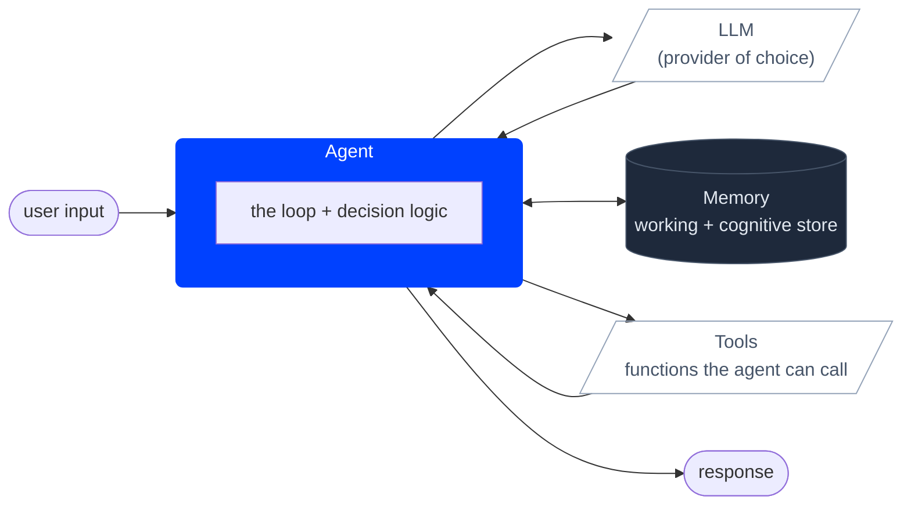

# Getting Started with AgentOS

> Your fastest path from zero to a running AI agent — one line, three lines, or five, depending on how much you need.

---

## Table of Contents

1. [Installation](#installation)
2. [Environment Setup](#environment-setup)
3. [Core Concepts](#core-concepts)
4. [Provider Configuration](#provider-configuration)
5. [Level 1 — Single Text Generation](#level-1--single-text-generation)
6. [Level 2 — Stateful Agent Session](#level-2--stateful-agent-session)
7. [Level 3 — Multi-Agent Agency](#level-3--multi-agent-agency)
8. [First End-to-End Example](#first-end-to-end-example)
9. [What's Next](#whats-next)

---

## Installation

```bash
npm install @framers/agentos
```

TypeScript is strongly recommended. AgentOS ships full `.d.ts` types and expects
`"moduleResolution": "bundler"` or `"node16"` in your `tsconfig.json`.

```json
{
  "compilerOptions": {
    "target": "ES2022",
    "module": "ESNext",
    "moduleResolution": "bundler",
    "strict": true
  }
}
```

---

## Environment Setup

AgentOS resolves credentials in three layers, highest priority first:

1. **Inline `apiKey` / `provider` / `baseUrl`** on the call.
2. **Module-level default** set via `setDefaultProvider()` (see below).
3. **Environment variable auto-detect chain**: `OPENROUTER_API_KEY` → `OPENAI_API_KEY` → `ANTHROPIC_API_KEY` → `GEMINI_API_KEY` → `GROQ_API_KEY` → `TOGETHER_API_KEY` → `MISTRAL_API_KEY` → `XAI_API_KEY` → `which claude` → `which gemini` → `OLLAMA_BASE_URL` → `STABILITY_API_KEY` → `REPLICATE_API_TOKEN` → `STABLE_DIFFUSION_LOCAL_BASE_URL` → `BFL_API_KEY` → `FAL_API_KEY`.

You only need one of these — pick whichever fits your deployment.

### Module-level default (no `.env` required)

Configure once at app boot, every subsequent call inherits:

```typescript
import { setDefaultProvider, generateText, agent } from '@framers/agentos';

setDefaultProvider({
  provider: 'openai',
  apiKey: process.env.MY_OWN_KEY ?? process.env.OPENAI_API_KEY,  // any source — Vault, KMS, hard-coded, etc.
  // optional:
  // model: 'gpt-4o-mini',
  // baseUrl: 'https://my-proxy.example.com/v1',
});

// No env vars needed, no inline opts — just works:
const { text } = await generateText({ prompt: 'hello' });
const bot = agent({ instructions: 'You are a coding tutor.' });

// Inline opts always win over the default (per-tenant keys, fallback providers, etc.):
const { text: tenantReply } = await generateText({
  apiKey: process.env.SCOPED_OPENAI_API_KEY ?? process.env.OPENAI_API_KEY,
  prompt: 'tenant-isolated call',
});

// Reset the default:
setDefaultProvider(undefined);
```

[`setDefaultProvider`](https://github.com/framersai/agentos/blob/master/src/api/runtime/global-default.ts) is the recommended path for apps that hold their keys somewhere other than environment variables (secrets manager, runtime config service, etc.). It also works inside the [`AgentOS`](https://github.com/framersai/agentos/blob/master/src/api/AgentOS.ts) class — pass `defaultProvider` in your [`AgentOSConfig`](https://github.com/framersai/agentos/blob/master/src/api/AgentOS.ts) and the runtime will install it during `initialize()`.

### Reordering the auto-detect chain

If you have multiple env-var keys configured but want a different one preferred, install a custom priority list once at boot:

```typescript
import { setProviderPriority, generateText } from '@framers/agentos';

// Even if OPENAI_API_KEY is set, prefer Anthropic when its key is also present:
setProviderPriority(['anthropic', 'openai', 'ollama']);

const { text } = await generateText({ prompt: 'hello' });
// Picks anthropic if ANTHROPIC_API_KEY is set; falls through to openai;
// then to a local ollama server. Providers not in the list are skipped.
```

Throws if you list an unknown provider id (typo guard). Pass an empty array to disable auto-detection entirely (callers must then supply a provider inline or via `setDefaultProvider`). Call `clearProviderPriority()` (or `setProviderPriority(undefined)`) to revert to the default order.

### Environment variables

For zero-code setup, set any one of the supported env vars:

```bash
# Cloud providers (pick one or more)
export OPENAI_API_KEY=sk-...
export ANTHROPIC_API_KEY=sk-ant-...
export GEMINI_API_KEY=AIza...
export OPENROUTER_API_KEY=sk-or-...

# Key rotation — comma-separated keys rotate automatically with quota detection
export OPENAI_API_KEY=sk-key1,sk-key2,sk-key3

# Local providers (no key required, just a running server)
export OLLAMA_BASE_URL=http://localhost:11434
export STABLE_DIFFUSION_LOCAL_BASE_URL=http://localhost:7860
```

### Inline API Keys

Every function also accepts `apiKey` and `baseUrl` directly, which override both the module-level default and any environment variable. This is useful for multi-tenant apps, test suites, or dynamic key management:

```typescript
import { generateText, agent } from '@framers/agentos';

// Pass apiKey inline — skips env var lookup for this call
const { text } = await generateText({
  provider: 'openai',
  apiKey: 'sk-my-specific-key',
  prompt: 'Hello world',
});

// Works on agent() too
const bot = agent({
  provider: 'anthropic',
  apiKey: process.env.CUSTOMER_ANTHROPIC_KEY,
  instructions: 'You are a helpful assistant.',
});

// Local provider with explicit baseUrl
const { text: local } = await generateText({
  provider: 'ollama',
  baseUrl: 'http://gpu-server:11434',
  prompt: 'Summarize this document.',
});
```

All high-level functions support `apiKey`: `generateText`, [`streamText`](https://github.com/framersai/agentos/blob/master/src/api/streamText.ts), `generateObject`, [`streamObject`](https://github.com/framersai/agentos/blob/master/src/api/streamObject.ts), `generateImage`, `generateVideo`, `generateMusic`, `generateSFX`, `embedText`, `performOCR`, [`agent`](https://github.com/framersai/agentos/blob/master/src/api/agent.ts), and [`agency`](https://github.com/framersai/agentos/blob/master/src/api/agency.ts).

---

## Core Concepts

Before the code, four parts and how they fit together.



- **Agent** — the runtime loop. Receives input, calls the LLM, executes tool calls, retrieves memory, returns a response. `agent()` and `agency()` are the two factories that build one.
- **LLM** — the language model. AgentOS routes through 11 provider adapters; the agent does not care which one you pick.
- **Memory** — what survives across turns and sessions. Working memory (short-term scratchpad) plus cognitive memory (episodic, semantic, procedural traces with Ebbinghaus decay, retrieval-induced forgetting, and reconsolidation).
- **Tools** — functions the agent can invoke when the LLM decides it needs one. Pre-registered tools work the same way runtime-generated tools do once approved by the LLM judge.

The three levels below build on this picture:

| Level | API | What it adds |
|---|---|---|
| 1 | `generateText()` / `streamText()` | one LLM call, no agent loop, no memory, no tools |
| 2 | `agent()` | the loop, sessions, working memory, tool calling |
| 3 | `agency()` | multiple agents under a coordination strategy; optional runtime tool generation and specialist spawning |

Personality vectors, multimodal RAG, streaming guardrails, channel adapters, and the voice pipeline layer on top of any level.

---

## Provider Configuration

Every entry point (`generateText`, `streamText`, `generateObject`, `agent`, `agency`, etc.) accepts the same three provider fields:

| Field | Required? | Default | Notes |
|---|---|---|---|
| `provider` | yes | none | One of `openai`, `anthropic`, `gemini`, `ollama`, `groq`, `together`, `fireworks`, `perplexity`, `mistral`, `cohere`, `deepseek`, `xai`, `bedrock`, `qwen`, `moonshot`, `openrouter`, plus the CLI bridges. |
| `model` | no | provider-specific (`gpt-4o`, `claude-sonnet-4-6`, `gemini-2.5-pro`, `llama3.3` for Ollama, etc.) | Pin explicitly for stability across package upgrades. Use a current model id; retired snapshots return 404. |
| `apiKey` | no | env auto-detect (`OPENAI_API_KEY`, `ANTHROPIC_API_KEY`, etc.; full chain in [Environment Setup](#environment-setup)) | Pass explicitly for multi-tenant apps and to avoid coupling code to env var names. |

The examples below use the same explicit shape across all three levels. If you would rather rely on the auto-detect chain plus the provider's default model, omit `model` and `apiKey` — the calls still work as long as the env var is set.

---

## Level 1 — Single Text Generation

One call, no state, no agent loop:

```typescript
import { generateText } from '@framers/agentos';

const { text } = await generateText({
  provider: 'openai',
  model: 'gpt-4o',
  apiKey: process.env.OPENAI_API_KEY,
  prompt: 'Explain the TCP three-way handshake in three bullet points.',
});

console.log(text);
```

Streaming version:

```typescript
import { streamText } from '@framers/agentos';

const stream = streamText({
  provider: 'anthropic',
  model: 'claude-sonnet-4-6',
  apiKey: process.env.ANTHROPIC_API_KEY,
  prompt: 'Write a haiku about distributed systems.',
});

for await (const chunk of stream.textStream) {
  process.stdout.write(chunk);
}
```

---

## Level 2 — Stateful Agent Session

`agent()` adds the loop, sessions, working memory, and tool calling on top of a Level 1 call:

```typescript
import { agent } from '@framers/agentos';

const assistant = agent({
  provider: 'openai',
  model: 'gpt-4o',
  apiKey: process.env.OPENAI_API_KEY,
  instructions: 'You are a helpful coding assistant.',
});

const session = assistant.session('my-session');
const reply = await session.send('What is a closure in JavaScript?');

console.log(reply.text);

// Follow-up retains context:
const followUp = await session.send('Show me a practical example.');
console.log(followUp.text);
```

---

## Level 3 — Multi-Agent Agency

`agency()` coordinates a team of agents under a chosen strategy:

```typescript
import { agency } from '@framers/agentos';

const team = agency({
  provider: 'openai',
  model: 'gpt-4o',
  apiKey: process.env.OPENAI_API_KEY,
  strategy: 'sequential',
  agents: {
    researcher: { instructions: 'Find key facts about the topic.' },
    writer:     { instructions: 'Synthesize the facts into a clear summary.' },
    reviewer:   { instructions: 'Check for accuracy and suggest improvements.' },
  },
});

const result = await team.generate('Explain how large language models work.');
console.log(result.text);
```

Per-agent overrides: any sub-agent in the `agents` map can declare its own `provider`, `model`, and `apiKey` to route specific roles to specific models (for example, a `gpt-5-mini` reviewer with a `claude-sonnet-4-6` researcher).

---

## Personality (Optional)

HEXACO personality traits modulate encoding strength, retrieval bias, memory decay, and cognitive mechanisms. They're **completely optional** — omit them for purely objective behavior.

```typescript
// ── Personality-driven agent (warm, curious, detail-oriented) ─────────────
const empathicAgent = agent({
  provider: 'openai',
  instructions: 'You are a supportive mentor.',
  personality: {
    emotionality: 0.8,  // warm, empathetic responses
    openness: 0.9,      // curious, exploratory
    conscientiousness: 0.85,
    agreeableness: 0.8,
  },
});

// ── No personality (purely objective) ─────────────────────────────────────
const objectiveAgent = agent({
  provider: 'openai',
  instructions: 'You are a factual analyst. Be precise and neutral.',
  // personality: omitted — all encoding weights default to uniform (0.5)
});

// ── Selective traits (only set what matters) ──────────────────────────────
const analyticalAgent = agent({
  provider: 'anthropic',
  instructions: 'You are a research assistant.',
  personality: {
    conscientiousness: 0.95,  // meticulous, thorough
    openness: 0.7,            // open to new ideas
    // other traits: default to 0.5 (neutral)
  },
});
```

When personality is omitted:
- Memory encoding uses **uniform weights** (no trait-driven bias)
- Cognitive mechanisms use **default parameters** (no HEXACO modulation)
- System prompt includes **no behavior traits** section
- The agent behaves as a purely objective, trait-neutral assistant

You can also disable personality per-turn by passing `personality: undefined` to individual method calls while the base agent retains its configured traits.

---

## First End-to-End Example

This complete example uses tools, streaming, and a basic session:

```typescript
import { agent, generateText } from '@framers/agentos';

// ── Step 1: One-shot text generation ───────────────────────────────────────
const { text: summary } = await generateText({
  provider: 'openai',
  prompt: 'Summarise AgentOS in one sentence.',
});
console.log('Summary:', summary);

// ── Step 2: Stateful session with tool-enabled agent ───────────────────────
const coder = agent({
  provider: 'anthropic',
  model: 'claude-sonnet-4-5-20250929',
  instructions: 'You are an expert TypeScript developer.',
  maxSteps: 4,
});

const session = coder.session('quickstart');

const { text: explanation } = await session.send(
  'How do I debounce a function in TypeScript? Show a typed example.'
);
console.log('\nDebounce explanation:\n', explanation);

const { text: followUp } = await session.send('Now make it cancel-able with an AbortSignal.');
console.log('\nCancellable version:\n', followUp);

// ── Step 3: Check usage ─────────────────────────────────────────────────────
const usage = await session.usage();
console.log('\nUsage:', usage);
```

Run it:

```bash
npx tsx getting-started.ts
```

Expected output:

```
Summary: AgentOS is a modular orchestration runtime for adaptive AI agents.

Debounce explanation:
  function debounce<T extends (...args: unknown[]) => void>(
    fn: T, delay: number
  ): T { ... }

Cancellable version:
  function debounce<T extends (...args: unknown[]) => void>(
    fn: T, delay: number, signal?: AbortSignal
  ): T { ... }

Usage: { inputTokens: 312, outputTokens: 487, totalTokens: 799, estimatedCost: 0.00024 }
```

---

## What's Next

| Topic                                             | Guide                                        |
| ------------------------------------------------- | -------------------------------------------- |
| Graph pipelines, workflows, missions              | [ORCHESTRATION.md](./ORCHESTRATION.md)       |
| Deploy agents to 37 channels                      | [CHANNELS.md](./CHANNELS.md)                 |
| Publish to social platforms                       | [SOCIAL_POSTING.md](./SOCIAL_POSTING.md)     |
| Audit trails and tamper evidence                  | [PROVENANCE.md](./PROVENANCE.md)             |
| Episodic, semantic, procedural memory             | [COGNITIVE_MEMORY.md](./COGNITIVE_MEMORY.md) |
| 8 core cognitive mechanisms (+ optional persona drift analysis) | [COGNITIVE_MEMORY.md#mechanism-implementation-reference](./COGNITIVE_MEMORY.md#mechanism-implementation-reference) |
| HEXACO personality traits and on/off configuration | [COGNITIVE_MEMORY.md](./COGNITIVE_MEMORY.md#1-hexaco-personality---encoding-weights) |
| Testing and benchmarking agents                   | [EVALUATION.md](./EVALUATION.md)             |
| Token-efficient capability discovery              | [DISCOVERY.md](./DISCOVERY.md)               |
| Image generation across 5 providers               | [IMAGE_GENERATION.md](./IMAGE_GENERATION.md) |
| Practical cookbook examples                       | [EXAMPLES.md](./EXAMPLES.md)                 |
| Runtime-configured tools and full `AgentOS` setup | [HIGH_LEVEL_API.md](./HIGH_LEVEL_API.md)     |
| Full API hierarchy                                | [AGENCY_API.md](./AGENCY_API.md)             |
| Architecture overview                             | [ARCHITECTURE.md](./ARCHITECTURE.md)         |
