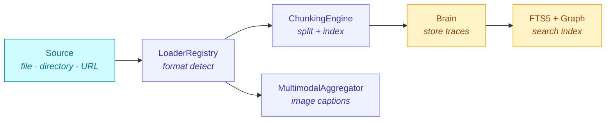

> The Memory ingestion pipeline converts external documents into searchable memory traces. It handles format detection, multi-tier PDF extraction, four chunking strategies, folder scanning with glob patterns, and optional vision-LLM image captioning.

---

## Overview

The ingestion pipeline transforms files and URLs into chunked, searchable memory traces stored in the agent's `brain.sqlite`:



### Quick Start

```ts
import { Memory } from '@framers/agentos';

const mem = await Memory.createSqlite({ path: './brain.sqlite' });

// Single file
await mem.ingest('./report.pdf');

// Directory with glob filters
await mem.ingest('./docs', {
  recursive: true,
  include: ['**/*.md', '**/*.pdf'],
  exclude: ['**/node_modules/**'],
});

// URL
await mem.ingest('https://example.com/api-docs');

await mem.close();
```

---

## Supported File Types

| Format | Extensions | Loader | Notes |
|--------|-----------|--------|-------|
| **PDF** | `.pdf` | `PdfLoader` | 3-tier extraction (see below) |
| **DOCX** | `.docx` | `DocxLoader` | Also supports Docling for high fidelity |
| **HTML** | `.html`, `.htm` | `HtmlLoader` | Strips scripts/styles, extracts text |
| **Markdown** | `.md`, `.mdx` | `MarkdownLoader` | Preserves heading structure for hierarchical chunking |
| **Plain text** | `.txt` | `TextLoader` | Direct pass-through |
| **CSV** | `.csv` | `CsvLoader` | Each row becomes a trace or chunk |
| **JSON** | `.json` | `JsonLoader` | Extracts string values recursively |
| **YAML** | `.yaml`, `.yml` | `YamlLoader` | Converted to JSON, then extracted |
| **URLs** | `http://`, `https://` | `UrlLoader` | Fetches content, then routes to appropriate loader |

The `LoaderRegistry` auto-detects the correct loader based on file extension. When Docling or OCR loaders are available in the environment, they automatically override the default handlers for PDF and DOCX.

---

## 3-Tier PDF Extraction

PDF extraction uses a cascading strategy that maximises text fidelity while remaining zero-dependency by default:

| Tier | Engine | Activation | Fidelity | Dependencies |
|------|--------|-----------|----------|-------------|
| **Tier 1** | `unpdf` | Always (built-in) | Good for born-digital PDFs | None (pure JS) |
| **Tier 2** | `tesseract.js` OCR | Auto when Tier 1 yields sparse text (< 50 chars/page average) | Handles scanned documents | `pnpm add tesseract.js` |
| **Tier 3** | Docling sidecar | Opt-in via `doclingEnabled: true` | Highest fidelity (tables, layouts, figures) | `pip install docling` |

### How the Cascade Works

```
PDF buffer arrives
  │
  ▼
[Tier 1: unpdf]
  │
  ├── Text extraction succeeds and is dense?
  │     └── YES → Return extracted text
  │
  └── Sparse text (< 50 chars/page)?
        │
        ▼
      [Tier 2: tesseract.js OCR]  (if installed)
        │
        └── Return OCR text

[Tier 3: Docling]  (if doclingEnabled)
  │
  └── Bypasses Tier 1+2 entirely
      Runs `python3 -m docling --output-format json <file>`
      Returns high-fidelity structured extraction
```

### Configuration

```ts
const mem = await Memory.createSqlite({
  path: './brain.sqlite',
  ingestion: {
    extractImages: true,   // Pull images from PDFs/DOCX
    ocrEnabled: true,      // Allow tesseract.js fallback
    doclingEnabled: false,  // Opt into Docling sidecar
  },
});
```

---

## Chunking Strategies

The `ChunkingEngine` splits document text into indexable chunks. Four strategies are available:

| Strategy | Best For | Algorithm |
|----------|----------|-----------|
| `fixed` | General-purpose, predictable sizing | Split at character count with word-boundary awareness and configurable overlap |
| `semantic` | Topic-coherent chunks | Embed individual sentences, split where cosine similarity drops below threshold |
| `hierarchical` | Markdown documents with heading structure | Each heading creates a chunk boundary; long sections sub-split with `fixed` |
| `layout` | Code-heavy or table-heavy documents | Preserve fenced code blocks and pipe-delimited tables as atomic chunks |

### Configuration

```ts
const mem = await Memory.createSqlite({
  path: './brain.sqlite',
  ingestion: {
    chunkStrategy: 'semantic',   // 'fixed' | 'semantic' | 'hierarchical' | 'layout'
    chunkSize: 512,              // Target characters per chunk
    chunkOverlap: 64,            // Overlap between consecutive chunks
  },
});
```

### Strategy Details

**Fixed** splits at a fixed character count, snapping to the nearest word boundary. The `chunkOverlap` parameter (default 64 chars) controls how much text is repeated between consecutive chunks to prevent context loss at split boundaries.

**Semantic** requires an embedding function. It embeds individual sentences, then splits wherever cosine similarity between adjacent sentences drops below a threshold (topic boundary detection). Falls back to `fixed` when no `embedFn` is supplied.

**Hierarchical** respects Markdown heading structure (`#`, `##`, `###`, etc.). Each heading creates a new chunk boundary, with the heading text stored in chunk metadata. Sections that exceed `chunkSize` are sub-split using the `fixed` strategy.

**Layout** detects fenced code blocks (` ``` `) and pipe-delimited tables (`| col |`) and preserves them as atomic chunks. Surrounding prose is split with `fixed`. This prevents code snippets and data tables from being cut mid-content.

---

## FolderScanner

`FolderScanner` provides recursive directory ingestion with glob-based filtering via `minimatch`:

```ts
// Ingest an entire documentation folder
const result = await mem.ingest('./project/docs', {
  recursive: true,
  include: ['**/*.md', '**/*.pdf', '**/*.txt'],
  exclude: ['**/node_modules/**', '**/.git/**', '**/dist/**'],
  onProgress: (processed, total, current) => {
    console.log(`[${processed}/${total}] ${current}`);
  },
});

console.log(`Succeeded: ${result.succeeded.length}`);
console.log(`Failed: ${result.failed.length}`);
console.log(`Chunks created: ${result.chunksCreated}`);
console.log(`Traces created: ${result.tracesCreated}`);
```

### Behaviour

- When `recursive` is `false` (default), only direct children of the directory are processed.
- `include` patterns are evaluated first; only matching files are considered.
- `exclude` patterns are evaluated second; matching files are skipped.
- Patterns are matched against the path relative to the scanned root directory.
- A single unreadable or unparseable file never aborts the entire scan --- errors are collected in `result.failed`.
- The `onProgress` callback fires after each file attempt (success or failure).

### IngestResult

```ts
interface IngestResult {
  succeeded: string[];                         // Absolute paths of ingested files
  failed: Array<{ path: string; error: string }>; // Files that could not be processed
  chunksCreated: number;                       // Total chunks stored
  tracesCreated: number;                       // Total memory traces created
}
```

---

## MultimodalAggregator

When `extractImages: true` is configured, document loaders (PDF, DOCX) extract embedded images as `ExtractedImage` objects. The `MultimodalAggregator` enriches them with natural-language captions via a vision-capable LLM:

```ts
const mem = await Memory.createSqlite({
  path: './brain.sqlite',
  ingestion: {
    extractImages: true,
    visionLlm: 'gpt-4o',   // Model used for image captioning
  },
});

await mem.ingest('./slides.pdf');
// Images are extracted, captioned, and stored in document_images table
```

### How It Works

1. Document loaders produce `ExtractedImage` objects (raw bytes + MIME type + optional page number).
2. `MultimodalAggregator` receives the image batch and calls the `describeImage` function for each image lacking a caption.
3. Images are processed in parallel via `Promise.allSettled` --- a single failed captioning attempt does not block the rest.
4. Failed images retain their un-captioned state rather than propagating errors.
5. Captions are stored in the `document_images.caption` column and indexed for text retrieval.

### Passthrough Mode

When no `describeImage` function is configured, the aggregator passes images through unchanged. This is the default behaviour when `visionLlm` is not set.

---

## URL Ingestion

The `UrlLoader` fetches content from HTTP/HTTPS URLs and routes it through the appropriate document loader:

```ts
// Single URL
await mem.ingest('https://docs.example.com/guide');

// The UrlLoader:
// 1. Fetches the URL via HTTP GET
// 2. Detects content type from response headers
// 3. Routes to HtmlLoader, MarkdownLoader, etc.
// 4. Chunks and stores as memory traces
```

---

## Idempotent Re-Ingestion

Every ingested document is tracked in the `documents` table with a SHA-256 `content_hash`. When the same file is ingested again:

- If the content hash matches the previously ingested version, the file is skipped.
- If the content has changed, the old chunks are replaced with the new extraction.

This makes it safe to re-run ingestion on the same directory without creating duplicates.

---

## Configuration Reference

All ingestion options can be set at the `Memory` constructor level (applied to every `ingest()` call) or per-call:

| Option | Default | Description |
|--------|---------|-------------|
| `chunkStrategy` | `'semantic'` | Chunking algorithm: `fixed`, `semantic`, `hierarchical`, `layout` |
| `chunkSize` | `512` | Target character count per chunk |
| `chunkOverlap` | `64` | Character overlap between consecutive chunks |
| `extractImages` | `false` | Extract embedded images from PDF/DOCX |
| `ocrEnabled` | `false` | Allow tesseract.js fallback for sparse PDFs |
| `doclingEnabled` | `false` | Use Docling sidecar for high-fidelity extraction |
| `visionLlm` | `undefined` | Vision model for image captioning |
| `recursive` | `false` | Descend into subdirectories (per-call) |
| `include` | `undefined` | Glob patterns to include (per-call) |
| `exclude` | `undefined` | Glob patterns to exclude (per-call) |

---

## Source Files

| File | Purpose |
|------|---------|
| `memory/ingestion/LoaderRegistry.ts` | Auto-detection and loader dispatch |
| `memory/ingestion/PdfLoader.ts` | 3-tier PDF extraction (unpdf + OCR + Docling) |
| `memory/ingestion/OcrPdfLoader.ts` | tesseract.js OCR fallback |
| `memory/ingestion/DoclingLoader.ts` | Python Docling sidecar |
| `memory/ingestion/FolderScanner.ts` | Recursive directory walking |
| `memory/ingestion/ChunkingEngine.ts` | 4-strategy chunking |
| `memory/ingestion/MultimodalAggregator.ts` | Image caption enrichment |
| `memory/ingestion/UrlLoader.ts` | HTTP/HTTPS URL fetching |
| `memory/facade/types.ts` | `IngestOptions`, `IngestResult`, `IngestionConfig` |
