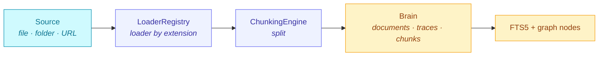

> `Memory.ingest()` turns files, folders and URLs into memory traces: it picks a loader by file extension, extracts the text, splits it into chunks, and stores each chunk as a trace in the brain with a full-text index entry.

---

## Overview



```mermaid
flowchart LR
    Source["Source<br/><i>file · folder · URL</i>"]:::input
    Loader["LoaderRegistry<br/><i>loader by extension</i>"]:::process
    Chunker["ChunkingEngine<br/><i>split</i>"]:::process
    Brain["Brain<br/><i>documents · traces · chunks</i>"]:::data
    Index["FTS5 + graph nodes"]:::data

    Source --> Loader --> Chunker --> Brain --> Index

    classDef input fill:#cffafe,stroke:#0891b2,color:#0e7490
    classDef process fill:#eef2ff,stroke:#6366f1,color:#3730a3
    classDef data fill:#fef3c7,stroke:#f59e0b,color:#92400e
```

### Quick Start

```ts
import { Memory } from '@framers/agentos';

const mem = await Memory.createSqlite('./brain.sqlite', {
  ingestion: { chunkStrategy: 'fixed', chunkSize: 512, chunkOverlap: 64 },
});

// One file
await mem.ingest('./report.pdf');

// A folder, with glob filters relative to it
await mem.ingest('./docs', {
  include: ['**/*.md', '**/*.pdf'],
  exclude: ['**/node_modules/**'],
});

// A URL
await mem.ingest('https://example.com/api-docs');

await mem.close();
```

`ingest()` decides what the source is in this order: an existing folder, an existing file, an `http://` or `https://` URL. Anything else lands in `result.failed`.

---

## Supported File Types

| Format | Extensions | Loader | What it does |
|--------|-----------|--------|--------------|
| PDF | `.pdf` | [`PdfLoader`](https://github.com/framerslab/agentos/blob/master/src/cognition/memory/io/ingestion/PdfLoader.ts) | Text extraction with fallbacks (see below) |
| DOCX | `.docx` | [`DocxLoader`](https://github.com/framerslab/agentos/blob/master/src/cognition/memory/io/ingestion/DocxLoader.ts) | `mammoth.extractRawText()`; replaced by the Docling loader when Docling is available |
| HTML | `.html`, `.htm` | [`HtmlLoader`](https://github.com/framerslab/agentos/blob/master/src/cognition/memory/io/ingestion/HtmlLoader.ts) | Removes `<script>` and `<style>` blocks and tags, keeps the text |
| Markdown | `.md`, `.mdx` | [`MarkdownLoader`](https://github.com/framerslab/agentos/blob/master/src/cognition/memory/io/ingestion/MarkdownLoader.ts) | Parses and strips YAML front matter (`gray-matter`); the title comes from the front matter or the first heading |
| Text | `.txt`, `.csv`, `.tsv`, `.json`, `.yaml`, `.yml` | [`TextLoader`](https://github.com/framerslab/agentos/blob/master/src/cognition/memory/io/ingestion/TextLoader.ts) | Reads the file as UTF-8 text, unparsed; `format` names the extension |
| URL | `http://`, `https://` | [`UrlLoader`](https://github.com/framerslab/agentos/blob/master/src/cognition/memory/io/ingestion/UrlLoader.ts) | Fetches the URL and routes by content type |

[`LoaderRegistry`](https://github.com/framerslab/agentos/blob/master/src/cognition/memory/io/ingestion/LoaderRegistry.ts) maps extensions to loaders. A folder scan considers only files whose extension a loader claims. `registry.register(loader)` adds a loader for its `supportedExtensions`, replacing an earlier one for the same extension.

`UrlLoader` throws on a non-2xx response. A `text/html` response goes to the HTML loader, `application/pdf` to the PDF loader, and every other content type, Markdown included, is kept as raw text with `format: 'text'`.

### Word files and what they inflate to

```ts
import { DocxLoader, DocumentTooLargeError } from '@framers/agentos/cognition/memory';

const loader = new DocxLoader({ maxInflatedBytes: 64 * 1024 * 1024 });
try {
  const doc = await loader.load(uploadedBuffer);
} catch (error) {
  if (error instanceof DocumentTooLargeError) {
    // error.limit is the bound; mammoth never read the file
  }
}
```

A `.docx` file is a ZIP archive, and mammoth inflates every part it reads, so a file of a few megabytes can inflate to gigabytes. Before mammoth reads a file, `DocxLoader` inflates each entry of the archive with `node:zlib` under `maxInflatedBytes`, one entry's output at a time, and throws `DocumentTooLargeError` (`code` `'DOCUMENT_TOO_LARGE'`, `limit` the bound) once the entries pass it together. The size an entry states for itself is not trusted. The bound is 134,217,728 bytes (128 MiB) when `maxInflatedBytes` is left out, which is how `LoaderRegistry` registers the loader; `registry.register(new DocxLoader({ maxInflatedBytes }))` replaces it. When the Docling loader replaces `DocxLoader` for `.docx`, this bound does not apply.

A file the loader cannot read as a ZIP archive the way mammoth's reader does is refused with `DocxLoader: not a Word archive` before mammoth runs: no end of central directory record, a ZIP64 record, bytes between the central directory and the end record, an entry outside the file, entries that share their data (their compressed data together larger than the bytes before the central directory, where every entry's data lies apart), a compression method other than stored or deflated, or data that does not inflate.

---

## PDF Extraction

The registry builds `PdfLoader` with two optional fallbacks, probed once when the registry is created:

| Engine | Used when | Needs |
|--------|-----------|-------|
| Docling (`python3 -m docling --output-format json <file>`) | `python3 -m docling --version` succeeds; then every PDF and DOCX goes to Docling, and unpdf is not used | Python with `docling` installed |
| `unpdf` | No Docling | Nothing: a dependency of `@framers/agentos` |
| `tesseract.js` OCR | No Docling, `tesseract.js` resolves, and unpdf returns fewer than 50 characters per page on average | `tesseract.js` installed |

No option switches these engines: the registry uses whatever it finds. The `ingestion` config fields `ocrEnabled` and `doclingEnabled` are declared and not read.

---

## Chunking Strategies

[`ChunkingEngine`](https://github.com/framerslab/agentos/blob/master/src/cognition/memory/io/ingestion/ChunkingEngine.ts) splits the extracted text. `ingest()` reads `chunkStrategy` (default `'semantic'`), `chunkSize` (default 512 characters) and `chunkOverlap` (default 64 characters) from the `ingestion` config the brain was opened with; the strategy cannot change per call.

| Strategy | What it does |
|----------|--------------|
| `fixed` | Cuts every `chunkSize` characters, moved back to the last whitespace so no word is split (a window with no whitespace is cut hard), and starts the next chunk `chunkOverlap` characters before the cut |
| `semantic` | With an embedding function, splits the text into sentences, embeds them, and starts a new chunk where the cosine similarity of two neighbouring sentences is below 0.3; a group longer than twice `chunkSize` is cut with `fixed`. Without one, it is `fixed` |
| `hierarchical` | Starts a section at every Markdown heading (`#` to `######`); a section longer than `chunkSize` is cut with `fixed`; each chunk carries its heading, level and parent headings |
| `layout` | Keeps each fenced code block and each run of lines containing `|` as one chunk; the prose between them is cut with `fixed` |

`ingest()` calls the engine without an embedding function, so through `Memory` the default `semantic` strategy runs as `fixed`. The brain stores each chunk's text and position; the heading and block-type metadata the engine attaches are not stored.

---

## What a document becomes

For each loaded document, `ingest()`:

1. Computes the SHA-256 of the extracted text. When any document in the brain already has that hash, the document is skipped: it stays in `succeeded` and adds no chunks.
2. Inserts a `documents` row (path, format, title, hash, chunk count, the loader's metadata).
3. For each chunk, inserts a `memory_traces` row (`type: 'semantic'`, scope `user`, strength 1.0, no embedding), its `memory_traces_fts` entry, a graph node when the graph is on (the default), and a `document_chunks` row.

Chunk traces get no embedding, so `recall()` finds them through full-text search.

The skip compares content, not paths. A file whose text changed is stored again as a new document, and the traces of its earlier version stay in the brain. For a flat vector collection without the brain (doc citations, a help index), see [Incremental Vector Ingestion](./INCREMENTAL_VECTOR_INGESTION.md).

---

## Folders

[`FolderScanner`](https://github.com/framerslab/agentos/blob/master/src/cognition/memory/io/ingestion/FolderScanner.ts) walks the folder and loads every candidate file before any chunk is stored:

```ts
const result = await mem.ingest('./project/docs', {
  recursive: true,
  include: ['**/*.md', '**/*.pdf', '**/*.txt'],
  exclude: ['**/node_modules/**', '**/.git/**', '**/dist/**'],
  onProgress: (processed, total, current) => {
    console.log(`[${processed}/${total}] ${current}`);
  },
});

console.log(result.succeeded.length, result.failed.length, result.chunksCreated, result.tracesCreated);
```

- `recursive` defaults to `true` in `ingest()` (the `IngestOptions` comment says `false`).
- `include` and `exclude` are `minimatch` patterns (dot files included) matched against the path relative to the folder; a file must match an `include` pattern when there are any, and must match no `exclude` pattern.
- A folder path containing a `..` segment is rejected, and the error lands in `result.failed`.
- A file that fails to load goes to `failed` and the scan goes on. `onProgress(processed, total, current)` fires after each file is loaded or fails.
- A file that loaded but failed to store appears in both `succeeded` and `failed`.
- `IngestOptions.format` is declared and not read.

```ts
interface IngestResult {
  succeeded: string[];                             // files (or the URL) that loaded
  failed: Array<{ path: string; error: string }>;  // load or store errors
  chunksCreated: number;
  tracesCreated: number;                           // one trace per chunk
}
```

---

## Images

No loader extracts images, and `ingest()` writes nothing to `document_images`. The `ingestion` config fields `extractImages` and `visionLlm` are declared and not read.

[`MultimodalAggregator`](https://github.com/framerslab/agentos/blob/master/src/cognition/memory/io/ingestion/MultimodalAggregator.ts) is a separate utility for hosts that extract images themselves: `new MultimodalAggregator({ describeImage })` and `processImages(images)` add a caption to each `ExtractedImage` that lacks one, in parallel with `Promise.allSettled`; an image whose captioning fails keeps no caption, and without `describeImage` the images pass through unchanged. For image retrieval, see [Multimodal RAG](./MULTIMODAL_RAG.md).

---

## Configuration Reference

Read by `ingest()`:

| Where | Option | Default |
|-------|--------|---------|
| `ingestion` config | `chunkStrategy` | `'semantic'` (runs as `fixed` through `Memory`) |
| `ingestion` config | `chunkSize` | `512` characters |
| `ingestion` config | `chunkOverlap` | `64` characters |
| `ingest()` options | `recursive` | `true` |
| `ingest()` options | `include`, `exclude` | none |
| `ingest()` options | `onProgress` | none |

Declared and not read: `ingestion.extractImages`, `ingestion.ocrEnabled`, `ingestion.doclingEnabled`, `ingestion.visionLlm`, and the `format` option of `ingest()`.

---

## Source Files

| File | Purpose |
|------|---------|
| [`io/facade/Memory.ts`](https://github.com/framerslab/agentos/blob/master/src/cognition/memory/io/facade/Memory.ts) | `ingest()` and the per-document storage |
| [`io/ingestion/LoaderRegistry.ts`](https://github.com/framerslab/agentos/blob/master/src/cognition/memory/io/ingestion/LoaderRegistry.ts) | Extension routing and the optional loaders |
| [`io/ingestion/PdfLoader.ts`](https://github.com/framerslab/agentos/blob/master/src/cognition/memory/io/ingestion/PdfLoader.ts) | unpdf with the OCR and Docling fallbacks |
| [`io/ingestion/OcrPdfLoader.ts`](https://github.com/framerslab/agentos/blob/master/src/cognition/memory/io/ingestion/OcrPdfLoader.ts) | tesseract.js OCR |
| [`io/ingestion/DoclingLoader.ts`](https://github.com/framerslab/agentos/blob/master/src/cognition/memory/io/ingestion/DoclingLoader.ts) | Python Docling subprocess |
| [`io/ingestion/FolderScanner.ts`](https://github.com/framerslab/agentos/blob/master/src/cognition/memory/io/ingestion/FolderScanner.ts) | Folder walking and glob filters |
| [`io/ingestion/ChunkingEngine.ts`](https://github.com/framerslab/agentos/blob/master/src/cognition/memory/io/ingestion/ChunkingEngine.ts) | The four strategies |
| [`io/ingestion/UrlLoader.ts`](https://github.com/framerslab/agentos/blob/master/src/cognition/memory/io/ingestion/UrlLoader.ts) | URL fetching |
| [`io/ingestion/MultimodalAggregator.ts`](https://github.com/framerslab/agentos/blob/master/src/cognition/memory/io/ingestion/MultimodalAggregator.ts) | Image captions for hosts |
| [`io/facade/types.ts`](https://github.com/framerslab/agentos/blob/master/src/cognition/memory/io/facade/types.ts) | `IngestionConfig`, `IngestOptions`, `IngestResult` |

All paths are under `src/cognition/memory/`.
