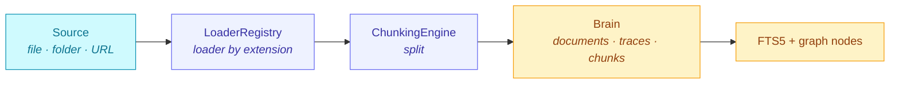

> `Memory.ingest()` turns files, folders and URLs into memory traces: it picks a loader by file extension, extracts the text, splits it into chunks, and stores each chunk as a trace in the brain with a full-text index entry.

---

## Overview



```mermaid
flowchart LR
    Source["Source<br/><i>file · folder · URL</i>"]:::input
    Loader["LoaderRegistry<br/><i>loader by extension</i>"]:::process
    Chunker["ChunkingEngine<br/><i>split</i>"]:::process
    Brain["Brain<br/><i>documents · traces · chunks</i>"]:::data
    Index["FTS5 + graph nodes"]:::data

    Source --> Loader --> Chunker --> Brain --> Index

    classDef input fill:#cffafe,stroke:#0891b2,color:#0e7490
    classDef process fill:#eef2ff,stroke:#6366f1,color:#3730a3
    classDef data fill:#fef3c7,stroke:#f59e0b,color:#92400e
```

### Quick Start

```ts
import { Memory } from '@framers/agentos';

const mem = await Memory.createSqlite('./brain.sqlite', {
  ingestion: { chunkStrategy: 'fixed', chunkSize: 512, chunkOverlap: 64 },
});

// One file
await mem.ingest('./report.pdf');

// A folder, with glob filters relative to it
await mem.ingest('./docs', {
  include: ['**/*.md', '**/*.pdf'],
  exclude: ['**/node_modules/**'],
});

// A URL
await mem.ingest('https://example.com/api-docs');

await mem.close();
```

`ingest()` decides what the source is in this order: an existing folder, an existing file, an `http://` or `https://` URL. Anything else lands in `result.failed`.

---

## Supported File Types

| Format | Extensions | Loader | What it does |
|--------|-----------|--------|--------------|
| PDF | `.pdf` | [`PdfLoader`](https://github.com/framerslab/agentos/blob/master/src/cognition/memory/io/ingestion/PdfLoader.ts) | Text extraction with fallbacks (see below) |
| DOCX | `.docx` | [`DocxLoader`](https://github.com/framerslab/agentos/blob/master/src/cognition/memory/io/ingestion/DocxLoader.ts) | `mammoth.extractRawText()`; replaced by the Docling loader when Docling is available |
| HTML | `.html`, `.htm` | [`HtmlLoader`](https://github.com/framerslab/agentos/blob/master/src/cognition/memory/io/ingestion/HtmlLoader.ts) | Removes `<script>` and `<style>` blocks and tags, keeps the text |
| Markdown | `.md`, `.mdx` | [`MarkdownLoader`](https://github.com/framerslab/agentos/blob/master/src/cognition/memory/io/ingestion/MarkdownLoader.ts) | Parses and strips YAML front matter (`gray-matter`), read as data: a block marked as JavaScript (`---js`) is dropped and never evaluated; the title comes from the front matter or the first heading |
| Text | `.txt`, `.csv`, `.tsv`, `.json`, `.yaml`, `.yml` | [`TextLoader`](https://github.com/framerslab/agentos/blob/master/src/cognition/memory/io/ingestion/TextLoader.ts) | Reads the file as UTF-8 text, unparsed; `format` names the extension |
| URL | `http://`, `https://` | [`UrlLoader`](https://github.com/framerslab/agentos/blob/master/src/cognition/memory/io/ingestion/UrlLoader.ts) | Fetches the URL and routes by content type |

[`LoaderRegistry`](https://github.com/framerslab/agentos/blob/master/src/cognition/memory/io/ingestion/LoaderRegistry.ts) maps extensions to loaders. A folder scan considers only files whose extension a loader claims. `registry.register(loader)` adds a loader for its `supportedExtensions`, replacing an earlier one for the same extension.

Reading through the global `fetch`, `UrlLoader` throws on a non-2xx response. A `text/html` response goes to the HTML loader, `application/pdf` to the PDF loader, and every other content type, Markdown included, is kept as raw text with `format: 'text'`.

### An address a person gives a server

```ts
import { guardedFetch, GuardedFetchError, HtmlLoader, PdfLoader, UrlLoader } from '@framers/agentos/cognition/memory';

const loaders = {
  getLoader: (extension: string) =>
    extension === '.html' ? new HtmlLoader() : extension === '.pdf' ? new PdfLoader() : undefined,
};
const loader = new UrlLoader(loaders, {
  fetchDocument: (url) => guardedFetch(url, { maxBytes: 2 * 1024 * 1024, deadlineMs: 10_000 }),
});

try {
  const doc = await loader.load(addressFromTheForm);
} catch (error) {
  if (error instanceof GuardedFetchError) {
    // error.reason: 'address', 'scheme', 'port', 'redirects', 'status', 'type', 'size', 'deadline' or 'network'
  }
}
```

A server that fetches an address someone typed can be pointed at itself or at the network it sits on: `http://169.254.169.254/` is where cloud metadata services answer, and a name can resolve to `127.0.0.1`. `guardedFetch` reads such an address under these rules, and `UrlLoader` takes it as `fetchDocument`:

- The host is resolved first, and the fetch is refused (`reason` `'address'`) when any address it resolves to is not public: loopback, private, carrier-grade NAT, link-local, unique-local, multicast, documentation, reserved or unspecified, in IPv4 and IPv6, with an IPv4 address carried inside an IPv6 one read as IPv4. `isPublicAddress(address)` is that rule. `allowAddresses` exempts the addresses it lists, for a test's own server.
- The connection goes to the address that was checked, on a connection of its own, so a second lookup cannot send it elsewhere. An `https:` connection checks the certificate against the host's name.
- Only `http:` and `https:` addresses without a user name or password are read (`'scheme'`), on ports 80 and 443 unless `allowPorts` names others (`'port'`).
- Up to `maxRedirects` redirects are followed (3 unless set), each checked as the first address is (`'redirects'` past them).
- The body is read as it arrives and refused once it passes `maxBytes`, counted after a gzip, deflate or br coding is decoded (`'size'`); a body in another coding is refused (`'type'`).
- Only the media types in `accept` are read (`'type'`): `text/html`, `application/xhtml+xml`, `application/pdf` and `text/plain` unless set. An answer that is neither a 2xx nor a redirect (301, 302, 303, 307 or 308) is refused (`'status'`).
- One deadline, `deadlineMs`, covers the lookups, the redirects and the body (`'deadline'`). An abort of `signal` ends the fetch with the signal's own reason.

With `fetchDocument`, the answer's media type picks the loader: HTML and XHTML go to the `.html` loader, PDF to the `.pdf` loader, anything else is read as UTF-8 text, and `metadata.source` is the last address after redirects. `UrlLoader` takes its loaders from any object with `getLoader(extension)`, so a server builds no `LoaderRegistry`, whose constructor probes for Docling. When that object has no loader for an HTML, XHTML or PDF answer of `fetchDocument`, `load()` throws an error that names the media type and not the address, so such an answer is never returned as raw markup.

### Word files and what they inflate to

```ts
import { DocxLoader, DocumentTooLargeError } from '@framers/agentos/cognition/memory';

const loader = new DocxLoader({ maxInflatedBytes: 64 * 1024 * 1024 });
try {
  const doc = await loader.load(uploadedBuffer);
} catch (error) {
  if (error instanceof DocumentTooLargeError) {
    // error.limit is the bound; mammoth never read the file
  }
}
```

A `.docx` file is a ZIP archive, and mammoth inflates every part it reads, so a file of a few megabytes can inflate to gigabytes. Before mammoth reads a file, `DocxLoader` inflates each entry of the archive with `node:zlib` under `maxInflatedBytes`, one entry's output at a time, and throws `DocumentTooLargeError` (`code` `'DOCUMENT_TOO_LARGE'`, `limit` the bound) once the entries pass it together. The size an entry states for itself is not trusted. The bound is 134,217,728 bytes (128 MiB) when `maxInflatedBytes` is left out, which is how `LoaderRegistry` registers the loader; `registry.register(new DocxLoader({ maxInflatedBytes }))` replaces it. When the Docling loader replaces `DocxLoader` for `.docx`, this bound does not apply.

The bound is on what the archive inflates to, not on the memory a read takes. Every entry counts toward it, images and other media included, though `mammoth.extractRawText()` reads only the XML parts. mammoth parses each XML part it reads into an element tree, which takes a multiple of the part's size, so for files from people you do not know, set `maxInflatedBytes` well below the memory the process can spare, or read them with `loadIsolated` (next section).

A file the loader cannot read as a ZIP archive the way mammoth's reader does is refused with `DocxLoader: not a Word archive` before mammoth runs: no end of central directory record, a ZIP64 record, a central directory that does not end where the end record starts (bytes between the two, or bytes in front of an archive whose offsets do not count them), an entry outside the file, entries that share their data (their compressed data together larger than the bytes before the central directory, where every entry's data lies apart), a compression method other than stored or deflated, or data that does not inflate.

### A file from someone you do not know

```ts
import {
  loadIsolated,
  DocumentTooComplexError,
  DocumentReadTimeoutError,
  DocumentTooLargeError,
} from '@framers/agentos/cognition/memory';

try {
  const doc = await loadIsolated('docx', upload, {
    maxHeapMb: 256,
    timeoutMs: 30_000,
    maxExternalMb: 128,
    maxInflatedBytes: 64 * 1024 * 1024,
  });
} catch (error) {
  if (error instanceof DocumentTooComplexError) {
    // error.resource is 'heap' or 'external'; error.limitMb is the bound the read passed
  } else if (error instanceof DocumentReadTimeoutError) {
    // error.timeoutMs is the deadline
  } else if (error instanceof DocumentTooLargeError) {
    // error.limit is the Word loader's bound
  } else {
    // the loader's own error, with its name and message
  }
}
```

`loadIsolated(kind, bytes, options)` reads with the loader of its kind (`'pdf'` with `PdfLoader`, `'docx'` with `DocxLoader`, `'text'` with `TextLoader`, `'markdown'` with `MarkdownLoader`) in a `node:worker_threads` worker, and answers the `content`, `metadata` and `format` that loader answers. It copies the bytes into a buffer of its own before it moves them to the worker, so the caller's buffer stays usable. The answer is copied into the caller's heap, so the caller holds whatever text the worker read within its bounds. It refuses a read in four ways:

| Refusal | When | What it carries |
|---------|------|-----------------|
| `DocumentTooComplexError`, `code` `'DOCUMENT_TOO_COMPLEX'` | The worker reaches its heap cap (`resource` `'heap'`), or its memory outside the heap passes `maxExternalMb` (`resource` `'external'`) | `limitMb`, the bound the read passed |
| `DocumentReadTimeoutError`, `code` `'DOCUMENT_READ_TIMEOUT'` | The read passes `timeoutMs` | `timeoutMs` |
| `DocumentTooLargeError`, `code` `'DOCUMENT_TOO_LARGE'` | A Word file's entries inflate past `maxInflatedBytes`, which goes to `DocxLoader` (its default when left out) | `limit` |
| The loader's own error | The loader throws anything else, such as `DocxLoader: not a Word archive` | An `Error` with the loader's error's name and message |

Any other failure of the worker rejects with the worker's own error (for a bundle that leaves out the worker's entry file, Node's `Cannot find module` error), and a worker that stops with neither an answer nor an error rejects with an `Error` that names its exit code.

On every path, an answer included, the worker is ended before the call settles. A kind outside the four or bytes that are not a `Uint8Array` reject with a `TypeError`, and a bound that is not a positive, finite number, or a `timeoutMs` past 2,147,483,647, with a `RangeError`, before any worker starts.

What each bound holds, and what it leaves:

- `maxHeapMb` (default 256) caps the worker's old generation through `resourceLimits.maxOldGenerationSizeMb`. A read that reaches the cap ends the worker, and the process that called `loadIsolated` reads on. `--max-old-space-size` overrides the cap, as Node documents for `resourceLimits`, wherever the process was given it: on its command line or in `NODE_OPTIONS`.
- `timeoutMs` (default 30,000, at most 2,147,483,647, the longest delay a Node timer holds) counts from the worker's start, the loading of the loader included.
- `maxExternalMb` bounds what the heap cap does not count. Node's resource limits leave out array buffers, and the loaders hold large ones: JSZip, which mammoth reads a Word file with, keeps a part's inflated chunks and then their concatenation, and pdf.js keeps every decoded byte of a stream. With `maxExternalMb`, the worker's `external_memory` (its array buffers and external strings) is read with `worker.getHeapStatistics()` every 20 ms, and the worker is ended once it passes the bound. The check samples and does not cap: it runs on a timer on the caller's event loop, so what the worker allocates between two checks can pass the bound before the worker is ended (a busy caller's thread delays the next check), and a read that ends between two checks is answered whatever it held at its peak. Without `maxExternalMb`, nothing bounds that memory. `worker.getHeapStatistics()` comes with Node 22.16 and 24.0; on an earlier Node, a read given `maxExternalMb` is refused with a `TypeError`.

A read still shares its process: the caps end the worker, and a fault the worker cannot catch ends both. The worker is a thread of that process, with its access to files, the network and a copy of its environment variables: it bounds a read's memory and time, and it is not a sandbox for code. The worker's entry is `isolatedLoadWorker.js`, compiled beside `loadIsolated.js` in the package's `dist`. The package ships ES modules only, and `loadIsolated` finds the entry from its own URL (`new URL('./isolatedLoadWorker.js', import.meta.url)`), so a bundler that moves `loadIsolated.js` has to carry that file beside it. The worker is started with an empty `execArgv` in place of the Node options it would inherit from the caller's thread: an `--input-type` given with `node -e` would refuse its entry file, and the caller's `--require` and `--import` preloads would load inside the capped heap. `NODE_OPTIONS` from the environment applies to it as to any Node process. V8's options are the whole process's, whatever a worker's `execArgv`, so a `--max-old-space-size` the process was started with still overrides `maxHeapMb`.

---

## PDF Extraction

The registry builds `PdfLoader` with two optional fallbacks, probed once when the registry is created:

| Engine | Used when | Needs |
|--------|-----------|-------|
| Docling (`python3 -m docling --output-format json <file>`) | `python3 -m docling --version` succeeds; then every PDF and DOCX goes to Docling, and unpdf is not used | Python with `docling` installed |
| `unpdf` | No Docling | Nothing: a dependency of `@framers/agentos` |
| `tesseract.js` OCR | No Docling, `tesseract.js` resolves, and unpdf returns fewer than 50 characters per page on average | `tesseract.js` installed |

No option switches these engines: the registry uses whatever it finds. The `ingestion` config fields `ocrEnabled` and `doclingEnabled` are declared and not read.

---

## Chunking Strategies

[`ChunkingEngine`](https://github.com/framerslab/agentos/blob/master/src/cognition/memory/io/ingestion/ChunkingEngine.ts) splits the extracted text. `ingest()` reads `chunkStrategy` (default `'semantic'`), `chunkSize` (default 512 characters) and `chunkOverlap` (default 64 characters) from the `ingestion` config the brain was opened with; the strategy cannot change per call.

| Strategy | What it does |
|----------|--------------|
| `fixed` | Cuts every `chunkSize` characters, moved back to the last whitespace so no word is split (a window with no whitespace is cut hard), and starts the next chunk `chunkOverlap` characters before the cut |
| `semantic` | With an embedding function, splits the text into sentences, embeds them, and starts a new chunk where the cosine similarity of two neighbouring sentences is below 0.3; a group longer than twice `chunkSize` is cut with `fixed`. Without one, it is `fixed` |
| `hierarchical` | Starts a section at every Markdown heading (`#` to `######`); a section longer than `chunkSize` is cut with `fixed`; each chunk carries its heading, level and parent headings |
| `layout` | Keeps each fenced code block and each run of lines containing `|` as one chunk; the prose between them is cut with `fixed` |

`ingest()` calls the engine without an embedding function, so through `Memory` the default `semantic` strategy runs as `fixed`. The brain stores each chunk's text and position; the heading and block-type metadata the engine attaches are not stored.

---

## What a document becomes

For each loaded document, `ingest()`:

1. Computes the SHA-256 of the extracted text. When any document in the brain already has that hash, the document is skipped: it stays in `succeeded` and adds no chunks.
2. Inserts a `documents` row (path, format, title, hash, chunk count, the loader's metadata).
3. For each chunk, inserts a `memory_traces` row (`type: 'semantic'`, scope `user`, strength 1.0, no embedding), its `memory_traces_fts` entry, a graph node when the graph is on (the default), and a `document_chunks` row.

Chunk traces get no embedding, so `recall()` finds them through full-text search.

The skip compares content, not paths. A file whose text changed is stored again as a new document, and the traces of its earlier version stay in the brain. For a flat vector collection without the brain (doc citations, a help index), see [Incremental Vector Ingestion](./INCREMENTAL_VECTOR_INGESTION.md).

---

## Folders

[`FolderScanner`](https://github.com/framerslab/agentos/blob/master/src/cognition/memory/io/ingestion/FolderScanner.ts) walks the folder and loads every candidate file before any chunk is stored:

```ts
const result = await mem.ingest('./project/docs', {
  recursive: true,
  include: ['**/*.md', '**/*.pdf', '**/*.txt'],
  exclude: ['**/node_modules/**', '**/.git/**', '**/dist/**'],
  onProgress: (processed, total, current) => {
    console.log(`[${processed}/${total}] ${current}`);
  },
});

console.log(result.succeeded.length, result.failed.length, result.chunksCreated, result.tracesCreated);
```

- `recursive` defaults to `true` in `ingest()` (the `IngestOptions` comment says `false`).
- `include` and `exclude` are `minimatch` patterns (dot files included) matched against the path relative to the folder; a file must match an `include` pattern when there are any, and must match no `exclude` pattern.
- A folder path containing a `..` segment is rejected, and the error lands in `result.failed`.
- A file that fails to load goes to `failed` and the scan goes on. `onProgress(processed, total, current)` fires after each file is loaded or fails.
- A file that loaded but failed to store appears in both `succeeded` and `failed`.
- `IngestOptions.format` is declared and not read.

```ts
interface IngestResult {
  succeeded: string[];                             // files (or the URL) that loaded
  failed: Array<{ path: string; error: string }>;  // load or store errors
  chunksCreated: number;
  tracesCreated: number;                           // one trace per chunk
}
```

---

## Images

No loader extracts images, and `ingest()` writes nothing to `document_images`. The `ingestion` config fields `extractImages` and `visionLlm` are declared and not read.

[`MultimodalAggregator`](https://github.com/framerslab/agentos/blob/master/src/cognition/memory/io/ingestion/MultimodalAggregator.ts) is a separate utility for hosts that extract images themselves: `new MultimodalAggregator({ describeImage })` and `processImages(images)` add a caption to each `ExtractedImage` that lacks one, in parallel with `Promise.allSettled`; an image whose captioning fails keeps no caption, and without `describeImage` the images pass through unchanged. For image retrieval, see [Multimodal RAG](./MULTIMODAL_RAG.md).

---

## Configuration Reference

Read by `ingest()`:

| Where | Option | Default |
|-------|--------|---------|
| `ingestion` config | `chunkStrategy` | `'semantic'` (runs as `fixed` through `Memory`) |
| `ingestion` config | `chunkSize` | `512` characters |
| `ingestion` config | `chunkOverlap` | `64` characters |
| `ingest()` options | `recursive` | `true` |
| `ingest()` options | `include`, `exclude` | none |
| `ingest()` options | `onProgress` | none |

Declared and not read: `ingestion.extractImages`, `ingestion.ocrEnabled`, `ingestion.doclingEnabled`, `ingestion.visionLlm`, and the `format` option of `ingest()`.

---

## Source Files

| File | Purpose |
|------|---------|
| [`io/facade/Memory.ts`](https://github.com/framerslab/agentos/blob/master/src/cognition/memory/io/facade/Memory.ts) | `ingest()` and the per-document storage |
| [`io/ingestion/LoaderRegistry.ts`](https://github.com/framerslab/agentos/blob/master/src/cognition/memory/io/ingestion/LoaderRegistry.ts) | Extension routing and the optional loaders |
| [`io/ingestion/PdfLoader.ts`](https://github.com/framerslab/agentos/blob/master/src/cognition/memory/io/ingestion/PdfLoader.ts) | unpdf with the OCR and Docling fallbacks |
| [`io/ingestion/OcrPdfLoader.ts`](https://github.com/framerslab/agentos/blob/master/src/cognition/memory/io/ingestion/OcrPdfLoader.ts) | tesseract.js OCR |
| [`io/ingestion/DoclingLoader.ts`](https://github.com/framerslab/agentos/blob/master/src/cognition/memory/io/ingestion/DoclingLoader.ts) | Python Docling subprocess |
| [`io/ingestion/loadIsolated.ts`](https://github.com/framerslab/agentos/blob/master/src/cognition/memory/io/ingestion/loadIsolated.ts) | `loadIsolated`, `DocumentTooComplexError` and `DocumentReadTimeoutError` |
| [`io/ingestion/isolatedLoadWorker.ts`](https://github.com/framerslab/agentos/blob/master/src/cognition/memory/io/ingestion/isolatedLoadWorker.ts) | The worker thread's entry: one read with the loader of its kind |
| [`io/ingestion/FolderScanner.ts`](https://github.com/framerslab/agentos/blob/master/src/cognition/memory/io/ingestion/FolderScanner.ts) | Folder walking and glob filters |
| [`io/ingestion/ChunkingEngine.ts`](https://github.com/framerslab/agentos/blob/master/src/cognition/memory/io/ingestion/ChunkingEngine.ts) | The four strategies |
| [`io/ingestion/UrlLoader.ts`](https://github.com/framerslab/agentos/blob/master/src/cognition/memory/io/ingestion/UrlLoader.ts) | URL fetching |
| [`io/ingestion/guardedFetch.ts`](https://github.com/framerslab/agentos/blob/master/src/cognition/memory/io/ingestion/guardedFetch.ts) | `guardedFetch` and `isPublicAddress`, for an address a person gives a server |
| [`io/ingestion/MultimodalAggregator.ts`](https://github.com/framerslab/agentos/blob/master/src/cognition/memory/io/ingestion/MultimodalAggregator.ts) | Image captions for hosts |
| [`io/facade/types.ts`](https://github.com/framerslab/agentos/blob/master/src/cognition/memory/io/facade/types.ts) | `IngestionConfig`, `IngestOptions`, `IngestResult` |

All paths are under `src/cognition/memory/`.
