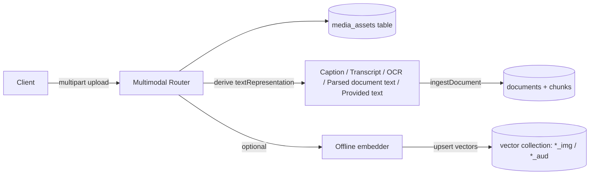
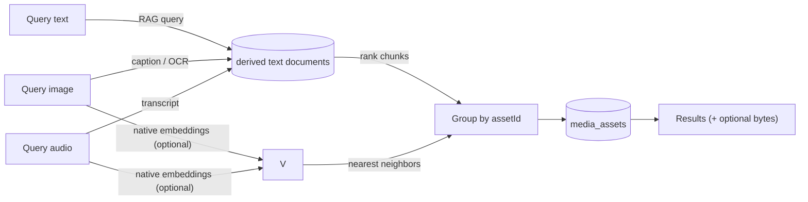

# Multimodal RAG (Image + Audio + Documents)

> **Memory benchmarks (full N=500, gpt-4o reader):** **85.6% on LongMemEval-S** at $0.0090 per correct, **+1.4 points above Mastra Observational Memory (84.23%)**. **70.2% on LongMemEval-M** on the 1.5M-token / 500-session haystack variant — the only open-source library on the public record above 65% on M with publicly reproducible methodology. The same text-first retrieval pipeline that produced these numbers is what the multimodal pattern below indexes against (derived captions, transcripts, OCR, document text) once you have a text representation. [Benchmarks](https://docs.agentos.sh/benchmarks) · [Run JSONs](https://github.com/framersai/agentos-bench/tree/master/results/runs) · [SOTA writeup](https://agentos.sh/en/blog/agentos-memory-sota-longmemeval/)

AgentOS’ core RAG APIs are **text-first** ([`EmbeddingManager`](https://github.com/framersai/agentos/blob/master/src/cognition/rag/EmbeddingManager.ts) + [`VectorStoreManager`](https://github.com/framersai/agentos/blob/master/src/cognition/rag/VectorStoreManager.ts) + [`RetrievalAugmentor`](https://github.com/framersai/agentos/blob/master/src/cognition/rag/RetrievalAugmentor.ts)). Multimodal support (image/audio) is implemented as a composable pattern on top:

1. Store the **binary asset** (optional) + metadata.
2. Derive a **text representation** (caption/transcript/OCR/document text extraction).
3. Index that text as a **normal RAG document** so the existing retrieval pipeline (vector, BM25, reranking, GraphRAG, etc.) can operate without any “special” multimodal database.
4. Optionally add **modality-specific embeddings** (image-to-image / audio-to-audio) as a fast path.

This guide documents the reference implementation used by the AgentOS HTTP API router ([`@framers/agentos-ext-http-api`](https://github.com/framersai/agentos-ext-http-api)) and the `voice-chat-assistant` backend.

This is a strong **production baseline**, not a claim that AgentOS already ships the full current frontier of multimodal retrieval research. Today the canonical retrieval surface is still derived text. Direct visual late-interaction retrievers and page-native document retrieval remain follow-up work.

Current implementation detail: PDF/document ingestion now indexes extracted text into standard RAG collections through [`MultimodalIndexer.indexText(...)`](https://github.com/framersai/agentos/blob/master/src/cognition/rag/multimodal/MultimodalIndexer.ts), so derived document text is retrievable through the normal text pipeline rather than only being stored as memory traces.


## Why This Design

- **Works by default**: If you can derive text, you can retrieve multimodal assets immediately using the standard RAG pipeline.
- **Optional offline**: Image/audio embedding retrieval is install-on-demand and can be enabled per deployment.
- **No vendor lock-in**: The same abstractions work with [`SqlVectorStore`](https://github.com/framersai/agentos/blob/master/src/cognition/rag/vector_stores/SqlVectorStore.ts), [`HnswlibVectorStore`](https://github.com/framersai/agentos/blob/master/src/cognition/rag/vector_stores/HnswlibVectorStore.ts), or [`QdrantVectorStore`](https://github.com/framersai/agentos/blob/master/src/cognition/rag/vector_stores/QdrantVectorStore.ts).

## Architecture

### Ingest (image/audio/document)



Key idea: the **derived text** is the canonical retrieval surface. Modality embeddings (when enabled) are an acceleration path, not a requirement. Documents are first-class assets in the same model, but stay text-first for now.

That text-first design has one important boundary today: [`UnifiedRetriever`](https://github.com/framersai/agentos/blob/master/src/cognition/rag/unified/UnifiedRetriever.ts) still treats its multimodal source as non-text-only. Document/PDF text retrieval therefore works through the standard text RAG collections rather than through the multimodal source branch in [`UnifiedRetriever`](https://github.com/framersai/agentos/blob/master/src/cognition/rag/unified/UnifiedRetriever.ts).

### Query



Query-by-image and query-by-audio support a unified `retrievalMode` contract:

- `auto` (default): text-first retrieval, with native modality retrieval added when available
- `text`: derived text only
- `native`: modality-native embeddings only
- `hybrid`: fuse text + native retrieval when both are available

Text queries over `/multimodal/query` can search any combination of `image`, `audio`, and `document` assets.

## Data Model (Reference Backend)

The backend stores multimodal asset metadata in a dedicated SQL table (name depends on the configured RAG table prefix):

- `media_assets.asset_id` (string) is the stable identifier.
- `media_assets.modality` is `image`, `audio`, or `document`.
- `media_assets.collection_id` is the “base” collection that the derived text is indexed into.
- `store_payload` controls whether raw bytes are persisted.
- `metadata_json`, `tags_json`, `source_url`, `mime_type`, `original_file_name` are stored for filtering/display.

The derived text representation is indexed as a **normal RAG document**:

- `documentId = assetId`
- `collectionId = media_images`, `media_audio`, or `media_documents` by default (configurable)
- chunks are generated from `textRepresentation` (usually 1 chunk unless you provide long text)

When offline embeddings are enabled, the reference backend also writes into **embedding collections** derived from the base collection:

- image embeddings: `${baseCollectionId}${suffix}` (default suffix `_img`)
- audio embeddings: `${baseCollectionId}${suffix}` (default suffix `_aud`)

This keeps modality embeddings separate from text embeddings, while still reusing the same vector-store provider.

## HTTP API Surface

The host-agnostic Express router lives in [`@framers/agentos-ext-http-api`](https://github.com/framersai/agentos-ext-http-api) — specifically [`src/rag/rag.routes.ts`](https://github.com/framersai/agentos-ext-http-api/blob/master/src/rag/rag.routes.ts):

```ts
import express from 'express';
import { createAgentOSRagRouter } from '@framers/agentos-ext-http-api';

app.use(
  '/api/agentos/rag',
  createAgentOSRagRouter({
    isEnabled: () => true,
    ragService, // host-provided implementation
  }),
);
```

It mounts multimodal routes under `/multimodal/*`:

- `POST /multimodal/images/ingest` (multipart field: `image`)
- `POST /multimodal/audio/ingest` (multipart field: `audio`)
- `POST /multimodal/documents/ingest` (multipart field: `document`)
- `POST /multimodal/query` (search derived text)
- `POST /multimodal/images/query` (query-by-image)
- `POST /multimodal/audio/query` (query-by-audio)
- `GET /multimodal/assets/:assetId`
- `GET /multimodal/assets/:assetId/content` (only if payload is stored)
- `DELETE /multimodal/assets/:assetId`

See the [`@framers/agentos-ext-http-api` package](https://github.com/framersai/agentos-ext-http-api) for request/response examples and deployment notes — the routes wired here ([`createAgentOSRagRouter`](https://github.com/framersai/agentos-ext-http-api/blob/master/src/rag/rag.routes.ts)) are the same ones the `voice-chat-assistant` backend mounts.

## Offline Embeddings (Optional)

Offline embeddings are **disabled by default** and are install-on-demand:

- Image embeddings: require Transformers.js (`@huggingface/transformers` preferred; `@xenova/transformers` supported).
- Audio embeddings: requires Transformers.js **and** WAV decoding support via `wavefile` (Node-only in the reference backend).

When offline embeddings are not enabled (or deps are missing), the system falls back to:

- query-by-image: caption the query image, then run text retrieval
- query-by-audio: transcribe the query audio, then run text retrieval
- document ingest: parse PDF/DOCX/TXT/MD/CSV/JSON/XML into derived text, then run normal text retrieval

Both query endpoints accept:

- `textRepresentation` to bypass captioning/transcription
- `retrievalMode=auto|text|native|hybrid` to control the planner

`auto` keeps derived text as the canonical retrieval layer and only adds native retrieval opportunistically.

Additional compatibility notes:

- Multipart query fields such as `modalities` and `collectionIds` may be sent as comma-separated strings (`image,audio`, `docs,media_images`) by higher-level clients.
- Document assets can be searched through `/multimodal/query` with `modalities:["document"]` or mixed alongside image/audio assets.
- Document parsing in the reference backend currently supports PDF, DOCX, TXT, Markdown, CSV, JSON, and XML.
- PDFs that contain no embedded text still need a page-image OCR/vision pipeline; the current backend surfaces that as an explicit extraction error instead of silently indexing nothing.
- Ollama can be used for image captioning when the selected model supports vision input and the caller sends image bytes as an inline `data:` URL. Remote image URLs are not converted automatically for Ollama in the current provider adapter.
- Audio embedding retrieval is WAV-only in the Node reference backend. Non-WAV audio is retrieved via the transcript-first path.

## Configuration (Reference Backend)

These env vars control the multimodal behavior in the `voice-chat-assistant` backend:

- `AGENTOS_RAG_MEDIA_STORE_PAYLOAD=true|false` (default `false`)
- `AGENTOS_RAG_MEDIA_IMAGE_COLLECTION_ID` (default `media_images`)
- `AGENTOS_RAG_MEDIA_AUDIO_COLLECTION_ID` (default `media_audio`)
- `AGENTOS_RAG_MEDIA_DOCUMENT_COLLECTION_ID` (default `media_documents`)
- `AGENTOS_RAG_MEDIA_IMAGE_EMBEDDINGS_ENABLED=true|false` (default `false`)
- `AGENTOS_RAG_MEDIA_IMAGE_EMBED_MODEL` (default `Xenova/clip-vit-base-patch32`)
- `AGENTOS_RAG_MEDIA_IMAGE_EMBED_COLLECTION_SUFFIX` (default `_img`)
- `AGENTOS_RAG_MEDIA_AUDIO_EMBEDDINGS_ENABLED=true|false` (default `false`)
- `AGENTOS_RAG_MEDIA_AUDIO_EMBED_MODEL` (default `Xenova/clap-htsat-unfused`)
- `AGENTOS_RAG_MEDIA_AUDIO_EMBED_COLLECTION_SUFFIX` (default `_aud`)
- `AGENTOS_RAG_MEDIA_*_EMBED_CACHE_DIR` (optional; recommended for servers to persist model downloads)

## Extending To Video

The recommended approach is the same pattern:

1. Persist video metadata and optional bytes.
2. Derive one or more text representations (e.g. transcript, scene captions, frame OCR).
3. Index derived text into a `media_videos` collection.
4. (Optional) add a video embedding collection for query-by-video.

This keeps the base retrieval system consistent while still allowing richer modality-specific paths.

## Source Files

| Symbol | Repo | Path |
|---|---|---|
| [`MultimodalIndexer`](https://github.com/framersai/agentos/blob/master/src/cognition/rag/multimodal/MultimodalIndexer.ts) | `framersai/agentos` | [`src/cognition/rag/multimodal/MultimodalIndexer.ts`](https://github.com/framersai/agentos/blob/master/src/cognition/rag/multimodal/MultimodalIndexer.ts) |
| [`MultimodalAggregator`](https://github.com/framersai/agentos/blob/master/src/cognition/memory/io/ingestion/MultimodalAggregator.ts) | `framersai/agentos` | [`src/cognition/memory/io/ingestion/MultimodalAggregator.ts`](https://github.com/framersai/agentos/blob/master/src/cognition/memory/io/ingestion/MultimodalAggregator.ts) |
| [`UnifiedRetriever`](https://github.com/framersai/agentos/blob/master/src/cognition/rag/unified/UnifiedRetriever.ts) | `framersai/agentos` | [`src/cognition/rag/unified/UnifiedRetriever.ts`](https://github.com/framersai/agentos/blob/master/src/cognition/rag/unified/UnifiedRetriever.ts) |
| [`EmbeddingManager`](https://github.com/framersai/agentos/blob/master/src/cognition/rag/EmbeddingManager.ts) | `framersai/agentos` | [`src/cognition/rag/EmbeddingManager.ts`](https://github.com/framersai/agentos/blob/master/src/cognition/rag/EmbeddingManager.ts) |
| [`VectorStoreManager`](https://github.com/framersai/agentos/blob/master/src/cognition/rag/VectorStoreManager.ts) | `framersai/agentos` | [`src/cognition/rag/VectorStoreManager.ts`](https://github.com/framersai/agentos/blob/master/src/cognition/rag/VectorStoreManager.ts) |
| [`RetrievalAugmentor`](https://github.com/framersai/agentos/blob/master/src/cognition/rag/RetrievalAugmentor.ts) | `framersai/agentos` | [`src/cognition/rag/RetrievalAugmentor.ts`](https://github.com/framersai/agentos/blob/master/src/cognition/rag/RetrievalAugmentor.ts) |
| [`SqlVectorStore`](https://github.com/framersai/agentos/blob/master/src/cognition/rag/vector_stores/SqlVectorStore.ts) | `framersai/agentos` | [`src/cognition/rag/vector_stores/SqlVectorStore.ts`](https://github.com/framersai/agentos/blob/master/src/cognition/rag/vector_stores/SqlVectorStore.ts) |
| [`HnswlibVectorStore`](https://github.com/framersai/agentos/blob/master/src/cognition/rag/vector_stores/HnswlibVectorStore.ts) | `framersai/agentos` | [`src/cognition/rag/vector_stores/HnswlibVectorStore.ts`](https://github.com/framersai/agentos/blob/master/src/cognition/rag/vector_stores/HnswlibVectorStore.ts) |
| [`QdrantVectorStore`](https://github.com/framersai/agentos/blob/master/src/cognition/rag/vector_stores/QdrantVectorStore.ts) | `framersai/agentos` | [`src/cognition/rag/vector_stores/QdrantVectorStore.ts`](https://github.com/framersai/agentos/blob/master/src/cognition/rag/vector_stores/QdrantVectorStore.ts) |
| [Vector stores tree](https://github.com/framersai/agentos/tree/master/src/cognition/rag/vector_stores) | `framersai/agentos` | [`src/cognition/rag/vector_stores/`](https://github.com/framersai/agentos/tree/master/src/cognition/rag/vector_stores) |
| [Multimodal tree (Aggregator + Indexer + types)](https://github.com/framersai/agentos/tree/master/src/cognition/rag/multimodal) | `framersai/agentos` | [`src/cognition/rag/multimodal/`](https://github.com/framersai/agentos/tree/master/src/cognition/rag/multimodal) |
| [`createAgentOSRagRouter`](https://github.com/framersai/agentos-ext-http-api/blob/master/src/rag/rag.routes.ts) | `framersai/agentos-ext-http-api` | `src/rag/rag.routes.ts` |
| [Multimodal route tests](https://github.com/framersai/agentos-ext-http-api/blob/master/src/rag/rag.multimodal.routes.test.ts) | `framersai/agentos-ext-http-api` | `src/rag/rag.multimodal.routes.test.ts` |
| [HTTP API package root](https://github.com/framersai/agentos-ext-http-api) | `framersai/agentos-ext-http-api` | (root) |

---

## References

### Retrieval-augmented generation foundations

- Lewis, P., Perez, E., Piktus, A., Petroni, F., Karpukhin, V., Goyal, N., Küttler, H., Lewis, M., Yih, W.-t., Rocktäschel, T., Riedel, S., & Kiela, D. (2020). [*Retrieval-augmented generation for knowledge-intensive NLP tasks.*](https://arxiv.org/abs/2005.11401) NeurIPS 2020. — Original RAG paper.
- Karpukhin, V., Oguz, B., Min, S., Lewis, P., Wu, L., Edunov, S., Chen, D., & Yih, W.-t. (2020). [*Dense passage retrieval for open-domain question answering.*](https://arxiv.org/abs/2004.04906) EMNLP 2020. — Bi-encoder dense retrieval (the cosine-similarity layer in this pipeline).

### Hybrid retrieval (dense + sparse + reranker)

- Robertson, S., & Zaragoza, H. (2009). [*The probabilistic relevance framework: BM25 and beyond.*](https://doi.org/10.1561/1500000019) *Foundations and Trends in Information Retrieval*, 3(4), 333–389. — BM25 reference (the sparse arm of hybrid retrieval).
- Cormack, G. V., Clarke, C. L. A., & Buettcher, S. (2009). [*Reciprocal rank fusion outperforms Condorcet and individual rank learning methods.*](https://dl.acm.org/doi/10.1145/1571941.1572114) SIGIR 2009. — RRF for fusing dense + sparse rankings.
- Nogueira, R., & Cho, K. (2019). [*Passage re-ranking with BERT.*](https://arxiv.org/abs/1901.04704) arXiv preprint. — Cross-encoder reranking principle behind the Cohere / Transformers.js rerank stage.

### Hypothetical document expansion

- Gao, L., Ma, X., Lin, J., & Callan, J. (2022). [*Precise zero-shot dense retrieval without relevance labels.*](https://arxiv.org/abs/2212.10496) arXiv preprint. — HyDE retrieval, the foundation of the hypothetical-document expansion path.
- Lei, F., et al. (2025). [*Never come up empty: Adaptive HyDE retrieval for improving LLM developer support.*](https://arxiv.org/abs/2507.16754) arXiv preprint. — Adaptive HyDE thresholding on a 3M-post Stack Overflow corpus; informs the adaptive thresholding in [`MemoryHydeRetriever`](https://github.com/framersai/agentos/blob/master/src/memory/retrieval/hyde/MemoryHydeRetriever.ts).

### Graph-augmented retrieval

- Edge, D., Trinh, H., Cheng, N., Bradley, J., Chao, A., Mody, A., Truitt, S., & Larson, J. (2024). [*From local to global: A graph RAG approach to query-focused summarization.*](https://arxiv.org/abs/2404.16130) arXiv preprint. — Microsoft GraphRAG; community detection + summarization for multi-hop reasoning.
- Blondel, V. D., Guillaume, J.-L., Lambiotte, R., & Lefebvre, E. (2008). [*Fast unfolding of communities in large networks.*](https://arxiv.org/abs/0803.0476) *Journal of Statistical Mechanics: Theory and Experiment*, 10, P10008. — Louvain algorithm used by [`GraphRAGEngine`](https://github.com/framersai/agentos/blob/master/src/memory/retrieval/graph/graphrag/GraphRAGEngine.ts) for community detection.

### Multimodal embeddings

- Radford, A., Kim, J. W., Hallacy, C., Ramesh, A., Goh, G., Agarwal, S., Sastry, G., Askell, A., Mishkin, P., Clark, J., Krueger, G., & Sutskever, I. (2021). [*Learning transferable visual models from natural language supervision.*](https://arxiv.org/abs/2103.00020) ICML 2021. — CLIP, the foundation for image-text joint embeddings used in vision retrieval.
- Wu, Y., Chen, K., Zhang, T., Hui, Y., Berg-Kirkpatrick, T., & Dubnov, S. (2023). [*Large-scale contrastive language-audio pretraining with feature fusion and keyword-to-caption augmentation.*](https://arxiv.org/abs/2211.06687) ICASSP 2023. — CLAP audio-text embeddings — referenced as `Xenova/clap-htsat-unfused` for the audio retrieval path.

### Vector indexing

- Malkov, Y. A., & Yashunin, D. A. (2020). [*Efficient and robust approximate nearest neighbor search using hierarchical navigable small world graphs.*](https://arxiv.org/abs/1603.09320) *IEEE Transactions on Pattern Analysis and Machine Intelligence*, 42(4), 824–836. — HNSW algorithm behind the [`HnswlibVectorStore`](https://github.com/framersai/agentos/blob/master/src/cognition/rag/vector_stores/HnswlibVectorStore.ts) backend.

### Implementation references

- [`packages/agentos/src/rag/`](https://github.com/framersai/agentos/tree/master/src/rag) — vector stores, embeddings, fusion, reranking, GraphRAG
- [`packages/agentos/src/memory/retrieval/hyde/MemoryHydeRetriever.ts`](https://github.com/framersai/agentos/blob/master/src/memory/retrieval/hyde/MemoryHydeRetriever.ts) — HyDE for memory-specific recall
- [`packages/agentos/src/memory/retrieval/graph/graphrag/GraphRAGEngine.ts`](https://github.com/framersai/agentos/blob/master/src/memory/retrieval/graph/graphrag/GraphRAGEngine.ts) — Microsoft GraphRAG-style implementation
