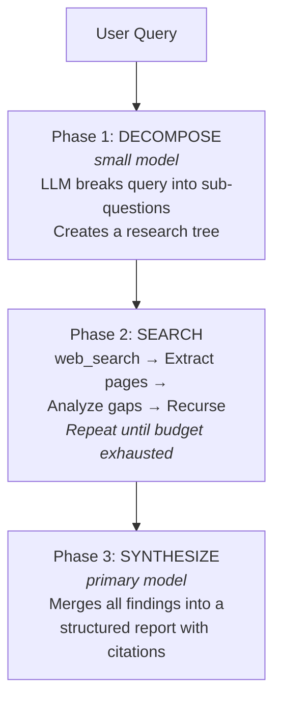

# RAG and Memory Configuration

> **Memory benchmarks (full N=500, gpt-4o reader):** **85.6% on LongMemEval-S** at $0.0090 per correct, **+1.4 points above Mastra Observational Memory (84.23%)**. **70.2% on LongMemEval-M** on the 1.5M-token / 500-session haystack variant — the only open-source library on the public record above 65% on M with publicly reproducible methodology. Competitive with the strongest published M results in the LongMemEval paper (Wu et al., ICLR 2025: round Top-5 65.7%, session Top-5 71.4%, round Top-10 72.0%). [Benchmarks](https://docs.agentos.sh/benchmarks) · [Run JSONs](https://github.com/framersai/agentos-bench/tree/master/results/runs) · [SOTA writeup](https://agentos.sh/en/blog/agentos-memory-sota-longmemeval/)

AgentOS provides three levels of memory API:

1. **`Memory`** — Primary SQLite-first facade for persistent local memory, ingestion, import/export, graph memory, and self-improving consolidation.
2. **`AgentMemory`** — Compatibility facade that can wrap either `CognitiveMemoryManager` or the standalone `Memory` engine.
3. **Low-level RAG primitives** — `EmbeddingManager`, `VectorStoreManager`, `RetrievalAugmentor`, `UnifiedRetriever`, `GraphRAGEngine` for custom pipelines.

`Memory.create()` currently supports the SQLite-backed standalone memory facade at runtime. Postgres, Qdrant, Pinecone, and other backends are available through the lower-level RAG/vector-store layer.

Runtime truth: `ragConfig` and the standard AgentOS bootstrap still create the classic `RetrievalAugmentor` path. `UnifiedRetriever` exists as an opt-in orchestration layer for hosts that explicitly wire it in.

## Standalone Memory Facade

```ts
import { Memory } from '@framers/agentos';

const mem = await Memory.createSqlite({
  path: './brain.sqlite',
  graph: true,
  selfImprove: true,
});

await mem.remember('User prefers dark mode', { type: 'semantic', tags: ['prefs'] });
await mem.ingest('./docs');
await mem.importFrom('./notes.csv', { format: 'csv' });

const hits = await mem.recall('dark mode');
await mem.export('./vault', { format: 'obsidian' });
await mem.close();
```

To expose the memory editor tools to AgentOS at runtime, either register the
tools directly or load them through the extension system:

```ts
import { createMemoryToolsPack, Memory } from '@framers/agentos';

const memory = await Memory.createSqlite({ path: './brain.sqlite', selfImprove: true });

// Direct registration
for (const tool of memory.createTools()) {
  await agentos.getToolOrchestrator().registerTool(tool);
}

// Or extension-based registration through the shared tool registry
await agentos.getExtensionManager().loadPackFromFactory(
  createMemoryToolsPack(memory),
  'memory-tools',
);
```

If you already bootstrap `AgentOS`, you can auto-load the same pack directly
from `AgentOS.initialize()`:

```ts
import { AgentOS, Memory } from '@framers/agentos';

const memory = await Memory.createSqlite({ path: './brain.sqlite', selfImprove: true });
const agentos = await AgentOS.create({
  memoryTools: {
    memory,
    includeReflect: true,
    identifier: 'primary-memory-tools',
    manageLifecycle: true,
  },
});
```

`manageLifecycle` is optional. Leave it unset when your app owns the
`Memory` instance and closes it outside `AgentOS`.

`memoryTools` only registers the tool pack. It does not automatically make the
same `Memory` instance the prompt-time `longTermMemoryRetriever` or
`rollingSummaryMemorySink`.

If you want one standalone `Memory` backend to power all three paths, use the
unified `standaloneMemory` config bridge:

```ts
import { AgentOS, Memory } from '@framers/agentos';

const memory = await Memory.createSqlite({ path: './brain.sqlite', selfImprove: true });
const agentos = await AgentOS.create({
  standaloneMemory: {
    memory,
    manageLifecycle: true,
    tools: { includeReflect: true },
    longTermRetriever: true,
    rollingSummarySink: true,
  },
});
```

This keeps memory tools available to agents while also reusing the same store
for long-term prompt injection and rolling-summary persistence.

## High-Level API: AgentMemory

```ts
import { AgentMemory } from '@framers/agentos';

// Option A: wrap an existing CognitiveMemoryManager
const cognitive = AgentMemory.wrap(existingManager);

// Option B: create a standalone SQLite-backed adapter
const memory = await AgentMemory.sqlite({ path: './brain.sqlite' });

// Store information
await memory.remember('User prefers dark mode');
await memory.remember('Deploy by Friday', { type: 'prospective', tags: ['deadline'] });

// Recall relevant memories
const results = await memory.recall('what does the user prefer?');
for (const m of results.memories) {
  console.log(m.content, m.retrievalScore);
}

// Standalone-only extras from the new Memory engine
await memory.ingest('./docs');
await memory.export('./vault', { format: 'obsidian' });

// Cognitive-only APIs remain available on the wrapped manager path
await cognitive.observe('user', 'Can you help me debug this?');
const context = await cognitive.getContext('TMJ treatment', { tokenBudget: 2000 });

await cognitive.remind({
  content: 'Remind about deploy deadline',
  triggerType: 'time',
  triggerAt: Date.now() + 3600000,
});

// Consolidation (merge, strengthen, decay)
await memory.consolidate();

// Health diagnostics
const health = await memory.health();

// Access underlying backends when needed
const rawManager = cognitive.raw;
const rawMemory = memory.rawMemory;
```

Use `Memory` directly for most local-first or ingestion-heavy workloads. Use `AgentMemory` when you want a compatibility facade across both backends, or when you specifically need cognitive-only APIs such as `observe()`, `getContext()`, or `remind()`.

## Observational Memory

Observational memory is a background system that compresses long-running conversation history into dense, searchable memory traces. Instead of keeping the entire conversation in context, the system progressively distills it through three tiers:

```
Recent Messages (raw conversation turns)
  → Observations (concise notes extracted by MemoryObserver)
    → Reflections (long-term memory traces produced by MemoryReflector)
```

### How It Works

1. **ObservationBuffer** accumulates every message fed via `observe()`. It tracks approximate token count (~4 chars/token).
2. **MemoryObserver** activates when the buffer reaches **30,000 tokens**. It sends buffered messages to a cheap LLM, which extracts typed observation notes (`factual`, `emotional`, `commitment`, `preference`, `creative`, `correction`). The LLM prompt is biased by the agent's HEXACO personality traits — high Emotionality focuses on tone shifts, high Conscientiousness on deadlines, high Openness on creative tangents.
3. **MemoryReflector** accumulates observation notes. When they exceed **40,000 tokens**, it consolidates them into long-term `MemoryTrace` objects with 5-40x compression. Conflict resolution is personality-driven: high Honesty prefers newer information and supersedes old traces; high Agreeableness keeps both versions.

### Integration with RAG

Reflection traces are encoded into the vector store via `CognitiveMemoryManager.encode()`, making them searchable through the standard RAG pipeline. When HyDE is enabled, a query like "what did we decide about deployment?" generates a hypothetical answer, and that embedding finds relevant reflection traces alongside regular memories.

Superseded traces are soft-deleted so they no longer surface in retrieval results.

### API

The high-level entry point is `AgentMemory.observe()`:

```ts
// Feed every conversation turn to the observer
await memory.observe('user', userMessage);
await memory.observe('assistant', assistantResponse);
```

Internally, `CognitiveMemoryManager.observe()` orchestrates the full pipeline: buffer → observer → reflector → encode traces → soft-delete superseded.

### Configuration

Enable observational memory in `CognitiveMemoryConfig`:

```ts
await memory.initialize({
  // ... core config ...
  observer: {
    activationThresholdTokens: 30_000, // trigger observation extraction
    llmInvoker,                         // (system, user) => Promise<string>
  },
  reflector: {
    activationThresholdTokens: 40_000, // trigger reflection consolidation
    llmInvoker,
  },
});
```

Both thresholds can be tuned. Lower thresholds produce more frequent, finer-grained observations at higher LLM cost. Higher thresholds batch more context but risk losing detail.

In persona JSON, the observer/reflector activate automatically when `memoryConfig.enabled = true` and an `llmInvoker` is available. No additional persona-level config is required.

## Low-Level RAG Primitives

The concrete RAG APIs live under `@framers/agentos/cognition/rag`:

- **`EmbeddingManager`** — Text → vector embeddings (OpenAI, Ollama, custom providers)
- **`VectorStoreManager`** — HNSW/InMemory vector storage with similarity search
- **`RetrievalAugmentor`** — Default runtime RAG pipeline for embedding + search + context assembly
- **`UnifiedRetriever`** — Opt-in plan-aware orchestration across multiple retrieval sources
- **`HydeRetriever`** — Hypothetical Document Embedding for better recall (generates pseudo-answers before searching)
- **`GraphRAGEngine`** — TypeScript-native graph-based RAG with knowledge graph traversal

For most standalone and local-first use cases, prefer `Memory`. Use `AgentMemory` when you need the compatibility layer or the cognitive observer/reflector APIs.

## Enabling RAG In AgentOS

There are two supported ways to provide an augmentor to GMIs.

### Option A: Provide a ready `retrievalAugmentor` instance

You construct and initialize the augmentor yourself, then pass it into `AgentOS.initialize()`:

```ts
import { AgentOS } from '@framers/agentos';
import { EmbeddingManager, VectorStoreManager, RetrievalAugmentor } from '@framers/agentos/cognition/rag';
import { AIModelProviderManager } from '@framers/agentos/core/llm/providers/AIModelProviderManager';

// 1) Provider manager (must support embeddings for your chosen embedding model)
const providers = new AIModelProviderManager();
await providers.initialize({
  providers: [
    {
      providerId: 'openai',
      enabled: true,
      isDefault: true,
      config: { apiKey: process.env.OPENAI_API_KEY },
    },
  ],
});

// 2) Embeddings
const embeddingManager = new EmbeddingManager();
await embeddingManager.initialize(
  {
    embeddingModels: [
      { modelId: 'text-embedding-3-small', providerId: 'openai', dimension: 1536, isDefault: true },
    ],
  },
  providers,
);

// 3) Vector stores + data sources
const vectorStoreManager = new VectorStoreManager();
await vectorStoreManager.initialize(
  {
    managerId: 'rag-vsm',
    providers: [
      {
        id: 'sql-store',
        type: 'sql',
        storage: { filePath: './data/agentos_vectors.db', priority: ['better-sqlite3', 'sqljs'] },
      },
    ],
    defaultProviderId: 'sql-store',
    defaultEmbeddingDimension: 1536,
  },
  [
    {
      dataSourceId: 'voice_conversation_summaries',
      displayName: 'Conversation Summaries',
      vectorStoreProviderId: 'sql-store',
      actualNameInProvider: 'voice_conversation_summaries',
      embeddingDimension: 1536,
      isDefaultIngestionSource: true,
      isDefaultQuerySource: true,
    },
  ],
);

// 4) Retrieval augmentor
const rag = new RetrievalAugmentor();
await rag.initialize(
  {
    defaultDataSourceId: 'voice_conversation_summaries',
    categoryBehaviors: [],
  },
  embeddingManager,
  vectorStoreManager,
);

// 5) Pass into AgentOS
const agentos = await AgentOS.create({
  retrievalAugmentor: rag,
  manageRetrievalAugmentorLifecycle: true,
});
```

### Option B: Let AgentOS create the RAG subsystem (`ragConfig`)

If you don’t want to manage instantiation, use `AgentOSConfig.ragConfig`. AgentOS will create:
`EmbeddingManager` → `VectorStoreManager` → `RetrievalAugmentor`, and pass the augmentor into GMIs.

```ts
import { AgentOS } from '@framers/agentos';

const agentos = await AgentOS.create({
  ragConfig: {
    embeddingManagerConfig: {
      embeddingModels: [
        { modelId: 'text-embedding-3-small', providerId: 'openai', dimension: 1536, isDefault: true },
      ],
    },
    vectorStoreManagerConfig: {
      managerId: 'rag-vsm',
      providers: [
        { id: 'sql-store', type: 'sql', storage: { filePath: './data/agentos_vectors.db' } },
      ],
      defaultProviderId: 'sql-store',
      defaultEmbeddingDimension: 1536,
    },
    dataSourceConfigs: [
      {
        dataSourceId: 'voice_conversation_summaries',
        displayName: 'Conversation Summaries',
        vectorStoreProviderId: 'sql-store',
        actualNameInProvider: 'voice_conversation_summaries',
        embeddingDimension: 1536,
        isDefaultIngestionSource: true,
        isDefaultQuerySource: true,
      },
    ],
    retrievalAugmentorConfig: {
      defaultDataSourceId: 'voice_conversation_summaries',
      categoryBehaviors: [],
    },
  },
});
```

Notes:
- If `retrievalAugmentor` is provided, it takes precedence over `ragConfig`.
- `ragConfig.manageLifecycle` defaults to `true`.
- `ragConfig.bindToStorageAdapter` defaults to `true` and will inject AgentOS’ `storageAdapter` into **SQL vector store providers that did not specify `adapter` or `storage`**.
- `ragConfig` does not instantiate `UnifiedRetriever`. If you want QueryRouter plan execution through `UnifiedRetriever`, wire that separately with `router.setUnifiedRetriever(...)`.

## Long-Term Memory Recall (Aggressive Default)

Prompt-injected durable memory retrieval (`longTermMemoryRetriever`) is controlled by `orchestratorConfig.longTermMemoryRecall`.

Default profile is intentionally **aggressive** for higher recall and task success:

- `profile: "aggressive"`
- `cadenceTurns: 2`
- `forceOnCompaction: true`
- `maxContextChars: 4200`
- `topKByScope: { user: 8, persona: 8, organization: 8 }`

Example:

```ts
await agentos.initialize({
  // ...
  orchestratorConfig: {
    longTermMemoryRecall: {
      profile: 'aggressive',     // default
      // Optional explicit overrides:
      cadenceTurns: 2,
      forceOnCompaction: true,
      maxContextChars: 4200,
      topKByScope: { user: 8, persona: 8, organization: 8 },
    },
  },
});
```

If you need lower token usage, switch to:

- `profile: "balanced"`
- `profile: "conservative"`

## Single-Tenant vs Multi-Tenant Routing

`organizationId` routing behavior is controlled by `orchestratorConfig.tenantRouting`:

- `multi_tenant` (default): uses request-scoped `organizationId` when provided.
- `single_tenant`: collapses all turns to one org context (optional strict mode).

```ts
await agentos.initialize({
  // ...
  orchestratorConfig: {
    tenantRouting: {
      mode: 'single_tenant',
      defaultOrganizationId: 'acme-org',
      strictOrganizationIsolation: true,
    },
  },
});
```

With strict single-tenant isolation enabled, mismatched `organizationId` values are rejected.

## Persona `memoryConfig.ragConfig` (Triggers and Data Sources)

RAG retrieval/ingestion in the GMI is driven by persona configuration. At minimum:

- `memoryConfig.ragConfig.enabled = true`
- `retrievalTriggers.onUserQuery = true` to retrieve on user turns
- `ingestionTriggers.onTurnSummary = true` to ingest post-turn summaries
- `defaultIngestionDataSourceId` set to a data source you configured in the RAG subsystem

Minimal example (persona JSON):

```json
{
  "memoryConfig": {
    "enabled": true,
    "ragConfig": {
      "enabled": true,
      "retrievalTriggers": { "onUserQuery": true },
      "ingestionTriggers": { "onTurnSummary": true },
      "defaultRetrievalTopK": 5,
      "defaultIngestionDataSourceId": "voice_conversation_summaries",
      "dataSources": [
        {
          "id": "voice_conversation_summaries",
          "dataSourceNameOrId": "voice_conversation_summaries",
          "isEnabled": true,
          "displayName": "Conversation Summaries"
        }
      ]
    }
  }
}
```

### Ingestion summarization is opt-in

Turn-summary ingestion can be cheap by storing raw text. Summarization is enabled only when:

```json
{
  "memoryConfig": {
    "ragConfig": {
      "ingestionProcessing": {
        "summarization": { "enabled": true }
      }
    }
  }
}
```

## Manual Ingest and Retrieve

You can use the augmentor directly (useful for knowledge-base ingestion pipelines):

```ts
await rag.ingestDocuments(
  [
    { id: 'doc-1', content: 'AgentOS is a TypeScript runtime for AI agents.' },
    { id: 'doc-2', content: 'GMIs maintain persistent identity across sessions.' },
  ],
  { targetDataSourceId: 'voice_conversation_summaries' },
);

const result = await rag.retrieveContext('How do GMIs work?', { topK: 5 });
console.log(result.augmentedContext);
```

## Vector Store Providers In This Repo

AgentOS currently ships these vector-store implementations:

- `InMemoryVectorStore` (ephemeral, dev/testing)
- `SqlVectorStore` (persistent via `@framers/sql-storage-adapter`; embeddings stored as JSON blobs; optional SQLite FTS for hybrid)
- `HnswlibVectorStore` (ANN search via `hnswlib-node`, optional peer dependency; optional file persistence via `persistDirectory`)
- `QdrantVectorStore` (remote/self-hosted Qdrant via HTTP; optional BM25 sparse vectors + hybrid fusion)

If you want “true” large-scale vector DB behavior (tens of millions of vectors, filtered search at scale, etc.), add a provider implementation and wire it into `VectorStoreManager`.

### Qdrant Provider (Remote or Self-Hosted)

`QdrantVectorStore` lets you point AgentOS at a Qdrant instance (local Docker or managed cloud) without changing any higher-level RAG code.

Example `VectorStoreManager` provider config:

```ts
import type { VectorStoreManagerConfig } from '@framers/agentos/config/VectorStoreConfiguration';

const vsmConfig: VectorStoreManagerConfig = {
  managerId: 'rag-vsm',
  providers: [
    {
      id: 'qdrant-main',
      type: 'qdrant',
      url: process.env.QDRANT_URL!,
      apiKey: process.env.QDRANT_API_KEY,
      enableBm25: true,
    },
  ],
  defaultProviderId: 'qdrant-main',
  defaultEmbeddingDimension: 1536,
};
```

## GraphRAG (Optional)

`GraphRAGEngine` exists as a TypeScript-native implementation (graphology + Louvain community detection). It is not automatically used by GMIs by default; treat it as an advanced subsystem you opt into when your problem benefits from entity/relationship structure.

- If you use non-OpenAI embedding models (e.g., Ollama), set `GraphRAGConfig.embeddingDimension`, or provide an `embeddingManager` so the engine can probe the embedding dimension at runtime.
- `GraphRAGEngine` can run without embeddings and/or without an LLM:
  - No embeddings: falls back to text matching (lower quality; no vector search).
  - No LLM: falls back to pattern-based extraction (no model calls).
- `GraphRAGEngine.ingestDocuments()` supports update semantics when you re-ingest the same `documentId` with new content (it subtracts prior per-document contributions before applying the new extraction).
- To keep a GraphRAG index consistent with deletes or category/collection moves, call `GraphRAGEngine.removeDocuments([documentId, ...])`.

Minimal lifecycle example:

```ts
import { GraphRAGEngine } from '@framers/agentos/cognition/rag/graphrag';

const engine = new GraphRAGEngine({
  // Optional:
  // - vectorStore
  // - embeddingManager
  // - llmProvider
  // - persistenceAdapter
});

await engine.initialize({ engineId: 'graphrag-demo' });

// Ingest (or update) using a stable documentId.
await engine.ingestDocuments([{ id: 'doc-1', content: 'Alice founded Wonderland Inc.' }]);
await engine.ingestDocuments([{ id: 'doc-1', content: 'Bob founded Wonderland Inc.' }]); // update

// Delete or move out of GraphRAG policy scope.
await engine.removeDocuments(['doc-1']);
```

Troubleshooting updates:

- If you see warnings about missing previous contribution records, you upgraded from an older persistence format.
  - Fix: rebuild the GraphRAG index (clear its persisted state and re-ingest documents).

## Immutability Notes (Sealed Agents)

If you run with an append-only / sealed storage policy, avoid hard deletes of memory or history.
Prefer append-only tombstones/redactions so retrieval can ignore forgotten items while the audit trail remains verifiable.

## Combined Vector + GraphRAG Search

The HTTP API supports running vector retrieval and GraphRAG in a single request via `includeGraphRag: true`. This combines:

1. **Vector + BM25 hybrid** — standard chunk retrieval with Reciprocal Rank Fusion
2. **GraphRAG local search** — entity/relationship/community traversal

The response includes both `chunks` (ranked vector results) and `graphContext` (entities, relationships, community context) in one payload.

```bash
curl -s -X POST http://localhost:3001/api/agentos/rag/query \
  -H ‘content-type: application/json’ \
  -d ‘{“query”:”agent security model”,”includeGraphRag”:true,”topK”:5}’ | jq
```

Alternatively, use the programmatic API: `await rag.retrieveContext('agent security model', { includeGraphRag: true })`.

When to use combined search:
- Questions requiring both textual similarity AND relational/structural context
- Queries about how entities relate to each other (e.g., “how does X affect Y”)
- When you want chunk-level evidence plus knowledge graph context in a single call

## Debug Pipeline Tracing

Set `debug: true` in the query request (or use `--debug` CLI flag) to get a step-by-step trace of the retrieval pipeline. Each step reports timing and relevant metrics:

| Step | Data |
|------|------|
| `query_received` | query text, preset, topK, vectorProvider, collectionIds |
| `variants_resolved` | base query, variant count, variant texts |
| `vector_search` | provider (sql/hnswlib/qdrant), candidate count, latency, embedding model |
| `keyword_search` | enabled, match count, latency |
| `fusion` | strategy (RRF), vector/keyword/merged counts |
| `graphrag` | entities found, relationships, communities, search time |
| `pipeline_complete` | total latency, results returned |

Enable globally via `AGENTOS_RAG_DEBUG=true` environment variable, or per-request with the `debug` flag.

Alternatively, use the programmatic API: `await rag.retrieveContext('security tiers', { debug: true })`.

## HNSW Vector Store Configuration

When using `AGENTOS_RAG_VECTOR_PROVIDER=hnswlib`, the following environment variables configure the HNSW index:

| Variable | Default | Description |
|----------|---------|-------------|
| `AGENTOS_RAG_HNSWLIB_M` | `16` | Max number of connections per node (higher = better recall, more memory) |
| `AGENTOS_RAG_HNSWLIB_EF_CONSTRUCTION` | `200` | Construction-time search depth (higher = better index quality, slower build) |
| `AGENTOS_RAG_HNSWLIB_EF_SEARCH` | `100` | Query-time search depth (higher = better recall, slower query) |
| `AGENTOS_RAG_HNSWLIB_PERSIST_DIR` | `./db_data/agentos_rag_hnswlib` | Directory for persisted HNSW index files |

The health endpoint (`/api/agentos/rag/health`) reports the active `vectorProvider` and HNSW params when applicable.

## Practical Guidance

- Default recommendation: start with **vector (dense) retrieval**, then add **keyword (BM25/FTS)** for recall, then add a **reranker** only where it’s worth the latency/cost.
- GraphRAG tends to pay off when questions depend on multi-hop relationships and “global summaries” (org structures, timelines, dependency graphs), not for everyday chat retrieval.
- Use `--debug` to understand pipeline behavior and identify bottlenecks before tuning parameters.

## Retrieval Strategies (Implemented)

`RetrievalAugmentor.retrieveContext()` supports `RagRetrievalOptions.strategy`:

- `similarity`: Dense similarity search (bi-encoder) via `IVectorStore.query()`.
- `hybrid`: Dense + lexical fusion via `IVectorStore.hybridSearch()` when the store implements it.
  - `SqlVectorStore.hybridSearch()` performs BM25-style lexical scoring and fuses dense + lexical rankings (default: RRF).
- `mmr`: Maximal Marginal Relevance diversification. The augmentor requests embeddings for candidates and then selects a diverse top-K set using `strategyParams.mmrLambda` (0..1).

Notes:
- If a store does not implement `hybridSearch()`, AgentOS falls back to dense `query()`.
- For `mmr`, embeddings are used internally even if `includeEmbeddings=false`; embeddings are stripped from the output unless explicitly requested.

## Reranking and the Reranker Chain {#reranker-chain}

If `RetrievalAugmentorServiceConfig.rerankerServiceConfig` is provided, AgentOS initializes `RerankerService` and auto-registers built-in providers declared in config: `cohere` (requires `apiKey`) and `local` (offline cross-encoder, requires Transformers.js: `@huggingface/transformers` preferred, or `@xenova/transformers`). Reranking is opt-in per request via `RagRetrievalOptions.rerankerConfig.enabled=true`.

AgentOS supports chaining multiple reranking providers into a sequential pipeline. Each stage narrows the result set, producing progressively higher-quality rankings:

```
120 search results
  → Stage 1: Local Cross-Encoder (120 → 30)    [~300ms, free]
  → Stage 2: Cohere Rerank (30 → 15)            [~100ms, ~$0.001]
  → Stage 3: LLM Judge (15 → 5)                 [~2s, ~$0.002]
  → 5 high-confidence results
```

### Chain configuration

```json title="agent.config.json"
{
  "rag": {
    "reranking": {
      "chain": [
        { "provider": "local", "topK": 30, "model": "cross-encoder/ms-marco-MiniLM-L-6-v2" },
        { "provider": "cohere", "topK": 15, "model": "rerank-v4.0-fast" },
        { "provider": "llm-judge", "topK": 5 }
      ]
    }
  }
}
```

### Available providers

**Local cross-encoder (free, offline).** ONNX transformer models that auto-download on first use (~80-560 MB).

| Model | Size | Speed (50 docs) | Quality |
|---|---|---|---|
| `cross-encoder/ms-marco-MiniLM-L-6-v2` | 80 MB | ~200 ms | Good |
| `cross-encoder/ms-marco-MiniLM-L-12-v2` | 120 MB | ~400 ms | Better |
| `BAAI/bge-reranker-base` | 110 MB | ~300 ms | Good |
| `BAAI/bge-reranker-large` | 560 MB | ~800 ms | Best |

**Cohere Rerank (cloud).** Requires `COHERE_API_KEY`. Models: `rerank-v4.0-pro`, `rerank-v4.0-fast`, `rerank-v3.5`.

**LLM-as-judge (two-phase).** Uses the agent's LLM for relevance scoring. Phase 1 batch-scores documents in groups of 10 with a cheap model (0–10 scale); Phase 2 ranks the top candidates with a stronger model. Cost ~$0.002 per rerank with gpt-4o-mini.

### Default chains by research depth

| Depth | Default chain |
|---|---|
| `quick` | `[{ provider: "local", topK: 5 }]` |
| `moderate` | `[{ provider: "local", topK: 15 }, { provider: "cohere", topK: 5 }]` |
| `deep` | `[{ provider: "local", topK: 30 }, { provider: "cohere", topK: 15 }, { provider: "llm-judge", topK: 5 }]` |

### Graceful degradation

If a provider is unavailable (missing API key, model not loaded, API error), that stage is silently skipped and the pipeline continues with the next. The chain always produces results.

### Programmatic usage

```typescript
import { RerankerService, LlmJudgeReranker, CohereReranker, LocalCrossEncoderReranker } from '@framers/agentos';

const service = new RerankerService({ config: { providers: [] } });
service.registerProvider(new LocalCrossEncoderReranker({ providerId: 'local' }));
service.registerProvider(new CohereReranker({ providerId: 'cohere', apiKey: '...' }));
service.registerProvider(new LlmJudgeReranker({ llmCallFn: myLlmCall }));

const results = await service.rerankChain('quantum computing', chunks, [
  { provider: 'local', topK: 20 },
  { provider: 'cohere', topK: 10 },
  { provider: 'llm-judge', topK: 5 },
]);
```

### Memory retrieval reranking

The reranker chain integrates with the [Cognitive Memory System](./COGNITIVE_MEMORY.md). When a `RerankerService` is passed to `CognitiveMemoryManager` via the `rerankerService` config field, it runs a neural reranking pass after the cognitive scoring pipeline:

```typescript
import { CognitiveMemoryManager } from '@framers/agentos/memory';
import { RerankerService, CohereReranker } from '@framers/agentos/rag/reranking';

const rerankerService = new RerankerService({
  config: {
    providers: [
      { providerId: 'cohere', apiKey: process.env.COHERE_API_KEY!, defaultModelId: 'rerank-v3.5' },
      { providerId: 'llm-judge' },
    ],
    defaultProviderId: 'cohere',
  },
});

await manager.initialize({
  // ... other config ...
  rerankerService,
});
```

Reranker scores blend with the cognitive composite:

```
finalScore = 0.7 × cognitiveComposite + 0.3 × neuralRerankerScore
```

The 0.7/0.3 weighting is fixed: the cognitive pipeline already accounts for 6 independent signals (Ebbinghaus decay, mood congruence, spreading activation, similarity, recency, importance) and the reranker adds a 7th dimension of semantic relevance. If the provider is unavailable, retrieval falls back to cognitive-only scoring with no degradation.

## Multimodal RAG (Image + Audio)

AgentOS’ core RAG APIs are text-first. The recommended multimodal pattern is:

- Persist asset metadata (and optionally bytes).
- Derive a **text representation** (caption/transcript/OCR/etc).
- Index that text as a normal RAG document (so the same vector/BM25/rerank pipeline applies).
- Optionally add modality embeddings (image-to-image / audio-to-audio) as an acceleration path.

See [MULTIMODAL_RAG.md](./MULTIMODAL_RAG.md) for the reference implementation and HTTP API.

---

## Query Classification and Deep Research {#query-classification}


Ask an agent "what's 2+2" and it should answer instantly. Ask it "what are the latest treatment options for drug-resistant tuberculosis" and it should go dig through medical literature, cross-reference sources, identify gaps, and come back with citations.

The problem: most agents treat both queries the same way. Either they web-search everything (slow, wasteful) or they never search at all (hallucinate freely).

AgentOS solves this with an LLM-as-judge classifier that runs _before_ the main LLM turn. A cheap, fast model (gpt-4o-mini, claude-haiku, or qwen2.5:3b) inspects the query and assigns a research depth tier. The agent then behaves accordingly.

### Research Depth Tiers

| Tier       | When it triggers                                               | What happens                                                                       | Budget            |
| ---------- | -------------------------------------------------------------- | ---------------------------------------------------------------------------------- | ----------------- |
| `none`     | Greetings, simple facts, code help, creative writing           | LLM answers from training data. No tools called.                                   | 0s, 0 searches    |
| `quick`    | Weather, stock price, "what is X", latest news                 | 1-2 web searches, cite sources                                                     | 30s, 10 searches  |
| `moderate` | Product comparisons, travel recs, "best X for Y"               | Multi-source research with `researchAggregate` or `researchInvestigate`            | 2min, 20 searches |
| `deep`     | Medical, legal, scientific, financial planning, learning plans | Full `deep_research` pipeline: decompose, search, extract, gap-analyze, synthesize | 9min, 50 searches |

The classifier defaults to `none` on failure. A broken classifier never blocks the main conversation.

### The Research Tools

Six tools form the research stack, from lightweight to heavy:

| Tool                  | Purpose                                            | Side effects |
| --------------------- | -------------------------------------------------- | ------------ |
| `web_search`          | Single web search query                            | None         |
| `news_search`         | Search recent news articles                        | None         |
| `researchInvestigate` | Targeted investigation of a specific topic         | None         |
| `researchAcademic`    | Search academic papers and scholarly sources       | None         |
| `researchAggregate`   | Aggregate findings across multiple search results  | None         |
| `deep_research`       | Full 3-phase pipeline with recursive decomposition | None         |

The classifier decides which tools to inject into the prompt based on the depth tier. `quick` gets `web_search` and `news_search`. `moderate` gets `researchAggregate` and `researchInvestigate`. `deep` triggers the full `deep_research` tool.

### The 3-Phase Deep Research Pipeline

When `deep_research` runs, it follows a structured process:



Phase 2 iterates. Each iteration searches, extracts, analyzes gaps, and optionally spawns child queries to fill those gaps. The number of iterations depends on depth:

| Depth      | Default iterations | Max searches | Max extractions | Max LLM calls | Time limit |
| ---------- | ------------------ | ------------ | --------------- | ------------- | ---------- |
| `quick`    | 1                  | 10           | 5               | 3             | 30s        |
| `moderate` | 3                  | 20           | 10              | 8             | 2 min      |
| `deep`     | 6                  | 50           | 25              | 20            | 9 min      |

A `ResearchBudgetTracker` enforces hard caps on all dimensions. When any budget is exhausted, the engine moves to synthesis with whatever findings it has.

### LLM-as-Judge Auto-Classifier

Enabled by default. Before every chat turn, the classifier runs a fast LLM call with a structured prompt:

```
You are a query complexity classifier. Given a user query, classify it
into ONE of these research depth tiers: none, quick, moderate, deep.

Respond with ONLY a JSON object:
{"depth": "none|quick|moderate|deep", "reasoning": "one sentence why"}
```

The classifier uses the cheapest available model:

- OpenAI: `gpt-4o-mini`
- Gemini: `gemini-2.0-flash-lite`
- Ollama: `qwen2.5:3b`

Classification typically adds 200-400ms to the turn. The result is cached per query.

### Override Patterns

Explicit prefixes bypass the classifier entirely:

| Input                                                    | Resolved depth  |
| -------------------------------------------------------- | --------------- |
| `/research what are the best hiking trails in Patagonia` | `moderate`      |
| `/deep explain the neurochemistry of psilocybin`         | `deep`          |
| Regular message (no prefix)                              | Auto-classified |

### HTTP API

### Body Fields

```json
{
  "message": "What are the latest advances in mRNA vaccine technology?",
  "research": true
}
```

| `research` value | Effect                    |
| ---------------- | ------------------------- |
| `true`           | Forces `moderate` depth   |
| `"deep"`         | Forces `deep` depth       |
| `"quick"`        | Forces `quick` depth      |
| omitted          | Auto-classified (default) |

You can also disable auto-classification per request:

```json
{
  "message": "Hello",
  "autoClassify": false
}
```

### Streaming Research Progress

When `"stream": true` is set, research progress events are pushed as SSE:

```bash
curl -N -X POST http://localhost:3777/chat \
  -H "Content-Type: application/json" \
  -d '{"message": "Explain CRISPR gene editing safety concerns", "research": "deep", "stream": true}'
```

Progress events arrive as `event: progress` with a `SYSTEM_PROGRESS` payload:

```
event: progress
data: {"type":"SYSTEM_PROGRESS","toolName":"deep_research","phase":"decomposing","message":"Decomposing query into sub-questions","progress":0.1}

event: progress
data: {"type":"SYSTEM_PROGRESS","toolName":"deep_research","phase":"searching","message":"Searching sources \"CRISPR off-target effects\" (iter 1/6, 3 findings)","progress":0.3}

event: reply
data: {"type":"REPLY","reply":"## CRISPR Gene Editing Safety Concerns\n\n..."}
```

See the [HTTP Streaming API](./http-streaming-api.md) guide for the full SSE protocol.

### Configuration

### agent.config.json

```json
{
  "research": {
    "autoClassify": true,
    "minDepthToInject": "quick"
  }
}
```

| Field                       | Type                                        | Default   | Description                                                                                              |
| --------------------------- | ------------------------------------------- | --------- | -------------------------------------------------------------------------------------------------------- |
| `research.autoClassify`     | `boolean`                                   | `true`    | Enable the LLM-as-judge classifier                                                                       |
| `research.minDepthToInject` | `"none" \| "quick" \| "moderate" \| "deep"` | `"quick"` | Minimum classified depth before research tools are injected. Set to `"moderate"` to skip quick searches. |

Setting `autoClassify: false` disables all automatic research — the agent only researches when you explicitly use `/research`, `/deep`, or pass the `research` body field.

Setting `minDepthToInject: "moderate"` means queries classified as `quick` are answered from training data. Only `moderate` and `deep` queries trigger tool injection.

### Example Queries

| Query                                                                    | Expected classification | Behavior                                       |
| ------------------------------------------------------------------------ | ----------------------- | ---------------------------------------------- |
| "Hello, how are you?"                                                    | `none`                  | Direct LLM response                            |
| "What's the weather in Tokyo?"                                           | `quick`                 | Single web search                              |
| "Best laptop for machine learning under $2000"                           | `moderate`              | Multi-source comparison                        |
| "What are the treatment options for stage 3 non-small cell lung cancer?" | `deep`                  | Full research pipeline with medical literature |
| "/research top AI startups in 2026"                                      | `moderate` (forced)     | Multi-source research                          |
| "/deep history of the Byzantine Empire"                                  | `deep` (forced)         | Full pipeline                                  |

### Key Files

| File                                                                                                      | Purpose                      |
| --------------------------------------------------------------------------------------------------------- | ---------------------------- |
| `packages/wunderland/src/runtime/research-classifier.ts`                                                  | LLM-as-judge classifier      |
| [`packages/agentos-extensions/registry/curated/research/deep-research/src/engine/DeepResearchTool.ts`](https://github.com/framersai/agentos-extensions/blob/master/registry/curated/research/deep-research/src/engine/DeepResearchTool.ts)      | ITool wrapper for the engine |
| [`packages/agentos-extensions/registry/curated/research/deep-research/src/engine/DeepResearchEngine.ts`](https://github.com/framersai/agentos-extensions/blob/master/registry/curated/research/deep-research/src/engine/DeepResearchEngine.ts)    | Core research pipeline       |
| [`packages/agentos-extensions/registry/curated/research/deep-research/src/engine/ResearchBudgetTracker.ts`](https://github.com/framersai/agentos-extensions/blob/master/registry/curated/research/deep-research/src/engine/ResearchBudgetTracker.ts) | Budget enforcement           |
| [`packages/agentos-extensions/registry/curated/research/deep-research/src/engine/types.ts`](https://github.com/framersai/agentos-extensions/blob/master/registry/curated/research/deep-research/src/engine/types.ts)                 | Type definitions             |
| [`packages/agentos-extensions/registry/curated/research/deep-research/src/tools/investigate.ts`](https://github.com/framersai/agentos-extensions/blob/master/registry/curated/research/deep-research/src/tools/investigate.ts)            | researchInvestigate tool     |
| [`packages/agentos-extensions/registry/curated/research/deep-research/src/tools/academic.ts`](https://github.com/framersai/agentos-extensions/blob/master/registry/curated/research/deep-research/src/tools/academic.ts)               | researchAcademic tool        |
| [`packages/agentos-extensions/registry/curated/research/deep-research/src/tools/aggregate.ts`](https://github.com/framersai/agentos-extensions/blob/master/registry/curated/research/deep-research/src/tools/aggregate.ts)              | researchAggregate tool       |

### Related

- [HTTP Streaming API](./http-streaming-api.md) -- SSE protocol for progress events
- [Chat Server](./chat-server.md) -- HTTP API reference
- [Tools](./tools.md) -- Full tool catalog
- [Browser Automation](./browser-automation.md) -- Content extraction behind the scenes
