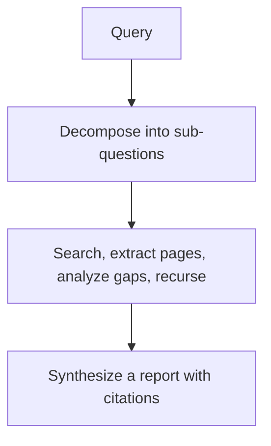

# RAG and Memory Configuration

> **Memory benchmarks (N=500, gpt-4o reader):** 85.6% on LongMemEval-S at $0.0090 per correct answer, and 70.2% on LongMemEval-M, the 1.5M-token, 500-session variant. The LongMemEval paper (Wu et al., ICLR 2025) reports 65.7% (round, top-5), 71.4% (session, top-5) and 72.0% (round, top-10) on M. [Benchmarks](https://docs.agentos.sh/benchmarks) · [Run JSONs](https://github.com/framerslab/agentos-bench/tree/master/results/runs) · [Write-up](https://agentos.sh/en/blog/agentos-memory-sota-longmemeval/)

AgentOS provides three levels of memory API:

1. **`Memory`** — Primary SQLite-first facade for persistent local memory, ingestion, import/export, graph memory, and self-improving consolidation.
2. **[`AgentMemory`](https://github.com/framerslab/agentos/blob/master/src/cognition/memory/AgentMemory.ts)** — Compatibility facade that can wrap either [`CognitiveMemoryManager`](https://github.com/framerslab/agentos/blob/master/src/cognition/memory/CognitiveMemoryManager.ts) or the standalone `Memory` engine.
3. **Low-level RAG primitives** — [`EmbeddingManager`](https://github.com/framerslab/agentos/blob/master/src/cognition/rag/EmbeddingManager.ts), [`VectorStoreManager`](https://github.com/framerslab/agentos/blob/master/src/cognition/rag/VectorStoreManager.ts), [`RetrievalAugmentor`](https://github.com/framerslab/agentos/blob/master/src/cognition/rag/RetrievalAugmentor.ts), [`UnifiedRetriever`](https://github.com/framerslab/agentos/blob/master/src/cognition/rag/unified/UnifiedRetriever.ts), [`GraphRAGEngine`](https://github.com/framerslab/agentos/blob/master/src/cognition/memory/retrieval/graph/graphrag/GraphRAGEngine.ts) for custom pipelines.

`Memory.createSqlite()` opens a brain in SQLite and `Memory.createPostgres()` one in Postgres. Qdrant, Pinecone and the other vector databases are reached through the vector-store layer of the RAG primitives.

`ragConfig` makes AgentOS build a [`RetrievalAugmentor`](https://github.com/framerslab/agentos/blob/master/src/cognition/rag/RetrievalAugmentor.ts). [`UnifiedRetriever`](https://github.com/framerslab/agentos/blob/master/src/cognition/rag/unified/UnifiedRetriever.ts) runs only where a host wires it in.


## Standalone Memory Facade

```ts
import { Memory } from '@framers/agentos';

const mem = await Memory.createSqlite({
  path: './brain.sqlite',
  graph: true,
  selfImprove: true,
});

await mem.remember('User prefers dark mode', { type: 'semantic', tags: ['prefs'] });
await mem.ingest('./docs');
await mem.importFrom('./notes.csv', { format: 'csv' });

const hits = await mem.recall('dark mode');
await mem.export('./vault', { format: 'obsidian' });
await mem.close();
```

To expose the memory editor tools to AgentOS at runtime, either register the
tools directly or load them through the extension system:

```ts
import { createMemoryToolsPack, Memory } from '@framers/agentos';

const memory = await Memory.createSqlite({ path: './brain.sqlite', selfImprove: true });

// Direct registration
for (const tool of memory.createTools()) {
  await agentos.getToolOrchestrator().registerTool(tool);
}

// Or extension-based registration through the shared tool registry
await agentos.getExtensionManager().loadPackFromFactory(
  createMemoryToolsPack(memory),
  'memory-tools',
);
```

If you already bootstrap [`AgentOS`](https://github.com/framerslab/agentos/blob/master/src/api/AgentOS.ts), the runtime loads the same pack
during `AgentOS.create()`:

```ts
import { AgentOS, Memory } from '@framers/agentos';

const memory = await Memory.createSqlite({ path: './brain.sqlite', selfImprove: true });
const agentos = await AgentOS.create({
  memoryTools: {
    memory,
    includeReflect: true,
    identifier: 'primary-memory-tools',
    manageLifecycle: true,
  },
});
```

`manageLifecycle` is optional (default `false`). Leave it unset when your app owns the
`Memory` instance and closes it outside [`AgentOS`](https://github.com/framerslab/agentos/blob/master/src/api/AgentOS.ts).

`memoryTools` only registers the tool pack. It does not automatically make the
same `Memory` instance the prompt-time `longTermMemoryRetriever` or
`rollingSummaryMemorySink`.

If you want one standalone `Memory` backend to power all three paths, use the
unified `standaloneMemory` config bridge:

```ts
import { AgentOS, Memory } from '@framers/agentos';

const memory = await Memory.createSqlite({ path: './brain.sqlite', selfImprove: true });
const agentos = await AgentOS.create({
  standaloneMemory: {
    memory,
    manageLifecycle: true,
    tools: { includeReflect: true },
    longTermRetriever: true,
    rollingSummarySink: true,
  },
});
```

This keeps memory tools available to agents while also reusing the same store
for long-term prompt injection and rolling-summary persistence.

## High-Level API: AgentMemory

```ts
import { AgentMemory } from '@framers/agentos';

// Option A: wrap an existing CognitiveMemoryManager
const cognitive = AgentMemory.wrap(existingManager);

// Option B: create a standalone SQLite-backed adapter
const memory = await AgentMemory.sqlite({ path: './brain.sqlite' });

// Store information
await memory.remember('User prefers dark mode');
await memory.remember('Deploy by Friday', { type: 'prospective', tags: ['deadline'] });

// Recall relevant memories
const results = await memory.recall('what does the user prefer?');
for (const m of results.memories) {
  console.log(m.content, m.retrievalScore);
}

// Standalone-only extras from the new Memory engine
await memory.ingest('./docs');
await memory.export('./vault', { format: 'obsidian' });

// Cognitive-only APIs remain available on the wrapped manager path
await cognitive.observe('user', 'Can you help me debug this?');
const context = await cognitive.getContext('TMJ treatment', { tokenBudget: 2000 });

await cognitive.remind({
  content: 'Remind about deploy deadline',
  triggerType: 'time_based', // or 'event_based', 'context_based'
  triggerAt: Date.now() + 3_600_000,
  importance: 0.8,
  recurring: false,
});

// Consolidation (merge, strengthen, decay)
await memory.consolidate();

// Health diagnostics
const health = await memory.health();

// Access underlying backends when needed
const rawManager = cognitive.raw;
const rawMemory = memory.rawMemory;
```

Use `Memory` directly for most local-first or ingestion-heavy workloads. Use [`AgentMemory`](https://github.com/framerslab/agentos/blob/master/src/cognition/memory/AgentMemory.ts) when you want one facade over both backends, or when you need the cognitive-only APIs `observe()`, `getContext()` and `remind()`, which throw on the standalone path. `ingest()`, `importFrom()` and `export()` throw on the wrapped-manager path.

## Observational Memory

Observational memory turns conversation into memory traces. `CognitiveMemoryManager` runs it when its config gives the observer and the reflector an `llmInvoker`:

```
messages --> notes (MemoryObserver) --> traces (MemoryReflector)
```

### How It Works

1. **ObservationBuffer** holds every message passed to `observe()` and estimates its tokens at 4 characters each.
2. **MemoryObserver** runs when the buffer reaches `activationThresholdTokens` (default 30,000) or `activationThresholdMessages` (default 20). It sends the buffered messages to its LLM, which returns typed notes (`factual`, `emotional`, `commitment`, `preference`, `creative`, `correction`). The prompt adds an instruction for each HEXACO trait above 0.6: emotionality for tone shifts, conscientiousness for commitments and deadlines, openness for creative tangents, agreeableness for preferences and rapport, honesty for corrections.
3. **MemoryReflector** collects the notes and runs when 6 are pending (`activationThresholdNotes`) or their content reaches an estimated `activationThresholdTokens` (default 40,000). Its LLM turns them into [`MemoryTrace`](https://github.com/framerslab/agentos/blob/master/src/cognition/memory/core/types.ts) data and lists traces to supersede. The prompt asks for 5-40x compression and picks one contradiction rule from the traits: honesty above 0.6 prefers the newer information and supersedes the old trace; otherwise agreeableness above 0.6 keeps both versions; otherwise the version with higher confidence stays.

### What the manager does with them

`CognitiveMemoryManager.observe()` stores each reflected trace with `encode()`, which embeds it into the vector store, so retrieval finds it like any other trace. It soft-deletes the superseded traces, and it registers commitment notes (importance 0.5 or more) and future-intent preference notes as prospective reminders.

### API

On a wrapped manager, call `AgentMemory.observe()`:

```ts
// Feed every conversation turn to the observer
await memory.observe('user', userMessage);
await memory.observe('assistant', assistantResponse);
```

`CognitiveMemoryManager.observe()` runs buffer, observer, reflector, `encode()` and the soft-deletes in that order, and returns the notes when the observer ran (else `null`).

### Configuration

Enable observational memory in [`CognitiveMemoryConfig`](https://github.com/framerslab/agentos/blob/master/src/cognition/memory/core/config.ts):

```ts
await memory.initialize({
  // ... core config ...
  observer: {
    activationThresholdTokens: 30_000, // trigger observation extraction
    llmInvoker,                         // (system, user) => Promise<string>
  },
  reflector: {
    activationThresholdTokens: 40_000, // or 6 pending notes (activationThresholdNotes)
    llmInvoker,
  },
});
```

Both thresholds can be tuned. Lower thresholds produce more frequent, finer-grained observations at higher LLM cost. Higher thresholds batch more context but risk losing detail.

A persona's `memoryConfig` does not create them. A GMI uses a `CognitiveMemoryManager` only when the host passes `gmiManagerConfig.cognitiveMemoryFactory`; the GMI then calls the manager's `observe()` and `encode()` with each user message and reply, and the observer and reflector run when the manager the factory built has their `llmInvoker`.

## Low-Level RAG Primitives

The concrete RAG APIs live under `@framers/agentos/cognition/rag`:

- **[`EmbeddingManager`](https://github.com/framerslab/agentos/blob/master/src/cognition/rag/EmbeddingManager.ts)** — Text → vectors through the embedding models of the providers in an `AIModelProviderManager`
- **[`VectorStoreManager`](https://github.com/framerslab/agentos/blob/master/src/cognition/rag/VectorStoreManager.ts)** — Creates the vector stores named in its config and maps data sources onto them
- **[`RetrievalAugmentor`](https://github.com/framerslab/agentos/blob/master/src/cognition/rag/RetrievalAugmentor.ts)** — Default runtime RAG pipeline for embedding + search + context assembly
- **[`UnifiedRetriever`](https://github.com/framerslab/agentos/blob/master/src/cognition/rag/unified/UnifiedRetriever.ts)** — Opt-in plan-aware orchestration across multiple retrieval sources
- **[`HydeRetriever`](https://github.com/framerslab/agentos/blob/master/src/cognition/rag/HydeRetriever.ts)** — Hypothetical Document Embedding for better recall (generates pseudo-answers before searching)
- **[`GraphRAGEngine`](https://github.com/framerslab/agentos/blob/master/src/cognition/memory/retrieval/graph/graphrag/GraphRAGEngine.ts)** — TypeScript-native graph-based RAG with knowledge graph traversal

For most standalone and local-first use cases, prefer `Memory`. Use [`AgentMemory`](https://github.com/framerslab/agentos/blob/master/src/cognition/memory/AgentMemory.ts) when you need the compatibility layer or the cognitive observer/reflector APIs.

## Enabling RAG In AgentOS

There are two supported ways to provide an augmentor to GMIs.

### Option A: Provide a ready `retrievalAugmentor` instance

You construct and initialize the augmentor yourself, then pass it into `AgentOS.initialize()`:

```ts
import { AgentOS } from '@framers/agentos';
import { EmbeddingManager, VectorStoreManager, RetrievalAugmentor } from '@framers/agentos/cognition/rag';
import { AIModelProviderManager } from '@framers/agentos/core/llm/providers/AIModelProviderManager';

// 1) Provider manager (must support embeddings for your chosen embedding model)
const providers = new AIModelProviderManager();
await providers.initialize({
  providers: [
    {
      providerId: 'openai',
      enabled: true,
      isDefault: true,
      config: { apiKey: process.env.OPENAI_API_KEY },
    },
  ],
});

// 2) Embeddings
const embeddingManager = new EmbeddingManager();
await embeddingManager.initialize(
  {
    embeddingModels: [
      { modelId: 'text-embedding-3-small', providerId: 'openai', dimension: 1536, isDefault: true },
    ],
  },
  providers,
);

// 3) Vector stores + data sources
const vectorStoreManager = new VectorStoreManager();
await vectorStoreManager.initialize(
  {
    managerId: 'rag-vsm',
    providers: [
      {
        id: 'sql-store',
        type: 'sql',
        storage: { filePath: './data/agentos_vectors.db', priority: ['better-sqlite3', 'sqljs'] },
      },
    ],
    defaultProviderId: 'sql-store',
    defaultEmbeddingDimension: 1536,
  },
  [
    {
      dataSourceId: 'voice_conversation_summaries',
      displayName: 'Conversation Summaries',
      vectorStoreProviderId: 'sql-store',
      actualNameInProvider: 'voice_conversation_summaries',
      embeddingDimension: 1536,
      isDefaultIngestionSource: true,
      isDefaultQuerySource: true,
    },
  ],
);

// 4) Retrieval augmentor
const rag = new RetrievalAugmentor();
await rag.initialize(
  {
    defaultDataSourceId: 'voice_conversation_summaries',
    categoryBehaviors: [],
  },
  embeddingManager,
  vectorStoreManager,
);

// 5) Pass into AgentOS
const agentos = await AgentOS.create({
  retrievalAugmentor: rag,
  manageRetrievalAugmentorLifecycle: true,
});
```

### Option B: Let AgentOS create the RAG subsystem (`ragConfig`)

To let AgentOS build the parts, use `AgentOSConfig.ragConfig`. AgentOS creates:
[`EmbeddingManager`](https://github.com/framerslab/agentos/blob/master/src/cognition/rag/EmbeddingManager.ts) → [`VectorStoreManager`](https://github.com/framerslab/agentos/blob/master/src/cognition/rag/VectorStoreManager.ts) → `RetrievalAugmentor`, and passes the augmentor to GMIs.

```ts
import { AgentOS } from '@framers/agentos';

const agentos = await AgentOS.create({
  ragConfig: {
    embeddingManagerConfig: {
      embeddingModels: [
        { modelId: 'text-embedding-3-small', providerId: 'openai', dimension: 1536, isDefault: true },
      ],
    },
    vectorStoreManagerConfig: {
      managerId: 'rag-vsm',
      providers: [
        { id: 'sql-store', type: 'sql', storage: { filePath: './data/agentos_vectors.db' } },
      ],
      defaultProviderId: 'sql-store',
      defaultEmbeddingDimension: 1536,
    },
    dataSourceConfigs: [
      {
        dataSourceId: 'voice_conversation_summaries',
        displayName: 'Conversation Summaries',
        vectorStoreProviderId: 'sql-store',
        actualNameInProvider: 'voice_conversation_summaries',
        embeddingDimension: 1536,
        isDefaultIngestionSource: true,
        isDefaultQuerySource: true,
      },
    ],
    retrievalAugmentorConfig: {
      defaultDataSourceId: 'voice_conversation_summaries',
      categoryBehaviors: [],
    },
  },
});
```

Notes:
- If `retrievalAugmentor` is provided, it takes precedence over `ragConfig`.
- `ragConfig.manageLifecycle` defaults to `true`.
- `ragConfig.bindToStorageAdapter` defaults to `true` and injects the runtime's `storageAdapter` into **SQL vector store providers that did not specify `adapter` or `storage`**.
- `ragConfig` does not instantiate `UnifiedRetriever`. If you want QueryRouter plan execution through `UnifiedRetriever`, wire that separately with `router.setUnifiedRetriever(...)`.

## Long-Term Memory Recall

When the runtime has a `longTermMemoryRetriever` (set directly, or derived through `standaloneMemory.longTermRetriever`), `orchestratorConfig.longTermMemoryRecall` sets how often it runs and how much text it injects:

| Profile | `cadenceTurns` | `forceOnCompaction` | `maxContextChars` | `topKByScope` (user, persona, organization) |
|---|---|---|---|---|
| `aggressive` (default) | 2 | `true` | 4200 | 8, 8, 8 |
| `balanced` | 4 | `true` | 3200 | 6, 6, 6 |
| `conservative` | 8 | `false` | 2200 | 4, 4, 4 |

Explicit fields override the profile's values (`cadenceTurns` 1-100, `maxContextChars` 300-12000, each top-K 1-50).

```ts
const agentos = await AgentOS.create({
  orchestratorConfig: {
    // AgentOS.create() replaces a top-level key it is given, so keep the defaults:
    maxToolCallIterations: 5,
    defaultAgentTurnTimeoutMs: 120_000,
    enableConversationalPersistence: false,
    longTermMemoryRecall: {
      profile: 'balanced',
      maxContextChars: 2500,
    },
  },
});
```

## Single-Tenant vs Multi-Tenant Routing

`orchestratorConfig.tenantRouting` decides which `organizationId` a turn uses:

- `multi_tenant` (default): the request's `organizationId`, when it has one.
- `single_tenant`: the request's `organizationId`, or `defaultOrganizationId` when the request has none.

With `strictOrganizationIsolation: true` in single-tenant mode, a request whose `organizationId` differs from `defaultOrganizationId` fails with a validation error, and so does a turn that ends up with no organization at all.

```ts
const agentos = await AgentOS.create({
  orchestratorConfig: {
    maxToolCallIterations: 5,
    defaultAgentTurnTimeoutMs: 120_000,
    enableConversationalPersistence: false,
    tenantRouting: {
      mode: 'single_tenant',
      defaultOrganizationId: 'acme-org',
      strictOrganizationIsolation: true,
    },
  },
});
```

## Persona `memoryConfig.ragConfig` (Triggers and Data Sources)

A GMI retrieves and ingests through the runtime's augmentor (`retrievalAugmentor` or `ragConfig`) as its persona's `memoryConfig.ragConfig` says:

- `enabled: true` turns both on for the persona.
- Retrieval runs before the first model call of a user turn when `retrievalTriggers.onUserQuery` is `true` (`onToolFailure` and `onIntentDetected` are the other triggers). It asks for `defaultRetrievalTopK` chunks (default 5) from the enabled `dataSources` (by `dataSourceNameOrId`), with `defaultRetrievalStrategy` (`similarity`, `mmr` or `hybrid_search`) when set.
- After the turn, `ingestionTriggers.onTurnSummary: true` stores the turn as a document in `defaultIngestionDataSourceId`.

Minimal example (persona JSON):

```json
{
  "memoryConfig": {
    "enabled": true,
    "ragConfig": {
      "enabled": true,
      "retrievalTriggers": { "onUserQuery": true },
      "ingestionTriggers": { "onTurnSummary": true },
      "defaultRetrievalTopK": 5,
      "defaultIngestionDataSourceId": "voice_conversation_summaries",
      "dataSources": [
        {
          "id": "voice_conversation_summaries",
          "dataSourceNameOrId": "voice_conversation_summaries",
          "isEnabled": true,
          "displayName": "Conversation Summaries"
        }
      ]
    }
  }
}
```

### Ingestion summarization is opt-in

Turn-summary ingestion stores the raw turn text. An LLM summary replaces it only when:

```json
{
  "memoryConfig": {
    "ragConfig": {
      "ingestionProcessing": {
        "summarization": { "enabled": true }
      }
    }
  }
}
```

## Manual Ingest and Retrieve

You can use the augmentor directly (useful for knowledge-base ingestion pipelines):

```ts
await rag.ingestDocuments(
  [
    { id: 'doc-1', content: 'AgentOS is a TypeScript runtime for AI agents.' },
    { id: 'doc-2', content: 'GMIs maintain persistent identity across sessions.' },
  ],
  { targetDataSourceId: 'voice_conversation_summaries' },
);

const result = await rag.retrieveContext('How do GMIs work?', { topK: 5 });
console.log(result.augmentedContext);
```

## Vector Store Providers

`VectorStoreManager` builds a store for each provider `type` in its config:

| `type` | Store | Notes |
|---|---|---|
| `in_memory` | [`InMemoryVectorStore`](https://github.com/framerslab/agentos/blob/master/src/cognition/rag/vector_stores/InMemoryVectorStore.ts) | Lost on exit |
| `sql` | [`SqlVectorStore`](https://github.com/framerslab/agentos/blob/master/src/cognition/rag/vector_stores/SqlVectorStore.ts) | Through `@framers/sql-storage-adapter` (`storage` or `adapter`); embeddings as base64 Float32 text; `hybridSearch()` fuses dense and lexical rankings (RRF by default); with `hnswlib-node` installed, an HNSW index per collection once an upsert leaves it with `hnswThreshold` documents (default 1000) |
| `hnswlib` | [`HnswlibVectorStore`](https://github.com/framerslab/agentos/blob/master/src/cognition/rag/vector_stores/HnswlibVectorStore.ts) | Deprecated in the manager (it logs a warning and points to `sql`); needs `hnswlib-node` |
| `qdrant` | [`QdrantVectorStore`](https://github.com/framerslab/agentos/blob/master/src/cognition/rag/vector_stores/QdrantVectorStore.ts) | Qdrant over HTTP; BM25 sparse vectors and `hybridSearch()` unless `enableBm25: false` |
| `pinecone` | [`PineconeVectorStore`](https://github.com/framerslab/agentos/blob/master/src/cognition/rag/vector_stores/PineconeVectorStore.ts) | See [Pinecone Backend](./PINECONE_BACKEND.md) |
| `neo4j` | `Neo4jVectorStore` | The manager loads it with `require()`, which the ES-module build of `@framers/agentos` does not define, so this type fails to load through the manager; construct the store directly |

[`PostgresVectorStore`](https://github.com/framerslab/agentos/blob/master/src/cognition/rag/vector_stores/PostgresVectorStore.ts) has no manager type; construct it directly (see [Postgres Backend](./POSTGRES_BACKEND.md)). Any other `type` throws.

### Qdrant Provider (Remote or Self-Hosted)

[`QdrantVectorStore`](https://github.com/framerslab/agentos/blob/master/src/cognition/rag/vector_stores/QdrantVectorStore.ts) lets you point AgentOS at a Qdrant instance (local Docker or managed cloud) without changing any higher-level RAG code.

Example `VectorStoreManager` provider config:

```ts
import type { VectorStoreManagerConfig } from '@framers/agentos/config/VectorStoreConfiguration';

const vsmConfig: VectorStoreManagerConfig = {
  managerId: 'rag-vsm',
  providers: [
    {
      id: 'qdrant-main',
      type: 'qdrant',
      url: process.env.QDRANT_URL!,
      apiKey: process.env.QDRANT_API_KEY,
      enableBm25: true, // the default
    },
  ],
  defaultProviderId: 'qdrant-main',
  defaultEmbeddingDimension: 1536,
};
```

## GraphRAG (Optional)

[`GraphRAGEngine`](https://github.com/framerslab/agentos/blob/master/src/cognition/memory/retrieval/graph/graphrag/GraphRAGEngine.ts) is a TypeScript implementation built on `graphology` and Louvain community detection (`graphology` and `graphology-communities-louvain` are optional peer dependencies). GMIs do not use it; a host that wants entity and relationship structure constructs it.

- If you use non-OpenAI embedding models (e.g., Ollama), set `GraphRAGConfig.embeddingDimension`, or provide an `embeddingManager` so the engine can probe the embedding dimension at runtime.
- `GraphRAGEngine` can run without embeddings and/or without an LLM:
  - No embeddings: falls back to text matching (lower quality; no vector search).
  - No LLM: falls back to pattern-based extraction (no model calls).
- `GraphRAGEngine.ingestDocuments()` supports update semantics when you re-ingest the same `documentId` with new content (it subtracts prior per-document contributions before applying the new extraction).
- To keep a GraphRAG index consistent with deletes or category/collection moves, call `GraphRAGEngine.removeDocuments([documentId, ...])`.

Minimal lifecycle example:

```ts
import { GraphRAGEngine } from '@framers/agentos/cognition/rag/graphrag';

const engine = new GraphRAGEngine({
  // Optional:
  // - vectorStore
  // - embeddingManager
  // - llmProvider
  // - persistenceAdapter
});

await engine.initialize({ engineId: 'graphrag-demo' });

// Ingest (or update) using a stable documentId.
await engine.ingestDocuments([{ id: 'doc-1', content: 'Alice founded Wonderland Inc.' }]);
await engine.ingestDocuments([{ id: 'doc-1', content: 'Bob founded Wonderland Inc.' }]); // update

// Delete or move out of GraphRAG policy scope.
await engine.removeDocuments(['doc-1']);
```

Troubleshooting updates:

- If you see warnings about missing previous contribution records, you upgraded from an older persistence format.
  - Fix: rebuild the GraphRAG index (clear its persisted state and re-ingest documents).

## Immutability Notes (Sealed Agents)

If you run with an append-only / sealed storage policy, avoid hard deletes of memory or history.
Prefer append-only tombstones/redactions so retrieval can ignore forgotten items while the audit trail remains verifiable.

## The reference HTTP service

Combined vector and GraphRAG search, pipeline traces and the hnswlib environment variables belong to the reference HTTP service (the `@framers/agentos-http` routes a host mounts under `/api/agentos/rag`), not to `RetrievalAugmentor`: `retrieveContext()` takes no `includeGraphRag` or `debug` option.

`POST /api/agentos/rag/query` accepts `includeGraphRag: true`, which adds GraphRAG context (entities, relationships, communities) beside the ranked chunks, and `debug: true`, which adds a `debugTrace` with the steps of the run:

```bash
curl -s -X POST http://localhost:3001/api/agentos/rag/query \
  -H 'content-type: application/json' \
  -d '{"query":"agent security model","includeGraphRag":true,"debug":true,"topK":5}' | jq
```

With `AGENTOS_RAG_VECTOR_PROVIDER=hnswlib`, the service builds an hnswlib store from these variables:

| Variable | Default |
|----------|---------|
| `AGENTOS_RAG_HNSWLIB_M` | `16` |
| `AGENTOS_RAG_HNSWLIB_EF_CONSTRUCTION` | `200` |
| `AGENTOS_RAG_HNSWLIB_EF_SEARCH` | `100` |
| `AGENTOS_RAG_HNSWLIB_PERSIST_DIR` | `./db_data/agentos_rag_hnswlib` |

## Practical Guidance

- Start with dense retrieval, add keyword (lexical) search for recall, and add a reranker where its latency and cost are worth it.
- GraphRAG helps questions that depend on relationships across documents (organization structures, timelines, dependency graphs) more than everyday chat retrieval.

## Retrieval Strategies (Implemented)

`RetrievalAugmentor.retrieveContext()` supports `RagRetrievalOptions.strategy`:

- `similarity`: Dense similarity search (bi-encoder) via `IVectorStore.query()`.
- `hybrid`: Dense + lexical fusion via `IVectorStore.hybridSearch()` when the store implements it.
  - `SqlVectorStore.hybridSearch()` performs BM25-style lexical scoring and fuses dense + lexical rankings (default: RRF).
- `mmr`: Maximal Marginal Relevance. The augmentor fetches five times `topK` candidates with their embeddings and selects a diverse top-K set using `strategyParams.mmrLambda` (0 to 1, default 0.7).

Notes:
- If a store does not implement `hybridSearch()`, AgentOS falls back to dense `query()`.
- For `mmr`, embeddings are used internally even if `includeEmbeddings=false`; embeddings are stripped from the output unless explicitly requested.

## Reranking and the Reranker Chain {#reranker-chain}

If `RetrievalAugmentorServiceConfig.rerankerServiceConfig` is provided, the augmentor builds a [`RerankerService`](https://github.com/framerslab/agentos/blob/master/src/cognition/rag/reranking/RerankerService.ts) and registers the built-in providers its `providers` list names: `cohere` (needs `apiKey`) and `local` (an offline cross-encoder through Transformers.js: `@huggingface/transformers`, or `@xenova/transformers`). Reranking is opt-in per request with `RagRetrievalOptions.rerankerConfig.enabled: true`.

`RerankerService.rerankChain(query, chunks, stages)` runs several providers one after another, each stage keeping its `topK`. The caller passes the stages; no config file or research depth sets a chain.

### Providers

| Provider id | Class | What it does |
|---|---|---|
| `local` | `LocalCrossEncoderReranker` | Transformers.js cross-encoder; default model `cross-encoder/ms-marco-MiniLM-L-6-v2` (`LOCAL_RERANKER_MODELS` lists the others) |
| `cohere` | `CohereReranker` | Cohere's rerank API with the `apiKey` in its config; `COHERE_RERANKER_MODELS` lists the model ids, `rerank-v4.0-pro`, `rerank-v4.0-fast` and `rerank-v3.5` among them |
| `llm-judge` | `LlmJudgeReranker` | Your `llmCallFn(system, user, model?)`: phase 1 scores up to 100 documents 0-10 in batches of 10 with `scoringModel`; phase 2 ranks the best 20 with `rankingModel`, falling back to the phase-1 order when it fails |

### Skipped stages

`rerankChain()` skips a stage whose provider is not registered or reports itself unavailable, and keeps the previous ranking when a stage throws. With every stage skipped, it returns the chunks in their original order.

### Programmatic usage

```typescript
import {
  RerankerService,
  LlmJudgeReranker,
  CohereReranker,
  LocalCrossEncoderReranker,
} from '@framers/agentos/cognition/rag/reranking';

// myLlmCall: (system, user, model?) => Promise<string>; chunks: RagRetrievedChunk[]
const service = new RerankerService({ config: { providers: [] } });
service.registerProvider(new LocalCrossEncoderReranker({ providerId: 'local' }));
service.registerProvider(new CohereReranker({ providerId: 'cohere', apiKey: '...' }));
service.registerProvider(new LlmJudgeReranker({ llmCallFn: myLlmCall }));

const results = await service.rerankChain('quantum computing', chunks, [
  { provider: 'local', topK: 20 },
  { provider: 'cohere', topK: 10 },
  { provider: 'llm-judge', topK: 5 },
]);
```

### Memory retrieval reranking

When a [`RerankerService`](https://github.com/framerslab/agentos/blob/master/src/cognition/rag/reranking/RerankerService.ts) is passed to [`CognitiveMemoryManager`](https://github.com/framerslab/agentos/blob/master/src/cognition/memory/CognitiveMemoryManager.ts) in the `rerankerService` config field (see [Cognitive Memory](./COGNITIVE_MEMORY.md)), retrieval reranks the scored traces with the service's default provider after the cognitive scoring. The service's constructor only records the provider configs; register each provider:

```typescript
import { CognitiveMemoryManager } from '@framers/agentos';
import { RerankerService, CohereReranker } from '@framers/agentos/cognition/rag/reranking';

const rerankerService = new RerankerService({
  config: {
    providers: [{ providerId: 'cohere', defaultModelId: 'rerank-v3.5' }],
    defaultProviderId: 'cohere',
  },
});
rerankerService.registerProvider(
  new CohereReranker({ providerId: 'cohere', apiKey: process.env.COHERE_API_KEY! }),
);

const manager = new CognitiveMemoryManager();
await manager.initialize({
  // ... the rest of the CognitiveMemoryConfig ...
  rerankerService,
});
```

For each trace the reranker returns, the score becomes:

```
retrievalScore = 0.7 × cognitiveComposite + 0.3 × rerankerScore
```

The weights are fixed. The cognitive composite combines six signals (strength, similarity, recency, emotional congruence, graph activation, importance). Traces outside the reranker's top N keep their cognitive score. When the reranker throws (no provider registered, an API error), retrieval keeps the cognitive scores.

## Multimodal RAG (Image + Audio)

The pattern for images and audio:

- Keep the asset's metadata (and its bytes if needed).
- Derive a text representation (caption, transcript, OCR text).
- Index that text as a normal RAG document, so the same vector, lexical and rerank steps apply.
- Optionally add modality embeddings for image-to-image or audio-to-audio search.

[Multimodal RAG](./MULTIMODAL_RAG.md) describes `MultimodalIndexer` and the reference HTTP routes.

---

## Query Classification and Deep Research {#query-classification}

Research-depth classification is a Wunderland feature, built on AgentOS tools: `wunderland chat` and the `POST /chat` route of `wunderland start` classify each message and, when it needs research, put an instruction in front of it that names the research tools. The tools come from the `web-search`, `news-search` and `deep-research` extension packs.

### Research depth tiers

The classifier (`classifyResearchDepth()` in Wunderland) sends the message to a small model with a fixed prompt and reads back one of four depths. The depth decides the instruction placed before the message:

| Depth | The prompt's examples | Instruction added to the message |
|-------|-----------------------|----------------------------------|
| `none` | Greetings, general knowledge, code syntax, math, creative writing | None |
| `quick` | Weather, a stock price, latest news, a recent term | Use `web_search` or `news_search` and cite sources |
| `moderate` | Product comparisons, "best X for Y", travel | Use `researchAggregate` or `researchInvestigate` across sources, with citations |
| `deep` | Medical, legal, scientific, financial planning, learning plans | Use `deep_research` with `depth="deep"`: decompose, search, analyze gaps, synthesize with citations |

The instruction is text in the user message; the classifier does not change which tools the agent has. A classifier error or an unparseable answer gives `none`, so the turn goes on without research.

The classifier model is `gpt-4o-mini`, or `gemini-2.0-flash-lite` with the `gemini` provider, or `qwen2.5:3b` with `ollama`. It runs on every message that has no explicit depth, and nothing caches its answers.

### Explicit depth

| Input | Depth |
|-------|-------|
| `/research <query>` | `moderate` |
| `/deep <query>` | `deep` |
| Any other message | Classified |

The prefix is removed from the message before the instruction is added.

### The research tools

| Tool | Pack | Purpose |
|------|------|---------|
| `web_search` | `web-search` | One web search |
| `news_search` | `news-search` | Recent news articles |
| `researchInvestigate` | `deep-research` | Targeted investigation of one topic |
| `researchAcademic` | `deep-research` | Academic and scholarly sources |
| `researchAggregate` | `deep-research` | Findings aggregated across searches |
| `researchScrape`, `researchTrending` | `deep-research` | Page scraping and trending topics |
| `deep_research` | `deep-research` | The three-phase pipeline below |

### The `deep_research` pipeline


```mermaid
flowchart TD
    Q[Query] --> P1["Decompose into sub-questions"]
    P1 --> P2["Search, extract pages, analyze gaps, recurse"]
    P2 --> P3["Synthesize a report with citations"]
```

The search phase repeats until its iterations or a budget run out. [`ResearchBudgetTracker`](https://github.com/framerslab/agentos-extensions/blob/master/registry/curated/research/deep-research/src/engine/ResearchBudgetTracker.ts) enforces the limits for the requested depth, and the engine synthesizes from what it has when one is reached:

| Depth | Iterations | Searches | Page extractions | LLM calls | Time |
|-------|-----------:|---------:|-----------------:|----------:|------|
| `quick` | 1 | 10 | 5 | 3 | 30 s |
| `moderate` | 3 | 20 | 10 | 8 | 2 min |
| `deep` | 6 | 50 | 25 | 20 | 9 min |

### HTTP API (`wunderland start`)

`POST /chat` takes the depth in the body:

```json
{
  "message": "What are the latest advances in mRNA vaccine technology?",
  "research": true
}
```

| `research` | Depth |
|------------|-------|
| `true` | `moderate` |
| `"deep"` | `deep` |
| `"quick"` | `quick` |
| omitted | Classified (unless `"autoClassify": false` in the body) |

With `"stream": true`, the route answers with server-sent events: tool progress as `event: progress` with a `SYSTEM_PROGRESS` payload, and the answer as `event: reply`:

```bash
curl -N -X POST http://localhost:3777/chat \
  -H "Content-Type: application/json" \
  -d '{"message": "Explain CRISPR gene editing safety concerns", "research": "deep", "stream": true}'
```

```
event: progress
data: {"type":"SYSTEM_PROGRESS","toolName":"deep_research","phase":"decomposing","message":"Decomposing query into sub-questions","progress":0.1}

event: reply
data: {"type":"REPLY","reply":"## CRISPR Gene Editing Safety Concerns\n\n...","personaId":"..."}
```

### Configuration (`agent.config.json`)

```json
{
  "research": {
    "autoClassify": true,
    "minDepthToInject": "quick"
  }
}
```

| Field | Default | Effect |
|-------|---------|--------|
| `research.autoClassify` | `true` | `false` turns the classifier off; `/research`, `/deep` and the `research` body field keep working |
| `research.minDepthToInject` | `"quick"` | The lowest classified depth that adds an instruction; `"moderate"` leaves `quick` messages without one |

### Key Files

| File | Purpose |
|------|---------|
| `wunderland`: `src/runtime/agentos-bridge/research-classifier.ts` | Classifier, instruction text, depth threshold |
| `wunderland`: `src/cli/commands/start/routes/chat.ts` | `POST /chat` research handling and streaming |
| [`deep-research/src/engine/DeepResearchTool.ts`](https://github.com/framerslab/agentos-extensions/blob/master/registry/curated/research/deep-research/src/engine/DeepResearchTool.ts) | The `deep_research` tool |
| [`deep-research/src/engine/DeepResearchEngine.ts`](https://github.com/framerslab/agentos-extensions/blob/master/registry/curated/research/deep-research/src/engine/DeepResearchEngine.ts) | The pipeline |
| [`deep-research/src/engine/types.ts`](https://github.com/framerslab/agentos-extensions/blob/master/registry/curated/research/deep-research/src/engine/types.ts) | Budgets and iterations per depth |
| [`deep-research/src/tools/`](https://github.com/framerslab/agentos-extensions/tree/master/registry/curated/research/deep-research/src/tools) | `researchInvestigate`, `researchAcademic`, `researchAggregate`, `researchScrape`, `researchTrending` |

### Related

- [Streaming Semantics](/architecture/streaming-semantics) -- SSE protocol for progress events
- [Tool Calling & Lazy Loading](/architecture/tool-calling-and-loading) -- Full tool catalog and registration
- [Incremental Vector Ingestion](./INCREMENTAL_VECTOR_INGESTION.md): content-hash caching to keep a flat vector collection in sync
