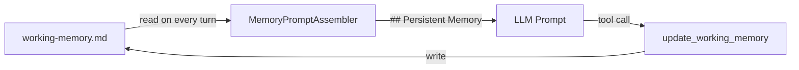

# Persistent Markdown Working Memory

> A human-readable `.md` file that persists across conversations — inspired by Mastra's agent notepad pattern. Complements the [Baddeley cognitive working memory](https://github.com/framersai/agentos/blob/master/src/cognition/memory/core/working/CognitiveWorkingMemory.ts) with durable, editable state.

Implementation lives at [`packages/agentos/src/cognition/memory/core/working/`](https://github.com/framersai/agentos/tree/master/src/cognition/memory/core/working): [`MarkdownWorkingMemory`](https://github.com/framersai/agentos/blob/master/src/cognition/memory/core/working/MarkdownWorkingMemory.ts) owns the on-disk file, [`ReadWorkingMemoryTool`](https://github.com/framersai/agentos/blob/master/src/cognition/memory/core/working/ReadWorkingMemoryTool.ts) and [`UpdateWorkingMemoryTool`](https://github.com/framersai/agentos/blob/master/src/cognition/memory/core/working/UpdateWorkingMemoryTool.ts) expose it as agent tools, and [`MemoryPromptAssembler`](https://github.com/framersai/agentos/blob/master/src/cognition/memory/core/prompt/MemoryPromptAssembler.ts) splices the contents into every turn's prompt under the `## Persistent Memory` heading.

---

## Overview

Each agent maintains a markdown file at `~/.agentos/agents/{seedId}/working-memory.md` (owned by [`MarkdownWorkingMemory`](https://github.com/framersai/agentos/blob/master/src/cognition/memory/core/working/MarkdownWorkingMemory.ts)). This file is:

- **Injected** into every prompt as a `## Persistent Memory` section
- **Updated** by the agent via tools during conversation
- **Human-editable** — open the file in any text editor to add or correct information
- **Budget-capped** at 5% of the prompt token budget to avoid context bloat



Source: [`MemoryPromptAssembler`](https://github.com/framersai/agentos/blob/master/src/cognition/memory/core/prompt/MemoryPromptAssembler.ts) splices the file body into the prompt under `## Persistent Memory`; [`UpdateWorkingMemoryTool`](https://github.com/framersai/agentos/blob/master/src/cognition/memory/core/working/UpdateWorkingMemoryTool.ts) writes back when the agent calls the tool.

## How It Coexists with Baddeley Cognitive Memory

| Aspect | [Markdown Working Memory](https://github.com/framersai/agentos/blob/master/src/cognition/memory/core/working/MarkdownWorkingMemory.ts) | [Baddeley Cognitive Memory](https://github.com/framersai/agentos/blob/master/src/cognition/memory/core/working/CognitiveWorkingMemory.ts) |
|--------|------------------------|--------------------------|
| **Persistence** | Survives restarts, stored on disk | Ephemeral, lives in RAM per session |
| **Capacity** | 5% of token budget (~200-800 tokens) | 7 +/- 2 slots, personality-modulated |
| **Content** | User preferences, project context, facts | Active reasoning slots, recent stimuli |
| **Update mechanism** | Explicit tool call or manual edit | Automatic decay and activation |
| **Visibility** | Human-readable `.md` file | Internal cognitive model |
| **Purpose** | Long-term agent personalization | Short-term cognitive processing |

Both systems contribute to the prompt simultaneously — they are complementary, not competing.

## Tools

### [`read_working_memory`](https://github.com/framersai/agentos/blob/master/src/cognition/memory/core/working/ReadWorkingMemoryTool.ts)

Returns the current contents of the agent's working memory file.

```json
{ "name": "read_working_memory" }
```

### [`update_working_memory`](https://github.com/framersai/agentos/blob/master/src/cognition/memory/core/working/UpdateWorkingMemoryTool.ts)

Replaces the entire file content. The agent decides what to keep, add, or remove.

```json
{
  "name": "update_working_memory",
  "input": {
    "content": "## User Preferences\n- Prefers concise answers\n- Timezone: PST\n\n## Current Project\n- Building a REST API with Hono\n- Database: PostgreSQL\n"
  }
}
```

## Default Template

New agents start with a minimal template:

```markdown
## User Preferences
<!-- Agent will fill in learned preferences -->

## Current Project
<!-- Context about what the user is working on -->

## Key Facts
<!-- Important information to remember across sessions -->
```

## Custom Templates

Override the default via `agent.config.json`:

```json
{
  "workingMemoryTemplate": "## Client Profile\n\n## Open Tasks\n\n## Decisions Log\n"
}
```

## Prompt Injection

On every turn, [`MemoryPromptAssembler`](https://github.com/framersai/agentos/blob/master/src/cognition/memory/core/prompt/MemoryPromptAssembler.ts) reads the file and injects it:

```
## Persistent Memory
<contents of working-memory.md>
```

The section is capped at 5% of the total prompt token budget. If the file exceeds this limit, it is truncated with a warning appended to the prompt.

## Manual Editing

The file is plain markdown — edit it anytime:

```bash
# Open in your editor
vim ~/.agentos/agents/my-agent/working-memory.md
```

Changes are picked up on the next conversation turn with no restart required.

## Source Files

| Symbol | Repo | Path |
|---|---|---|
| [`MarkdownWorkingMemory`](https://github.com/framersai/agentos/blob/master/src/cognition/memory/core/working/MarkdownWorkingMemory.ts) | `framersai/agentos` | `src/cognition/memory/core/working/MarkdownWorkingMemory.ts` |
| [`CognitiveWorkingMemory`](https://github.com/framersai/agentos/blob/master/src/cognition/memory/core/working/CognitiveWorkingMemory.ts) (Baddeley) | `framersai/agentos` | `src/cognition/memory/core/working/CognitiveWorkingMemory.ts` |
| [`ReadWorkingMemoryTool`](https://github.com/framersai/agentos/blob/master/src/cognition/memory/core/working/ReadWorkingMemoryTool.ts) | `framersai/agentos` | `src/cognition/memory/core/working/ReadWorkingMemoryTool.ts` |
| [`UpdateWorkingMemoryTool`](https://github.com/framersai/agentos/blob/master/src/cognition/memory/core/working/UpdateWorkingMemoryTool.ts) | `framersai/agentos` | `src/cognition/memory/core/working/UpdateWorkingMemoryTool.ts` |
| [`MemoryPromptAssembler`](https://github.com/framersai/agentos/blob/master/src/cognition/memory/core/prompt/MemoryPromptAssembler.ts) | `framersai/agentos` | `src/cognition/memory/core/prompt/MemoryPromptAssembler.ts` |
| [Working memory tree](https://github.com/framersai/agentos/tree/master/src/cognition/memory/core/working) | `framersai/agentos` | `src/cognition/memory/core/working/` |
