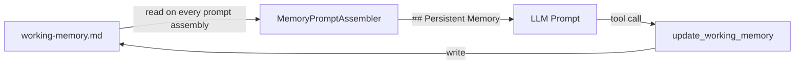

# Persistent Markdown Working Memory

> A human-readable `.md` file that persists across conversations — inspired by Mastra's agent notepad pattern. Complements the [Baddeley cognitive working memory](https://github.com/framerslab/agentos/blob/master/src/cognition/memory/core/working/CognitiveWorkingMemory.ts) with durable, editable state.

Implementation lives at [`src/cognition/memory/core/working/`](https://github.com/framerslab/agentos/tree/master/src/cognition/memory/core/working): [`MarkdownWorkingMemory`](https://github.com/framerslab/agentos/blob/master/src/cognition/memory/core/working/MarkdownWorkingMemory.ts) owns the file, [`ReadWorkingMemoryTool`](https://github.com/framerslab/agentos/blob/master/src/cognition/memory/core/working/ReadWorkingMemoryTool.ts) and [`UpdateWorkingMemoryTool`](https://github.com/framerslab/agentos/blob/master/src/cognition/memory/core/working/UpdateWorkingMemoryTool.ts) expose it as agent tools, and [`MemoryPromptAssembler`](https://github.com/framerslab/agentos/blob/master/src/cognition/memory/core/prompt/MemoryPromptAssembler.ts) puts its contents into the memory section of each prompt under a `## Persistent Memory` heading.

---

## Overview

The host creates the file and wires it in; AgentOS creates no working-memory file on its own:

```ts
import {
  CognitiveMemoryManager,
  MarkdownWorkingMemory,
  ReadWorkingMemoryTool,
  UpdateWorkingMemoryTool,
} from '@framers/agentos/memory';

const notes = new MarkdownWorkingMemory('./agents/aria/working-memory.md'); // template and maxTokens optional
notes.ensureFile(); // writes the default template when the file does not exist

const manager = new CognitiveMemoryManager();
await manager.initialize({
  // ...the rest of the manager config
  persistentMemory: notes, // read on every prompt assembly
});

// Give the agent the two tools.
const tools = [new ReadWorkingMemoryTool(notes), new UpdateWorkingMemoryTool(notes)];
```

With that wiring the file is:

- **Injected** into each prompt the manager assembles, as a `## Persistent Memory` section
- **Updated** by the agent through `update_working_memory`
- **Human-editable**: open the file in any text editor to add or correct information
- **Budget-capped** at 5% of the memory section's token budget (`persistentMemory: 0.05` in the manager's budget allocation)

The Wunderland CLI does this wiring for each agent: its file is `agents/<agent id>/working-memory.md` under the Wunderland workspace directory, and the agent's config can set `workingMemoryTemplate`.


```mermaid
flowchart LR
  A[working-memory.md] -->|read on every prompt assembly| B[MemoryPromptAssembler]
  B -->|"## Persistent Memory"| C[LLM Prompt]
  C -->|tool call| D[update_working_memory]
  D -->|write| A
```

## How It Coexists with Baddeley Cognitive Memory

| Aspect | [Markdown Working Memory](https://github.com/framerslab/agentos/blob/master/src/cognition/memory/core/working/MarkdownWorkingMemory.ts) | [Baddeley Cognitive Memory](https://github.com/framerslab/agentos/blob/master/src/cognition/memory/core/working/CognitiveWorkingMemory.ts) |
|--------|------------------------|--------------------------|
| **Persistence** | Survives restarts, stored on disk | Ephemeral, lives in RAM per session |
| **Capacity** | 5% of the memory section's token budget in the prompt; 2,000 tokens on disk by default | 7 +/- 2 slots, personality-modulated |
| **Content** | User preferences, project context, facts | Active reasoning slots, recent stimuli |
| **Update mechanism** | Explicit tool call or manual edit | Automatic decay and activation |
| **Visibility** | Human-readable `.md` file | Internal cognitive model |
| **Purpose** | Long-term agent personalization | Short-term cognitive processing |

Both contribute to the prompt: the assembler adds the persistent memory section before the working-memory section.

## Tools

### [`read_working_memory`](https://github.com/framerslab/agentos/blob/master/src/cognition/memory/core/working/ReadWorkingMemoryTool.ts)

Returns the current contents of the working memory file.

```json
{ "name": "read_working_memory" }
```

### [`update_working_memory`](https://github.com/framerslab/agentos/blob/master/src/cognition/memory/core/working/UpdateWorkingMemoryTool.ts)

Replaces the entire file content. The agent decides what to keep, add, or remove. Content over the `maxTokens` limit (2,000 estimated tokens by default, at four characters a token) is cut and ends with `<!-- truncated: exceeded token limit -->`; the tool's output reports `truncated` and `tokensUsed`.

```json
{
  "name": "update_working_memory",
  "input": {
    "content": "## User Preferences\n- Prefers concise answers\n- Timezone: PST\n\n## Current Project\n- Building a REST API with Hono\n- Database: PostgreSQL\n"
  }
}
```

## Default Template

`ensureFile()` writes this template when the file does not exist:

```markdown
# Working Memory

## User Profile
- **Name**:
- **Preferences**:

## Current Context
- **Active Topics**:
- **Recent Requests**:

## Notes
```

## Custom Templates

Pass a template as the second constructor argument:

```ts
const notes = new MarkdownWorkingMemory(
  './agents/aria/working-memory.md',
  '## Client Profile\n\n## Open Tasks\n\n## Decisions Log\n',
);
```

## Prompt Injection

On every prompt assembly, the manager reads the file through `persistentMemory.read()` and [`MemoryPromptAssembler`](https://github.com/framerslab/agentos/blob/master/src/cognition/memory/core/prompt/MemoryPromptAssembler.ts) adds it:

```
## Persistent Memory

<contents of working-memory.md>
```

An empty file adds nothing. Text over the section's budget is cut and ends with `<!-- truncated -->`.

## Manual Editing

The file is plain markdown; edit it at any time. The next prompt assembly reads the new contents, with no restart.

## Source Files

| Symbol | Repo | Path |
|---|---|---|
| [`MarkdownWorkingMemory`](https://github.com/framerslab/agentos/blob/master/src/cognition/memory/core/working/MarkdownWorkingMemory.ts) | `framerslab/agentos` | [`src/cognition/memory/core/working/MarkdownWorkingMemory.ts`](https://github.com/framerslab/agentos/blob/master/src/cognition/memory/core/working/MarkdownWorkingMemory.ts) |
| [`CognitiveWorkingMemory`](https://github.com/framerslab/agentos/blob/master/src/cognition/memory/core/working/CognitiveWorkingMemory.ts) (Baddeley) | `framerslab/agentos` | [`src/cognition/memory/core/working/CognitiveWorkingMemory.ts`](https://github.com/framerslab/agentos/blob/master/src/cognition/memory/core/working/CognitiveWorkingMemory.ts) |
| [`ReadWorkingMemoryTool`](https://github.com/framerslab/agentos/blob/master/src/cognition/memory/core/working/ReadWorkingMemoryTool.ts) | `framerslab/agentos` | [`src/cognition/memory/core/working/ReadWorkingMemoryTool.ts`](https://github.com/framerslab/agentos/blob/master/src/cognition/memory/core/working/ReadWorkingMemoryTool.ts) |
| [`UpdateWorkingMemoryTool`](https://github.com/framerslab/agentos/blob/master/src/cognition/memory/core/working/UpdateWorkingMemoryTool.ts) | `framerslab/agentos` | [`src/cognition/memory/core/working/UpdateWorkingMemoryTool.ts`](https://github.com/framerslab/agentos/blob/master/src/cognition/memory/core/working/UpdateWorkingMemoryTool.ts) |
| [`MemoryPromptAssembler`](https://github.com/framerslab/agentos/blob/master/src/cognition/memory/core/prompt/MemoryPromptAssembler.ts) | `framerslab/agentos` | [`src/cognition/memory/core/prompt/MemoryPromptAssembler.ts`](https://github.com/framerslab/agentos/blob/master/src/cognition/memory/core/prompt/MemoryPromptAssembler.ts) |
| [Working memory tree](https://github.com/framerslab/agentos/tree/master/src/cognition/memory/core/working) | `framerslab/agentos` | [`src/cognition/memory/core/working/`](https://github.com/framerslab/agentos/tree/master/src/cognition/memory/core/working) |
