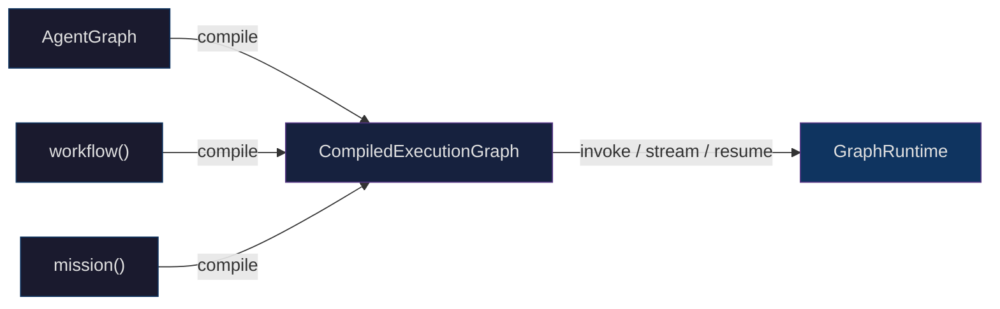
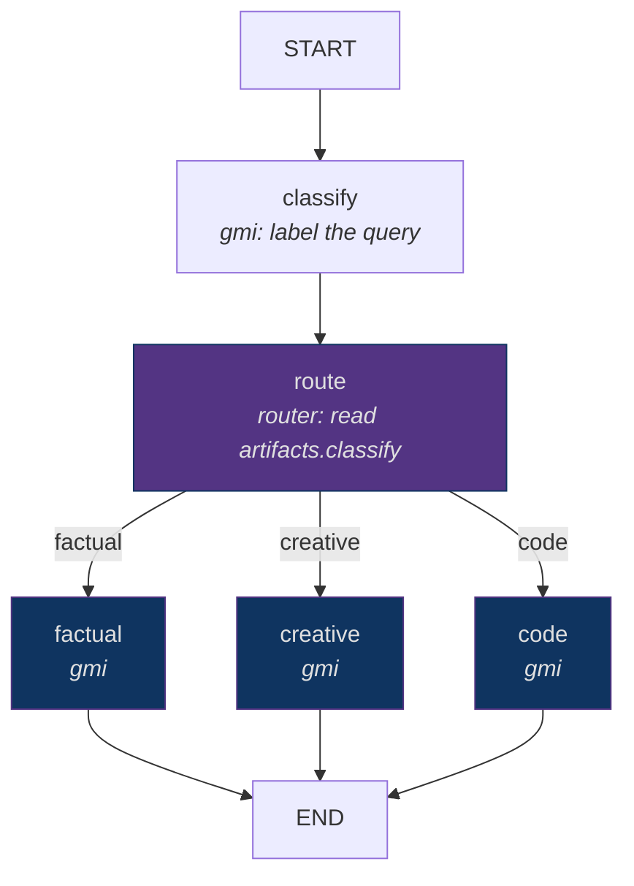

# Orchestration Guide

A walkthrough of the three graph builders in `@framers/agentos/orchestration`: [`AgentGraph`](https://github.com/framerslab/agentos/blob/master/src/orchestration/builders/AgentGraph.ts), `workflow()` and `mission()`. Each compiles to the same [`CompiledExecutionGraph`](https://github.com/framerslab/agentos/blob/master/src/orchestration/ir/types.ts) IR and runs on the same [`GraphRuntime`](https://github.com/framerslab/agentos/blob/master/src/orchestration/runtime/GraphRuntime.ts). The reference pages cover each one in full: [AgentGraph](../architecture/AGENT_GRAPH.md), [workflow() DSL](./WORKFLOW_DSL.md), [mission() API](./MISSION_API.md) and [Checkpointing](./CHECKPOINTING.md).



Every compiled graph exposes its IR (`toIR()`, and `toWorkflow()` on a mission), and any IR can run inside another graph as a `subgraph` node.

---

## How a Run Works

### Executors come from the host

The runtime calls no model and no tool of its own. `compile({ deps })` passes the node executors to it ([`WorkflowRuntimeDeps`](https://github.com/framerslab/agentos/blob/master/src/orchestration/builders/WorkflowBuilder.ts)), and each node type needs its own:

| Node type | Needs | Without it |
|---|---|---|
| `gmi` | `deps.loopController` and `deps.providerCall` | Succeeds with the output `'gmi-placeholder'` |
| `tool` | `deps.toolOrchestrator` | Fails (`success: false`) |
| `guardrail` | `deps.guardrailEngine` | Passes |
| `subgraph` | `deps.subgraphResolver` and `deps.createSubgraphRuntime` | Succeeds with the output `'subgraph-placeholder'` |
| `extension` | `deps.extensionExecutor` | Succeeds with the output `'extension-not-configured'` |
| `voice` | `deps.voiceExecutor` | Fails |
| `router`, `human` | Nothing | |

The examples on this page share one set of host bindings:

```typescript
import { LoopController } from '@framers/agentos/orchestration';
import type { WorkflowRuntimeDeps } from '@framers/agentos/orchestration/builders/WorkflowBuilder';

// Your application's own tool runner and model call.
declare function runMyTool(name: string, args: Record<string, unknown>): Promise<unknown>;
declare function callMyModel(instructions: string, context: unknown): Promise<string>;

const deps: WorkflowRuntimeDeps = {
  toolOrchestrator: {
    async processToolCall({ toolCallRequest }) {
      const output = await runMyTool(toolCallRequest.toolName, toolCallRequest.arguments);
      return { success: true, output };
    },
  },
  loopController: new LoopController(),
  async *providerCall(instructions, state) {
    // state.artifacts holds the outputs of the nodes that ran before this one.
    const text = await callMyModel(instructions, { input: state.input, artifacts: state.artifacts });
    yield { type: 'text_delta', content: text };
    // No tool calls: the node's loop ends after this turn.
    return { responseText: text, toolCalls: [], finishReason: 'stop' };
  },
};
```

A `gmi` node runs [`LoopController`](https://github.com/framerslab/agentos/blob/master/src/orchestration/runtime/LoopController.ts)'s loop for up to `maxInternalIterations` turns (default 10). Each turn calls `providerCall(instructions, state)`; when the returned `toolCalls` is not empty, the loop runs those calls through `deps.toolOrchestrator` and calls `providerCall` again with the same arguments, so the host keeps the conversation and the tool results itself. The node's output is the text of all its turns.

### State and outputs

- `invoke(input)` freezes `input` into `state.input`. `state.scratch` and `state.artifacts` start empty. The Zod schemas passed to a builder are lowered to JSON Schema and stored in the IR; the runtime neither validates against them nor applies their defaults.
- A node's output goes into `state.artifacts` under the node's id (a `workflow()` step's `outputAs` names another key). `invoke()` returns `state.artifacts`. A `gmi` node's output is its text, a `tool` node's is the tool's `output`.
- `scratch` changes only through executors that return a scratch update: a `subgraph` node's `outputMapping`, an `extension` node whose output is an object, and a `voice` node (its checkpoint). Reducers merge those updates.
- A `tool` node sends the tool the static `args` from `toolNode(name, { args })` and nothing from the graph state.

### Scheduling

- A node runs when every node with an edge into it has completed or been skipped, and it runs at most once per run. A router marks the targets it did not pick skipped; skipping goes no further, so a node whose incoming edges all come from skipped nodes still runs.
- Nodes that become ready together run concurrently. After such a batch the runtime merges the branches' `scratch` with the reducers and keeps `artifacts` as they were before the batch, so the outputs of the nodes that ran in one batch are not in the result.
- A node that fails stops the run: the runtime saves a checkpoint and emits `error`, `interrupt` and `run_end` (see [Checkpointing](./CHECKPOINTING.md)). `toolNode(name, { retryPolicy })` and a `workflow()` step's `retryPolicy` re-run a failed node first.

---

## AgentGraph

Use [`AgentGraph`](../architecture/AGENT_GRAPH.md) when you lay out the nodes and edges yourself.

### Minimal example

```typescript
import { AgentGraph, START, END, gmiNode, toolNode } from '@framers/agentos/orchestration';
import { z } from 'zod';

const graph = new AgentGraph({
  input:     z.object({ topic: z.string() }),
  scratch:   z.object({}),
  artifacts: z.object({}),
})
  .addNode('search',    toolNode('web_search', { args: { query: 'quantum computing' } }))
  .addNode('summarize', gmiNode({ instructions: 'Summarize the search results in 3 sentences.' }))
  .addEdge(START, 'search')
  .addEdge('search', 'summarize')
  .addEdge('summarize', END)
  .compile({ deps });

const result = await graph.invoke({ topic: 'quantum computing' });
console.log(result.summarize); // the summary text; result.search holds the tool output
```

`compile()` validates the graph and throws on an edge to an unknown node, a missing entry or exit edge, or a node that cannot be reached from `START`.

### Routing on a node's output

A `routerNode` returns the id of the node to run next. Give it a static edge to every node it can return; the runtime follows the one it names and marks the others skipped.

```typescript
import { AgentGraph, START, END, gmiNode, routerNode } from '@framers/agentos/orchestration';
import { z } from 'zod';

const labels = ['factual', 'creative', 'code'];

const graph = new AgentGraph({
  input:     z.object({ query: z.string() }),
  scratch:   z.object({}),
  artifacts: z.object({}),
})
  .addNode('classify', gmiNode({
    instructions: 'Classify the query as "factual", "creative", or "code". Reply with only the label.',
  }))
  .addNode('route', routerNode((state) => {
    const label = String(state.artifacts.classify ?? '').toLowerCase();
    return labels.find((id) => label.includes(id)) ?? 'creative';
  }))
  .addNode('factual',  gmiNode({ instructions: 'Answer with facts and name your sources.' }))
  .addNode('creative', gmiNode({ instructions: 'Write a creative, engaging response.' }))
  .addNode('code',     gmiNode({ instructions: 'Write clean, documented code with an explanation.' }))
  .addEdge(START, 'classify')
  .addEdge('classify', 'route')
  .addEdge('route', 'factual')
  .addEdge('route', 'creative')
  .addEdge('route', 'code')
  .addEdge('factual',  END)
  .addEdge('creative', END)
  .addEdge('code',     END)
  .compile({ deps });

const result = await graph.invoke({ query: 'Write a debounce function in TypeScript' });
// { classify: 'code', code: '...' }
```



`addConditionalEdge(source, fn)` stores its target as the placeholder `__CONDITIONAL__`, and the scheduler counts that placeholder as an edge from the source to every node in the graph, the source included. The source then waits on itself and every other node waits on the source, so no node runs and `invoke()` returns `{}`. Route with a `routerNode` as above.

### Loops

A node runs at most once per run, and a node in a cycle waits for the node before it in the same cycle, so a cycle never starts. `compile()` accepts cycles, and the run ends when only the nodes of the cycle and the nodes after it are left. Repeated work belongs inside a node, in the `gmi` node's tool loop (`maxInternalIterations`), or in a new run.

### Subgraphs

`subgraphNode(ir, { inputMapping, outputMapping })` runs another compiled graph as one node. `inputMapping` maps paths in the parent's `scratch` to paths in the child's input, and `outputMapping` maps paths in the child's artifacts to paths in the parent's `scratch`; the child's artifacts are also the node's output. The node looks the child up with `deps.subgraphResolver(graphId)` and runs it on the runtime that `deps.createSubgraphRuntime()` returns.

```typescript
import {
  AgentGraph, START, END, gmiNode, subgraphNode,
  GraphRuntime, NodeExecutor, InMemoryCheckpointStore,
} from '@framers/agentos/orchestration';
import { z } from 'zod';

const research = new AgentGraph({
  input: z.object({}), scratch: z.object({}), artifacts: z.object({}),
})
  .addNode('notes', gmiNode({ instructions: 'Collect research notes on fusion energy.' }))
  .addEdge(START, 'notes')
  .addEdge('notes', END)
  .compile({ deps });
const researchIR = research.toIR();

const production = new AgentGraph({
  input: z.object({ topic: z.string() }), scratch: z.object({}), artifacts: z.object({}),
})
  .addNode('research', subgraphNode(researchIR, { outputMapping: { notes: 'notes' } }))
  .addNode('write',    gmiNode({ instructions: 'Write a blog post from the research notes.' }))
  .addEdge(START, 'research')
  .addEdge('research', 'write')
  .addEdge('write', END)
  .compile({
    deps: {
      ...deps,
      subgraphResolver: (graphId) => (graphId === researchIR.id ? researchIR : undefined),
      createSubgraphRuntime: () => new GraphRuntime({
        checkpointStore: new InMemoryCheckpointStore(),
        nodeExecutor: new NodeExecutor(deps),
      }),
    },
  });

const result = await production.invoke({ topic: 'fusion energy' });
// result.research = the child's artifacts ({ notes: '...' }); result.write = the post
```

### Node options and policies

```typescript
gmiNode(
  {
    instructions: 'Summarize the document.',
    maxInternalIterations: 5, // read: caps the node's loop (default 10)
    parallelTools: false,     // read: runs a turn's tool calls together when true
    executionMode: 'react_bounded', // stored in the IR, not read
    temperature: 0.3,               // stored in the IR, not passed to providerCall
    maxTokens: 2048,                // stored in the IR, not passed to providerCall
  },
  {
    checkpoint: 'after',      // read: save a checkpoint after the node
    effectClass: 'read',      // read: on resume, a 'write', 'external' or 'human' node keeps its recorded output
    memory: { consistency: 'snapshot', read: { types: ['semantic'], maxTraces: 10 } }, // stored, not read
    guardrails: { output: ['pii-redaction'], onViolation: 'sanitize' },               // stored, not read
  },
)
```

The runtime reads a node's `checkpoint` flag and its `effectClass`. It does not read the `memory`, `discovery`, `persona` or `guardrails` policies; a `guardrailNode` is the step that checks content during a run, and a `humanNode` runs `pii-redaction` and `code-safety` through `deps.guardrailEngine` after an automatic or judged approval.

---

## workflow()

`workflow()` builds a graph from steps declared in order. `compile()` throws when `.input()` or `.returns()` is missing and when the graph has a cycle, and it always checkpoints after every node.

### Quick start

```typescript
import { workflow } from '@framers/agentos/orchestration';
import { z } from 'zod';

const pipeline = workflow('content-pipeline')
  .input(z.object({ url: z.string() }))
  .returns(z.object({ summary: z.string(), tags: z.string() }))
  .step('fetch',     { tool: 'web_fetch', effectClass: 'external' })
  .step('summarize', { gmi: { instructions: 'Summarize the fetched page in 3 sentences.' }, outputAs: 'summary' })
  .step('tag',       { gmi: { instructions: 'Extract 5 topic tags as a JSON array.' }, outputAs: 'tags' })
  .compile({ deps });

const result = await pipeline.invoke({ url: 'https://example.com/article' });
console.log(result.summary, result.tags); // result.fetch holds the tool output
```

A `tool` step sends the tool no arguments: `StepConfig` has no field for them, so the `web_fetch` step above receives `{}` and the URL reaches only the host's own `providerCall` through `state.input`. A `gmi` step is recorded as `single_turn` and runs the same loop as any `gmi` node, up to 10 turns while `providerCall` returns tool calls.

### Branches

`.branch(condition, routes)` takes a function and a map from route key to step config. The compiler adds a router node that runs the function, and a node per route.

```typescript
workflow('triage')
  .input(z.object({ ticket: z.string() }))
  .returns(z.object({ response: z.string() }))
  .step('classify', { gmi: { instructions: 'Classify as "billing", "technical", or "general".' } })
  .branch(
    (state) => String(state.artifacts.classify ?? '').trim(),
    {
      billing:   { gmi: { instructions: 'Handle the billing issue.' } },
      technical: { gmi: { instructions: 'Diagnose the technical issue.' } },
      general:   { gmi: { instructions: 'Answer the general inquiry.' } },
    },
  )
  .compile({ deps });
```

The router node returns the route key itself, and the runtime takes a router's return value as the id of the node to run next. The route nodes have generated ids (`branch-<key>-<n>`), so no node matches: every route node is marked skipped and the run continues with the step declared after the branch. To route on a value, build the graph with `AgentGraph` and a `routerNode` that returns node ids.

### Parallel steps

`.parallel(steps, join)` adds one node per step config, all connected from the previous step, and registers `join.merge` as reducers. `join.strategy`, `join.quorumCount` and `join.timeout` are stored and not read.

```typescript
workflow('multi-source-research')
  .input(z.object({ query: z.string() }))
  .returns(z.object({ report: z.string() }))
  .parallel(
    [{ tool: 'web_search' }, { tool: 'news_search' }, { tool: 'arxiv_search' }],
    { strategy: 'all', merge: { 'scratch.results': 'concat' } },
  )
  .step('synthesize', { gmi: { instructions: 'Synthesize the sources into a report.' }, outputAs: 'report' })
  .compile({ deps });
```

The three tool nodes become ready together and run concurrently. Their outputs are not in the result (see [Scheduling](#scheduling)), and `synthesize` runs after all three.

### Human step

```typescript
workflow('content-approval')
  .input(z.object({ brief: z.string() }))
  .returns(z.object({ post: z.string() }))
  .step('draft',   { gmi: { instructions: 'Write a blog post draft from the brief.' } })
  .step('approve', { human: { prompt: 'Review the draft. Approve or request changes.' } })
  .step('publish', { tool: 'cms_publish', effectClass: 'external' })
  .compile({ deps });
```

The `human` step interrupts the run: the runtime saves a checkpoint, emits an `interrupt` event with the reason `human_approval`, and ends the run with `run_end`. `resume(runId)` marks the step complete with its recorded output (`{ prompt }`) and runs the rest; a host that has the reviewer's answer writes it into a fork of the checkpoint and resumes the fork ([Checkpointing](./CHECKPOINTING.md), [Human-in-the-Loop](../safety/HUMAN_IN_THE_LOOP.md)).

A step's `memory`, `discovery` and `guardrails` policies are stored and not read; `requiresApproval` and `onFailure` are not read either, and `retryPolicy` re-runs a failed step whatever `onFailure` says.

---

## mission()

`mission()` builds a linear graph from a goal and a plan template ([mission() API](./MISSION_API.md)).

```typescript
import { mission } from '@framers/agentos/orchestration';
import { z } from 'zod';

const research = mission('research')
  .input(z.object({ topic: z.string() }))
  .goal('Research quantum error correction and produce a concise 3-paragraph summary with citations.')
  .returns(z.object({ summary: z.string() }))
  .planner({ strategy: 'linear', maxSteps: 8, style: 'research' })
  .compile({ deps });

const artifacts = await research.invoke({ topic: 'quantum error correction' });
// outputs under gather-info, process-info, deliver-result, refine-output
```

- `planner.style` picks the template (`research`, `qa` or `creative`); without it the compiler classifies the goal's wording. `strategy` and `maxSteps` are required and not read; a pre-built plan goes in `planner.plan`.
- The goal is wrapped in `<mission_goal>` tags at the start of every step's instructions. `{{variable}}` placeholders are not filled.
- `.anchor(id, node, { phase, after })` splices a node of your own into the chain.
- `autonomy()`, `providerStrategy()`, `costCap()`, `maxAgents()`, `branches()`, `plannerModel()` and `executionModel()` store values the compiler does not read.

---

## Voice Nodes

`voiceNode(id, config)` builds a `voice` node; `.on(exitReason, target)` maps the reason the voice session ended to the next node, and `.build()` returns the node.

```typescript
import { AgentGraph, START, END, voiceNode, gmiNode, toolNode } from '@framers/agentos/orchestration';
import { VoiceNodeExecutor } from '@framers/agentos/orchestration/runtime/VoiceNodeExecutor';
import { z } from 'zod';

const callGraph = new AgentGraph({
  input:     z.object({ callerId: z.string() }),
  scratch:   z.object({}),
  artifacts: z.object({}),
})
  // listen fails unless an earlier step has put the transport at state.scratch.voiceTransport (below).
  .addNode('listen', voiceNode('listen', { mode: 'conversation', maxTurns: 10 })
    .on('turns-exhausted', 'resolve')
    .on('hangup', 'cleanup')
    .build())
  .addNode('resolve', gmiNode({ instructions: 'Determine the resolution from the call transcript.' }))
  .addNode('cleanup', toolNode('close_ticket'))
  .addEdge(START, 'listen')
  .addEdge('listen', 'resolve')
  .addEdge('listen', 'cleanup')
  .addEdge('resolve', END)
  .addEdge('cleanup', END)
  .compile({ deps: { ...deps, voiceExecutor: new VoiceNodeExecutor((event) => console.log(event.type)) } });
```

A `conversation` or `listen-only` node ends with the first of these exit reasons: `hangup` (the transport emits `close` or `disconnected`), `turns-exhausted` (`maxTurns` turns, when it is above 0), `keyword:<word>` (with `exitOn: 'keyword'`, a final transcript containing one of `exitKeywords`), `silence-timeout` (with `exitOn: 'silence-timeout'`, 30 seconds without speech) and `interrupted` (an `AbortSignal` placed at `state.scratch.abortSignal` fires; a barge-in emits `voice_barge_in` and does not end the node). A `speak-only` node delivers `speakText` and ends with `completed`. The executor returns the target mapped to the exit reason, and the runtime runs that node and skips the others. The node still needs a static edge to each target, because the scheduler and the validator read only edges. An exit reason with no mapping follows every static edge, and a mapping back to the voice node itself does not run it again.

The executor needs the voice transport at `state.scratch.voiceTransport` and fails without it. A run starts with an empty `scratch` and no builder puts a transport there (`workflow().transport('voice', ...)` stores its settings and nothing reads them), so the host writes it from an earlier node, for example an `extension` node, whose object output is merged into `scratch`. Voice events (`voice_session`, `voice_transcript`, `voice_barge_in`, `voice_turn_complete`) go to the callback passed to `VoiceNodeExecutor`, not to the graph's event stream.

| Option | Type | Read by the executor |
|---|---|---|
| `mode` | `'conversation' \| 'listen-only' \| 'speak-only'` | Yes (required) |
| `maxTurns` | `number` | Yes: ends the node with `turns-exhausted` (0 or unset = no limit) |
| `exitOn` | `'hangup' \| 'silence-timeout' \| 'keyword' \| 'turns-exhausted' \| 'manual'` | `'keyword'` and `'silence-timeout'` add their exit condition; the other values add none |
| `exitKeywords` | `string[]` | Yes, with `exitOn: 'keyword'` |
| `speakText` | `string` | Yes, on a `speak-only` node |
| `stt`, `tts`, `voice`, `endpointing`, `bargeIn`, `diarization`, `language` | | No: stored in the node's checkpoint and not applied |

---

## Checkpointing and Resume

```typescript
import { AgentGraph, InMemoryCheckpointStore } from '@framers/agentos/orchestration';

const store = new InMemoryCheckpointStore();

const graph = new AgentGraph(stateSchema, { checkpointPolicy: 'every_node' })
  // ...nodes and edges...
  .compile({ checkpointStore: store, deps });

let runId: string | undefined;
for await (const event of graph.stream({ topic: 'fusion energy' })) {
  if (event.type === 'run_start') runId = event.runId;
}

// After an interrupt or a failure: continue from the run's latest checkpoint.
const artifacts = await graph.resume(runId!);

// Fork a checkpoint with patched state and resume the fork.
const [latest] = await store.list(graph.toIR().id, { runId, limit: 1 });
const forkId = await store.fork(latest.id, { scratch: { approved: true } });
const forked = await graph.resume(forkId);
```

`AgentGraph` takes `checkpointPolicy` in its constructor (`'none'` by default); `workflow()` and `mission()` checkpoint after every node. Under every policy the runtime also saves a checkpoint when a node fails or interrupts the run. `InMemoryCheckpointStore` keeps checkpoints in process memory and takes no arguments; implement [`ICheckpointStore`](https://github.com/framerslab/agentos/blob/master/src/orchestration/checkpoint/ICheckpointStore.ts) for a durable store. Resume, forks and the policies are in [Checkpointing](./CHECKPOINTING.md).

---

## Graph Events

`stream(input)` yields [`GraphEvent`](https://github.com/framerslab/agentos/blob/master/src/orchestration/events/GraphEvent.ts) values:

```typescript
for await (const event of graph.stream({ topic: 'AI safety' })) {
  switch (event.type) {
    case 'node_start':
      console.log(`-> ${event.nodeId}`);
      break;
    case 'node_end':
      console.log(`ok ${event.nodeId} in ${event.durationMs}ms`);
      break;
    case 'interrupt':
      console.log(`paused at ${event.nodeId}: ${event.reason}`);
      break;
    case 'error':
      console.error(event.nodeId, event.error.code, event.error.message);
      break;
    case 'run_end':
      console.log('done', event.finalOutput);
      break;
  }
}
```

| Event | Payload | When |
|---|---|---|
| `run_start` | `runId`, `graphId` | The run begins |
| `node_start` | `nodeId`, `state` (input and scratch) | A node starts, and again before each retry |
| `node_end` | `nodeId`, `output`, `durationMs`, `telemetry` | A node completes |
| `edge_transition` | `sourceId`, `targetId`, `edgeType` | The runtime follows an edge to a node |
| `checkpoint_saved` | `checkpointId`, `nodeId` | A checkpoint is saved |
| `interrupt` | `nodeId`, `reason` (`human_approval`, `error`, `guardrail_violation`) | A human node pauses the run, or a node fails |
| `node_timeout` | `nodeId`, `timeoutMs` | A node's `timeout` expired |
| `error` | `nodeId`, `error.code`, `error.message` | A node failed (`NODE_EXECUTION_FAILED` or `NODE_TIMEOUT`) |
| `guardrail:hitl-override` | `nodeId`, `guardrailId`, `reason` | A human node's post-approval guardrails rejected the approval |
| `run_end` | `runId`, `finalOutput` (the artifacts), `totalDurationMs` | The run ends |

A `GraphRuntime` built with an `expansionHandler` also emits `mission:*` events; none of the builders sets one. The other event types the union declares (`text_delta`, `tool_call`, `tool_result`, `memory_read`, `memory_write`, `discovery_result`, `guardrail_result`) are not emitted by the runtime.

---

## Choosing the Right API

| If you need... | Use |
|---|---|
| Known steps in a fixed order | `workflow()` |
| Routing on a node's output | `AgentGraph` with a `routerNode` |
| A graph built from a goal and a plan template | `mission()` |
| Several agents working on one task | [`agency()`](./AGENCY_API.md) (`sequential`, `parallel`, `debate`, `review-loop`, `hierarchical`, `graph`) |
| One model call | `generateText()` / `streamText()` |
| A voice turn inside a graph | `AgentGraph` with `voiceNode` |

---

## Related Guides

- [AgentGraph](../architecture/AGENT_GRAPH.md): node and edge types, state, subgraphs
- [workflow() DSL](./WORKFLOW_DSL.md): steps, branches, parallel steps
- [mission() API](./MISSION_API.md): plan templates, anchors, introspection
- [Checkpointing](./CHECKPOINTING.md): [`ICheckpointStore`](https://github.com/framerslab/agentos/blob/master/src/orchestration/checkpoint/ICheckpointStore.ts), resume, forks
- [Unified Orchestration](./UNIFIED_ORCHESTRATION.md): the shared IR and runtime
- [Human-in-the-Loop](../safety/HUMAN_IN_THE_LOOP.md): approval flows
- [Voice Pipeline](../features/VOICE_PIPELINE.md): STT, TTS and transports
