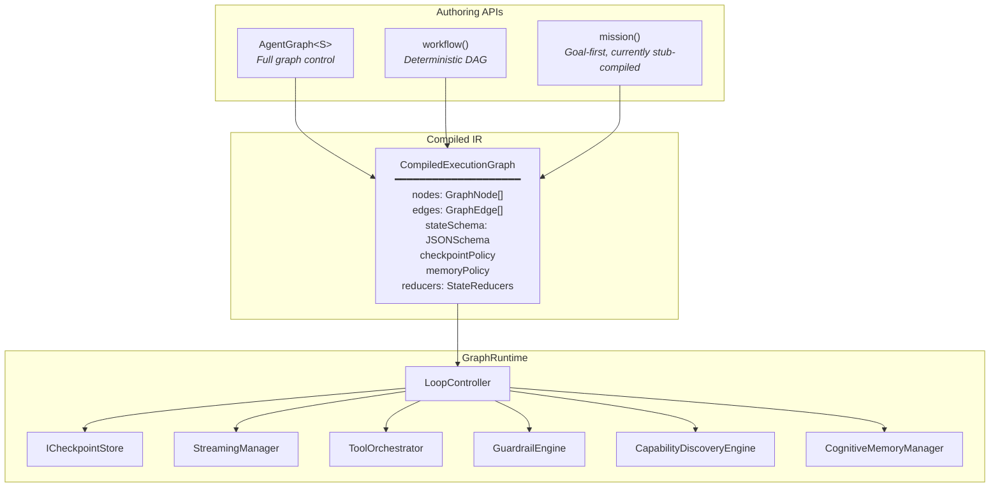

# Unified Orchestration Layer

Three authoring APIs. One compiled intermediate representation. A single runtime that executes every graph with streaming, checkpointing, guardrails, memory, and capability discovery built in.

See `/architecture/runtime-status-matrix` for the canonical shipped vs partial status across orchestration, retrieval, extension loading, and placeholder backend surfaces.

> Runtime status note:
> The compiled IR, builders, checkpointing, and base graph runtime are real and usable today.
> Some advanced routing/execution paths are still partial in the shared runtime:
> discovery edges currently fall back when capability discovery is not wired,
> personality edges still use default branch behavior unless a trait source is injected,
> and `extension` / `subgraph` execution requires a bridge runtime rather than the bare `NodeExecutor`.

## Architecture

Every orchestration surface in AgentOS — `AgentGraph`, `workflow()`, and `mission()` — compiles to the same `CompiledExecutionGraph` IR. The `GraphRuntime` executes that IR regardless of which API produced it.



### Node Types

| Node Type | Purpose | Notes |
| --- | --- | --- |
| `gmi` | LLM reasoning with tool calling | Core reasoning node |
| `tool` | Single tool invocation | Uses the shared tool runtime |
| `extension` | Extension pack execution | Partial in the bare runtime; host bridges may be required |
| `human` | Human-in-the-loop gate | Approval/review checkpoint |
| `guardrail` | Safety check node | Input/output policy node |
| `router` | Conditional branching | State-based routing |
| `subgraph` | Nested graph execution | Partial in the bare runtime; host bridges may be required |
| `voice` | Voice pipeline node | Voice orchestration surface |

### Edge Types

| Edge Type | Behavior |
| --- | --- |
| `static` | Unconditional transition |
| `conditional` | Arbitrary routing function evaluates state and returns next node |
| `discovery` | Semantic search over the capability registry determines the next node |
| `personality` | HEXACO trait thresholds determine branching |

## Three APIs

### AgentGraph — Full Graph Control

Explicit nodes, edges, cycles, and subgraphs. Use this when you need the full graph model: conditional routing with arbitrary logic, agent loops that cycle back, memory-aware state machines, and personality-driven branching.

```typescript
import { AgentGraph, END, START, gmiNode, toolNode } from '@framers/agentos/orchestration';
import { z } from 'zod';

const graph = new AgentGraph({
  input: z.object({ topic: z.string() }),
  output: z.object({ summary: z.string() }),
})
  .addNode('search', toolNode('web_search'))
  .addNode('summarize', gmiNode({ instructions: 'Summarize the results.' }))
  .addEdge(START, 'search')
  .addEdge('search', 'summarize')
  .addEdge('summarize', END)
  .compile();
```

### workflow() — Deterministic DAG

Fluent DSL for sequential pipelines with branching and parallelism. Every workflow is a strict DAG, and cycles are caught at compile time. All GMI steps default to `single_turn` to keep execution deterministic and cost-bounded.

```typescript
import { workflow } from '@framers/agentos/orchestration';
import { z } from 'zod';

const wf = workflow('onboarding')
  .input(z.object({ userId: z.string() }))
  .returns(z.object({ welcomed: z.boolean() }))
  .step('fetch-user', { tool: 'get_user' })
  .step('send-email', { tool: 'send_email', effectClass: 'external' })
  .compile();
```

### mission() — Intent-Driven Orchestration

Describe what you want to achieve and let the mission compiler generate the current stub graph shape for you. Today that means a fixed phase-ordered mission skeleton with your goal preserved in generated reasoning nodes, plus any anchors and mission-level policies you attach.

```typescript
import { mission } from '@framers/agentos/orchestration';
import { z } from 'zod';

const m = mission('deep-research')
  .input(z.object({ topic: z.string() }))
  .goal('Research {{topic}} and produce a structured report')
  .returns(z.object({ report: z.string() }))
  .planner({ strategy: 'linear', maxSteps: 8 })
  .compile();
```

## Decision Guide

| Situation | Use |
| --- | --- |
| Exact steps known upfront | `workflow()` |
| Steps known but complex branching needed | `AgentGraph` |
| Goal-first authoring with a fixed mission skeleton today | `mission()` |
| Need agent loops / cycles | `AgentGraph` |
| Cost-bounded, deterministic execution | `workflow()` |
| Prototype quickly, then reuse the generated IR directly | `mission()` -> `toWorkflow()` |

## Why This Still Matters

- One IR means one streaming/checkpointing model across all three authoring APIs.
- Memory, guardrails, and tool orchestration are shared runtime concerns instead of separate orchestration stacks.
- The runtime can keep evolving without forcing authors to rewrite every orchestration surface at once.

## Detailed Guides

- [AgentGraph](./AGENT_GRAPH.md)
- [workflow() DSL](./WORKFLOW_DSL.md)
- [mission() API](./MISSION_API.md)
- [Checkpointing](./CHECKPOINTING.md)
