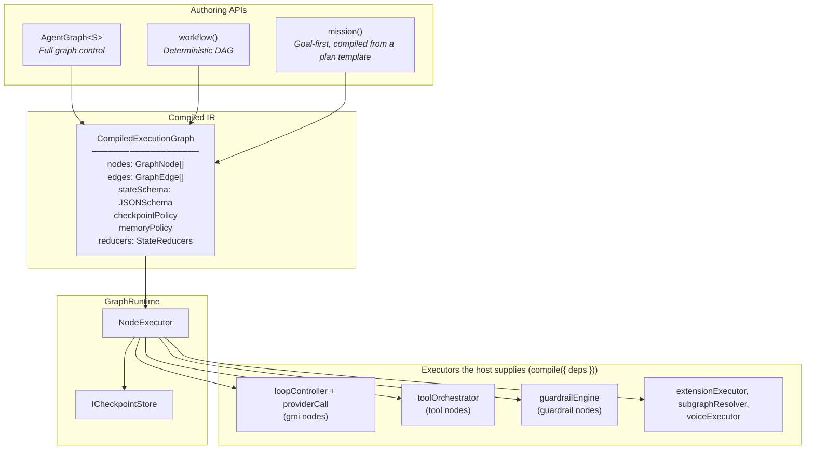

# Unified Orchestration Layer

Three authoring APIs. One compiled intermediate representation. A single runtime that executes every graph, streams its events and checkpoints its state; the model calls, tools, guardrails and extensions a graph runs come from executors the host supplies.

## Architecture

Every orchestration surface in AgentOS — [`AgentGraph`](https://github.com/framerslab/agentos/blob/master/src/orchestration/builders/AgentGraph.ts), `workflow()`, and `mission()` — compiles to the same [`CompiledExecutionGraph`](https://github.com/framerslab/agentos/blob/master/src/orchestration/ir/types.ts) IR. The [`GraphRuntime`](https://github.com/framerslab/agentos/blob/master/src/orchestration/runtime/GraphRuntime.ts) executes that IR regardless of which API produced it.


```mermaid
graph TD
    subgraph Authoring["Authoring APIs"]
        AG["AgentGraph&lt;S&gt;<br/><em>Full graph control</em>"]
        WF["workflow()<br/><em>Deterministic DAG</em>"]
        MS["mission()<br/><em>Goal-first, compiled from a plan template</em>"]
    end

    subgraph IR["Compiled IR"]
        CEG["CompiledExecutionGraph<br/>━━━━━━━━━━━━━━━━━━━━<br/>nodes: GraphNode[]<br/>edges: GraphEdge[]<br/>stateSchema: JSONSchema<br/>checkpointPolicy<br/>memoryPolicy<br/>reducers: StateReducers"]
    end

    subgraph Runtime["GraphRuntime"]
        CP["ICheckpointStore"]
        NE["NodeExecutor"]
    end

    subgraph Deps["Executors the host supplies (compile({ deps }))"]
        LC["loopController + providerCall<br/>(gmi nodes)"]
        TO["toolOrchestrator<br/>(tool nodes)"]
        GE["guardrailEngine<br/>(guardrail nodes)"]
        EX["extensionExecutor, subgraphResolver,<br/>voiceExecutor"]
    end

    AG --> CEG
    WF --> CEG
    MS --> CEG
    CEG --> NE
    NE --> CP
    NE --> LC
    NE --> TO
    NE --> GE
    NE --> EX
```

A node whose executor is missing does not throw. A `tool` or `voice` node fails (`success: false`); a `gmi` node succeeds with the output `'gmi-placeholder'`, an `extension` node with `'extension-not-configured'` and a `subgraph` node with `'subgraph-placeholder'`, so a graph compiled without `deps` runs to the end without calling a model; a `guardrail` node passes.

### Node Types

| Node Type | Purpose | Notes |
| --- | --- | --- |
| `gmi` | LLM reasoning with tool calling | Core reasoning node |
| `tool` | Single tool invocation | Uses the shared tool runtime |
| `extension` | Extension pack execution | Partial in the bare runtime; host bridges may be required |
| `human` | Human-in-the-loop gate | Approval/review checkpoint |
| `guardrail` | Safety check node | Input/output policy node |
| `router` | Conditional branching | State-based routing |
| `subgraph` | Nested graph execution | Partial in the bare runtime; host bridges may be required |
| `voice` | Voice pipeline node | Voice orchestration surface |

### Edge Types

| Edge Type | Behavior |
| --- | --- |
| `static` | Unconditional transition |
| `conditional` | Arbitrary routing function evaluates state and returns next node |
| `discovery` | Semantic search over the capability registry determines the next node |
| `personality` | HEXACO trait thresholds determine branching |

## Three APIs

### AgentGraph — Full Graph Control

Explicit nodes, edges, cycles, and subgraphs. Use this when you need the full graph model: conditional routing with arbitrary logic, agent loops that cycle back, memory-aware state machines, and personality-driven branching.

```typescript
import { AgentGraph, END, START, gmiNode, toolNode } from '@framers/agentos/orchestration';
import { z } from 'zod';

const graph = new AgentGraph({
  input: z.object({ topic: z.string() }),
  scratch: z.object({}),
  artifacts: z.object({ summary: z.string().optional() }),
})
  .addNode('search', toolNode('web_search'))
  .addNode('summarize', gmiNode({ instructions: 'Summarize the results.' }))
  .addEdge(START, 'search')
  .addEdge('search', 'summarize')
  .addEdge('summarize', END)
  .compile({ deps: { toolOrchestrator, loopController, providerCall } });
```

### workflow() — Deterministic DAG

Fluent DSL for sequential pipelines with branching and parallelism. Every workflow is a strict DAG, and cycles are caught at compile time. All GMI steps default to `single_turn` to keep execution deterministic and cost-bounded.

```typescript
import { workflow } from '@framers/agentos/orchestration';
import { z } from 'zod';

const wf = workflow('onboarding')
  .input(z.object({ userId: z.string() }))
  .returns(z.object({ welcomed: z.boolean() }))
  .step('fetch-user', { tool: 'get_user' })
  .step('send-email', { tool: 'send_email', effectClass: 'external' })
  .compile({ deps: { toolOrchestrator } });
```

### mission() — Intent-Driven Orchestration

Describe what you want to achieve and the mission compiler builds the graph from a fixed plan template: `research`, `qa` or `creative`, picked by `planner.style` or from the goal text. Your goal is kept in the generated reasoning nodes, and the anchors and mission-level policies you attach are added.

```typescript
import { mission } from '@framers/agentos/orchestration';
import { z } from 'zod';

const m = mission('deep-research')
  .input(z.object({ topic: z.string() }))
  .goal('Research {{topic}} and produce a structured report')
  .returns(z.object({ report: z.string() }))
  .planner({ strategy: 'linear', maxSteps: 8 })
  .compile();
```

## Decision Guide

| Situation | Use |
| --- | --- |
| Exact steps known upfront | `workflow()` |
| Steps known but complex branching needed | [`AgentGraph`](https://github.com/framerslab/agentos/blob/master/src/orchestration/builders/AgentGraph.ts) |
| Goal-first authoring from a plan template | `mission()` |
| Need agent loops / cycles | [`AgentGraph`](https://github.com/framerslab/agentos/blob/master/src/orchestration/builders/AgentGraph.ts) |
| Cost-bounded, deterministic execution | `workflow()` |
| Prototype quickly, then reuse the generated IR directly | `mission()` -> `toWorkflow()` |

## Why One IR

- One IR means one streaming and checkpointing model across all three authoring APIs.
- Tools, guardrails and model calls run through the same node executor, whichever API built the graph.

## Detailed Guides

- [AgentGraph](../architecture/AGENT_GRAPH.md)
- [workflow() DSL](./WORKFLOW_DSL.md)
- [mission() API](./MISSION_API.md)
- [Checkpointing](./CHECKPOINTING.md)
