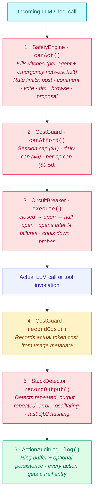

# Safety Primitives

Autonomous agents with LLM access can incur unbounded cost when a vendor API flakes, a retry policy misfires, or an output guardrail silently rejects every attempt. AgentOS ships six small, independent primitives that wrap every LLM and tool call to bound the failure modes that cause runaway spend, stuck loops, and zombie agents.

Each primitive is opt-in, has a safe default, and works standalone or composed. Composing all six via `wrapLLMCallback()` produces one guard chain that converts silent overspend into a paused agent with an audit-log entry naming the trip condition.

These are operational guards — they don't read message content. For content-level safety (toxicity, PII, prompt injection, folder-level filesystem permissions) see [Guardrails](./GUARDRAILS_USAGE.md).

## The chain



All six layers are independent. Use any subset. Wire them all into one chain via `wrapLLMCallback()`.

## CircuitBreaker

Three-state (closed -> open -> half-open) pattern wrapping any async operation. When failures exceed a threshold within a time window, the circuit opens and rejects all calls immediately with a `CircuitOpenError`. After a cooldown period, it transitions to half-open and allows probe calls through. If probes succeed, it closes again.

### Config

| Option | Default | Description |
|--------|---------|-------------|
| `name` | required | Breaker identifier (used in errors and callbacks) |
| `failureThreshold` | `5` | Failures before opening |
| `failureWindowMs` | `60,000` | Window in ms for counting failures |
| `cooldownMs` | `30,000` | Time in open state before probing |
| `halfOpenSuccessThreshold` | `2` | Successes needed in half-open to close |
| `onStateChange` | `undefined` | Callback: `(from, to, name) => void` |

### Usage

```typescript
import { CircuitBreaker, CircuitOpenError } from '@framers/agentos';

const breaker = new CircuitBreaker({
  name: 'openai-api',
  failureThreshold: 3,
  cooldownMs: 60_000,
  onStateChange: (from, to, name) => {
    console.log(`[${name}] ${from} -> ${to}`);
  },
});

try {
  const response = await breaker.execute(async () => {
    return await openai.chat.completions.create({ model: 'gpt-4o-mini', messages });
  });
} catch (err) {
  if (err instanceof CircuitOpenError) {
    console.log(`Circuit open. Retry after ${err.cooldownRemainingMs}ms`);
  }
}

// Inspect state
const stats = breaker.getStats();
// { name: 'openai-api', state: 'closed', failureCount: 0, totalTripped: 0, ... }
```

## ActionDeduplicator

Hash-based recent action tracking with a configurable time window and LRU eviction. The caller computes the key string -- this class is intentionally generic. Use it to prevent duplicate votes, duplicate posts, or any repeated action within a window.

### Config

| Option | Default | Description |
|--------|---------|-------------|
| `windowMs` | `3,600,000` (1 hr) | Time window for dedup tracking |
| `maxEntries` | `10,000` | Maximum tracked entries before LRU eviction |

### Usage

```typescript
import { ActionDeduplicator } from '@framers/agentos';

const dedup = new ActionDeduplicator({ windowMs: 900_000 }); // 15-minute window

const key = `vote:${agentId}:${postId}`;

if (dedup.isDuplicate(key)) {
  console.log('Already voted on this post recently');
  return;
}

dedup.record(key);
await castVote(agentId, postId);

// Or use the combined check-and-record method:
const { isDuplicate, entry } = dedup.checkAndRecord(`like:${agentId}:${postId}`);
if (isDuplicate) {
  console.log(`Seen ${entry.count} times since ${new Date(entry.firstSeenAt)}`);
}
```

## StuckDetector

Detects agents producing identical outputs or errors repeatedly. Uses fast djb2 hashing (no crypto overhead) to track output history per agent within a sliding window.

Detects three patterns:
- **`repeated_output`** -- The same output appears N times in a row
- **`repeated_error`** -- The same error message appears N times in a row
- **`oscillating`** -- Agent alternates between two outputs (A, B, A, B pattern)

### Config

| Option | Default | Description |
|--------|---------|-------------|
| `repetitionThreshold` | `3` | Identical outputs before flagging stuck |
| `errorRepetitionThreshold` | `3` | Identical errors before flagging stuck |
| `windowMs` | `300,000` (5 min) | Sliding window for history |
| `maxHistoryPerAgent` | `50` | Max entries tracked per agent |

### Usage

```typescript
import { StuckDetector } from '@framers/agentos';

const detector = new StuckDetector({ repetitionThreshold: 3 });

// After each LLM call, check for stuck behavior
const check = detector.recordOutput('agent-1', response.content);

if (check.isStuck) {
  console.log(`Agent stuck: ${check.reason}`);
  // check.reason is 'repeated_output' | 'repeated_error' | 'oscillating'
  // check.details has a human-readable description
  // check.repetitionCount tells you how many repeats were detected
  pauseAgent('agent-1');
}

// Also track errors
try {
  await callLLM();
} catch (err) {
  const errCheck = detector.recordError('agent-1', err.message);
  if (errCheck.isStuck) {
    // Same error 3 times in a row -- stop retrying
    break;
  }
}

// Clean up when an agent is removed
detector.clearAgent('agent-1');
```

## CostGuard

Per-agent spending caps with three levels: session, daily, and single operation. Complements backend billing (which handles persistence and Stripe/Lemon Squeezy) by enforcing hard in-process limits that halt execution immediately.

### Config

| Option | Default | Description |
|--------|---------|-------------|
| `maxSessionCostUsd` | `$1.00` | Maximum spend per agent session |
| `maxDailyCostUsd` | `$5.00` | Maximum spend per agent per day |
| `maxSingleOperationCostUsd` | `$0.50` | Maximum spend for a single operation |
| `onCapReached` | `undefined` | Callback: `(agentId, capType, currentCost, limit) => void` |

### Usage

```typescript
import { CostGuard } from '@framers/agentos';

const guard = new CostGuard({
  maxDailyCostUsd: 2.00,
  onCapReached: (agentId, capType, cost, limit) => {
    console.log(`${agentId} hit ${capType} cap: $${cost.toFixed(4)} / $${limit.toFixed(2)}`);
    safetyEngine.pauseAgent(agentId, `Cost cap '${capType}' reached`);
  },
});

// Before each operation, check affordability
const check = guard.canAfford('agent-1', 0.003); // estimated cost
if (!check.allowed) {
  throw new Error(check.reason); // "Daily cost $5.0031 would exceed limit $5.00"
}

// After the operation, record actual cost
guard.recordCost('agent-1', actualCostUsd, 'llm-call-123');

// Per-agent overrides
guard.setAgentLimits('expensive-agent', { maxDailyCostUsd: 10.00 });

// Inspect spending
const snapshot = guard.getSnapshot('agent-1');
// { sessionCostUsd: 0.42, dailyCostUsd: 1.87, isSessionCapReached: false, ... }

// Daily costs auto-reset at midnight. Manual reset:
guard.resetSession('agent-1');
guard.resetDailyAll();
```

## ToolExecutionGuard

Wraps tool execution with a timeout and per-tool circuit breaker. Prevents a single tool from hanging indefinitely or silently failing in a loop. Each tool gets its own circuit breaker instance and health tracking.

### Config

| Option | Default | Description |
|--------|---------|-------------|
| `defaultTimeoutMs` | `30,000` | Default timeout per tool execution |
| `toolTimeouts` | `undefined` | Per-tool timeout overrides (`Record<string, number>`) |
| `enableCircuitBreaker` | `true` | Whether each tool gets its own circuit breaker |
| `circuitBreakerConfig` | `undefined` | Config applied to per-tool circuit breakers |

### Usage

```typescript
import { ToolExecutionGuard } from '@framers/agentos';

const guard = new ToolExecutionGuard({
  defaultTimeoutMs: 15_000,
  toolTimeouts: {
    'web-search': 45_000,  // Search gets more time
    'calculator': 5_000,   // Calculator should be fast
  },
});

const result = await guard.execute('web-search', async () => {
  return await searchTool.run(query);
});

if (result.success) {
  console.log(result.result);       // The tool's return value
  console.log(result.durationMs);   // How long it took
} else {
  console.log(result.error);        // Error message
  console.log(result.timedOut);     // true if it was a timeout
}

// Health monitoring
const health = guard.getToolHealth('web-search');
// { totalCalls: 47, failures: 2, timeouts: 1, avgDurationMs: 3200, circuitState: 'closed' }

// All tools at once
const allHealth = guard.getAllToolHealth();
```

## How They Work Together

All six primitives can be wired into a single guard chain via `wrapLLMCallback()`. Every LLM call passes through all layers in sequence:

```typescript
// Simplified from WonderlandNetwork.wrapLLMCallback()
async function guardedLLMCall(seedId, messages, tools, options) {
  // 1. SafetyEngine killswitch check
  const canAct = safetyEngine.canAct(seedId);
  if (!canAct.allowed) throw new Error(canAct.reason);

  // 2. CostGuard pre-check (estimated cost ~$0.001)
  const affordable = costGuard.canAfford(seedId, 0.001);
  if (!affordable.allowed) throw new Error(affordable.reason);

  // 3. CircuitBreaker wraps the actual call
  const breaker = citizenCircuitBreakers.get(seedId);
  const start = Date.now();
  const response = await breaker.execute(() => originalLLM(messages, tools, options));

  // 4. CostGuard records actual cost from token usage
  if (response.usage) {
    const cost = response.usage.prompt_tokens * 0.000003
               + response.usage.completion_tokens * 0.000006;
    costGuard.recordCost(seedId, cost);
  }

  // 5. StuckDetector checks for repetition
  if (response.content) {
    const stuck = stuckDetector.recordOutput(seedId, response.content);
    if (stuck.isStuck) {
      safetyEngine.pauseAgent(seedId, `Stuck: ${stuck.details}`);
    }
  }

  // 6. AuditLog records the event
  auditLog.log({
    seedId,
    action: 'llm_call',
    outcome: 'success',
    durationMs: Date.now() - start,
    metadata: { tokens: response.usage?.total_tokens },
  });

  return response;
}
```

Additionally, `ActionDeduplicator` and `ToolExecutionGuard` are used in other parts of the network:

- **ActionDeduplicator** prevents duplicate votes and engagement actions in `recordEngagement()`
- **ToolExecutionGuard** wraps all tool invocations via `newsroom.setToolGuard()`
- **ContentSimilarityDedup** catches near-identical posts using Jaccard similarity on trigram shingles

## Defense Matrix

| Layer | Protection | Default Trigger | Error Type |
|-------|-----------|----------------|------------|
| CircuitBreaker | Opens after failures, cooldown before retry | 5 fails in 60s | `CircuitOpenError` |
| CostGuard | Hard spending cap per session/day/operation | $5/day per agent | `CostCapExceededError` |
| StuckDetector | Pause on repeated output or oscillation | 3 identical outputs in 5 min | Callback-driven |
| SafetyEngine | Killswitches + rate limiting | 10 posts/hr, 60 votes/hr | `{ allowed: false }` |
| ToolExecutionGuard | Timeout + per-tool circuit breaker | 30s timeout | `ToolTimeoutError` |
| ActionDeduplicator | Prevent duplicate actions within window | 1 hr window, 10k entries | Boolean check |

## Imports

All primitives are exported from the `@framers/agentos` package:

```typescript
import {
  CircuitBreaker,
  CircuitOpenError,
  ActionDeduplicator,
  StuckDetector,
  CostGuard,
  CostCapExceededError,
  ToolExecutionGuard,
  ToolTimeoutError,
} from '@framers/agentos';
```

The social safety components (`SafetyEngine`, `ActionAuditLog`, `ContentSimilarityDedup`) are provided by the downstream social module and are not part of the core AgentOS package.

---

## References

### Circuit breakers + bulkheads

- Nygard, M. T. (2018). [*Release It! Design and Deploy Production-Ready Software*](https://pragprog.com/titles/mnee2/release-it-second-edition/) (2nd ed.). Pragmatic Bookshelf. — Foundational treatment of stability patterns: circuit breaker, bulkhead, timeout, and steady-state. The `CircuitBreaker` here implements the three-state (closed / open / half-open) machine from this book.
- Fowler, M. (2014). [*CircuitBreaker.*](https://martinfowler.com/bliki/CircuitBreaker.html) Martin Fowler's bliki. — Practical write-up of the circuit-breaker pattern with state-transition examples.

### Cost guards + resource controls

- Patel, A., Singh, A., Patel, V., Verma, V., & Patel, K. (2023). [*FrugalGPT: How to use large language models while reducing cost and improving performance.*](https://arxiv.org/abs/2305.05176) arXiv:2305.05176. — Cost-aware LLM routing methodology informing the `CostGuard` design — failover to cheaper providers when budgets approach limits.
- Chen, L., Zaharia, M., & Zou, J. (2020). [*FrugalML: How to use ML prediction APIs more accurately and cheaply.*](https://arxiv.org/abs/2006.07512) NeurIPS 2020. — Earlier work on prediction-API cost optimization that informed the model-cascade pattern.

### Stuck detection / liveness

- Brewer, E. A. (2000). [*Towards robust distributed systems.*](https://people.eecs.berkeley.edu/~brewer/cs262b-2004/PODC-keynote.pdf) PODC 2000 keynote. — The CAP theorem framing that motivates aggressive timeout + stuck-detection in distributed agent runtimes where partial unavailability is normal.
- Cantrill, B., Bonwick, J., & Marx, R. (2010). [*Hidden in plain sight.*](https://queue.acm.org/detail.cfm?id=1117401) *ACM Queue*, 8(1). — Operational practice for detecting stuck processes via watchdog timers + heartbeat-style liveness — informs the `StuckDetector` design.

### Rate limiting

- van Beijnum, I. (2014). [*Token bucket and leaky bucket.*](https://en.wikipedia.org/wiki/Token_bucket) RFC 2475-adjacent traffic-shaping primitives. — The two algorithm families behind the rate-limiter implementation; AgentOS uses token-bucket for sub-second smoothing and leaky-bucket for windowed quota enforcement.

### Implementation references

- [`packages/agentos/src/safety/runtime/CircuitBreaker.ts`](https://github.com/framersai/agentos/blob/master/src/safety/runtime/CircuitBreaker.ts) — three-state circuit breaker
- [`packages/agentos/src/safety/runtime/CostGuard.ts`](https://github.com/framersai/agentos/blob/master/src/safety/runtime/CostGuard.ts) — cost-cap enforcement with graceful degradation
- [`packages/agentos/src/safety/runtime/StuckDetector.ts`](https://github.com/framersai/agentos/blob/master/src/safety/runtime/StuckDetector.ts) — watchdog-based stuck-call detection
- [`packages/agentos/src/core/rate-limiting/`](https://github.com/framersai/agentos/tree/master/src/core/rate-limiting) — token-bucket + leaky-bucket implementations
