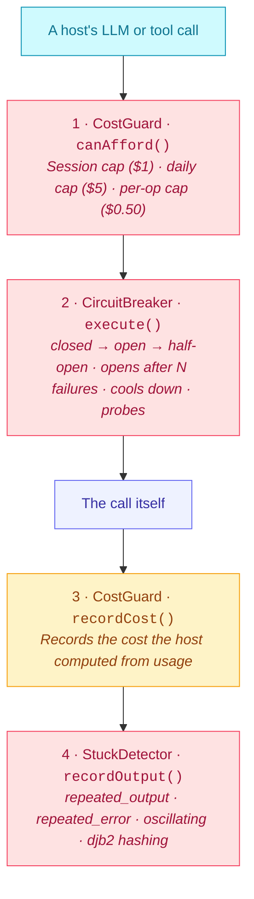

# Safety Primitives

Autonomous agents with LLM access can incur unbounded cost when a vendor API flakes, a retry policy misfires, or an output guardrail silently rejects every attempt. AgentOS ships small, independent primitives that bound the failure modes behind runaway spend, stuck loops and hung tools. Three run inside the runtime: `generateText()` and `streamText()` consult the [provider health registry](#llmproviderhealthregistry), `processRequest()` reserves against a configured [spend meter](#spend-meter), and `generateText()`, `streamText()`, `generateObject()`, `embedText()` and `agent()` check each provider call against a [CostGuard](#costguard) when they are given a spend budget ([Cost Optimization](./COST_OPTIMIZATION.md#a-spend-budget-for-a-run-of-calls)). A host calls the others around its own model and tool calls, and can call a CostGuard of its own the same way.

Each has defaults and works alone or composed with the others ([How they work together](#how-they-work-together)).

These are operational guards — they don't read message content. For content-level safety (toxicity, PII, prompt injection, folder-level filesystem permissions) see [Guardrails](./GUARDRAILS_USAGE.md).

## A host's guard chain


```mermaid
flowchart TB
    Inv["A host's LLM or tool call"]:::input
    CG1["1 · CostGuard · <tt>canAfford()</tt><br/><i>Session cap ($1) · daily cap ($5) · per-op cap ($0.50)</i>"]:::warning
    CB["2 · CircuitBreaker · <tt>execute()</tt><br/><i>closed → open → half-open · opens after N failures · cools down · probes</i>"]:::warning
    Exec["The call itself"]:::process
    CG2["3 · CostGuard · <tt>recordCost()</tt><br/><i>Records the cost the host computed from usage</i>"]:::data
    SD["4 · StuckDetector · <tt>recordOutput()</tt><br/><i>repeated_output · repeated_error · oscillating · djb2 hashing</i>"]:::warning

    Inv --> CG1 --> CB --> Exec --> CG2 --> SD

    classDef input fill:#cffafe,stroke:#0891b2,color:#0e7490
    classDef process fill:#eef2ff,stroke:#6366f1,color:#3730a3
    classDef warning fill:#fee2e2,stroke:#f43f5e,color:#9f1239
    classDef data fill:#fef3c7,stroke:#f59e0b,color:#92400e
```

Each layer is independent; use any subset.

## CircuitBreaker

Three-state (closed -> open -> half-open) pattern wrapping any async operation. When failures exceed a threshold within a time window, the circuit opens and rejects all calls immediately with a [`CircuitOpenError`](https://github.com/framerslab/agentos/blob/master/src/safety/runtime/CircuitBreaker.ts). After a cooldown period, it transitions to half-open and allows probe calls through. If probes succeed, it closes again.

### Config

| Option | Default | Description |
|--------|---------|-------------|
| `name` | required | Breaker identifier (used in errors and callbacks) |
| `failureThreshold` | `5` | Failures before opening |
| `failureWindowMs` | `60,000` | Window in ms for counting failures |
| `cooldownMs` | `30,000` | Time in open state before probing |
| `halfOpenSuccessThreshold` | `2` | Successes needed in half-open to close |
| `onStateChange` | `undefined` | Callback: `(from, to, name) => void` |

### Usage

```typescript
import { CircuitBreaker, CircuitOpenError } from '@framers/agentos';

const breaker = new CircuitBreaker({
  name: 'openai-api',
  failureThreshold: 3,
  cooldownMs: 60_000,
  onStateChange: (from, to, name) => {
    console.log(`[${name}] ${from} -> ${to}`);
  },
});

try {
  const response = await breaker.execute(async () => {
    return await openai.chat.completions.create({ model: 'gpt-4o-mini', messages });
  });
} catch (err) {
  if (err instanceof CircuitOpenError) {
    console.log(`Circuit open. Retry after ${err.cooldownRemainingMs}ms`);
  }
}

// Inspect state
const stats = breaker.getStats();
// { name: 'openai-api', state: 'closed', failureCount: 0, totalTripped: 0, ... }
```

## LLMProviderHealthRegistry

A status-aware, process-lifetime memory of LLM provider health, keyed by `providerId`. Wired into [`generateText`](https://github.com/framerslab/agentos/blob/master/src/api/generateText.ts) and [`streamText`](https://github.com/framerslab/agentos/blob/master/src/api/streamText.ts) so the next caller doesn't pay a full TLS round-trip to rediscover a provider that just returned `402 Insufficient Credits` or `401 Invalid API key`.

The plain [`CircuitBreaker`](https://github.com/framerslab/agentos/blob/master/src/safety/runtime/CircuitBreaker.ts) above uses a single failure-threshold + cooldown pair per instance — fine for one-off operations. The router needs **per-error-class** behavior: open immediately on a payment or auth failure, but require a streak before tripping on a 429 or 5xx. This is what the registry adds.

| Error class                | Threshold | Cooldown |
| -------------------------- | --------- | -------- |
| 402 insufficient credits   | 1 fail    | 5 min    |
| 401, 403 auth/forbidden    | 1 fail    | 30 min   |
| 429 rate limit             | 3 fails   | 30 s     |
| 5xx + unclassifiable       | 5 fails   | 60 s     |

The 5-minute window on 402 reflects operational reality: credits might get topped up while a batch job is in flight. 30 minutes on 401/403 is longer because those failures usually require an env change plus redeploy. 429 cooldowns are intentionally short because rate limits typically lift in a single billing interval.

### How the router uses it

1. **Before the primary call**, `generateText` consults `globalLLMProviderHealth.isOpen(resolvedProviderId)`. If the breaker is open, it throws a synthetic `LLMProviderCircuitOpenError` with `httpStatus: 503`. The existing [`isRetryableError`](https://github.com/framerslab/agentos/blob/master/src/api/generateText.ts) check recognizes that status and routes the call into the fallback chain. No network round-trip, no TLS handshake, no waste.
2. **On a real provider error** (anything caught in the outer try/catch except the breaker's own `LLMProviderCircuitOpenError` and a call the caller stopped: a spend budget's refusal, a hook's error under `hookErrors: 'throw'`, or the call's `abortSignal` aborting), `recordFailure(providerId, error)` classifies the error by HTTP status and either trips immediately (for 401/402/403) or increments the streak counter (for 429/5xx).
3. **On success**, `recordSuccess(providerId)` resets the streak counter so a future transient failure starts fresh. A single success does NOT shorten an already-open cooldown: the breaker is open precisely because we want to stop probing for a window.
4. **In the fallback chain loop**, every fallback entry is checked against `isOpen()` before its attempt. A dead chain entry is skipped instantly, so the loop walks to the first healthy provider with O(N) constant-time checks rather than O(N) network calls.

### Error classification

The registry reads HTTP status from three sources, in order:

1. `[NNN] ...` prefix in `error.message` — the shape [`OpenRouterProvider`](https://github.com/framerslab/agentos/blob/master/src/core/llm/providers/implementations/OpenRouterProvider.ts) decorates its errors with so downstream regex-based routing can find them.
2. `error.statusCode` numeric property — [`OpenRouterProviderError`](https://github.com/framerslab/agentos/blob/master/src/core/llm/providers/errors/OpenRouterProviderError.ts) sets this explicitly.
3. `error.status` numeric property — the Anthropic and OpenAI SDK shape.

If none of those resolves, the error is treated as the conservative transient class (5-failure threshold, 60 s cooldown). Better to under-protect on a one-off network blip than lock out a healthy provider.

Errors that judge the request rather than the provider do not count: a 4xx other than 401, 402, 403, 408 and 429 (a malformed body, an unknown model), a content-policy decline (`code` or `type` of `content_filter`, `content_policy_violation` or `safety_violations`), and a request larger than the model's context window.

### Config

The policy table is fixed in code; the registry takes no options.

### Usage

```typescript
import { globalLLMProviderHealth, LLMProviderHealthRegistry } from '@framers/agentos/core/safety';

// Read state for an admin / diagnostics endpoint
const stats = globalLLMProviderHealth.getStats('openrouter');
if (stats?.state === 'open') {
  console.log(
    `OpenRouter circuit open; ${stats.cooldownRemainingMs}ms until close. ` +
    `Last status: ${stats.lastStatusCode}, total trips: ${stats.totalTrips}`,
  );
}

// Manually reset after a credit top-up so the next call probes immediately
globalLLMProviderHealth.reset('openrouter');

// Construct a private registry for a test
const isolated = new LLMProviderHealthRegistry();
isolated.recordFailure('mock-provider', new Error('[402] Test'));
expect(isolated.isOpen('mock-provider')).toBe(true);
```

### Why a singleton

Provider health is process-wide state. Two concurrent `generateText` calls inside the same Node process see the same OpenRouter: if one just discovered it's at 402, the other shouldn't redo the discovery. The [`globalLLMProviderHealth`](https://github.com/framerslab/agentos/blob/master/src/core/safety/LLMProviderHealthRegistry.ts) singleton is the natural granularity. Tests construct their own [`LLMProviderHealthRegistry`](https://github.com/framerslab/agentos/blob/master/src/core/safety/LLMProviderHealthRegistry.ts) instances to keep state isolated across cases.

The registry is **ephemeral by design**: it lives in memory and resets on server restart. Persistent provider-health tracking would add complexity (Redis, write-through cache invalidation) for a problem the in-process singleton already solves for the dominant case: a long-running batch job hammering a degraded provider.

## ActionDeduplicator

Hash-based recent action tracking with a configurable time window and LRU eviction. The caller computes the key string -- this class is intentionally generic. Use it to prevent duplicate votes, duplicate posts, or any repeated action within a window.

### Config

| Option | Default | Description |
|--------|---------|-------------|
| `windowMs` | `3,600,000` (1 hr) | Time window for dedup tracking |
| `maxEntries` | `10,000` | Maximum tracked entries before LRU eviction |

### Usage

```typescript
import { ActionDeduplicator } from '@framers/agentos';

const dedup = new ActionDeduplicator({ windowMs: 900_000 }); // 15-minute window

const key = `vote:${agentId}:${postId}`;

if (dedup.isDuplicate(key)) {
  console.log('Already voted on this post recently');
  return;
}

dedup.record(key);
await castVote(agentId, postId);

// Or use the combined check-and-record method:
const { isDuplicate, entry } = dedup.checkAndRecord(`like:${agentId}:${postId}`);
if (isDuplicate) {
  console.log(`Seen ${entry.count} times since ${new Date(entry.firstSeenAt)}`);
}
```

## StuckDetector

Detects agents producing identical outputs or errors repeatedly. Uses fast djb2 hashing (no crypto overhead) to track output history per agent within a sliding window.

Detects three patterns:
- **`repeated_output`** -- The same output appears N times in a row
- **`repeated_error`** -- The same error message appears N times in a row
- **`oscillating`** -- Agent alternates between two outputs (A, B, A, B pattern)

### Config

| Option | Default | Description |
|--------|---------|-------------|
| `repetitionThreshold` | `3` | Identical outputs before flagging stuck |
| `errorRepetitionThreshold` | `3` | Identical errors before flagging stuck |
| `windowMs` | `300,000` (5 min) | Sliding window for history |
| `maxHistoryPerAgent` | `50` | Max entries tracked per agent |

### Usage

```typescript
import { StuckDetector } from '@framers/agentos';

const detector = new StuckDetector({ repetitionThreshold: 3 });

// After each LLM call, check for stuck behavior
const check = detector.recordOutput('agent-1', response.content);

if (check.isStuck) {
  console.log(`Agent stuck: ${check.reason}`);
  // check.reason is 'repeated_output' | 'repeated_error' | 'oscillating'
  // check.details has a human-readable description
  // check.repetitionCount tells you how many repeats were detected
  pauseAgent('agent-1');
}

// Also track errors
try {
  await callLLM();
} catch (err) {
  const errCheck = detector.recordError('agent-1', err.message);
  if (errCheck.isStuck) {
    // Same error 3 times in a row -- stop retrying
    break;
  }
}

// Clean up when an agent is removed
detector.clearAgent('agent-1');
```

## CostGuard

Per-agent spending caps with three levels: session, daily, and single operation, kept in process memory. CostGuard stops nothing itself: the host asks `canAfford()` before a call and records the cost after it, and `onCapReached` fires when a recorded cost reaches a cap. CostGuard never throws `CostCapExceededError`, and AgentOS runs no CostGuard of its own unless a call carries a spend budget: a `budget` on `generateText()`, `streamText()`, `generateObject()`, `embedText()` or `agent()` keeps a CostGuard (the one passed as `guard`, or one it makes), checks each provider call against it before the call and records the call's cost after it, and refuses a call that would pass the budget with `CostCapExceededError` unless the budget is set to warn. `reserveSpend()` throws the same error, with the cap type `daily`, when an admission would take a day's committed spending past its cap; that day's total lives in the caller's own tables, not in a CostGuard.

### Config

| Option | Default | Description |
|--------|---------|-------------|
| `maxSessionCostUsd` | `$1.00` | Maximum spend per agent session |
| `maxDailyCostUsd` | `$5.00` | Maximum spend per agent per day |
| `maxSingleOperationCostUsd` | `$0.50` | Maximum spend for a single operation |
| `onCapReached` | `undefined` | Callback: `(agentId, capType, currentCost, limit) => void` |

### Usage

```typescript
import { CostGuard } from '@framers/agentos';

const guard = new CostGuard({
  maxDailyCostUsd: 2.00,
  onCapReached: (agentId, capType, cost, limit) => {
    console.log(`${agentId} hit ${capType} cap: $${cost.toFixed(4)} / $${limit.toFixed(2)}`);
    pauseAgent(agentId); // the host's own pause
  },
});

// Before each operation, check affordability
const check = guard.canAfford('agent-1', 0.003); // estimated cost
// A refusal names its cap in check.capType, with the total so far and the cap in check.currentCostUsd and check.limitUsd
if (!check.allowed) {
  throw new Error(check.reason); // "Daily cost $5.0031 would exceed limit $5.00"
}

// After the operation, record actual cost
guard.recordCost('agent-1', actualCostUsd, 'llm-call-123');

// Per-agent overrides
guard.setAgentLimits('expensive-agent', { maxDailyCostUsd: 10.00 });

// Inspect spending
const snapshot = guard.getSnapshot('agent-1');
// { sessionCostUsd: 0.42, dailyCostUsd: 1.87, isSessionCapReached: false, ... }

// Daily totals reset at the process's local midnight. Manual reset:
guard.resetSession('agent-1');
guard.resetDailyAll();
```

## Spend meter

A persisted allowance per account and period, for a product that sells a number of turns a month, or per account over a rolling window, for one that allows a number of calls in any hour. `CostGuard` caps one process's spending in memory; the spend meter keeps the count in a database several processes share, so two servers cannot both sell the last turn, and a restart loses nothing.

`processRequest` reserves before anything reaches a provider and the turn settles the reservation when it ends:

| What happens | The request | The reservation |
|---|---|---|
| No `operationId` on the input | One error chunk, `SYS_VALIDATION_ERROR` | none |
| The period has no room | One error chunk, `BILLING_ALLOWANCE_EXHAUSTED` (402), with `reason`, `period` and `remaining` in `details` | none |
| The same `operationId` again, still running or already counted | One error chunk, `SYS_ALREADY_EXISTS` | unchanged |
| The meter's store does not answer within its retry policy | One error chunk, `SYS_SPEND_METER_UNAVAILABLE` (503) | none |
| The turn finishes, or asks for a tool | The reply | `consumed`, with the turn's usage |
| The turn fails before any text reached the stream | The error | `released` |
| The turn fails after some text reached the stream | The error | `consumed` |
| An output guardrail blocks the reply | The guardrail's error chunk | refunded (`released`, outcome `replaced`) |
| The process dies mid-turn | nothing more | settled by `reconcile()` once its lease runs out |

Each refusal reaches the caller before any model call. The turn settles in the orchestrator, so a caller that stops reading early still has its turn counted.

### Config

`SqlSpendMeter` runs on a `@framers/sql-storage-adapter` store. Give it a Postgres adapter of its own (or the product's pool), never AgentOS's provenance-wrapped storage adapter.

| Option | Default | Description |
|--------|---------|-------------|
| `db` | required | The store. It must offer transactions, persistence and concurrent access unless `requireShared: false` |
| `allowanceFor(accountId, period)` | required | The account's allowance in units for the period, read at every reservation |
| `periodOf(now, accountId)` | required unless `windowMs` is set | The period a moment falls in for the account, such as its calendar month in its own time zone. Not read with a window |
| `windowMs` | none | A rolling window in milliseconds, in place of periods: the allowance holds the units reserved or consumed in the `windowMs` before each reservation |
| `leaseMs` | `45000` | How long a reservation lives without a heartbeat; the turn heartbeats on each tool iteration |
| `maxAttemptsPerOperation` | `3` | Reservations one operation may take, its retries after a release included |
| `retry` | 3 tries, 50 to 400 ms, 2 s deadline | Retries of transient store errors before `SpendMeterUnavailableError` |
| `resolveUnknown(reservation)` | none | Asked by `reconcile()` what became of an expired reservation: `consumed`, `released` or `unknown` |
| `unknownAfterLease` | `'release'` | How an expired reservation settles when the answer is `unknown` |
| `ensureSchema` | `true` | Create the two tables when missing, and on tables that exist the indexes they lack; a product that runs its own migrations copies `SPEND_METER_DDL`, or `spendMeterDdl(prefix)` for its `tablePrefix`, and passes `false` |
| `tablePrefix` | `'agentos_spend'` | The start of the two tables' names, `<prefix>_meter` and `<prefix>_reservations`; their indexes are named `idx_<prefix>_reservations_*`, and `idx_spend_reservations_*` under the default. A lower-case letter and at most 37 more lower-case letters, digits or underscores, and not `spend`: the constructor throws on any other value, before any statement is built. At 38 characters the longest names, `idx_<prefix>_reservations_account` and `idx_<prefix>_reservations_settled`, take the 63 bytes Postgres keeps of an identifier |
| `onWarning(warning)` | none | Told of each statement that failed while `ensureSchema` brought tables that exist up to the meter's indexes, with the `statement` and the `error`: an index the store refused, or the catalogue read before them. The meter uses the tables as they are |

With `windowMs` the meter counts from the reservations themselves, inside each reservation's own transaction and after it has taken the account row's lock, so two reservations cannot both take the last unit of a window. Every row then carries the period `window`, which is the period `allowanceFor` is asked for. A unit counts from its reservation until more than `windowMs` have passed. A released reservation never counts, and one whose lease ran out still counts until `reconcile()` releases it. `snapshot()` answers the units consumed and reserved inside the window and what remains. A meter given neither `periodOf` nor `windowMs` throws when it is constructed.

The window's count reads the index `idx_spend_reservations_account`, and `purge()` finds the reservations settled before its `before` through `idx_spend_reservations_settled`, on `settled_at` and `state` (`idx_<prefix>_reservations_account` and `idx_<prefix>_reservations_settled` under another prefix). The DDL creates both with the tables. On tables that exist, `ensureSchema` reads the store's catalogue before the meter's first statement (`pg_indexes` on Postgres, `sqlite_master` on SQLite) and runs the `CREATE INDEX IF NOT EXISTS` statement of each of the meter's indexes the tables lack, so a store whose tables an earlier release made gains them. A meter whose tables hold all three runs no index statement, so on Postgres its start takes no SHARE lock on the reservations table, the lock a `CREATE INDEX` takes before it checks `IF NOT EXISTS`. The indexes change no answer of the meter, so tables that refuse one, as Postgres does for a role that does not own them, are used as they are, and the statement and its error go to `onWarning`. Postgres holds back writes to a table while it builds an index on it, so a product with a large reservations table creates the two indexes first in its own migration, with `CREATE INDEX CONCURRENTLY IF NOT EXISTS` and the names and columns `spendMeterDdl(prefix)` gives them, and runs the meter with `ensureSchema: false`.

### Several meters in one database

Meters with different rules take a prefix each. Every statement a meter runs names its own two tables, so its count reads only its own rows and its `purge()` deletes only its own rows. Meters under one prefix share its two tables and every row in them, and a purge by one reaches the settled reservations of the others.

```typescript
import { SqlSpendMeter, spendMeterDdl } from '@framers/agentos';

// Twenty calls an account in any hour, in the default tables
const hourly = new SqlSpendMeter({ db, windowMs: 3_600_000, allowanceFor: () => 20 });

// Five hundred a month, in tables of its own: monthly_spend_meter and monthly_spend_reservations
const monthly = new SqlSpendMeter({
  db,
  tablePrefix: 'monthly_spend',
  periodOf: (now) => new Date(now).toISOString().slice(0, 7),
  allowanceFor: () => 500,
});

// The same tables and indexes for a product's own migration, with ensureSchema: false on the meter
const migration = spendMeterDdl('monthly_spend');
```

With no prefix, `spendMeterDdl()` answers `SPEND_METER_DDL` word for word; given a prefix the constructor refuses, it throws.

### Usage

```typescript
import { AgentOS, SqlSpendMeter } from '@framers/agentos';
import { createPostgresAdapter } from '@framers/sql-storage-adapter';

const db = createPostgresAdapter({ connectionString: process.env.DATABASE_URL!, max: 3 });
await db.open();

const meter = new SqlSpendMeter({
  db,
  allowanceFor: async (accountId) => (await plans.planOf(accountId)).turnsPerMonth,
  periodOf: async (now, accountId) => monthIn(await accounts.timeZoneOf(accountId), now), // "2026-10"
  resolveUnknown: async ({ operationId }) => ((await replies.storedFor(operationId)) ? 'consumed' : 'unknown'),
});
meter.startReconciler(); // every 15 seconds

const agentos = await AgentOS.create({ spendMeter: { meter, accountIdOf: (input) => input.userId } });

for await (const chunk of agentos.processRequest({
  userId, sessionId, textInput,
  operationId: messageId, // the product's durable id of this message: a retry with it is never charged twice
})) {
  // ...
}

// The month so far, for the product's own meter line
const { used, remaining } = await meter.snapshot(userId);

// A plan change mid-period: the units used carry over, the new allowance applies at once
await meter.setAllowance(userId, 600);
```

### Retention

A settled reservation's row stays, so that a retry of its operation is recognised, and a window meter keeps one row per account. `purge({ before, limit })` deletes the reservations settled before `before` and, for a window meter, the account rows that hold nothing reserved and were last written before `before`. One call deletes at most `limit` of each (default 1,000) and answers how many of each it deleted, so a sweep calls it again while a count comes back full.

```typescript
// Twenty calls an account in any hour
const hourly = new SqlSpendMeter({ db, windowMs: 3_600_000, allowanceFor: () => 20 });

// The sweep: what settled more than an hour ago is past the window, and goes
const { reservations, periods } = await hourly.purge({ before: Date.now() - 3_600_000 });
```

A reservation still reserved is never deleted, and neither is a period meter's period row, which holds the period's count: a month's `snapshot()` reads the same after its settled reservations are purged. For a window meter, a `before` at least one window back keeps every unit the window counts. Once an operation's row is purged the meter no longer knows the operation: a retry of it reserves and counts again, and a refund of it finds nothing, so `before` lies past the time either can come. `purge()` deletes across every account in its meter's two tables, so meters under one prefix share their retention, and a meter under a prefix of its own keeps its own.

## ToolExecutionGuard

Wraps tool execution with a timeout and per-tool circuit breaker, so a hung tool returns a timeout result and a tool that keeps failing is refused while its breaker is open. Each tool gets its own circuit breaker instance and health tracking. `execute()` never throws: a timeout, an error or an open breaker comes back as `{ success: false }`. A timed-out call is not cancelled; its promise runs on and its result is dropped.

### Config

| Option | Default | Description |
|--------|---------|-------------|
| `defaultTimeoutMs` | `30,000` | Default timeout per tool execution |
| `toolTimeouts` | `undefined` | Per-tool timeout overrides (`Record<string, number>`) |
| `enableCircuitBreaker` | `true` | Whether each tool gets its own circuit breaker |
| `circuitBreakerConfig` | `undefined` | Config applied to per-tool circuit breakers |

### Usage

```typescript
import { ToolExecutionGuard } from '@framers/agentos';

const guard = new ToolExecutionGuard({
  defaultTimeoutMs: 15_000,
  toolTimeouts: {
    'web-search': 45_000,  // Search gets more time
    'calculator': 5_000,   // Calculator should be fast
  },
});

const result = await guard.execute('web-search', async () => {
  return await searchTool.run(query);
});

if (result.success) {
  console.log(result.result);       // The tool's return value
  console.log(result.durationMs);   // How long it took
} else {
  console.log(result.error);        // Error message
  console.log(result.timedOut);     // true if it was a timeout
}

// Health monitoring
const health = guard.getToolHealth('web-search');
// { totalCalls: 47, failures: 2, timeouts: 1, avgDurationMs: 3200, circuitState: 'closed' }

// All tools at once
const allHealth = guard.getAllToolHealth();
```

## How they work together

A host composes the primitives around its own model call:

```typescript
import { CostGuard, CircuitBreaker, StuckDetector } from '@framers/agentos';

const costGuard = new CostGuard({ maxDailyCostUsd: 2 });
const breaker = new CircuitBreaker({ name: 'llm' });
const stuck = new StuckDetector();

async function guardedCall(agentId: string, prompt: string) {
  const affordable = costGuard.canAfford(agentId, 0.001); // the host's estimate
  if (!affordable.allowed) throw new Error(affordable.reason);

  const response = await breaker.execute(() => callModel(prompt)); // the host's model call

  costGuard.recordCost(agentId, priceOf(response.usage)); // the host's pricing

  const check = stuck.recordOutput(agentId, response.text);
  if (check.isStuck) pauseAgent(agentId, check.details); // the host's own pause

  return response;
}
```

`ActionDeduplicator` fits around actions with side effects (a vote, a post, a message), and `ToolExecutionGuard` around tool calls.

## Defense Matrix

| Layer | Protection | Default Trigger | Error Type |
|-------|-----------|----------------|------------|
| CircuitBreaker | Opens after failures, cooldown before retry | 5 fails in 60s | [`CircuitOpenError`](https://github.com/framerslab/agentos/blob/master/src/safety/runtime/CircuitBreaker.ts) |
| LLMProviderHealthRegistry | Skips a provider that keeps failing, in `generateText()` and `streamText()` | 402: 1 failure; 401/403: 1; 429: 3; 5xx: 5 | `LLMProviderCircuitOpenError` (status 503, routed to the fallback chain) |
| CostGuard | Spending caps per session/day/operation, checked by the host or by a spend budget ([Cost Optimization](./COST_OPTIMIZATION.md#a-spend-budget-for-a-run-of-calls)) | $5/day per agent | `{ allowed: false, reason }` from `canAfford()`; `onCapReached` callback; `CostCapExceededError` from a spend budget |
| Spend meter | A persisted allowance per account and period, in `processRequest()` | the host's allowance | `BILLING_ALLOWANCE_EXHAUSTED` error chunk |
| Spend reservations | A day's spending cap held in the caller's own tables, across processes ([Cost Optimization](./COST_OPTIMIZATION.md#a-days-bound-across-processes)) | the cap each admission names | `CostCapExceededError` (`daily`) from `reserveSpend()` |
| StuckDetector | Flags repeated output or oscillation | 3 identical outputs in 5 min | `{ isStuck: true, reason }` |
| ToolExecutionGuard | Timeout + per-tool circuit breaker | 30s timeout | `{ success: false, timedOut }` |
| ActionDeduplicator | Prevent duplicate actions within window | 1 hr window, 10k entries | Boolean check |

## Imports

The primitives are exported from the `@framers/agentos` package, the provider health registry from `@framers/agentos/core/safety`:

```typescript
import {
  CircuitBreaker,
  CircuitOpenError,
  ActionDeduplicator,
  StuckDetector,
  CostGuard,
  CostCapExceededError,
  ToolExecutionGuard,
  ToolTimeoutError,
  SqlSpendMeter,
} from '@framers/agentos';
import { globalLLMProviderHealth, LLMProviderHealthRegistry } from '@framers/agentos/core/safety';
```

Killswitches, social rate limits and an action audit log (`SafetyEngine`, `ActionAuditLog`, `ContentSimilarityDedup`) belong to Wunderland's social network, not to AgentOS.

---

## References

### Circuit breakers + bulkheads

- Nygard, M. T. (2018). [*Release It! Design and Deploy Production-Ready Software*](https://pragprog.com/titles/mnee2/release-it-second-edition/) (2nd ed.). Pragmatic Bookshelf. — Foundational treatment of stability patterns: circuit breaker, bulkhead, timeout, and steady-state. The [`CircuitBreaker`](https://github.com/framerslab/agentos/blob/master/src/safety/runtime/CircuitBreaker.ts) here implements the three-state (closed / open / half-open) machine from this book.
- Fowler, M. (2014). [*CircuitBreaker.*](https://martinfowler.com/bliki/CircuitBreaker.html) Martin Fowler's bliki. — Practical write-up of the circuit-breaker pattern with state-transition examples.

### Cost guards + resource controls

- Chen, L., Zaharia, M., & Zou, J. (2023). [*FrugalGPT: How to use large language models while reducing cost and improving performance.*](https://arxiv.org/abs/2305.05176) arXiv:2305.05176. — Cost-aware LLM cascades; background for budgeting model calls.
- Chen, L., Zaharia, M., & Zou, J. (2020). [*FrugalML: How to use ML prediction APIs more accurately and cheaply.*](https://arxiv.org/abs/2006.07512) NeurIPS 2020. — Earlier work on prediction-API cost optimization that informed the model-cascade pattern.

### Stuck detection / liveness

- Brewer, E. A. (2000). [*Towards robust distributed systems.*](https://people.eecs.berkeley.edu/~brewer/cs262b-2004/PODC-keynote.pdf) PODC 2000 keynote. — The CAP theorem framing that motivates aggressive timeout + stuck-detection in distributed agent runtimes where partial unavailability is normal.
- Cantrill, B. (2006). [*Hidden in plain sight.*](https://queue.acm.org/detail.cfm?id=1117401) *ACM Queue*, 4(1). — On instrumenting production systems to find pathological behaviour where it happens.

### Implementation references

- [`src/safety/runtime/CircuitBreaker.ts`](https://github.com/framerslab/agentos/blob/master/src/safety/runtime/CircuitBreaker.ts) — three-state circuit breaker
- [`src/safety/runtime/CostGuard.ts`](https://github.com/framerslab/agentos/blob/master/src/safety/runtime/CostGuard.ts) — per-agent cost caps in memory
- [`src/safety/runtime/StuckDetector.ts`](https://github.com/framerslab/agentos/blob/master/src/safety/runtime/StuckDetector.ts) — repeated-output and oscillation detection
- [`src/safety/runtime/SqlSpendMeter.ts`](https://github.com/framerslab/agentos/blob/master/src/safety/runtime/SqlSpendMeter.ts) — the persisted spend meter
- [`src/core/safety/LLMProviderHealthRegistry.ts`](https://github.com/framerslab/agentos/blob/master/src/core/safety/LLMProviderHealthRegistry.ts) — per-provider health for the fallback router
